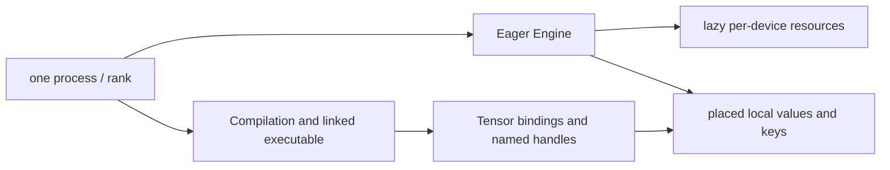
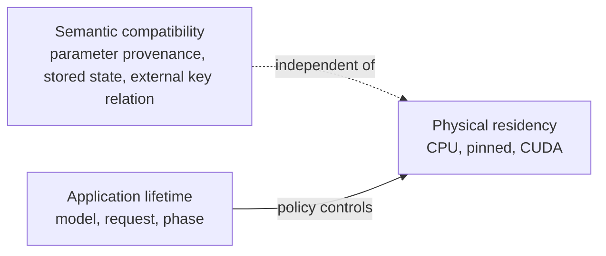

# Ownership and runtime responsibilities

Correct CKKS arithmetic is only one part of a reliable system. The application must also know who owns engines, values, keys, process groups, streams, files, and retention policy.

## The rank-local ownership unit



One Engine may use CPU and CUDA resources in the same process. Factories follow PyTorch placement defaults or a supplied device. Tensor placement selects the resource bundle and native dispatcher implementation for each operation. Key placement remains caller-controlled unless automatic key replication is enabled.

Each rank owns its local execution services and values. Immediate execution can use an `Engine`; manual or callable Compile can use a linked Program with supplied Tensor materials and non-Tensor handles. Placement plans and process groups connect local values across ranks. These process-local semantics support world-size-one execution, data parallelism, additive-term parallelism (including rotation offsets), and RNS-limb pipelines.

## Ownership table

| Object or mechanism | Created by | Lifetime owner | Movement or replacement |
| --- | --- | --- | --- |
| `fhelium.eager.Engine` | Application using immediate execution | Application | Process-local configuration and lazy device services |
| Public values, including `CompressedPlaintext` | Eager, executable adapters, or application | Application | `.to(...)`, typed collective, or managed buffer |
| `Compilation` | Capture, construction, or a Pipeline | Compile caller | Program transforms with shared workspace and Tensor-binding mappings |
| Tensor material bindings | Capture, preparation, or caller assignment | Compilation and caller | Replace assignments for later linking; compatible content updates remain live |
| Backend workspace | Application or execution provider | Backend instance | Replace named non-Tensor handle bindings through a new workspace |
| Executable or callable specialization | Linking or callable preparation | Application or callable cache | Relink bindings or prepare another input specialization |
| Keys | Application through a data provider or loader | Security/workload policy | Load, broadcast, buffer, or residency operation |
| Process group | `torch.distributed` launcher/init | Application | Never embedded in a value or engine |
| CUDA stream/event | Application or PyTorch | Application | Passed by the application to execution helpers |
| Serialized path | Application | Storage policy | Not remembered by the value |
| `ArtifactRef` | `ArtifactStore` | Application | Tensor-free; `store.get(ref)` reconstructs the checked generation |
| CUDA Graph program | Application/program cache | Application | Captures a supported rank-local CUDA callable |

## Why values are dense and local

A value combines ordinary Tensor storage with the metadata required by its representation:

```text
Ciphertext.data -> [component, *batch, limb, coefficient_or_ntt_index]
Plaintext.data  -> [*batch, limb, coefficient_or_ntt_index] when RNS encoded
CompressedPlaintext.data -> [*batch, limb, unique_index]
CompressedPlaintext.implicit_data -> [*batch, limb] for strided-sparse layout
Key.data        -> key-specific dense axes
```

The batch prefix represents independent homogeneous messages inside one local value. Process rank and placement remain application/subsystem metadata, and the application chooses whether to evaluate the batch or loop over unbatched members.

Engine binding, process rank and group, sharding or replication, movement history, persistence paths, and cache or eviction policy remain metadata owned by the application or the responsible subsystem.

### Benefits

- Local layout remains compatible with PyTorch allocators, streams, and native dispatch.
- A world-size-one program uses the same local semantics as a distributed one.
- Different parallel strategies can use the same value types.
- Serialization and transport can reconstruct values without recreating a hidden runtime.

### Cost

The workload must decide:

- which rank owns each logical object or partial result;
- which keys are present on each rank;
- whether communication means transport, addition, or structural reconstruction;
- where an operation requiring every active row forces reconstruction and synchronization.

That cost is intentional: these decisions cannot be inferred safely from shape alone.

## Mechanism versus policy


Examples of the mechanism/policy separation:

| Mechanism | Policy built on top |
| --- | --- |
| `value.nbytes` | Admission and memory budgets |
| Value signature | Which program handles a request |
| `ReusableValueBuffer` | Tile size and prefetch schedule |
| `CopyHandle` and CUDA event | When to overlap transfer and compute |
| Typed ciphertext reduction | Which ranks own additive terms |
| Direct value serialization | Namespace, key-management service (KMS), access-control list (ACL), and remote storage |
| Residency handle, requested transition, hold, lease | Stage and tile residency schedule |

A useful ownership test asks whether the behavior remains correct for every model, user, request, and deployment. Behavior that varies across those contexts belongs to workload or product policy.

## Lifetime is separate from meaning

A value preserves its cryptographic meaning when it moves among pageable CPU, pinned CPU, and CUDA storage. Interchangeability additionally requires matching parameter provenance, depths, scales, prime IDs, and key identities.



This separation enables CPU-to-GPU staging without teaching runtime values about model/request lifetimes.

## Responsibility relationships

CKKS meaning is expressed by value state and operation semantics; an Eager method applies the corresponding transition immediately. Compile transforms represented operations and specializes their execution conditions. Runtime and distributed mechanisms provide movement, synchronization, and lifetime management. Workload algorithms choose packing, retention, and resource placement. Backend implementations execute numerical operations through their Tensor operands and native or generated calls.

## Related pages

- [System overview](system-overview.md)
- [Open compiler stack](../open-compiler-stack.md)
- [Rank-local SPMD model](../distributed/spmd-model.md)
- [Residency lifetimes](../execution/residency-lifetimes.md)
- [Serialization and artifacts](../execution/serialization-and-artifacts.md)
