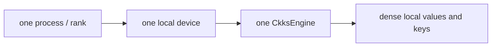
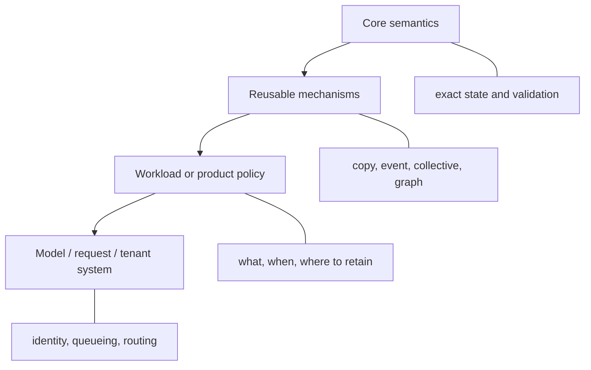
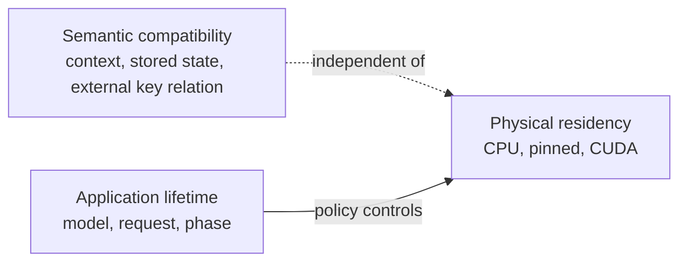

# Ownership and runtime responsibilities

Correct CKKS arithmetic is only one part of a reliable system. The application
must also know who owns engines, values, keys, process groups, streams, files,
and retention policy.

## The rank-local ownership unit



The current implementation binds that local device to CPU or CUDA. The
ownership relation uses a common device abstraction, while tensor placement
still participates in operation compatibility and selects the native dispatcher
implementation.

Each rank owns a process-local `CkksEngine`. Placement plans and process groups
connect local `Ciphertext` values across ranks. These process-local semantics
support world-size-one execution, data parallelism, additive-term parallelism
(including rotation offsets), and RNS-limb pipelines.

## Ownership table

| Object or mechanism | Created by | Lifetime owner | Movement or replacement |
| --- | --- | --- | --- |
| `CkksEngine` | Each process | Application | Not transported between ranks |
| `Plaintext` / `Ciphertext` | Engine or application | Application | `.to(...)`, typed collective, or managed buffer |
| Keys | Application through an engine or loader | Security/workload policy | Load, broadcast, buffer, or residency operation |
| Process group | `torch.distributed` launcher/init | Application | Never embedded in a value or engine |
| CUDA stream/event | Application or PyTorch | Application | Passed by the application to execution helpers |
| Serialized path | Application | Storage policy | Not remembered by the value |
| `ArtifactRef` | `ArtifactStore` | Application | Tensor-free; `store.get(ref)` reconstructs the checked generation |
| CUDA Graph program | Application/program cache | Application | Captures a deterministic rank-local callable |

## Why values are dense and local

A value owns ordinary tensor storage and exact cryptographic metadata:

```text
Ciphertext.data -> [component, *batch, limb, coefficient_or_ntt_index]
Plaintext.data  -> [*batch, limb, coefficient_or_ntt_index] when RNS encoded
Key.data        -> key-specific dense axes
```

The batch prefix represents independent homogeneous messages inside one local
value. It is not process-rank or placement metadata, and the application still
chooses whether to evaluate that batch or loop over unbatched members.

Engine binding, process rank and group, sharding or replication, movement
history, persistence paths, and cache or eviction policy remain metadata owned
by the application or the responsible subsystem.

### Benefits

- Local layout remains compatible with PyTorch allocators, streams, and native
  dispatch.
- A world-size-one program uses the same local semantics as a distributed one.
- Different parallel strategies can use the same value types.
- Serialization and transport can reconstruct exact values without recreating
  a hidden runtime.

### Cost

The workload must decide:

- which rank owns each logical object or partial result;
- which keys are present on each rank;
- whether communication means transport, addition, or structural
  reconstruction;
- where an operation requiring every active row forces reconstruction and synchronization.

That cost is intentional: these decisions cannot be inferred safely from
shape alone.

## Mechanism versus policy



Examples of the mechanism/policy separation:

| Mechanism | Policy built on top |
| --- | --- |
| `value.nbytes` | Admission and memory budgets |
| Exact value signature | Which program handles a request |
| `ReusableValueBuffer` | Tile size and prefetch schedule |
| `CopyHandle` and CUDA event | When to overlap transfer and compute |
| Typed ciphertext reduction | Which ranks own additive terms |
| Direct value serialization | Namespace, key-management service (KMS), access-control list (ACL), and remote storage |
| Residency handle, requested transition, hold, lease | Stage and tile residency schedule |

A useful test is: **would this behavior remain correct for every model, user,
request, and deployment?** If not, it is probably policy rather than core
semantics.

## Lifetime is separate from meaning

A value's cryptographic meaning does not change when it moves from pageable
CPU memory to pinned memory or a CUDA device. Conversely, two tensors on the
same GPU are not interchangeable if their contexts, levels, scales, prime IDs,
or key identities differ.



This separation enables exact CPU-to-GPU staging without teaching core values
about model/request lifetimes.

## Responsibility checklist

Before adding a feature, ask:

1. Does it change exact CKKS meaning? Define the semantics in `core` or `engine`.
2. Is it reusable movement, synchronization, or capture? Consider
   `distributed` or `execution`.
3. Does it choose resources for a model, request, user, or cache budget? Keep it
   in the experimental namespace or an application.
4. Does it depend on a packing algorithm? Keep it with the workload/compiler.
5. Does it require a native tensor primitive? Define an exact-state operator
   and validate the cross-layer ABI.

## Related pages

- [System overview](system-overview.md)
- [Rank-local SPMD model](../distributed/spmd-model.md)
- [Residency lifetimes](../execution/residency-lifetimes.md)
- [Serialization and artifacts](../execution/serialization-and-artifacts.md)
