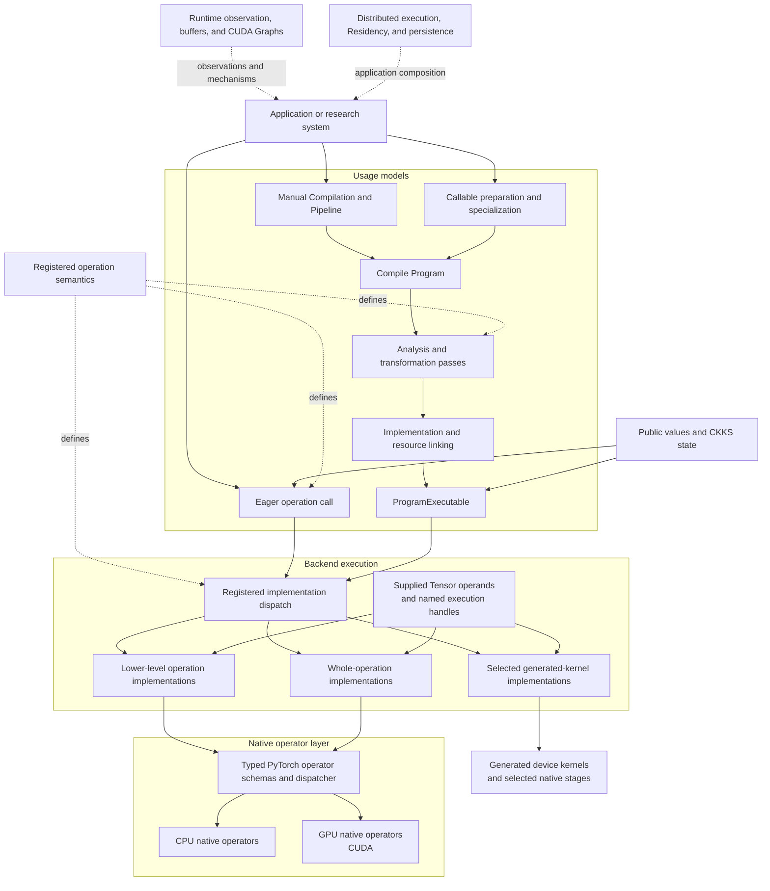

# Architecture

FHElium is a full-stack framework for research on Cheon–Kim–Kim–Song (CKKS) approximate-number homomorphic encryption. Its architecture connects public value semantics, two usage models, shared operation definitions, execution backends, runtime mechanisms, and native kernels. Each layer owns a specific class of decisions and exposes the information needed by adjacent layers.

## System structure

## Semantic and program layers

A public `Ciphertext`, `Plaintext`, `CompressedPlaintext`, or key combines Tensor storage with the state needed to interpret it. A sparse compressed plaintext retains both compact and implicit Tensor data. Depending on the value type, this state includes depth, actual scale, active prime identities, polynomial domain, modulus basis, residue representation, component count, batch shape, key role, and device placement.

Registered operations define their input requirements, result types, and state effects. Selected implementations declare the numerical operands and non-Tensor execution handles they consume. These definitions establish operation meaning across every execution route.

Applications enter this layer through two usage models. **Eager** applies one operation and its CKKS state transition immediately. **Compile** represents operations and values in a Program, where selected passes can analyze, schedule, preserve, or lower them before Backend linking creates an executable. Manual Program/Compilation/Pipeline execution and callable specialization use the same Compile machinery. Both usage models retain the meaning declared by the registered operation catalog.

## Backend composition layer

The **Backend** owns registered operation implementations and a workspace of named non-Tensor execution handles. Compile passes select implementations, prepare their numerical operands, and link the Program through the Backend's execution interface.

A Program can retain a whole CKKS operation, expose lower-level RNS/NTT operations, or group compatible operations into a fusion region. Whole implementations can compose the same RNS/NTT algorithms used by exposed operations. Generated implementations consume selected regions and produce device kernels or sequences combining generated and native stages.

Keys, arithmetic parameters, transform tables, and rounding state are Tensor operands supplied through `Compilation.material_bindings` for Compile or direct arguments for Eager. Process groups and encryption samplers are non-Tensor handles supplied through Backend resource bindings. These inputs preserve their respective data and execution lifetimes.

Eager resolves and caches one device-local call at a time. Compile resolves the Program's selected operations and binds their operands into prepared host control flow. Manual execution and compiled callables invoke that same `ProgramExecutable`; callable specialization additionally matches input conditions and retains prepared variants.

## Native CPU and GPU layers

Typed PyTorch operator schemas define the native execution interface. CPU and CUDA register separate implementations for those schemas, and PyTorch selects the implementation from Tensor placement. The two native backends can use different kernel structures, parallel execution strategies, and microarchitecture-specific optimizations while preserving the schema's Tensor, mutation, and resource contract.

The native layer uses PyTorch's allocator, CPU execution runtime, CUDA streams, device dispatch, and profiling tools. Additional execution providers can register Backend implementations and connect their own kernels through the same operation and resource interfaces.

## Runtime and system composition

The operation path composes with several system owners:

- `fhelium.runtime` supplies hardware and memory observations, reusable buffers, and CUDA Graph execution;
- `fhelium.compile` also supplies callable specialization and reuse of Backend-linked Programs through its high-level decorator and preparation API;
- `fhelium.distributed` supplies process setup, typed value transport, and CKKS-aware collectives for rank-local execution;
- `fhelium.residency` owns live materializations, byte accounting, placement admission, and asynchronous lifetimes;
- serialization preserves public values or Program text with selected Tensor bindings, and artifacts manage named generations of those persistent representations.

Applications and execution owners compose these mechanisms around Eager calls or linked Programs. They select devices, keys, placement policies, distributed schedules, and persistence behavior according to the workload.

## Ownership map

| Owner | Architectural responsibility |
| --- | --- |
| `fhelium.values` | Public payload-bearing values, represented CKKS state, and keys |
| `fhelium.eager` | Immediate operation transitions, key inventory, and device-local direct dispatch |
| `fhelium.ir` | Program structure, registered operation semantics, types, and analyses |
| `fhelium.compile` | Source capture, Compilation materials/workspaces, passes, lowering, implementation selection, preparation, linking, and host code generation |
| `fhelium.backend` | Implementation registry, numerical execution and kernel generation, non-Tensor resource workspace, and executable dispatch |
| `fhelium.native` | Native extension loading, application binary interface (ABI) diagnostics, typed wrappers, and device inspection |
| `fhelium.runtime` | Hardware and memory observations, reusable buffers, and CUDA Graph execution |
| `fhelium.compile.CompiledCallable` | Input specialization, preparation and executable reuse over the Compile pipeline |
| `fhelium.distributed` | Process setup, typed transport, and CKKS-aware collectives |
| `fhelium.residency` | Live-value ownership, byte accounting, placement admission, and lifetimes |
| `fhelium.serialization` and `fhelium.artifacts` | Durable value and Compilation representation, artifact identity, and generation management |

Applications compose these owners by selecting passes, implementations, resources, devices, keys, placement policies, and distributed schedules. This keeps research choices visible at the layer where they are made and allows their effects to be measured across the complete workload.

## Related concepts

- CKKS values: [Value model and identity](../ckks/value-model-and-identity.md)
- Operation effects: [Evaluator operation transitions](../ckks/evaluator-operation-transitions.md)
- Program representation: [Neutral IR programs](../neutral-ir-programs.md)
- Compile lifecycle: [Open compiler stack](../open-compiler-stack.md)
- Runtime ownership: [Ownership and responsibilities](ownership-and-responsibilities.md)
- Execution lifetimes: [Signatures and buffers](../execution/signatures-and-buffers.md)
