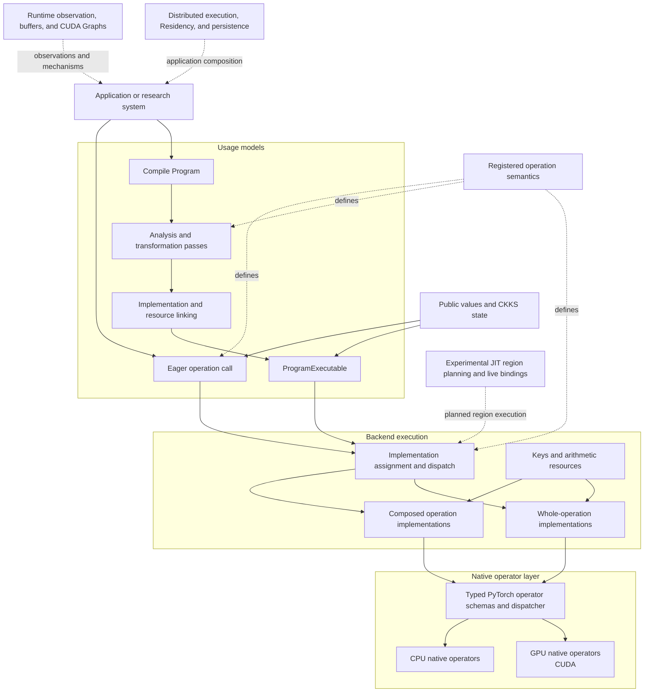

# Architecture

FHElium is a full-stack framework for research on Cheon–Kim–Kim–Song (CKKS)
approximate-number homomorphic encryption. Its architecture connects public
value semantics, two usage models, shared operation definitions,
execution backends, runtime mechanisms, and native kernels. Each layer owns a
specific class of decisions and exposes the information needed by adjacent
layers.

## System structure

## Semantic and program layers

A public `Ciphertext`, `Plaintext`, or key combines a Tensor payload with the
state needed to interpret that payload. Depending on the value type, this state
includes level, actual scale, active prime identities, polynomial domain,
modulus basis, residue representation, component count, batch shape, key role,
and device placement.

Registered operations define their input requirements, result types, state
effects, and required resources. These definitions establish operation meaning
across every execution route.

Applications enter this layer through two usage models. **Eager** applies one
operation and its CKKS state transition immediately. **Compile** represents
operations and values in a Program, where selected passes can analyze,
schedule, preserve, or lower them before Backend linking creates an executable.
Both routes retain the meaning declared by the registered operation catalog.

## Backend composition layer

The **Backend** registers operation implementations, owns execution-resource
mechanisms, assigns implementations, and links Programs. Its registry supports
two complementary implementation forms:

- **composed operation implementations** coordinate multiple Tensor and native
  operations to implement a higher-level operation;
- **whole-operation implementations** execute a registered operation through a
  specialized direct path.

Composed implementations depend on the native operator layer for device
arithmetic. Whole-operation implementations can use the same native layer while
selecting a different composition or specialized kernel route. Both receive
Tensor payloads together with bound keys, materials, and arithmetic resources.

Eager resolves and caches one device-local call at a time. Compile resolves all
remaining Program operations, prelinks their resources, and creates a
`ProgramExecutable`. These are two entry paths into the same implementation
registry and resource model.

## Native CPU and GPU layers

Typed PyTorch operator schemas define the native execution interface. CPU and
CUDA register separate implementations for those schemas, and PyTorch selects
the implementation from Tensor placement. The two native backends can use
different kernel structures, parallel execution strategies, and
microarchitecture-specific optimizations while preserving the schema's Tensor,
mutation, and resource contract.

The native layer uses PyTorch's allocator, CPU execution runtime, CUDA streams,
device dispatch, and profiling tools. Additional execution providers can
register Backend implementations and connect their own kernels through the
same operation and resource interfaces.

## Runtime and system composition

The operation path composes with several system owners:

- `fhelium.runtime` supplies hardware and memory observations, reusable
  buffers, and CUDA Graph execution;
- `fhelium.experimental.jit` owns live bindings, provider coverage,
  region planning, and just-in-time (JIT) execution;
- `fhelium.distributed` supplies process setup, typed value transport, and
  CKKS-aware collectives for rank-local execution;
- `fhelium.residency` owns live materializations, byte accounting, placement
  admission, and asynchronous lifetimes;
- serialization and artifacts preserve value state and application-visible
  artifact identity.

Applications and execution owners compose these mechanisms around Eager calls
or linked Programs. They select devices, keys, placement policies, distributed
schedules, and persistence behavior according to the workload.

## Ownership map

| Owner | Architectural responsibility |
| --- | --- |
| `fhelium.values` | Public payload-bearing values, represented CKKS state, context identity, and keys |
| `fhelium.eager` | Immediate operation transitions, key inventory, and device-local direct dispatch |
| `fhelium.ir` | Program structure, registered operation semantics, types, and analyses |
| `fhelium.compile` | Source capture, Compilation workspaces, passes, lowering, and code generation |
| `fhelium.backend` | Implementations, execution resources, Program linking, and executable dispatch |
| `fhelium.native` | Native extension loading, application binary interface (ABI) diagnostics, typed wrappers, and device inspection |
| `fhelium.runtime` | Hardware and memory observations, reusable buffers, and CUDA Graph execution |
| `fhelium.experimental.jit` | Live bindings, provider coverage, region planning, and JIT execution |
| `fhelium.distributed` | Process setup, typed transport, and CKKS-aware collectives |
| `fhelium.residency` | Live-value ownership, byte accounting, placement admission, and lifetimes |
| `fhelium.serialization` and `fhelium.artifacts` | Durable value representation, artifact identity, and generation management |

Applications compose these owners by selecting passes, implementations,
resources, devices, keys, placement policies, and distributed schedules. This
keeps research choices visible at the layer where they are made and allows
their effects to be measured across the complete workload.

## Continue

- CKKS values: [Value model and identity](../ckks/value-model-and-identity.md)
- Operation effects: [Evaluator operation transitions](../ckks/evaluator-operation-transitions.md)
- Program representation: [Neutral IR programs](../neutral-ir-programs.md)
- Compile lifecycle: [Open compiler stack](../open-compiler-stack.md)
- Runtime ownership: [Ownership and responsibilities](ownership-and-responsibilities.md)
- Native execution: [Eager, Compile, and native execution](../../developer/engine-native-stack.md)
