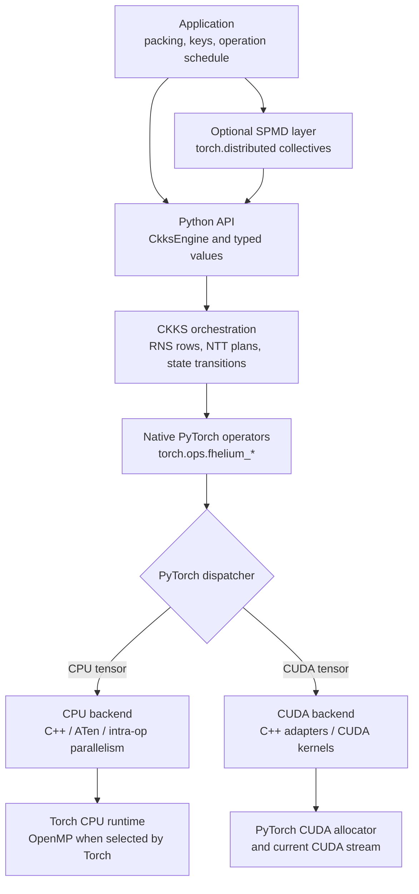
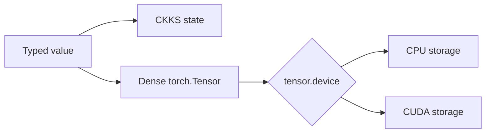
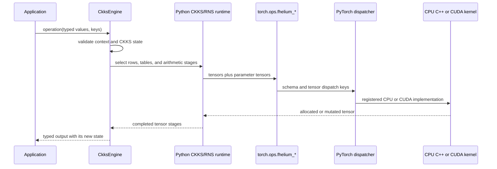
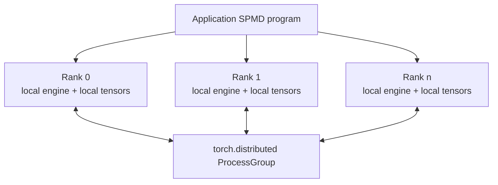
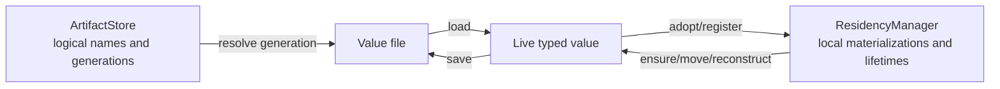

# System overview

FHElium is a tensor-native CKKS runtime implemented as a Python semantic layer
and a native PyTorch operator extension. Applications use typed Python values
and `CkksEngine`; arithmetic payloads remain `torch.Tensor` objects and execute
through PyTorch's CPU or CUDA dispatch paths.

The core execution unit is one engine bound to one local CPU or CUDA device.
Applications build packing schemes, operation schedules, key distribution, and
multi-rank communication around that local unit.

## Runtime stack



| Part of the stack | Technology | Function |
| --- | --- | --- |
| Application interface | Python 3.12+, typed FHElium values | Express CKKS values, keys, packing, and evaluator calls |
| Tensor runtime | PyTorch | Own tensor storage, devices, allocation, CPU intra-op execution, CUDA streams, profiling, and collectives |
| CKKS orchestration | Python in `fhelium.engine` | Validate state and compose encode, encrypt, NTT, RNS, key-switch, and rescale stages |
| Native operator ABI | PyTorch C++ operator schemas | Give CPU and CUDA one operator name, mutation model, and tensor signature |
| CPU arithmetic | C++17, ATen, `at::parallel_for` | Execute RNS, indexed radix-2 NTT, and CKKS tensor primitives through Torch's CPU runtime |
| GPU arithmetic | CUDA C++ and ATen CUDA integration | Execute RNS, several NTT policies, Galois, key-switch, and rescale kernels on the current stream |
| Native build | scikit-build-core, CMake, Torch C++ API, optional CUDA Toolkit | Produce the Python/Torch-ABI-specific native extension |

The native extension can contain CPU implementations, CUDA implementations, or
both. A shared operator schema does not choose a backend itself: PyTorch selects
the registered implementation from the input tensor's dispatch key.

## Values and CKKS state

A `Plaintext`, `Ciphertext`, or key combines dense tensor storage with the
metadata required to interpret it. For an RNS ciphertext, the principal layout
is:

```text
[component, *batch, limb, coefficient_or_ntt_index]
```

The tensor device stores the payload location. Other fields record
cryptographic and arithmetic state, including:

- CKKS context identity;
- level and ordered `prime_ids`;
- actual per-value scale;
- coefficient or NTT polynomial domain;
- Q or QP modulus basis;
- standard or Montgomery residue representation;
- key-specific axes and identity where applicable.

These metadata are execution inputs, not descriptive labels added after the
fact. For example, ciphertext addition requires matching level, scale,
component layout, domain, basis, residue form, context, prime rows, dtype, and
device before any modular addition runs.



Value objects do not embed an engine, process group, placement plan, artifact
path, or cache identity. Those objects have independent lifetimes and are
connected by application code or the corresponding subsystem.

## Local operation path

A public evaluator call crosses three distinct forms of validation and
execution:



Python owns the semantic operation. It decides, for example, which Q rows are
active, whether a forward NTT is required, which key digit is consumed, and how
level and scale change. Native operators own bounded tensor transformations and
receive modulus parameters, twiddles, schedules, indices, and key tensors as
arguments.

This division allows a high-level operation to combine several native kernels
without introducing a second opaque execution runtime. It also allows the same
Python arithmetic path to use CPU or CUDA when both devices implement the
required operator schemas.

For the registration and launch details, see
[Python-to-native execution stack](../../developer/engine-native-stack.md).

## CPU and CUDA execution

CPU and CUDA are local execution backends, not separate public CKKS APIs.
`CkksEngine(device="cpu")` and `CkksEngine(device="cuda:0")` expose the same
stateful value model and evaluator methods.

On CPU:

- native operators are C++/ATen implementations registered under PyTorch's
  `CPU` dispatch key;
- coefficient work is partitioned with `at::parallel_for` where appropriate;
- FHElium follows Torch intra-op thread controls;
- when the selected Torch uses OpenMP, FHElium compiles for and reuses that
  runtime instead of managing a second thread pool;
- indexed radix-2 is the production NTT policy.

On CUDA:

- C++ adapters are registered under PyTorch's `CUDA` dispatch key;
- kernels use the operand device and PyTorch's current CUDA stream;
- output storage uses PyTorch's CUDA allocator;
- launches remain asynchronous under normal PyTorch stream semantics;
- indexed radix-2 and CUDA-specific compact grouped or fixed-radix NTT policies
  are available according to the selected configuration.

An evaluator operation does not move input data between CPU and CUDA. Values
move through .to(...), buffer, collective, or Residency operations;
a mixed-device native call fails validation.

## Distributed execution

FHElium uses process-local single-program, multiple-data (SPMD) control.
Each rank creates its own local engine, local keys or key views, and local
values. The application initializes `torch.distributed`, chooses the rank-to-
device mapping, and calls typed FHElium collectives where value reconstruction
or modular semantics are required.



Typed collectives separate a metadata/descriptor phase from dense tensor
transfer. Whole-value transport reconstructs FHElium values at the
receiver. Limb gather/scatter performs structural RNS-row reconstruction, while
ciphertext reduce/all-reduce uses modular ciphertext addition rather than raw
integer `SUM`.

Process groups and global parallel strategy remain outside `CkksEngine`.
Consequently, data parallelism, additive-term parallelism, RNS-limb
partitioning, and world-size-one execution can use the same rank-local value and
engine semantics.

## Reusable execution

The `fhelium.execution` package builds reusable execution mechanisms on top of
typed values:

- `ValueTreeSignature` records nested input structure and value state;
- `ReusableValueBuffer` owns stable destination storage and stream/event-aware
  copies;
- `CudaGraphProgram` warms up, captures, and replays a rank-local callable with
  stable buffers.

CUDA Graph capture does not replace CKKS semantics or distributed scheduling.
The application supplies a deterministic local callable and owns when copies,
graph replay, communication, and output consumption occur.

The experimental JIT uses one xDSL program representation for captured,
textual, or directly constructed local computations. Its passes and executable
schemas ultimately call the same public/native execution stack rather than a
second arithmetic backend.

## Persistence and live residency

Persistence and live placement are separate systems:



- Serialization maps one typed value to a versioned file representation.
- `ArtifactStore` adds durable logical naming, immutable generations, catalog
  identity, checksums, and retirement around those files.
- `ResidencyManager` owns process-local live materializations, locations,
  accounting, transitions, leases, holds, reservations, and optional admission
  decisions.

A persisted artifact is not a live CUDA allocation. A Residency handle is not a
durable artifact reference. Applications connect them by registering a source
or loading and adopting a value.

## Package map

| Package | Primary implementation role |
| --- | --- |
| `fhelium.config` | CKKS presets, modulus chains, security checks, and NTT policies |
| `fhelium.core` | Context metadata, typed values, keys, state vocabulary, and rotation planning |
| `fhelium.engine` | Public CKKS semantics, RNS runtime, NTT plans/backends, encoding, encryption, key switching, and rescale |
| `fhelium.native` | Native ABI validation/loading, generated `torch.ops` wrappers, and CUDA topology inspection |
| `fhelium.distributed` | PyTorch distributed facade and typed HE collectives |
| `fhelium.execution` | Value signatures, reusable buffers, copy handles, and CUDA Graph execution |
| `fhelium.serialization` | Versioned single-value files |
| `fhelium.artifacts` | Durable local repository names and immutable generations |
| `fhelium.residency` | Live process-local materialization ownership, accounting, and admission |
| `fhelium.experimental` | Opt-in bootstrap, JIT, and multiparty mechanisms |
| `fhelium.benchmarks` | Versioned benchmark specifications, runners, and report model |

## Continue

- [Value model and identity](../ckks/value-model-and-identity.md)
- [Ownership and runtime responsibilities](ownership-and-responsibilities.md)
- [Python-to-native execution stack](../../developer/engine-native-stack.md)
- [Distributed internals](../../developer/distributed-internals.md)
- [Execution buffers and CUDA Graphs](../../developer/execution-buffers-and-cuda-graphs.md)
- [Serialization and artifacts](../execution/serialization-and-artifacts.md)
- [Residency lifetimes](../execution/residency-lifetimes.md)
