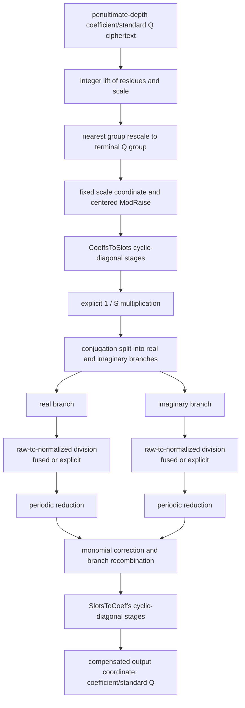

# Composable CKKS bootstrapping

FHElium composes bootstrapping from replaceable mathematical components
executed through the ordinary `fhelium.eager.Engine`, `Ciphertext`, NTT, and native
operator stack. The built-in `FullSlotBootstrap` makes its
linear maps, periodic reduction, depth budget, primitive-key requirements, and
arithmetic scale schedule visible.

## The mathematical map

Let:

- $N$ be the ring dimension and $S=N/2$ the complex slot count;
- $\Delta_0$ be `config.default_scale`;
- $q_b$ be the product of the primes in the terminal Q group;
- $C$ and $T$ be the unscaled CoeffsToSlots and SlotsToCoeffs maps, with
  $T(C(a))=Sa$ in FHElium's cyclotomic slot order;
- $B$ be a periodic reducer's `input_bound`.

Entry rescale removes the penultimate Q group and leaves the terminal Q
group. Centered ModRaise extends each ciphertext component from that group
into the active Q basis at `modulus_raise_target_depth`. After the compensated
entry-coordinate conversion described below, let $a$ be the coefficient-coordinate
value represented by the raised ciphertext at scale $\Delta_0$. Define

$$
w=\frac{\Delta_0}{Sq_b}C(a),\qquad
r_{\rm R}=2\operatorname{Re}(w),\qquad
r_{\rm I}=2\operatorname{Im}(w).
$$

The values $r_{\rm R}$ and $r_{\rm I}$ are **raw branch coordinates**. The
polynomial coordinate is the distinct normalized value

$$
x=r/B\in[-1,1].
$$

Both built-in periodic reductions approximate

$$
\rho(r)=\frac{\sin(\pi r)}{\pi}.
$$

For $r=2k+\epsilon$, where $k$ is an integer carry and $\epsilon$ is small,
$\rho(r)$ approximates $\epsilon$. Branch recombination and SlotsToCoeffs then
apply the idealized map

$$
a_{\rm out}=\frac{q_b}{2\Delta_0}
T\left(\rho(r_{\rm R})+i\rho(r_{\rm I})\right).
$$

The polynomial fit, CKKS rounding, and key switching perturb this idealized
expression. `input_bound` states the
mathematical precondition that applications must establish:
$|r_{\rm R}|,|r_{\rm I}|\le B$ and validate the resulting error distribution.

## Full-slot state flow

The built-in callable executes:

All public pipeline ciphertexts have axes
`[component, *batch, limb, coefficient]`, two components, Q basis, and
`prime_ids`. They remain in coefficient domain with standard residues between
operations. NTT-domain Montgomery values may span a complete polynomial or
double-angle chain before returning to the coefficient-domain pipeline. Each
linear stage removes one Q group, whose product is $M_d$ at depth $d$.
`BootstrapArithmetic` selects depth targets backward from the terminal target
$s_D=\Delta_0$:

$$
s_d=\sqrt{M_d s_{d+1}}.
$$

Ciphertext multiplication at $s_d$ followed by group rescale therefore has
scale $s_{d+1}$. A scalar or diagonal product with input scale $\Delta$ uses
plaintext scale $M_d s_{d+1}/\Delta$ to reach the same target. Every rescale
retains its actual quotient scale; it is not reset to the default.

Entry preparation multiplies residues and scale by integer
$k=\max(1,\lceil M_{input}\Delta_0/\Delta_{in}\rceil)$, preserving the
message. After entry rescale the actual terminal scale is $\Delta_b$.
The fixed circuit interprets that payload at scale $\Delta_0$, so its message
coordinate is $u=(\Delta_b/\Delta_0)m$. It refreshes $u$ using fixed
CoeffsToSlots and SlotsToCoeffs maps. Multiplying the output scale by
$\Delta_b/\Delta_0$ restores coordinate $m$. The compensation is part of the
full-slot mathematics; intermediate rescale outputs still retain actual scale.

Independent polynomial components derive basis scales from their input's
actual scale rather than assuming it matches a full-slot stage. Coefficient
products and accumulators connect the resulting basis values to the requested
output scale. Available precision and integer-encoding range still limit
which input scales, degrees, and modulus groups can be evaluated accurately.

## Raw and normalized reducer coordinates

`CosineDoubleAngleReduction` and `ExponentialSquaringReduction` have two related
but intentionally different input-coordinate conventions:

- `reference(values)` always consumes normalized $x\in[-1,1]$ and never divides
  by `input_bound`;
- `evaluate(...)` consumes raw $r$ when `fuse_input_normalization=False` and
  spends one depth computing $x=r/B$;
- with `fuse_input_normalization=True`, the caller must already provide $x$.
  `FullSlotBootstrap` does so by folding $1/B$ into CoeffsToSlots.

Both routes target $\sin(\pi Bx)/\pi=\sin(\pi r)/\pi$. Confusing the two
coordinates changes the periodic frequency by a factor of $B$.

## Replaceable decisions

A polynomial evaluator chooses a homomorphic multiplication directed acyclic
graph (DAG) for the stored approximation.

| Component | Replaceable decision |
|---|---|
| polynomial approximator | How a function becomes basis-tagged coefficients |
| polynomial evaluator | Which homomorphic multiplication DAG evaluates them |
| linear-transform compiler | How a basis map becomes executable stages |
| linear-transform evaluator | Direct, BSGS, or another stage schedule |
| periodic reduction (`modular_reduction`) | Cosine, exponential, or another periodic approximation |
| ordinary Python | Complete algorithm topology and control flow |

A `PolynomialApproximation` stores coefficients in ascending degree. Power
basis means $p(x)=\sum_n a_nx^n$; Chebyshev basis means
$p(x)=\sum_n a_nT_n(x)$. If an approximator records a physical domain
$[a,b]\ne[-1,1]$, its coefficients are still functions of the normalized
coordinate $x=(2t-a-b)/(b-a)$. An evaluator never performs that affine map
implicitly.

## Direct and BSGS linear evaluation

A cyclic-diagonal stage represents

$$
L(x)=\sum_k d_k\mathbin{\odot}\operatorname{Rot}_k(x).
$$

The direct evaluator computes every term independently. The baby-step/giant-step
(BSGS) evaluator writes $k=g+b$ and uses

$$
\operatorname{Rot}_g\left(
  \operatorname{Rot}_b(x)\mathbin{\odot}
  \operatorname{Rot}_{-g}(d_{g+b})
\right)
=
\operatorname{Rot}_{g+b}(x)\mathbin{\odot}d_{g+b}.
$$

They therefore implement the same mathematical map, output depth, actual-scale
recurrence, domain, basis, and `prime_ids`. Their operation grouping and CKKS
rounding can differ, so residue tensors need not be bit-identical.

Within one BSGS giant group, the built-in evaluator dispatches the represented
sum

$$
\sum_t c_t p_t
$$

as one RNS operation. Its CPU implementation reuses the ordinary Montgomery
product and standard-add primitives. Its CUDA implementation keeps one modular
accumulator per output coefficient and reads existing ciphertext/plaintext
Tensors through a bounded pointer set; it does not stack all term products or
encode BSGS policy into the native operation.

When the caller supplies every direct baby-step key, `aggregate_groups=True`
represents the complete group matrix as

$$
y_g=\sum_t p_{g,t}\mathbin{\odot}\operatorname{Rot}_{b_t}(x).
$$

The CKKS operation shares decomposition of $x$ across the requested rotations,
and the RNS implementation shares each rotated ciphertext load across the
plaintext groups. The evaluator still owns the baby/giant partition and key
choice; the operation records the supplied rotations and group dimensions and
does not choose a device policy or capture a CUDA Graph.

## Primitive key dependencies and factories

The built-in callable accepts one `EvaluationKeySet` through its
`evaluation_keys=` keyword. The set contains the selected `RotationKeySet`, an
optional `RelinearizationKey` when the reduction performs ciphertext products,
and the required `ConjugationKey`. Its `required_rotations` and `key_steps()`
queries report the transform rotation schedule, and `create_rotation_keys()`
generates either the direct-key inventory or the compact signed-power-of-two
inventory. Full branch handling requires the conjugation key; the exponential
reduction also uses it for sine extraction.

The versioned experimental `logn16` factories identify component configurations.
The documented end-to-end configuration is derived from
`Preset.slots32768_scale50_depth27_int64` for a `CkksConfig` configured with
`galois_generator=5`. Construction checks transform slot counts,
structural-base/default-scale proximity, and modulus-chain depth. Applications
establish the encrypted branch range, numerical tolerance, deployment identity,
and performance evidence for their configuration.

## Profile choices

The versioned factories identify circuit choices, not universal performance
profiles. A factory can select the transform stage counts, polynomial degree,
periodic-reduction bound, and branch schedule. `key_steps("power_of_two")`
describes the compact composed-rotation inventory; `key_steps("direct")`
describes direct transform rotations. A caller may also supply a mixed
inventory, which the evaluator resolves per requested rotation.

The factory names document intended configurations such as the `logn16`
full-slot arrangement. Construction checks the supplied Engine's slot count,
structural-base/default-scale proximity, target depth, and declared component
depth. It does not establish an encrypted range, numerical tolerance, memory
capacity, or latency on the caller's device. Applications should measure those
properties for their own Engine, key inventory, input class, and workload.

The current dense factory choices are summarized by their declared component
parameters and depth costs. The output-depth column assumes
`modulus_raise_target_depth=0`; construction still rejects an Engine whose
`max_depth` is too small for the selected composition.

| Factory | Raw bound $B$ | Polynomial degree | Periodic iterations | C2S / S2C stages | Declared output depth |
|---|---:|---:|---:|---:|---:|
| `cosine_depth_refresh_logn16_v1` | 1024 | 44 | 7 double-angle | 2 / 2 | 19 |
| `cosine_depth_refresh_logn16_8_28_v1` | 1024 | 28 | 8 double-angle | 2 / 2 | 19 |
| `cosine_depth_refresh_logn16_8_28_s2c3_v1` | 1024 | 28 | 8 double-angle | 2 / 3 | 20 |
| `cosine_depth_refresh_logn16_7_32_bound512_v1` | 512 | 32 | 7 double-angle | 2 / 2 | 18 |
| `exponential_depth_refresh_logn16_d16_v1` | 1024 | 16 | 10 squaring | 2 / 2 | 21 |

The constructor requires the terminal-group product to be within
`[0.5, 2.0]` times `config.default_scale`. Production centered ModRaise
currently supports at most eight source Q rows; this is an execution limit,
not a generic `FullSlotBootstrap` constructor check. The bound column is a
mathematical precondition for each reducer, not a range check performed on
encrypted data.
