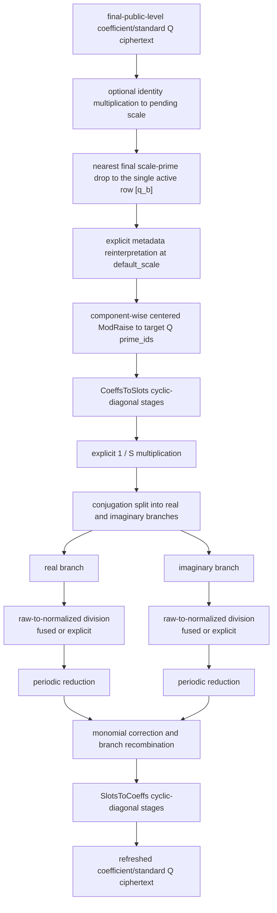

# Composable CKKS bootstrapping

FHElium composes bootstrapping from replaceable mathematical components
executed through the ordinary `CkksEngine`, `Ciphertext`, NTT, and native
operator stack. The built-in `FullSlotBootstrap` makes its
linear maps, periodic reduction, level budget, primitive-key requirements, and
private scale policy visible.

## The mathematical map

Let:

- $N$ be the ring dimension and $S=N/2$ the complex slot count;
- $\Delta_0$ be `config.default_scale`;
- $q_b$ be the structural base Q prime;
- $C$ and $T$ be the unscaled CoeffsToSlots and SlotsToCoeffs maps, with
  $T(C(a))=Sa$ in FHElium's cyclotomic slot order;
- $B$ be a periodic reducer's `input_bound`.

After the final public scale-prime drop, centered ModRaise extends each
ciphertext component from `[q_b]` into the selected target Q prefix. If $a$ is
the coefficient-coordinate value represented by that raised ciphertext, define

$$
w=\frac{\Delta_0}{Sq_b}C(a),\qquad
r_{\rm R}=2\operatorname{Re}(w),\qquad
r_{\rm I}=2\operatorname{Im}(w).
$$

The values $r_{\rm R}$ and $r_{\rm I}$ are **raw branch coordinates**. The
polynomial coordinate is the distinct normalized value

$$
x=r/B\in[-1,1].
$$

Both built-in periodic reductions approximate

$$
\rho(r)=\frac{\sin(\pi r)}{\pi}.
$$

For $r=2k+\epsilon$, where $k$ is an integer carry and $\epsilon$ is small,
$\rho(r)$ approximates $\epsilon$. Branch recombination and SlotsToCoeffs then
apply the idealized map

$$
a_{\rm out}=\frac{q_b}{2\Delta_0}
T\left(\rho(r_{\rm R})+i\rho(r_{\rm I})\right).
$$

The polynomial fit, CKKS rounding, key switching, and internal scale
reinterpretations perturb this idealized expression. `input_bound` is therefore
a mathematical input precondition, not a range measured from ciphertext data.
Applications must establish
$|r_{\rm R}|,|r_{\rm I}|\le B$ and validate the resulting error distribution.

## Full-slot state flow

The built-in callable executes:

All public pipeline ciphertexts have axes
`[component, *batch, limb, coefficient]`, two components, Q basis, and
`prime_ids`. They remain in coefficient domain with standard residues between
operations. NTT-domain Montgomery values are temporary arithmetic inputs. Each
linear stage consumes one leading Q row and follows the actual scale recurrence

$$
\Delta_{j+1}=\frac{\Delta_j\Delta_0}{q_j}.
$$

The bootstrap's scalar and ciphertext-multiplication helpers reinterpret their
rescale results at $\Delta_0$; ordinary linear stages do not. Consequently the
final SlotsToCoeffs stages leave a per-value output
scale rather than silently resetting it to `default_scale`.

## Raw and normalized reducer coordinates

`CosineDoubleAngleReduction` and `ExponentialSquaringReduction` have two related
but intentionally different input-coordinate conventions:

- `reference(values)` always consumes normalized $x\in[-1,1]$ and never divides
  by `input_bound`;
- `evaluate(...)` consumes raw $r$ when `fuse_input_normalization=False` and
  spends one level computing $x=r/B$;
- with `fuse_input_normalization=True`, the caller must already provide $x$.
  `FullSlotBootstrap` does so by folding $1/B$ into CoeffsToSlots.

Both routes target $\sin(\pi Bx)/\pi=\sin(\pi r)/\pi$. Confusing the two
coordinates changes the periodic frequency by a factor of $B$.

## Replaceable decisions

A polynomial evaluator chooses a homomorphic multiplication directed acyclic
graph (DAG) for the stored approximation.

| Component | Replaceable decision |
|---|---|
| polynomial approximator | How a function becomes basis-tagged coefficients |
| polynomial evaluator | Which homomorphic multiplication DAG evaluates them |
| linear-transform compiler | How a basis map becomes executable stages |
| linear-transform evaluator | Direct, BSGS, or another stage schedule |
| periodic reduction (`modular_reduction`) | Cosine, exponential, or another periodic approximation |
| ordinary Python | Complete algorithm topology and control flow |

A `PolynomialApproximation` stores coefficients in ascending degree. Power
basis means $p(x)=\sum_n a_nx^n$; Chebyshev basis means
$p(x)=\sum_n a_nT_n(x)$. If an approximator records a physical domain
$[a,b]\ne[-1,1]$, its coefficients are still functions of the normalized
coordinate $x=(2t-a-b)/(b-a)$. An evaluator never performs that affine map
implicitly.

## Direct and BSGS linear evaluation

A cyclic-diagonal stage represents

$$
L(x)=\sum_k d_k\mathbin{\odot}\operatorname{Rot}_k(x).
$$

The direct evaluator computes every term independently. The baby-step/giant-step
(BSGS) evaluator writes $k=g+b$ and uses

$$
\operatorname{Rot}_g\left(
  \operatorname{Rot}_b(x)\mathbin{\odot}
  \operatorname{Rot}_{-g}(d_{g+b})
\right)
=
\operatorname{Rot}_{g+b}(x)\mathbin{\odot}d_{g+b}.
$$

They therefore implement the same mathematical map, output level, actual-scale
recurrence, domain, basis, and `prime_ids`. Their operation grouping and CKKS
rounding can differ, so residue tensors need not be bit-identical.

## Primitive key dependencies and factories

The built-in callable accepts a `RotationKeySet`, `RelinearizationKey`, and
`ConjugationKey` as separate keyword arguments. Its `required_rotations` and
`key_steps()` queries report the transform rotation schedule, and
`create_rotation_keys()` generates either the direct-key inventory or the compact
signed-power-of-two inventory. Built-in periodic reductions require the
relinearization key for ciphertext products. Full branch handling requires the
conjugation key; the exponential reduction also uses it for sine extraction.

The versioned experimental `logn16` factories identify measured component
configurations; they are not numerical certificates. The documented
end-to-end configuration is derived from
`Preset.slots32768_scale50_levels27_int64` with `base_prime_bits=50` and is bound to
an engine using `galois_generator=5`. Construction checks transform slot counts,
structural-base/default-scale proximity, and modulus-chain depth. It does not
enforce the deployment identity, inspect the encrypted branch range, or
guarantee an application tolerance. Other configurations require independent
range, depth, precision, and performance validation.
