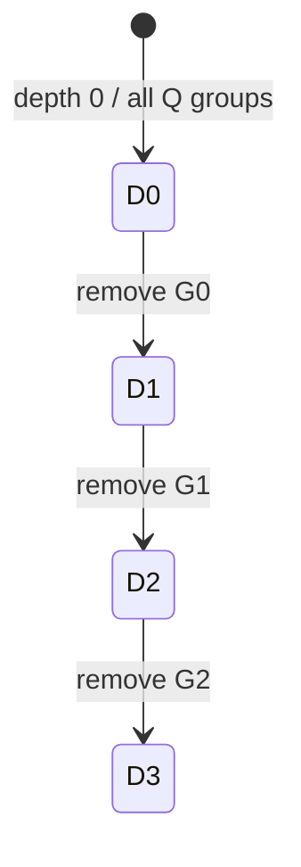

# Configuration and modulus chain

`CkksConfig` fixes the mathematical CKKS parameter set used by an execution context: the polynomial ring, default scale, ordered ciphertext-modulus groups, special modulus, Galois generator, error distribution, and security-budget selection. It contains exact prime values rather than device or machine-word policy.

## Ownership

| Object | Responsibility |
| --- | --- |
| `Preset` | Select a reviewed, named parameter baseline and resolve it to exact primes |
| `CkksConfig` | Store the placement-independent CKKS and security parameters |
| `fhelium.eager.Engine` | Select an RNS execution format and lazily create device-local arithmetic, random, and key resources |

A benchmark profile and a Bootstrap circuit are separate objects. Neither redefines CKKS parameters.

## Ring and slots

For `logN = k`,

$$
N=2^k, \qquad S=N/2.
$$

$N$ is the degree of the polynomial ring $\mathbb Z[X]/(X^N+1)$, and $S$ is the number of complex CKKS slots. Increasing $N$ increases slot capacity and the available security/noise budget, but also increases every polynomial, key, transform, and residue tensor.

## Q depth groups and P special primes

FHElium writes the ciphertext modulus as an ordered sequence of **Q depth groups**:

$$
(G_0,G_1,\ldots,G_D),
\qquad G_d=(q_{d,0},\ldots,q_{d,k_d-1}).
$$

Each $q_{d,i}$ is an NTT-compatible Q prime. `config.q_depth_groups` stores these groups and their order. `config.max_depth` is $D$. The final group $G_D$ is the terminal basis: it remains available for arithmetic, but there is no following group to which a rescale can advance.

At public depth $d$, the active ciphertext modulus is

$$
Q_d=\prod_{r=d}^{D}\prod_{q\in G_r}q.
$$

The special modulus is

$$
P=\prod_j p_j,
$$

where the $p_j$ are **special primes** stored in `config.p_moduli`. Hybrid key switching temporarily extends a Q value to the QP basis and then removes P by ModDown. P is not part of the public depth sequence.

For a dense RNS tensor, the limb axis is ordered as

```text
[active Q rows, all P rows]
```

when `modulus_basis="QP"`, and contains only the first region when `modulus_basis="Q"`. `prime_ids` records which configured prime each compact local row represents.

## Integers, RNS, and the Chinese remainder theorem

A **Residue Number System (RNS)** represents an integer modulo a product of pairwise-coprime moduli. At a fixed depth, write the active Q primes as $q_0,\ldots,q_{L-1}$ and their product as $Q$. The map from an integer $a$ to its residue vector is

$$
a\longmapsto(a_0,\ldots,a_{L-1}),
\qquad a_i=a\bmod q_i.
$$

Each remainder fits its individual modulus even when $Q$ is much larger than a machine integer. This forward conversion consists of independent modular reductions. The **Chinese remainder theorem (CRT)** establishes the ring isomorphism

$$
\mathbb Z/Q\mathbb Z
\;\cong\;
\prod_{i=0}^{L-1}\mathbb Z/q_i\mathbb Z.
$$

Consequently, the residues determine exactly one integer class modulo $Q$. Integers differing by a multiple of $Q$ have the same representation. Selecting a representative interval makes reconstruction unique within that interval.

### Reconstruction and signed representatives

Let $Q_i=Q/q_i$ and let $u_i=Q_i^{-1}\bmod q_i$. The standard representative is

$$
a_{\mathrm{std}}
=\left(\sum_{i=0}^{L-1}a_i Q_i u_i\right)\bmod Q,
\qquad 0\le a_{\mathrm{std}}<Q.
$$

Each term reproduces its selected residue and vanishes modulo the other primes. For the odd moduli used here, the centered representative is

$$
a_{\mathrm{ctr}}=
\begin{cases}
a_{\mathrm{std}},&a_{\mathrm{std}}\le (Q-1)/2,\\
a_{\mathrm{std}}-Q,&a_{\mathrm{std}}>(Q-1)/2.
\end{cases}
$$

The standard and centered forms describe the same residue vector. A signed integer lying in the centered interval is recovered with its sign; a value outside that interval wraps to another representative of its class.

As an integer CRT example, take moduli $(5,7,11)$, so $Q=385$. The integer $123$ maps to $(3,4,2)$. The reconstruction weights $Q_i u_i$ are $(231,330,210)$, giving

$$
(3\cdot231+4\cdot330+2\cdot210)\bmod385=123.
$$

The integer $-123$ maps to $(2,3,9)$. Its standard reconstruction is $262$, and its centered reconstruction is $262-385=-123$.

### Polynomial coefficients and independent arithmetic

CKKS applies this representation to every coefficient of a polynomial in $\mathbb Z_Q[X]/(X^N+1)$. If $a(X)=\sum_{j=0}^{N-1}a_jX^j$, row $i$ stores the polynomial

$$
a^{(i)}(X)=\sum_{j=0}^{N-1}(a_j\bmod q_i)X^j.
$$

The RNS Tensor therefore has a prime-row axis and a polynomial-coordinate axis. A row contains one residue of every coefficient, rather than a block of binary digits from each integer. CRT preserves addition and multiplication: polynomial arithmetic modulo $Q$ becomes independent polynomial arithmetic modulo each $q_i$, with the same reduction by $X^N+1$. An NTT transforms each row's polynomial coordinates to evaluations for multiplication; Montgomery representation changes how each row's residues are stored for modular arithmetic. Both transformations retain the underlying prime basis.

FHElium's encoder first produces signed `int64` coefficients and reduces them into these rows. Subsequent homomorphic arithmetic can represent coefficient classes modulo a many-prime $Q$ without assembling arbitrary-width integers in each kernel. Decryption uses mixed-radix reconstruction over the active Q rows to select the centered phase, then produces binary64 approximate coefficients for slot decoding. The CRT formulas define the represented integer class; binary64 conversion determines the precision of the reconstructed numerical output.

A mixed-radix form expresses the same standard representative as

$$
a_{\mathrm{std}}=\sum_{i=0}^{L-1}d_i\prod_{k=0}^{i-1}q_k,
\qquad 0\le d_i<q_i,
$$

where an empty product equals one. The digits $d_i$ are computed successively from the residues using inverses of preceding prime products modulo $q_i$. They are positional digits with radices $q_i$, while the original $a_i$ are independent remainders. This form supports centered comparison and numerical reconstruction through multiply-add steps.

### Removing and extending a basis

Dropping Q rows projects the residue class onto the product of the remaining primes. Modulus switching performs this projection while preserving the recorded scale. Rescaling additionally computes a rounded quotient by the dropped group's product, so it requires arithmetic correction in the retained rows and divides the actual scale by that product.

Extending a basis requires a representative convention. One residue vector identifies a class containing both $a$ and $a+Q$, which can have different residues modulo a new prime. The convention selects the integer representative whose residues are computed in the extended basis. Hybrid ModUp extends the selected decomposition digit, while centered ModRaise extends a centered source representative. The [state-transition model](state-transitions-and-orthogonality.md) places these basis changes alongside scale and polynomial-domain transitions.

## Depth and depth remaining

**Depth** identifies the first active Q group. At depth zero, all Q groups are active. For $d<D$, a rescale from depth $d$ to $d+1$ removes the complete group $G_d$:



The public interval is `0 <= depth <= max_depth`. FHElium reports

```text
depth_remaining = max_depth - depth
```

as the number of further rescale transitions in this chain. At `max_depth`, the active Q basis contains only $G_D$. Depth records a basis position, not the number of multiplications or rescale calls already executed. A caller may create a value at a selected depth, switch its basis, or accumulate several multiplications before one rescale when the remaining modulus and precision permit that schedule.

A Bootstrap composition declares its own entry requirements. The supplied full-slot composition uses `bootstrap.input_depth`, one step before the terminal basis; an ordinary rescale then reaches the basis it uses for centered ModRaise. This does not remove a depth from the general CKKS chain.

`mod_switch_to_depth(value, target_depth)` removes complete leading groups without quotient scaling. It preserves actual scale. `rescale_to_next_depth` removes one complete group and divides the actual scale by that group's product. No intermediate CKKS depth is created when a group contains several primes.

## Scale is independent of prime width

`config.default_scale` supplies a creation and planning default. Every plaintext and ciphertext carries its own positive finite actual scale $\Delta(v)$. For multiplication and rescaling,

$$
\Delta(ab)=\Delta(a)\Delta(b),
\qquad
\Delta(\operatorname{Rescale}_d(a))
=\frac{\Delta(a)}{\prod_{q\in G_d}q}.
$$

A default scale near $2^{50}$ does not require one approximately 50-bit Q prime per depth. A depth group may contain several smaller primes whose product is near the desired divisor. Prime grouping, actual scale, and tensor dtype are therefore separate concepts.

## RNS execution format

Encoding first produces signed `int64` integer coefficients. The `integer_coefficients_to_rns` transition reduces those coefficients modulo each active prime and materializes the Engine's RNS dtype. Ciphertexts and live keys then retain that dtype.

The Engine selects the narrowest supported execution format for the exact QP prime set. `rns_dtype=` is an expert override and is validated against every configured modulus. Montgomery radix, lazy-reduction bounds, and native table layout belong to the device-local `RnsContext`, not `CkksConfig`. This keeps one Ciphertext, Engine, operation set, and Backend model across supported execution formats.

## Exact configuration and serialization

A resolved configuration contains:

```text
logN
default_scale
q_depth_groups
p_moduli
galois_generator
sigma
security_bits
enforce_security_budget
```

`CkksConfig.dumps()` serializes these values and the FHElium package version. `CkksConfig.parse()` reconstructs that exact parameter set. Runtime placement, process groups, caches, NTT implementation choice, and RNS dtype do not enter configuration identity.

## Cost and security consequences

Let $L_d=\sum_{r=d}^{D}|G_r|$ be the number of active Q prime rows. An unbatched two-component Q ciphertext at depth $d$ stores

$$
2\,L_d\,N\,W
$$

bytes of Tensor payload, where $W$ is the number of bytes per residue element. Multiply this quantity by the product of batch extents for a homogeneous batch. Evaluation keys add key digit, component, and QP axes and commonly dominate memory. More Q rows provide additional modulus capacity but increase transforms, key products, and storage.

The built-in security assessment applies to the exact complete QP product. A parameter plan must also validate numerical precision, message range, error growth, and native arithmetic bounds for its workload.

## Related concepts

- [Scale and depth lifecycle](scale-and-depth-lifecycle.md)
- [Scale, depth, and RNS execution format](scale-depth-and-execution-format.md)
- [Value model and identity](value-model-and-identity.md)
- [State transitions and orthogonality](state-transitions-and-orthogonality.md)
- [Evaluator operation transitions](evaluator-operation-transitions.md)
