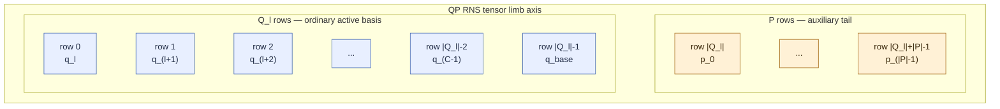
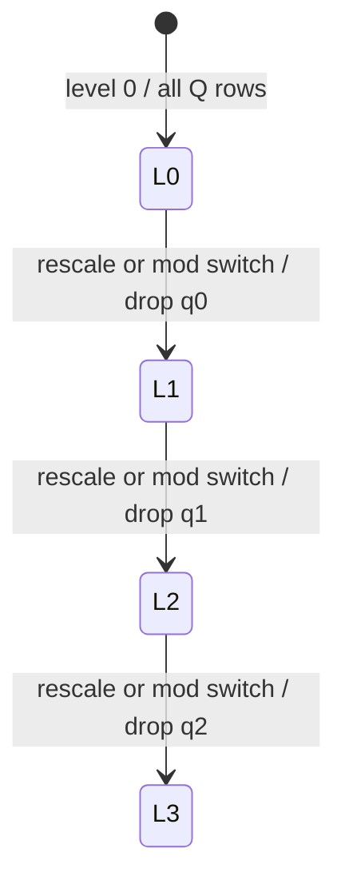

# Context and modulus chain

A FHElium value belongs to one immutable CKKS context. The context fixes the
direct representation version, ring, default scale, ordinary Q moduli, special
P moduli, Galois generator, and a stable identity used to reject incompatible
values.

Construction proceeds through distinct owners:

| Object | Responsibility |
| --- | --- |
| `Preset` | Named baseline for slot capacity, default scale width, public levels, and P-prime count |
| `CkksConfig` | Resolved mathematical/security parameters and Q/P chains |
| `CkksContextSpec` | Immutable placement-independent compatibility metadata derived for values |
| `CkksEngine` | One process-local device, NTT policy, tables, randomness, keys, and evaluator operations |

A benchmark profile and an experimental bootstrap factory are separate
objects; neither is a CKKS context.

## Context identity

`CkksContextSpec` is placement-independent metadata:

```text
representation = direct_per_value_scale_v1
logN
default_scale
q_moduli
p_moduli
galois_generator
context_id = hash(representation, logN, default_scale, Q, P, galois_generator)
```

It does not contain a CUDA device, rank, process group, cache, or file path.

`CkksConfig()` and the default `CkksEngine()` baseline use a 40-bit default
scale with int64 tensors. Maintained int64 presets provide 30-, 40-, and
50-bit scale families; maintained int32 presets use a 25-bit scale family.
The dtype suffix, residue buffer width, and scale width are separate
configuration properties.
`config.default_scale` supplies the value-creation scale when an encode or
encryption scale is omitted. Every plaintext and ciphertext carries its own
positive finite binary64 actual scale, and arithmetic uses that per-value
state. `scale_bits` selects the context's scale-prime catalog and default. Two
values with the same tensor shape are incompatible if their `context_id`
values differ. The complete maintained preset matrix is specified in
[Choose a preset and chain depth](../../how-to/choose-preset-and-depth.md).

## Ring dimension and slots

For `logN = k`:

$$
N = 2^k, \qquad \text{CKKS slots} = N/2.
$$

`N` is the polynomial-ring dimension. CKKS packs complex values into `N/2`
slots. A larger ring offers more slots and a larger security/noise budget, but
also increases every polynomial, key, NTT, and residue tensor.

## Q and P occupy distinct limb-axis regions

For one RNS polynomial, the dense payload has shape
``[..., limb, coefficient_or_ntt_index]``. Each box below is one full
length-$N$ tensor row; the diagram shows how the limb index is partitioned.



The expanded Q region is illustrated for $\ell\leq C-4$. At later levels,
unavailable intermediate Q rows are simply absent; the P tail remains the
same auxiliary region.

- **Q** is the ordinary ciphertext modulus chain. Ciphertexts normally live in
  basis `"Q"`.
- **P** contains special auxiliary moduli used by hybrid key switching. A
  key-switch stage may temporarily extend data to basis `"QP"` and then return
  to Q through ModDown.

QP is the auxiliary extension of Q at the same level. Basis and level are
independent state dimensions. In the dense tensor model, the limb axis is
ordered as

```text
[q_l, q_(l+1), ..., q_base, p_0, ..., p_(|P|-1)].
```

A Q value stores only the leading Q region. A QP value at the same level
retains those rows and appends the usually smaller P region. Hybrid key
switching temporarily extends the limb axis with this P tail and ModDown
returns to the leading Q region; neither operation interprets P rows as later
levels.

## Level means consumed leading Q primes

At level zero, a ciphertext uses the complete ordinary Q chain. Each
`rescale_to_next_level` or `mod_switch_to_next_level` transition drops one
leading scale prime:



`mod_switch_to_level(ciphertext, target_level)` may apply the same basis
restriction across several levels in one call, dropping
`target_level - ciphertext.level` leading Q rows.

Therefore:

- a larger level means fewer active Q rows;
- `prime_ids` identifies the exact rows represented by the dense tensor;
- the tensor's limb dimension shrinks after rescale or modulus switch;
- a final legal level cannot be rescaled again;
- operation compatibility requires more than comparing integer `level` values.

FHElium stores prime IDs with each local tensor row because a compact local tensor row must still
map to the correct canonical modulus and arithmetic parameters.

## Level and scale are independent state coordinates

Each plaintext and ciphertext carries a positive finite binary64 actual scale
$\Delta(v)$. Multiplication preserves level and records the product of operand
scales. At public level $\ell$, rescale advances to $\ell+1$ and records

$$
\Delta(c')=\frac{\Delta(c)}{q_{\mathrm{drop}}},
$$

where $q_{\mathrm{drop}}$ is the actual leading active Q prime. Modulus switch
advances or restricts the level while preserving scale. The complete public
level interval, transition equations, compatibility requirements, and transition
queries are specified in
[Scale and level lifecycle](scale-and-level-lifecycle.md). The
[explicit scale-management tutorial](../../tutorial/explicit-scale-management.md)
applies the rescale equation in a runnable operand-scale plan.

## Depth, precision, and range

A parameter plan must account for three interacting limits:

1. **Depth:** each rescale consumes a scale prime.
2. **Precision:** scale and modulus budget determine usable approximate
   precision.
3. **Range:** input amplitude, multiplication, and wide summation must not wrap
   modulo the active Q product.

Increasing scale can improve fractional precision while reducing headroom for
large intermediate values. Adding more Q primes increases value/key size and
operation cost. Parameter selection is therefore a workload decision, not a
single "maximum precision" knob.

## Memory scales with active rows

For a dense two-component ciphertext, payload storage is approximately:

$$
2 \times |Q_\ell| \times N \times \text{element size}.
$$

Evaluation keys additionally include digit and key-component axes and often a
QP basis, so they can dominate ciphertext memory. Moving to a later level
reduces ordinary active rows, but does not automatically eliminate all key or
temporary storage.

## Invariants to remember

- Context identity includes the exact modulus values, not only their count.
- Level zero contains all ordinary Q rows.
- Level increases as leading scale primes are dropped.
- Q and QP are different bases, not different levels.
- `prime_ids` is part of exact value identity.
- Ring size, active rows, and component/digit axes all contribute to memory.
- Precision claims must be validated at realistic amplitude and summation
  width.

## Continue

- [Scale and level lifecycle](scale-and-level-lifecycle.md)
- [Value model and identity](value-model-and-identity.md)
- [State transitions and orthogonality](state-transitions-and-orthogonality.md)
- [Evaluator operation transitions](evaluator-operation-transitions.md)
- [Modulus chain and depth tutorial](../../tutorial/modulus-chain-depth.md)
- [Choose a preset and chain depth](../../how-to/choose-preset-and-depth.md)
