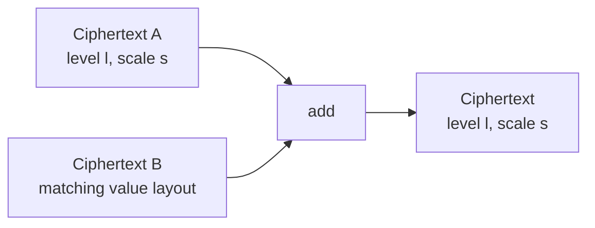
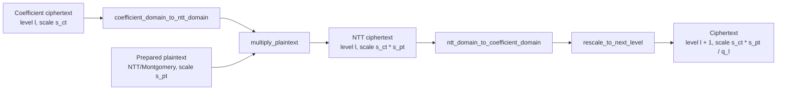
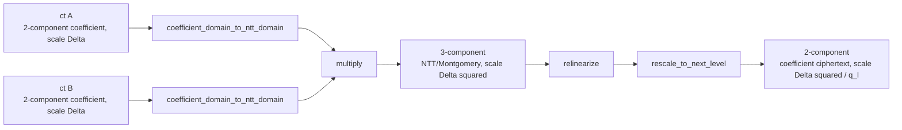
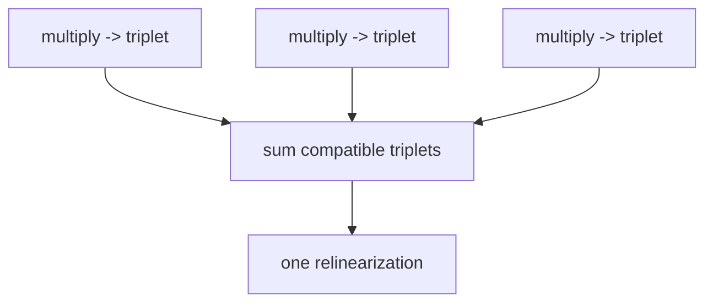

# Evaluator operation transitions

FHElium evaluator operations transform values through separately invoked arithmetic,
component-count, key-dependency, and modulus-chain steps. Their transitions
expose multiplicative depth, actual scale, key use, and optimization
opportunities.

This page defines the state effects of addition, multiplication,
relinearization, rescale, key switching, and rotation. Scale and level
equations are defined in
[Scale and level lifecycle](scale-and-level-lifecycle.md). Primitive
representation, domain, and residue conversions are defined in
[State transitions and orthogonality](state-transitions-and-orthogonality.md).

## Addition preserves arithmetic depth



Addition preserves level and scale. Inputs agree on context, active rows,
polynomial domain, modulus basis, residue representation, component count, and
binary64 scale.

Use `add(...)` for a functional output and `add_(lhs, rhs)` only when deliberate
mutation and storage reuse are part of the program.

## Plaintext multiplication preserves level and multiplies scale



`multiply_plaintext` accepts an operation-ready plaintext constructed with
`engine.prepare_plaintext_for_multiplication(engine.encode(...))` and a
two-component NTT/Montgomery ciphertext. The result remains NTT/Montgomery,
stays at the input level, and records the product of the operand scales. This
matches ciphertext-ciphertext `multiply`: multiplication regions own their
through separate NTT-domain transition calls, and compatible terms can be accumulated before
one inverse transition. Rescale still requires coefficient-domain standard
residues.

```python
source_ntt = engine.coefficient_domain_to_ntt_domain(source)
term_ntt = engine.multiply_plaintext(source_ntt, prepared_weight)
sum_ntt = engine.add(sum_ntt, term_ntt)
result = engine.rescale_to_next_level(
    engine.ntt_domain_to_coefficient_domain(sum_ntt)
)
```

For repeated model weights, encode and prepare operation-ready plaintexts at
the levels used by the evaluator instead of repeating preparation per
request.

## Ciphertext multiplication produces three components

For two compatible two-component ciphertexts:

$$
(c_0+c_1s)(d_0+d_1s)
  =c_0d_0+(c_0d_1+c_1d_0)s+c_1d_1s^2.
$$

The $s^2$ term explains the three-component output.



The public `multiply` operation has these preconditions:

- two components on each input;
- matching value layout;
- NTT domain;
- Montgomery representation;
- Q modulus basis.

It returns a three-component NTT ciphertext at the product scale.
Relinearization and `rescale_to_next_level` are subsequent operations.
Rescale accepts any valid pre-rescale actual scale supported by the active
modulus state.

Ciphertext-plaintext and ciphertext-ciphertext multiplication therefore share
the same arithmetic representation: NTT/Montgomery inputs and an
NTT/Montgomery output. They differ in component convolution and subsequent key
requirements, not in the multiplication domain.

## Relinearization is a specialized key switch

Relinearization transforms the $s^2$ dependency into two components under the
original secret-key basis. Conceptually it:

1. key-switches the third component with a relinearization key;
2. adds the two correction components to the original first and second
   components;
3. returns a two-component coefficient-domain ciphertext.

Because the transition is invoked separately, compatible triplet products may be added
first and relinearized once:



This **late relinearization** trades larger three-component live storage for
fewer key switches. It is valid only while all accumulated triplets have
compatible state and no subsequent operation requires two components.

## Scale and level transitions

`rescale_to_next_level` accepts a complete coefficient-domain, standard-residue Q or
QP ciphertext with two or three components. It advances one level, removes the
leading Q row, and divides the actual scale by that Q prime.
`mod_switch_to_next_level` and `mod_switch_to_level` restrict the active Q basis while
preserving scale. `reinterpret_at_scale` preserves residues and records a new
scale, changing the decoded message by the old-to-new scale ratio. The
equations, public bounds, and compatibility requirements are specified in
[Scale and level lifecycle](scale-and-level-lifecycle.md).

## Rotation is automorphism plus key switching


A sequence of rotations may share preparation through hoisting, but every
output still needs a step-specific automorphism, direct rotation key, key
products, and ModDown.

## Functional and in-place forms

| Form | Meaning |
| --- | --- |
| `engine.add(a, b)` | Returns a new value; inputs are unchanged |
| `engine.add_(a, b)` | Mutates the first argument |
| `value.to(device)` | Returns the same value state on another device |
| `value.replace_(other)` | Rebinds an object's storage and state |

Prefer functional operations until a memory-lifetime plan proves that mutation
is safe. In-place execution can invalidate borrowed references or race with
asynchronous readers if ownership is unclear.

## Evaluator state checklist

Record the following state before each operation:

- current level and active rows;
- current scale;
- coefficient or NTT domain;
- Q or QP basis;
- residue representation;
- component count;
- required stored key state and external cryptographic relation;
- whether the operation returns a new value or mutates storage.

## Continue

- [State transitions and orthogonality](state-transitions-and-orthogonality.md)
- [Scale and level lifecycle](scale-and-level-lifecycle.md)
- [Late relinearization and NTT reuse tutorial](../../tutorial/late-relinearization-and-ntt-reuse.md)
- [Rotation hoisting tutorial](../../tutorial/rotation-hoisting.md)
- [Key lifecycle](key-lifecycle.md)
- [Composable CKKS bootstrapping](composable-bootstrapping.md)
- [Multiplication, key switching, and rescale](../../developer/multiplication-keyswitch-rescale.md)
