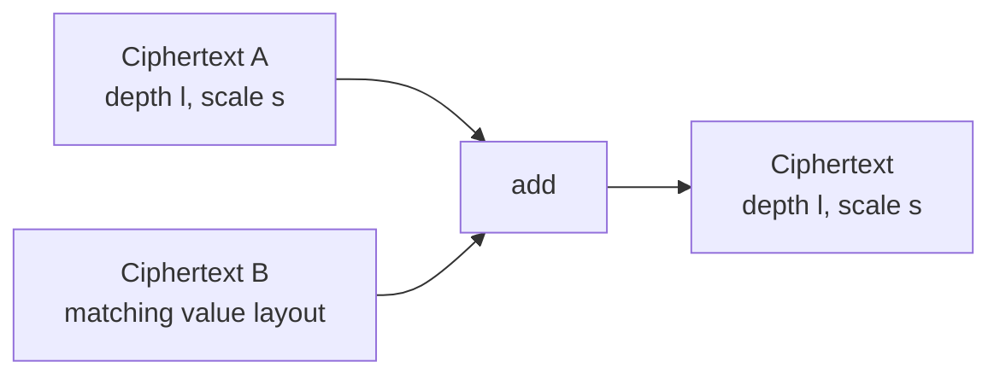
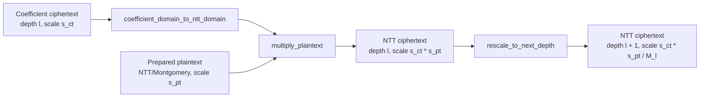
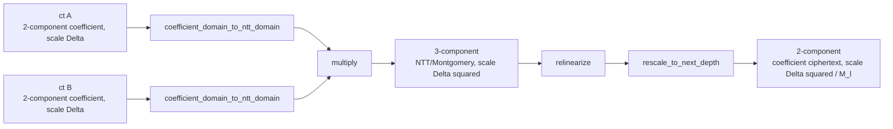
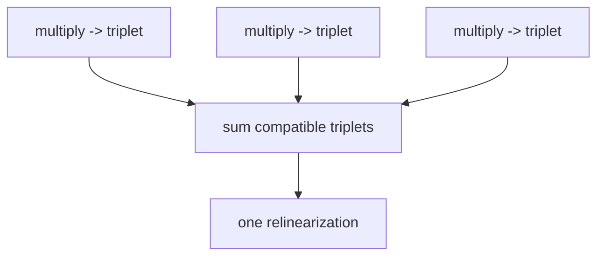
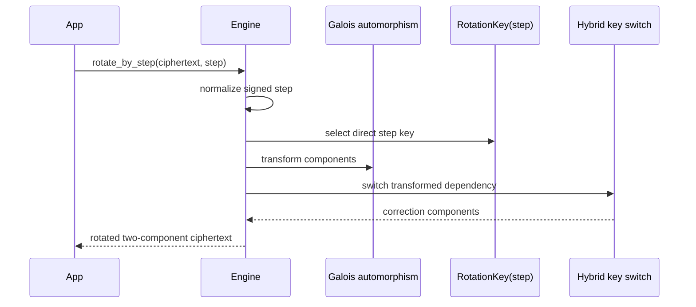

# Evaluator operation transitions

FHElium evaluator operations transform values through separately invoked arithmetic,
component-count, key-dependency, and modulus-chain steps. Their transitions
expose multiplicative depth, actual scale, key use, and optimization
opportunities.

This page defines the state effects of addition, multiplication,
relinearization, rescale, key switching, and rotation. Scale and depth
equations are defined in
[Scale and depth lifecycle](scale-and-depth-lifecycle.md). Primitive
representation, domain, and residue conversions are defined in
[State transitions and orthogonality](state-transitions-and-orthogonality.md).

## Addition preserves arithmetic depth



Addition preserves depth and scale. Inputs agree on active rows, polynomial
domain, modulus basis, residue representation, component count, and binary64
scale. The caller ensures that both inputs use compatible CKKS parameters.

Use `add(...)` for a functional output and `add_(lhs, rhs)` only when deliberate
mutation and storage reuse are part of the program.

## Real and integer scalar arithmetic avoids plaintext expansion

`add_scalar(ciphertext, scalar, scalar_scale=...)` quantizes one real scalar
at the selected scalar scale $\Delta_s$ and adds the resulting RNS integer to
the constant coefficient of component zero. Its input is coefficient-domain
with standard residues. The ciphertext actual scale $\Delta_c$ is preserved,
so the represented change is approximately

$$
\mathtt{scalar}\frac{\Delta_s}{\Delta_c}.
$$

Eager execution uses $\Delta_s=\Delta_c$ when `scalar_scale` is omitted,
which gives the ordinary slot-wise addition by `scalar`. A caller-supplied
positive finite scale changes the represented scalar magnitude while preserving
the ciphertext scale metadata.

`multiply_scalar(ciphertext, scalar, scalar_scale=...)` quantizes the real
scalar at $\Delta_s$ and applies one Montgomery scalar per active RNS row to
every ciphertext component and coefficient. It preserves the depth and
records

$$
\Delta_{\mathrm{out}}=\Delta_c\Delta_s.
$$

Eager execution again defaults $\Delta_s$ to the input ciphertext scale.
`multiply_integer_scalar(ciphertext, integer)` instead performs modular
integer multiplication without an encoding scale, so it preserves both
$\Delta_c$ and the depth. Neither multiplication operation rescales. A caller
invokes `rescale_to_next_depth` separately when its schedule requires the
divide-round-drop transition.

These shortcuts apply to real scalars. A non-real complex slot value uses
ordinary message encoding and plaintext preparation.

## Plaintext multiplication preserves depth and multiplies scale



`multiply_plaintext` accepts an operation-ready plaintext constructed with
`engine.prepare_plaintext_for_multiplication(engine.encode(...))` and a
two-component NTT/Montgomery ciphertext. The result remains NTT/Montgomery,
stays at the input depth, and records the product of the operand scales. This
matches ciphertext-ciphertext `multiply`: multiplication regions own their
NTT-domain transition calls, and compatible terms can be accumulated and
rescaled without an intermediate inverse transition.

```python
source_ntt = engine.coefficient_domain_to_ntt_domain(source)
term_ntt = engine.multiply_plaintext(source_ntt, prepared_weight)
sum_ntt = engine.add(sum_ntt, term_ntt)
result = engine.rescale_to_next_depth(sum_ntt)
```

For repeated model weights, encode and prepare operation-ready plaintexts at
the depths used by the evaluator instead of repeating preparation per
request.

## Ciphertext multiplication produces three components

For two compatible two-component ciphertexts:

$$
(c_0+c_1s)(d_0+d_1s)
  =c_0d_0+(c_0d_1+c_1d_0)s+c_1d_1s^2.
$$

The $s^2$ term explains the three-component output.



The public `multiply` operation has these preconditions:

- two components on each input;
- matching value layout;
- NTT domain;
- Montgomery representation;
- Q modulus basis.

It returns a three-component NTT ciphertext at the product scale.
Relinearization and `rescale_to_next_depth` are subsequent operations.
Rescale accepts any valid pre-rescale actual scale supported by the active
modulus state.

Ciphertext-plaintext and ciphertext-ciphertext multiplication therefore share
the same arithmetic representation: NTT/Montgomery inputs and an
NTT/Montgomery output. They differ in component convolution and subsequent key
requirements, not in the multiplication domain.

## Relinearization is a specialized key switch

Relinearization transforms the $s^2$ dependency into two components under the
original secret-key basis. Conceptually it:

1. key-switches the third component with a relinearization key;
2. adds the two correction components to the original first and second
   components;
3. returns a two-component coefficient-domain ciphertext.

Because the transition is invoked separately, compatible triplet products may be added
first and relinearized once:



This **late relinearization** trades larger three-component live storage for
fewer key switches. It is valid only while all accumulated triplets have
compatible state and no subsequent operation requires two components.

Compile placement passes inspect multiplication results, their SSA uses, value
state, and existing transition operations. A caller selects one placement
policy for each transition:

- `InsertRelinearizationPass` and `InsertRescalePass` materialize the
  transition at the nearest safe SSA frontier;
- `LateRelinearizationPass` coalesces compatible three-component add/sub trees
  and places one relinearization at each region exit;
- `LateRescalePass` coalesces compatible unconditional-nearest rescales across
  add/sub trees and places one rescale at each exit.

Relinearization and rescale placement are independent choices. Each pass
recognizes an already placed transition of the other kind as a state-preserving
edge where that ordering is valid. Immediate and late policies can therefore
be composed in either order without encoding pending work as an operation
attribute. A caller-inserted matching `RelinearizeOp` or `RescaleOp` satisfies
the corresponding multiplication path and is retained once.

The current late policies support flat single-block SSA graphs. They cross
compatible addition, subtraction, and negation. A fan-out is a placement
frontier, so one shared transition is inserted before the split. Existing
caller-inserted transition operations are retained.
Cross-dialect encrypted-value bridge casts carry the same ciphertext between
semantic, logical, and CKKS types and may be traversed. A same-dialect CKKS
cast with a different represented state is opaque: placement retains its input
and target type and inserts a required transition after the cast. Such a cast
cannot claim that a three-component ciphertext became two-component without a
real `RelinearizeOp`.
Rotation, conjugation, key switching, modulus switching, another ciphertext
multiplication, and unknown operations are barriers in the conservative first
policy. Moving a rescale across rotation is mathematically possible as a
different approximate schedule, but it changes the active-Q key-switch work,
rounding, and noise and is therefore not selected silently.

When a caller chooses transition placement, it runs those passes before
`AssignCkksDepthsPass` and `AssignCkksScalesPass`. The depth pass reads the
represented rescale and modulus-switch nodes. The scale pass propagates
per-value actual scales and never
inserts arithmetic or metadata reinterpretation operations. A Program may
therefore retain an unrescaled scale or a three-component result when its
caller and eventual consumer support that state.

## Scale and depth transitions

`rescale_to_next_depth` accepts a complete coefficient-domain, standard-residue Q or
QP ciphertext with two or three components. It advances one depth, removes the
leading Q depth group, and divides the actual scale by that group's prime
product.
`mod_switch_to_next_depth` and `mod_switch_to_depth` restrict the active Q basis while
preserving scale. `reinterpret_at_scale` preserves residues and records a new
scale, changing the decoded message by the old-to-new scale ratio. The
equations, public bounds, and compatibility requirements are specified in
[Scale and depth lifecycle](scale-and-depth-lifecycle.md).

## Rotation is automorphism plus key switching



A sequence of rotations may share preparation through hoisting, but every
output still needs a step-specific automorphism, direct rotation key, key
products, and ModDown.

## Functional and in-place forms

| Form | Meaning |
| --- | --- |
| `engine.add(a, b)` | Returns a new value; inputs are unchanged |
| `engine.add_(a, b)` | Mutates the first argument |
| `value.to(device)` | Returns the same value state on another device |
| `value.replace_(other)` | Rebinds an object's storage and state |

Prefer functional operations until a memory-lifetime plan proves that mutation
is safe. In-place execution can invalidate borrowed references or race with
asynchronous readers if ownership is unclear.

## Evaluator state checklist

Record the following state before each operation:

- current depth and active rows;
- current scale;
- coefficient or NTT domain;
- Q or QP basis;
- residue representation;
- component count;
- required stored key state and external cryptographic relation;
- whether the operation returns a new value or mutates storage.

## Continue

- [State transitions and orthogonality](state-transitions-and-orthogonality.md)
- [Scale and depth lifecycle](scale-and-depth-lifecycle.md)
- [Late relinearization and NTT reuse tutorial](../../tutorial/late-relinearization-and-ntt-reuse.md)
- [Rotation hoisting tutorial](../../tutorial/rotation-hoisting.md)
- [Key lifecycle](key-lifecycle.md)
- [Composable CKKS bootstrapping](composable-bootstrapping.md)
- [Multiplication, key switching, and rescale](../../developer/multiplication-keyswitch-rescale.md)
