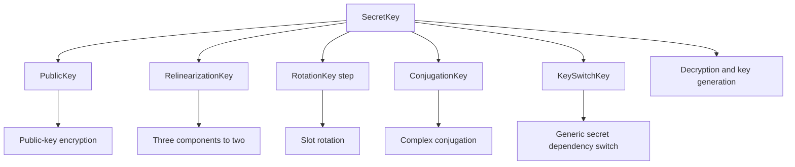
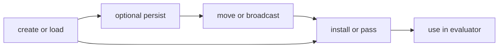
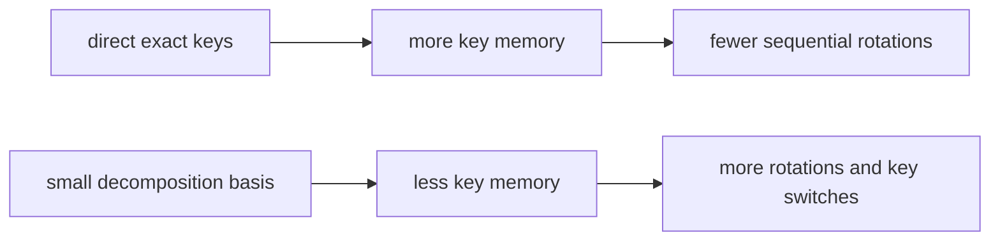

# Key lifecycle

FHElium treats keys as exact typed values with controlled creation, placement,
installation, persistence, and use. This separation supports production key
custody, minimal evaluator keysets, distributed ownership, and repeatable
benchmarks.

## Key families



| Key | Main purpose | Stored state or specialization |
| --- | --- | --- |
| `SecretKey` | Decrypt and derive other keys | Context and exact dense state |
| `PublicKey` | Public-key encryption | Context, Q rows, and arithmetic state |
| `RelinearizationKey` | Switch the multiplication $s^2$ component | Context and QP key layout |
| `RotationKey` | Automorphism-specific key switch | Context plus canonical signed step |
| `ConjugationKey` | Complex conjugation | Context and key-switch state |
| `KeySwitchKey` | Source-to-destination secret-key dependency switch | Context, digits, QP rows, and arithmetic state |

These objects validate their stored context, rows, representation state, and
specialization. A public key does not store a symbolic destination-secret
lineage, and a generic `KeySwitchKey` does not store symbolic source and
destination identifiers. The application preserves every such cryptographic
relation that is not represented by a concrete field.

## Creation, installation, and use are different actions

```python
secret_key = engine.create_secret_key()
public_key = engine.create_public_key(secret_key)
relin_key = engine.create_relinearization_key(secret_key)
rot_key = engine.create_rotation_key(3, secret_key)

engine.set_secret_key(secret_key)
engine.set_public_key(public_key)
engine.set_relinearization_key(relin_key)
engine.set_rotation_key(rot_key)
```



This design allows an evaluator to load externally managed keys without ever
creating a secret key locally. It also makes setup cost and steady-state
execution cost separable.

## Rotation keys bind exact steps

A `RotationKey` describes one canonical signed slot step. Equivalent modular
steps canonicalize to a stable range, but a key for one canonical step cannot
be used for another merely because tensor shapes match.

A `RotationKeySet` maps canonical steps to exact keys. Generate only steps the
packing/evaluator actually needs unless a measured decomposition strategy is
better.



This is a workload trade-off, not a universally safe automatic choice.

## Lifecycle invariants

- **The consumer plans the keyset.** Derive public, relinearization, rotation,
  conjugation, and generic key-switch requirements from the actual evaluator
  schedule rather than from every operation the library supports.
- **Setup and use are distinct.** Creating, loading, moving, installing, and
  using a key are separate actions. A worker that neither decrypts nor derives
  key material should not receive the secret key.
- **Persistence is authorization.** Secret-key serialization requires an
  explicit opt-in. Sensitivity labels do not provide encryption, a
  key-management service (KMS), access-control lists (ACLs), audit, backup, or
  deletion policy.
- **Placement is application-owned.** The workload decides which process owns,
  replicates, broadcasts, stages, or evicts each key. Large evaluation keys
  make this both a security and capacity decision.
- **Steady-state measurements exclude setup unless stated otherwise.** Report
  key creation, load, movement, and materialization separately when the named
  result is evaluator latency.

Use [Provision the minimum required keyset](../../how-to/provision-keyset.md)
for the operational checklist, specialist key-switch example, custody checks,
and reporting procedure. The [Engine API](../../api/fhelium/engine/ckks_engine.md) defines the
exact construction and installation methods.

## Continue

- [Key materials tutorial](../../tutorial/key-materials.md)
- [Distributed SPMD model](../distributed/spmd-model.md)
- [Residency lifetimes](../execution/residency-lifetimes.md)
- [Provision the minimum required keyset](../../how-to/provision-keyset.md)
