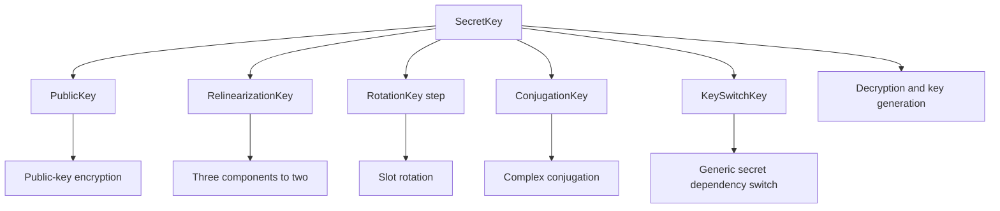
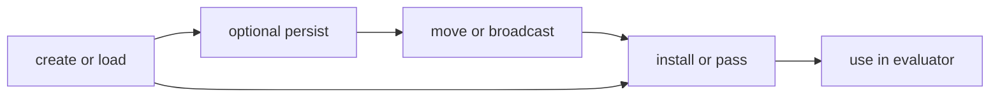
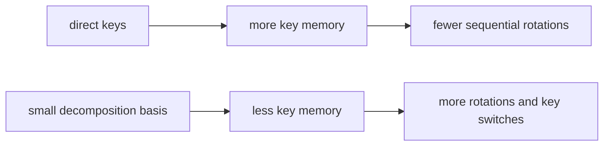

# Key lifecycle

FHElium treats keys as typed values with controlled creation, placement, installation, persistence, and use. This separation supports production key custody, minimal evaluator keysets, distributed ownership, and repeatable benchmarks.

## Key families



| Key | Main purpose | Stored state or specialization |
| --- | --- | --- |
| `SecretKey` | Decrypt and derive other keys | Dense arithmetic state |
| `PublicKey` | Public-key encryption | Q rows and arithmetic state |
| `RelinearizationKey` | Switch the multiplication $s^2$ component | QP key layout |
| `RotationKey` | Automorphism-specific key switch | Normalized signed step and QP key layout |
| `ConjugationKey` | Complex conjugation | Key-switch state |
| `KeySwitchKey` | Source-to-destination secret-key dependency switch | Digits, QP rows, and arithmetic state |

These objects validate their stored rows, representation state, and specialization. The application tracks CKKS parameter provenance and symbolic source/destination lineage beyond the concrete fields carried by each key type.

## Creation, installation, and use are different actions

```python
secret_key = engine.create_secret_key()
public_key = engine.create_public_key(secret_key)
relin_key = engine.create_relinearization_key(secret_key)
rot_key = engine.create_rotation_key(3, secret_key)

engine.set_secret_key(secret_key)
engine.set_public_key(public_key)
engine.set_relinearization_key(relin_key)
engine.set_rotation_key(rot_key)
```



This design allows an evaluator to load externally managed keys without ever creating a secret key locally. It also makes setup cost and steady-state execution cost separable.

## Key relations and calculation operands

A generic key-switch key represents a directed relation from a source secret polynomial to a destination secret polynomial. Its use maps a ciphertext phase according to

$$
c_0+c_1s_{\mathrm{src}}
\longmapsto
c'_0+c'_1s_{\mathrm{dst}},
$$

up to key-switch error. Relinearization is the corresponding switch from the multiplication dependency $s^2$ back to $s$. Rotation applies an automorphism and switches the resulting transformed secret dependency back to the original secret. Tensor shape and arithmetic state do not identify these source and destination relations; the application retains them with the key inventory. [Terminology and mathematical model](../terminology-and-mathematical-model.md#ciphertext-phase-and-key-relations) defines the phase and public-key equations.

Eager can consume a key passed to an operation or select an installed key. Key creation and installation remain separate actions. A Compile Program represents key payloads as Tensor operands, including fixed payloads referred to by material symbols. Its Compilation maps those symbols to caller-supplied Tensors. Capture retains actual supplied key data, and later preparation can supply missing key operands from an existing inventory. Capture and linking do not generate missing keys.

A transformed calculation's rotation and relinearization schedule determines its evaluation-key requirements. The same key may feed several operations through shared dataflow; replacing its binding changes the supplied key relation and requires the application to maintain compatible inputs. [Neutral IR programs](../neutral-ir-programs.md) explains Program material operands.

## Rotation keys bind steps

A `RotationKey` describes one normalized signed slot step. Equivalent modular steps reduce to the range $[-S/2,S/2)$, but a key for one normalized step cannot be used for another merely because tensor shapes match.

A `RotationKeySet` maps normalized steps to direct keys. Its required step set follows the packing and evaluator schedule; a decomposition strategy trades a smaller stored set for additional online rotations.



The workload selects this key-memory versus online-operation trade-off.

## Lifecycle invariants

- **The consumer plans the keyset.** Derive public, relinearization, rotation, conjugation, and generic key-switch requirements from the actual evaluator schedule.
- **Setup and use are distinct.** Creating, loading, moving, installing, and using a key are separate actions. Distribute the secret key only to workers authorized to decrypt or derive key material.
- **Persistence is authorization.** Secret-key serialization requires an explicit opt-in. Sensitivity labels provide classification metadata; applications supply encryption, a key-management service (KMS), access-control lists (ACLs), audit, backup, and deletion policy.
- **Placement is application-owned.** The workload decides which process owns, replicates, broadcasts, stages, or evicts each key. Large evaluation keys make this both a security and capacity decision. Eager execution rejects a key on another device by default. The caller may place a copy with `key.to(device)` or opt into Engine-managed lazy replicas with `allow_automatic_key_replication=True`. Source-copy lifetime and device trust remain application decisions.
- **Steady-state measurements exclude setup unless stated otherwise.** Report key creation, load, movement, and materialization separately when the named result is evaluator latency.

The key inventory, cryptographic relation, stored arithmetic state, placement, and lifetime together determine whether a key is available for a particular evaluator operation.

## Related concepts

- [Distributed SPMD model](../distributed/spmd-model.md)
- [Residency lifetimes](../execution/residency-lifetimes.md)
