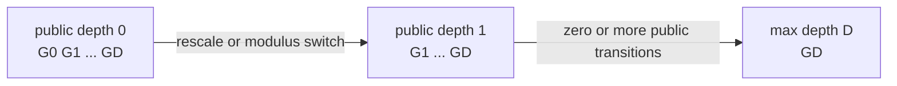
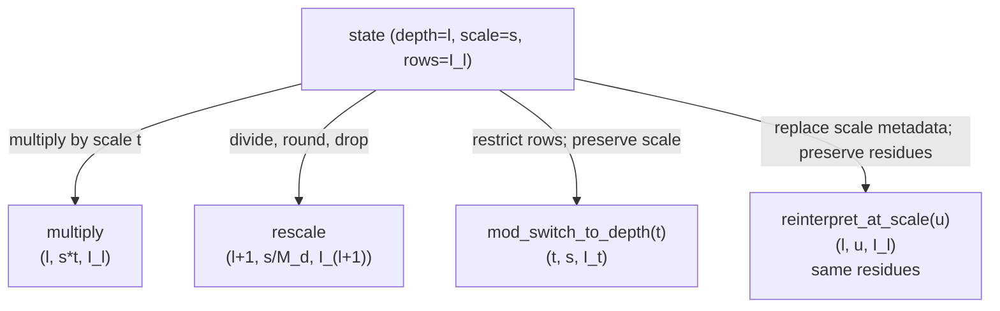

# Scale and depth lifecycle

Scale and depth are independently tracked coordinates of CKKS value state in
FHElium.
The application chooses encoding scales and state transitions. Evaluator
operations apply their documented input contract and record the resulting
scale, depth, and active modulus rows; callers must establish compatibility
that a numerical implementation does not infer.

This page defines the public scale and depth coordinates, valid public depths,
transition laws, compatibility requirements, and transition queries.

## Scale-depth transition state

A scale- or depth-changing operation is described by the tuple

$$
\mathcal{T}(v)=\bigl(\ell(v),\Delta(v),I(v),B(v)\bigr),
$$

where:

- $\ell(v)$ is the public Q-chain depth stored as `value.depth`;
- $\Delta(v)$ is the positive finite binary64 actual scale stored as
  `value.scale`;
- $I(v)$ is the ordered tuple `value.prime_ids` that maps each dense limb row
  to one configured parameter prime;
- $B(v)$ is the modulus basis, either $Q_\ell$ or $Q_\ell P$.

`depth` and `scale` are independent coordinates. Depth selects the active Q
suffix, basis independently selects Q or QP, and `prime_ids` records the
resulting RNS rows. Stored operation state also includes shape, polynomial
domain, residue representation, component count, dtype, and device. The caller
separately ensures the operands use compatible CKKS parameters.

## Default scale and actual scale

`config.default_scale` is the default encoding and planning value
$\Delta_0$. Its scale-bit description is $\log_2\Delta_0$.

`engine.plaintext`, `engine.encode`, and `engine.encrypt_message` select
$\Delta_0$ when their `scale` argument is `None`. Once a value exists, its
`scale` field is the actual scale used by subsequent arithmetic and decoding.

The product $M_d$ of one configured Q depth group is commonly selected near
$\Delta_0$, but it is a distinct integer. Consequently, a default-scale
product followed by rescale normally has

$$
\frac{\Delta_0^2}{M_d}\ne\Delta_0.
$$

FHElium records the binary64 quotient by the actual group product.

All public scale entry points and value constructors require a value that can
be represented as a finite Python `float` and satisfies

$$
0 < \Delta(v) < \infty.
$$

NaN, infinity, zero, negative values, booleans, and strings are rejected with
`InvalidScaleError`. A scale multiplication or division that overflows or
underflows the finite-positive range is rejected at the operation that produces
it.

## Depth addresses active Q groups

Let the configured Q chain be

$$
(G_0,G_1,\ldots,G_D).
$$

At public depth $d$, the active Q basis contains the flattened primes from
$G_d$ through the terminal group $G_D$. `max_depth` is $D$.

In the current parameter order, a complete Q value has

```python
value.prime_ids == tuple(
    range(engine.config.q_row_start(value.depth), engine.config.num_q_primes)
)
```

and a QP value at the same depth appends the special P prime IDs from
`range(engine.config.num_q_primes, engine.config.total_num_primes)`. `depth`
selects the active Q suffix, and `prime_ids` maps each dense limb to its
modulus. QP is the auxiliary basis at that depth.



Public value creation accepts depths in
`[0, engine.max_depth]`. Public `rescale_to_next_depth` and
`mod_switch_to_next_depth` require a following public depth, so from depth $\ell$ the
number of remaining public one-depth transitions is

$$
\mathtt{engine.max\_depth}-\ell.
$$

The built-in bootstrap accepts depth `engine.max_depth - 1`. Its entry
rescale removes that Q group and reaches the ordinary terminal group at
`engine.max_depth`; there is no additional private depth. Its scale schedule is documented
in [Composable CKKS bootstrap](../../developer/composable-ckks-bootstrap.md).

## Scale-depth transition laws

The following laws define multiplication, rescale, modulus switch, and scale
reinterpretation.



### Multiplication preserves depth and multiplies scale

For compatible ciphertext operands,

$$
\Delta(c_{\mathrm{out}})=\Delta(c_a)\Delta(c_b),
\qquad
\ell(c_{\mathrm{out}})=\ell(c_a)=\ell(c_b).
$$

`multiply_plaintext` applies the same scale-product law to a ciphertext and an
operation-ready plaintext. Both multiplication primitives require and return
NTT/Montgomery ciphertext state, preserve the active Q basis, and expose domain
transitions separately from scale arithmetic.

For real scalar multiplication, the caller-selected scalar scale $\Delta_s$
plays the role of the plaintext scale:

$$
\Delta(\operatorname{multiply\_scalar}(c,a,\Delta_s))
=\Delta(c)\Delta_s.
$$

The Eager default is $\Delta_s=\Delta(c)$. Rescale remains a separate
operation;
after a separately invoked rescale, the recorded scale is
$\Delta(c)\Delta_s/M_d$. Integer scalar multiplication has no
encoding scale and preserves $\Delta(c)$.

Real scalar addition quantizes its addend at a caller-selected $\Delta_s$ but
preserves the ciphertext scale. It therefore changes the represented message
by approximately $a\Delta_s/\Delta(c)$. Eager selects
$\Delta_s=\Delta(c)$ when the argument is omitted.

### Rescale changes depth, scale, rows, and payload

At depth $d< D$, let $M_d=\prod_{q\in G_d}q$ and let $k_d=|G_d|$.
`rescale_to_next_depth` computes

$$
c'=\operatorname{Round}\left(\frac{c}{M_d}\right)
\pmod{B_{\ell+1}}
$$

and records

$$
\ell'=\ell+1,
\qquad
\Delta'=\frac{\Delta}{M_d},
\qquad
I'=I[k_d:].
$$

For QP input, the leading Q-group rows are removed and every P row is retained.
`rounding="nearest"` and `rounding="floor"` select different quotient laws but
have the same metadata transition.

### Modulus switch advances depth and preserves scale

For a target public depth $t\ge\ell$, `mod_switch_to_depth` restricts each
residue polynomial to the target active basis:

$$
c'=c\pmod{B_t},
\qquad
\ell'=t,
\qquad
\Delta'=\Delta.
$$

The operation restricts residues to the target basis while preserving their
coefficient representatives. Message preservation requires that the centered
represented value remain within the smaller target modulus.

### Scale reinterpretation changes metadata and decoded meaning

`reinterpret_at_scale(ciphertext, target_scale)` leaves every ciphertext residue
unchanged and records the requested target scale:

$$
c'=c,
\qquad
\ell'=\ell,
\qquad
\Delta'=\Delta_{\mathrm{target}}.
$$

Because decoding divides by the recorded scale, the interpreted message
changes according to

$$
m'=m\frac{\Delta_{\mathrm{old}}}{\Delta_{\mathrm{target}}}.
$$

Its optional `max_relative_change` argument bounds the symmetric ratio between
the current and target scales. Addition requires scale compatibility before
evaluation.

## Addition and subtraction require compatible state

Addition and subtraction preserve depth and scale, but only after the operands
already satisfy their compatibility requirements:

$$
\ell_a=\ell_b,
\qquad
\Delta(a)=\Delta(b)
$$

with binary64 equality, together with equal shape, component count, domain,
basis, residue representation, and prime IDs. A scale difference
of one unit in the last place is a mismatch. `add`, `subtract`,
`sum_ciphertexts`, and `add_plaintext` accept values that already satisfy this
set of requirements.

The caller must also select operands produced under compatible CKKS
parameters; the application retains parameter provenance for runtime values.

Programs align the two axes separately:

1. choose encoding scales and multiplication histories that produce compatible
   actual scales;
2. use `mod_switch_to_depth` when only the active Q depth must advance;
3. apply guarded `reinterpret_at_scale` when the resulting message-ratio
   change is part of the numerical policy.

## Scale and depth effects by operation family

| Operation family | Depth requirements and effects | Scale requirements and effects |
| --- | --- | --- |
| `plaintext`, `encode`, `encrypt_message` | Set the requested public depth | Set the requested scale; an omitted argument selects `config.default_scale` |
| `encrypt`, `decrypt` | Preserve | Preserve |
| RNS, NTT, coefficient-domain, and residue conversions | Preserve | Preserve |
| `add`, `subtract`, `sum_ciphertexts`, `add_plaintext` | Require equality; preserve | Require binary64 equality; preserve |
| `negate`, `relinearize`, `switch_key`, rotations, conjugation | Preserve | Preserve |
| `multiply`, `multiply_plaintext` | Require equality; preserve | Record the product of operand scales |
| `add_scalar` | Preserve | Preserve; the scalar quantization scale is caller-selected and defaults to the ciphertext scale |
| `multiply_scalar` | Preserve | Multiply by the selected scalar scale, which defaults to the ciphertext scale |
| `multiply_integer_scalar` | Preserve | Preserve |
| `rescale_to_next_depth` | Advance by one | Divide by the actual dropped Q-group product |
| `mod_switch_to_next_depth` | Advance by one | Preserve |
| `mod_switch_to_depth` | Set the requested reachable public depth | Preserve |
| `reinterpret_at_scale` | Preserve | Replace with the requested scale |

Signatures, representation preconditions, exceptions, result allocation,
and in-place alias behavior are specified by the generated API reference and
method docstrings. Primitive representation, domain, and residue conversions
are defined in
[State transitions and orthogonality](state-transitions-and-orthogonality.md).
Arithmetic, component-count, and key-dependent effects are described in
[Evaluator operation transitions](evaluator-operation-transitions.md).

## Query the rescale transition

The engine exposes the same depth-dependent divisor and binary64 quotient used
by `rescale_to_next_depth`:

```python
drop_divisor = engine.rescale_divisor(depth=ciphertext.depth)
predicted_scale = engine.rescale_output_scale(
    input_scale=pre_rescale_scale,
    depth=ciphertext.depth,
)

assert predicted_scale == pre_rescale_scale / drop_divisor
```

These queries return the modulus and scale arithmetic of one transition from
a provided source depth and input scale.

Binary64 expression ordering is observable. Branches that will be added use a
common scale calculation history so their scale metadata satisfies binary64
equality.

## Continue

- [Configuration and modulus chain](context-and-modulus-chain.md)
- [Value model and identity](value-model-and-identity.md)
- [State transitions and orthogonality](state-transitions-and-orthogonality.md)
- [Evaluator operation transitions](evaluator-operation-transitions.md)
- [Basic CKKS workflow](../../tutorial/basic-ckks-workflow.md)
- [Explicit scale-management tutorial](../../tutorial/explicit-scale-management.md)
- [Composable CKKS bootstrap](../../developer/composable-ckks-bootstrap.md)
- [Choose a preset and chain depth](../../how-to/choose-preset-and-depth.md)
