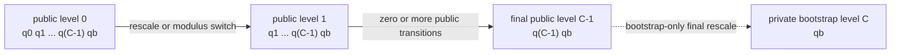
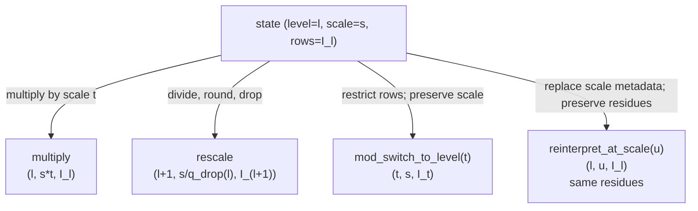

# Scale and level lifecycle

Scale and level are independently tracked coordinates of CKKS value state in
FHElium.
The application chooses encoding scales and state transitions. Evaluator
operations validate their input state and record the resulting scale, level,
and active modulus rows.

This page defines the public scale and level coordinates, valid public levels,
transition laws, compatibility requirements, and transition queries.

## Scale-level transition state

A scale- or level-changing operation is described by the tuple

$$
\mathcal{T}(v)=\bigl(\ell(v),\Delta(v),I(v),B(v)\bigr),
$$

where:

- $\ell(v)$ is the public Q-chain level stored as `value.level`;
- $\Delta(v)$ is the positive finite binary64 actual scale stored as
  `value.scale`;
- $I(v)$ is the ordered tuple `value.prime_ids` that maps each dense limb row
  to one canonical parameter prime;
- $B(v)$ is the modulus basis, either $Q_\ell$ or $Q_\ell P$.

`level` and `scale` are independent coordinates. Level selects the active Q
suffix, basis independently selects Q or QP, and `prime_ids` records the
resulting RNS rows. Complete operation compatibility also includes context,
shape, polynomial domain, residue representation, component count, dtype, and
device.

## Default scale and actual scale

`config.default_scale` is the default encoding and planning value

$$
\Delta_0=2^{\mathtt{config.scale\_bits}}.
$$

`engine.plaintext`, `engine.encode`, and `engine.encrypt_message` select
$\Delta_0$ when their `scale` argument is `None`. Once a value exists, its
`scale` field is the actual scale used by subsequent arithmetic and decoding.

The configured scale primes are close to $\Delta_0$, but they are distinct
integers selected from the prime catalog. Consequently, a default-scale
product followed by rescale normally has

$$
\frac{\Delta_0^2}{q_{\mathrm{drop}}}\ne\Delta_0.
$$

FHElium records the binary64 quotient by the actual dropped prime.

All public scale entry points and value constructors require a value that can
be represented as a finite Python `float` and satisfies

$$
0 < \Delta(v) < \infty.
$$

NaN, infinity, zero, negative values, booleans, and strings are rejected with
`InvalidScaleError`. A scale multiplication or division that overflows or
underflows the finite-positive range is rejected at the operation that produces
it.

## Level addresses active Q rows

Let a configuration contain $C=\mathtt{config.num\_scale\_primes}$ scale
primes followed by one structural base Q prime:

$$
Q_0=[q_0,q_1,\ldots,q_{C-1},q_b].
$$

The complete ordinary-prime count is therefore

$$
\mathtt{config.num\_q\_primes}=C+1.
$$

At public level $\ell$, the active Q basis is the suffix

$$
Q_\ell=[q_\ell,q_{\ell+1},\ldots,q_{C-1},q_b],
\qquad 0\le\ell<C.
$$

In the current canonical layout, a complete Q value has

```python
value.prime_ids == engine.rns_layout.prime_ids(value.level)
```

and a QP value at the same level appends every special P prime ID. `level`
selects the canonical Q suffix, and `prime_ids` maps each dense limb to its
modulus. QP is the auxiliary basis at that level.



`engine.public_level_count` is $C$, and `engine.final_public_level` is $C-1$.
Public value creation accepts levels in
`[0, engine.final_public_level]`. Public `rescale_to_next_level` and
`mod_switch_to_next_level` require a following public level, so from level $\ell$ the
number of remaining public one-level transitions is

$$
\mathtt{engine.final\_public\_level}-\ell.
$$

The built-in bootstrap entry consumes the final public level and performs
the private transition to `[q_b]`. Its compiled scale policy is documented
in [Composable CKKS bootstrap](../../developer/composable-ckks-bootstrap.md).

## Scale-level transition laws

The following laws define multiplication, rescale, modulus switch, and scale
reinterpretation.



### Multiplication preserves level and multiplies scale

For compatible ciphertext operands,

$$
\Delta(c_{\mathrm{out}})=\Delta(c_a)\Delta(c_b),
\qquad
\ell(c_{\mathrm{out}})=\ell(c_a)=\ell(c_b).
$$

`multiply_plaintext` applies the same scale-product law to a ciphertext and an
operation-ready plaintext. Both multiplication primitives require and return
NTT/Montgomery ciphertext state, preserve the active Q basis, and expose domain
transitions separately from scale arithmetic.

### Rescale changes level, scale, rows, and payload

At a non-final public level, let $q_{\mathrm{drop}}$ be the leading active Q
prime. `rescale_to_next_level` computes

$$
c'=\operatorname{Round}\left(\frac{c}{q_{\mathrm{drop}}}\right)
\pmod{B_{\ell+1}}
$$

and records

$$
\ell'=\ell+1,
\qquad
\Delta'=\frac{\Delta}{q_{\mathrm{drop}}},
\qquad
I'=I[1:].
$$

For QP input, the leading Q row is removed and every P row is retained.
`rounding="nearest"` and `rounding="floor"` select different quotient laws but
have the same metadata transition.

### Modulus switch advances level and preserves scale

For a target public level $t\ge\ell$, `mod_switch_to_level` restricts each
residue polynomial to the target active basis:

$$
c'=c\pmod{B_t},
\qquad
\ell'=t,
\qquad
\Delta'=\Delta.
$$

The operation restricts residues to the target basis while preserving their
coefficient representatives. Message preservation requires that the centered
represented value remain within the smaller target modulus.

### Scale reinterpretation changes metadata and decoded meaning

`reinterpret_at_scale(ciphertext, target_scale)` leaves every ciphertext residue
unchanged and records the requested target scale:

$$
c'=c,
\qquad
\ell'=\ell,
\qquad
\Delta'=\Delta_{\mathrm{target}}.
$$

Because decoding divides by the recorded scale, the interpreted message
changes according to

$$
m'=m\frac{\Delta_{\mathrm{old}}}{\Delta_{\mathrm{target}}}.
$$

Its optional `max_relative_change` argument bounds the symmetric ratio between
the current and target scales. Addition requires scale compatibility before
evaluation.

## Addition and subtraction require compatible state

Addition and subtraction preserve level and scale, but only after the operands
already satisfy their compatibility requirements:

$$
\ell_a=\ell_b,
\qquad
\Delta(a)=\Delta(b)
$$

with binary64 equality, together with equal context, shape, component count,
domain, basis, residue representation, and prime IDs. A scale difference
of one unit in the last place is a mismatch. `add`, `subtract`,
`sum_ciphertexts`, and `add_plaintext` accept values that already satisfy this
set of requirements.

Programs align the two axes separately:

1. choose encoding scales and multiplication histories that produce compatible
   actual scales;
2. use `mod_switch_to_level` when only the active Q level must advance;
3. apply guarded `reinterpret_at_scale` when the resulting message-ratio
   change is part of the numerical policy.

## Scale and level effects by operation family

| Operation family | Level requirements and effects | Scale requirements and effects |
| --- | --- | --- |
| `plaintext`, `encode`, `encrypt_message` | Set the requested public level | Set the requested scale; an omitted argument selects `config.default_scale` |
| `encrypt`, `decrypt` | Preserve | Preserve |
| RNS, NTT, coefficient-domain, and residue conversions | Preserve | Preserve |
| `add`, `subtract`, `sum_ciphertexts`, `add_plaintext` | Require equality; preserve | Require binary64 equality; preserve |
| `negate`, `relinearize`, `switch_key`, rotations, conjugation | Preserve | Preserve |
| `multiply`, `multiply_plaintext` | Require equality; preserve | Record the product of operand scales |
| `rescale_to_next_level` | Advance by one | Divide by the actual dropped Q prime |
| `mod_switch_to_next_level` | Advance by one | Preserve |
| `mod_switch_to_level` | Set the requested reachable public level | Preserve |
| `reinterpret_at_scale` | Preserve | Replace with the requested scale |

Signatures, representation preconditions, exceptions, result allocation,
and in-place alias behavior are specified by the generated API reference and
method docstrings. Primitive representation, domain, and residue conversions
are defined in
[State transitions and orthogonality](state-transitions-and-orthogonality.md).
Arithmetic, component-count, and key-dependent effects are described in
[Evaluator operation transitions](evaluator-operation-transitions.md).

## Query the rescale transition

The engine exposes the same level-dependent divisor and binary64 quotient used
by `rescale_to_next_level`:

```python
q_drop = engine.rescale_to_next_drop_prime(level=ciphertext.level)
predicted_scale = engine.rescale_to_next_output_scale(
    input_scale=pre_rescale_scale,
    level=ciphertext.level,
)

assert predicted_scale == pre_rescale_scale / q_drop
```

These queries return the modulus and scale arithmetic of one transition from
a provided source level and input scale.

Binary64 expression ordering is observable. Branches that will be added use a
common scale calculation history so their scale metadata satisfies binary64
equality.

## Continue

- [Context and modulus chain](context-and-modulus-chain.md)
- [Value model and identity](value-model-and-identity.md)
- [State transitions and orthogonality](state-transitions-and-orthogonality.md)
- [Evaluator operation transitions](evaluator-operation-transitions.md)
- [Basic CKKS workflow](../../tutorial/basic-ckks-workflow.md)
- [Explicit scale-management tutorial](../../tutorial/explicit-scale-management.md)
- [Composable CKKS bootstrap](../../developer/composable-ckks-bootstrap.md)
- [Choose a preset and chain depth](../../how-to/choose-preset-and-depth.md)
