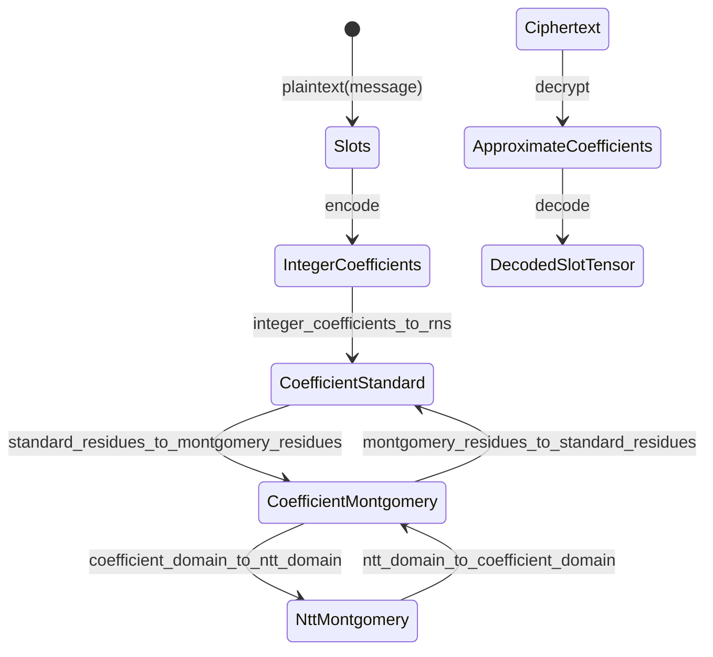
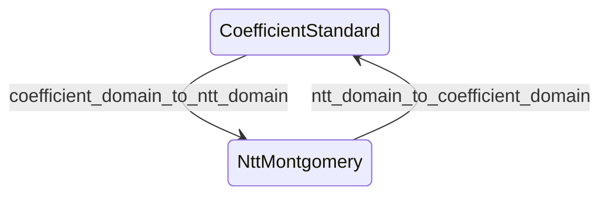

# State transitions and orthogonality

FHElium state-transition APIs change named CKKS value-state axes.
They preserve every axis outside the documented transition, except where the
ciphertext representation invariant deliberately couples polynomial domain and
residue representation.

This page defines the primitive transition graph, strict source-state rules,
and the relationship between primitive transitions and operation-oriented
plaintext preparation.

## Value-state axes

An exact local CKKS value is described by several distinct axes:

| Axis | Values | Responsibility |
| --- | --- | --- |
| Plaintext representation | `slots`, `integer_coefficients`, `approximate_coefficients`, `rns` | Identifies the semantic or arithmetic payload representation |
| Polynomial domain | `coefficient`, `ntt` | Distinguishes polynomial coefficients from NTT evaluations |
| Residue representation | `standard`, `montgomery` | Distinguishes ordinary residues from Montgomery residues |
| Modulus basis | `Q`, `QP` | Selects the active Q rows or active Q plus auxiliary P rows |
| Level | Public Q-chain level | Selects the active Q suffix, together with exact `prime_ids` |
| Scale | Positive finite binary64 | Records the actual CKKS scale of the value |
| Component count | Two or three for ciphertexts | Records the current secret-key polynomial degree |
| Placement | CPU or CUDA device | Identifies storage location, not mathematical state |

The axes are not interchangeable. In particular:

- NTT domain does not imply Montgomery representation as a general concept.
- Montgomery representation does not imply NTT domain.
- QP basis is not a level.
- `level` does not replace exact ordered `prime_ids`.
- placement does not change the represented polynomial or CKKS message.

## Plaintext state orthogonality

A plaintext owns exactly one top-level `representation`.
`integer_coefficients` and `approximate_coefficients` are coefficient-domain
representations without an RNS residue representation, modulus basis, or
prime-row tuple. Only `representation="rns"` owns the complete RNS state axes:
polynomial domain, residue representation, modulus basis, and `prime_ids`.

FHElium exposes polynomial domain and residue representation as separate
plaintext transitions. The currently supported RNS plaintext states are:

```text
(coefficient, standard)
(coefficient, montgomery)
(ntt, montgomery)
```

The absence of `(ntt, standard)` does not collapse the two axes. It records the
implementation invariant that public NTT data uses Montgomery residues, while
coefficient-domain plaintexts can be converted between standard and Montgomery
residues without applying an NTT.



`ApproximateCoefficients` is produced by decryption, not by an exact
`integer_coefficients` transition. It is finite binary64 data for decoding and
cannot be reduced back to RNS. `DecodedSlotTensor` is a semantic CPU tensor,
not a new `Plaintext` object with `representation="slots"`.

## Ciphertext state coupling

Public ciphertexts deliberately support two coupled arithmetic states:

```text
(coefficient, standard)
(ntt, montgomery)
```

Therefore a ciphertext domain transition also performs the required residue
conversion:



For ciphertexts,
`coefficient_domain_to_ntt_domain` applies a forward NTT and converts standard
residues to Montgomery form. `ntt_domain_to_coefficient_domain` applies the
normalized inverse NTT and returns standard residues. Both preserve the ring
element, component count, level, scale, Q/QP basis, and exact `prime_ids`.

Ciphertext multiplication primitives consume and produce the
`(ntt, montgomery)` state. This common rule covers both `multiply` and
`multiply_plaintext`; neither hides a round trip through
`(coefficient, standard)`. Addition preserves whichever valid arithmetic state
the compatible operands already share. Relinearization and rescale establish
their documented target-state target-state requirements.

The shared method names identify the polynomial-domain axis being changed.
The input type determines whether residue representation is independently
preserved, as for plaintexts, or follows the ciphertext coupling rule.

## Primitive transition preconditions and effects

| API | Accepted source | Target | Preserved state |
| --- | --- | --- | --- |
| `integer_coefficients_to_rns` | Exact `integer_coefficients` plaintext | RNS `(coefficient, standard)` plaintext | Level, scale, semantic polynomial; basis is provided as an argument |
| `standard_residues_to_montgomery_residues` | RNS `(coefficient, standard)` plaintext | RNS `(coefficient, montgomery)` plaintext | Representation, domain, level, scale, basis, `prime_ids` |
| `coefficient_domain_to_ntt_domain` | RNS `(coefficient, montgomery)` plaintext | RNS `(ntt, montgomery)` plaintext | Representation, residue form, level, scale, basis, `prime_ids` |
| `coefficient_domain_to_ntt_domain` | `(coefficient, standard)` ciphertext | `(ntt, montgomery)` ciphertext | Components, level, scale, basis, `prime_ids` |
| `ntt_domain_to_coefficient_domain` | RNS `(ntt, montgomery)` plaintext | RNS `(coefficient, montgomery)` plaintext | Representation, residue form, level, scale, basis, `prime_ids` |
| `ntt_domain_to_coefficient_domain` | `(ntt, montgomery)` ciphertext | `(coefficient, standard)` ciphertext | Components, level, scale, basis, `prime_ids` |
| `montgomery_residues_to_standard_residues` | RNS `(coefficient, montgomery)` plaintext | RNS `(coefficient, standard)` plaintext | Representation, domain, level, scale, basis, `prime_ids` |

Every primitive method has a strict source-state precondition. Passing a value
already in the target state is an error, not an idempotent conversion or an
implicit clone. A caller that conditionally transforms heterogeneous states
must inspect the relevant state field and choose the transition deliberately.

Functional forms allocate independent output storage. An underscore-suffixed
form, where provided, mutates the source object and returns that same object:

```python
ntt = engine.coefficient_domain_to_ntt_domain(coefficient)
engine.coefficient_domain_to_ntt_domain_(coefficient)
```

No compatibility aliases retain the former target-only `to_*` names.

## Operation-oriented plaintext preparation

Two convenience APIs name their intended arithmetic role rather than one
primitive state axis:

```python
addition_operand = engine.prepare_plaintext_for_addition(encoded)
multiplication_operand = engine.prepare_plaintext_for_multiplication(encoded)
```

Their public semantics are equivalent to primitive composition:

```python
addition_operand = engine.standard_residues_to_montgomery_residues(
    engine.integer_coefficients_to_rns(encoded)
)

multiplication_operand = engine.coefficient_domain_to_ntt_domain(
    engine.standard_residues_to_montgomery_residues(
        engine.integer_coefficients_to_rns(encoded)
    )
)
```

The convenience implementations may reuse their newly allocated intermediate
storage. They do not weaken the source-state preconditions of the public primitive
methods.

## Transitions on other axes

Domain and residue conversion are only one part of evaluator state management.
Other operations retain their mathematical names because their source and
target values are runtime-dependent:

| Axis or relation | APIs | Semantics |
| --- | --- | --- |
| Level and scale | `rescale_to_next_level`, `rescale_to_next_level_` | Drop one leading Q prime and divide actual scale by that prime |
| Level only | `mod_switch_to_next_level`, `mod_switch_to_next_level_`, `mod_switch_to_level`, `mod_switch_to_level_` | Restrict the active Q basis while preserving scale and arithmetic state |
| Scale metadata | `reinterpret_at_scale`, `reinterpret_at_scale_` | Preserve residues and replace scale metadata under a provided relative-change bound |
| Component count | `relinearize` | Convert a three-component ciphertext to two components through key switching |
| Key dependency | `switch_key`, rotation, conjugation | Apply the supplied or engine-owned key relation |
| Placement | `value.to(device)` | Move storage while preserving mathematical state |

A generic modulus-basis conversion is not part of the public primitive state
surface. QP extension and reduction occur inside operations with a declared
key-switch or bootstrapping state-transition specification.

## No implicit CRT reconstruction

`ntt_domain_to_coefficient_domain` changes polynomial domain; it does not
convert RNS data into `integer_coefficients`. FHElium deliberately exposes no
implicit `RNS -> integer_coefficients` arrow. Such an operation would need to
specify the composite modulus, representative interval, output numeric type,
and exact versus approximate reconstruction semantics.

Decryption instead produces bounded `approximate_coefficients` for decoding.
The semantic round trip consists of these operations:

```text
decrypt -> decode -> encode -> encrypt
```

## Continue

- [Value model and identity](value-model-and-identity.md)
- [Evaluator operation transitions](evaluator-operation-transitions.md)
- [Scale and level lifecycle](scale-and-level-lifecycle.md)
- [Diagnose a value-state mismatch](../../how-to/diagnose-value-state-mismatch.md)
