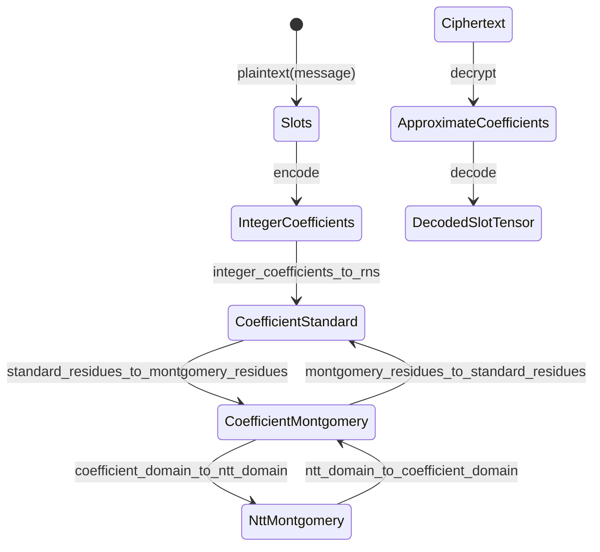
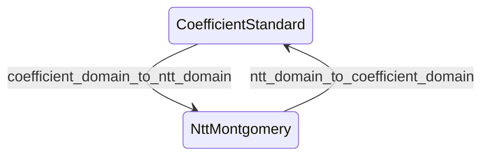

# State transitions and orthogonality

FHElium state-transition APIs change named CKKS value-state axes.
They preserve every axis outside the documented transition, except where the
ciphertext representation invariant deliberately couples polynomial domain and
residue representation.

This page defines the primitive transition graph, required source states,
and the relationship between primitive transitions and operation-oriented
plaintext preparation.

## Value-state axes

A local CKKS value is described by several distinct axes:

| Axis | Values | Responsibility |
| --- | --- | --- |
| Plaintext representation | `slots`, `integer_coefficients`, `approximate_coefficients`, `rns` | Identifies the semantic or arithmetic payload representation |
| Polynomial domain | `coefficient`, `ntt` | Distinguishes polynomial coefficients from NTT evaluations |
| Residue representation | `standard`, `montgomery` | Distinguishes ordinary residues from Montgomery residues |
| Modulus basis | `Q`, `QP` | Selects the active Q rows or active Q plus auxiliary P rows |
| Level | Nonnegative Q-chain level | Selects the active Q suffix, together with `prime_ids`; ordinary values use public levels, while modulus raising may use the one-prime structural base internally |
| Scale | Positive finite binary64 | Records the actual CKKS scale of the value |
| Component count | Two or three for ciphertexts | Records the current secret-key polynomial degree |
| Placement | CPU or CUDA device | Identifies storage location |

These axes are distinct metadata coordinates. Valid value states and operation
contracts constrain their combinations:

- polynomial domain and residue representation remain separate coordinates;
- modulus basis and level remain separate coordinates;
- `level` and ordered `prime_ids` jointly identify the active Q suffix;
- placement changes storage location while preserving the represented
  polynomial and CKKS message.

## Plaintext state orthogonality

A plaintext owns exactly one top-level `representation`.
`integer_coefficients` and `approximate_coefficients` are coefficient-domain
representations without an RNS residue representation, modulus basis, or
prime-row tuple. Only `representation="rns"` owns the complete RNS state axes:
polynomial domain, residue representation, modulus basis, and `prime_ids`.

FHElium exposes polynomial domain and residue representation as separate
plaintext transitions. The currently supported RNS plaintext states are:

```text
(coefficient, standard)
(coefficient, montgomery)
(ntt, montgomery)
```

Public NTT data uses Montgomery residues. Coefficient-domain plaintexts can
still move between standard and Montgomery residues independently of an NTT,
which preserves the distinction between the two state axes.



Decryption produces finite binary64 `ApproximateCoefficients` for decoding.
Full-CRT integer reconstruction requires a separate operation and numerical
contract. `DecodedSlotTensor` is the semantic Tensor returned by `decode` on
the plaintext's device, or on the device selected by the caller. Pass
`device="cpu"` to request a CPU result.

## Ciphertext state coupling

Public ciphertexts deliberately support two coupled arithmetic states:

```text
(coefficient, standard)
(ntt, montgomery)
```

Therefore a ciphertext domain transition also performs the required residue
conversion:



For ciphertexts,
`coefficient_domain_to_ntt_domain` applies a forward NTT and converts standard
residues to Montgomery form. `ntt_domain_to_coefficient_domain` applies the
normalized inverse NTT and returns standard residues. Both preserve the ring
element, component count, level, scale, Q/QP basis, and `prime_ids`.

Ciphertext multiplication primitives consume and produce the
`(ntt, montgomery)` state. This common rule covers both `multiply` and
`multiply_plaintext`; neither hides a round trip through
`(coefficient, standard)`. Ciphertext-ciphertext multiplication maps two CT2
inputs to one CT3 result, preserves level and active rows, and multiplies the
two actual scales. Plaintext multiplication preserves component count and
multiplies the ciphertext and plaintext scales.

For operands already in the same valid arithmetic state, addition preserves
that state. It does not transform or align operands: the caller contract
requires matching component count, rows, polynomial domain, residue
representation, and actual scale.

Relinearization consumes a CT3 `(ntt, montgomery)` ciphertext. Its default
output is CT2 `(coefficient, standard)`; `output_domain="ntt"` returns CT2
`(ntt, montgomery)`. Rescaling accepts either valid ciphertext arithmetic
state and preserves it: the NTT path inverts the dropped row for quotient
rounding and transforms the correction without inverting the surviving rows.
Both operations preserve component count as applicable; rescaling advances the
level by one and divides actual scale by the dropped prime.

`rotate_with_key` consumes a CT2 Q ciphertext in either coupled arithmetic
state. `rotate_many_with_keys` consumes `(coefficient, standard)` input so its
outputs can share the coefficient-domain key-switch preparation. Their default
output is `(coefficient, standard)`; `output_domain="ntt"` instead returns the
equivalent `(ntt, montgomery)` result. Both choices preserve level, active Q
rows, component count, and actual scale. The step-oriented `rotate_by_step` and
`rotate_many_by_steps` APIs currently return `(coefficient, standard)` state.
`switch_key` and `conjugate` expose the same output-domain choice.

The shared method names identify the polynomial-domain axis being changed.
The input type determines whether residue representation is independently
preserved, as for plaintexts, or follows the ciphertext coupling rule.

## Primitive transition preconditions and effects

| API | Accepted source | Target | Preserved state |
| --- | --- | --- | --- |
| `integer_coefficients_to_rns` | `integer_coefficients` plaintext | RNS `(coefficient, standard)` plaintext | Level, scale, semantic polynomial; basis is provided as an argument |
| `standard_residues_to_montgomery_residues` | RNS `(coefficient, standard)` plaintext | RNS `(coefficient, montgomery)` plaintext | Representation, domain, level, scale, basis, `prime_ids` |
| `coefficient_domain_to_ntt_domain` | RNS `(coefficient, montgomery)` plaintext | RNS `(ntt, montgomery)` plaintext | Representation, residue form, level, scale, basis, `prime_ids` |
| `coefficient_domain_to_ntt_domain` | `(coefficient, standard)` ciphertext | `(ntt, montgomery)` ciphertext | Components, level, scale, basis, `prime_ids` |
| `ntt_domain_to_coefficient_domain` | RNS `(ntt, montgomery)` plaintext | RNS `(coefficient, montgomery)` plaintext | Representation, residue form, level, scale, basis, `prime_ids` |
| `ntt_domain_to_coefficient_domain` | `(ntt, montgomery)` ciphertext | `(coefficient, standard)` ciphertext | Components, level, scale, basis, `prime_ids` |
| `montgomery_residues_to_standard_residues` | RNS `(coefficient, montgomery)` plaintext | RNS `(coefficient, standard)` plaintext | Representation, domain, level, scale, basis, `prime_ids` |

The accepted-source column states the caller contract. Value construction
rejects invalid state combinations, but transition methods and Backend
implementations do not repeat CKKS source-metadata validation and do not reject
a valid object merely because it already declares the target state. Compile
may retain unknown state until analysis or lowering; state-flow analysis can
report conflicts between inferred and represented state. A caller that
conditionally transforms heterogeneous states must inspect the relevant state
field and choose the transition deliberately.

Functional forms allocate independent output storage. An underscore-suffixed
form, where provided, mutates the source object and returns that same object:

```python
ntt = engine.coefficient_domain_to_ntt_domain(coefficient)
engine.coefficient_domain_to_ntt_domain_(coefficient)
```

## Operation-oriented plaintext preparation

Two convenience APIs name an intended arithmetic role and compose the required
primitive transitions:

```python
addition_operand = engine.prepare_plaintext_for_addition(encoded)
ntt_addition_operand = engine.prepare_plaintext_for_addition(
    encoded, polynomial_domain="ntt"
)
multiplication_operand = engine.prepare_plaintext_for_multiplication(encoded)
```

Their public semantics are equivalent to primitive composition:

```python
addition_operand = engine.standard_residues_to_montgomery_residues(
    engine.integer_coefficients_to_rns(encoded)
)

ntt_addition_operand = engine.coefficient_domain_to_ntt_domain(
    addition_operand
)

multiplication_operand = engine.coefficient_domain_to_ntt_domain(
    engine.standard_residues_to_montgomery_residues(
        engine.integer_coefficients_to_rns(encoded)
    )
)
```

The convenience implementations may reuse their newly allocated intermediate
storage. Their constituent transitions use the source and target states listed
above.

## Transitions on other axes

Evaluator state management also includes level, scale, component count, key
relations, and placement. These operations retain their mathematical names
because their source and target values are runtime-dependent:

| Axis or relation | APIs | Semantics |
| --- | --- | --- |
| Level and scale | `rescale_to_next_level`, `rescale_to_next_level_` | Drop one leading Q prime and divide actual scale by that prime |
| Structural level and scale | `rescale_to_structural_base` | From the final public level, drop its leading Q prime, divide actual scale by that prime, and enter the private one-prime structural base used for modulus raising |
| Level only | `mod_switch_to_next_level`, `mod_switch_to_next_level_`, `mod_switch_to_level`, `mod_switch_to_level_` | Restrict the active Q basis while preserving scale and arithmetic state |
| Scale metadata | `reinterpret_at_scale`, `reinterpret_at_scale_` | Preserve residues and replace scale metadata under a provided relative-change bound |
| Component count and arithmetic state | `relinearize` | Convert CT3 `(ntt, montgomery)` to CT2 through key switching; select coefficient/standard or NTT/Montgomery output while preserving level and scale |
| Key dependency | `switch_key`, conjugation | Apply the supplied or engine-owned key relation to CT2 `(coefficient, standard)` state and preserve that state |
| Key dependency and output arithmetic state | `rotate_with_key`, `rotate_many_with_keys` | Apply each rotation-key relation and select `(coefficient, standard)` or `(ntt, montgomery)` output while preserving level, scale, Q rows, and CT2 shape |
| Placement | `value.to(device)` | Move storage while preserving mathematical state |

Ciphertext Q-to-QP digit extension and QP-to-Q ModDown occur inside key-switch
or bootstrapping arithmetic; there is no generic public ciphertext ModUp
method. Plaintext RNS materialization and preparation may explicitly select Q
or QP as their target basis.

## CRT reconstruction requires its own contract

`ntt_domain_to_coefficient_domain` preserves the top-level RNS payload form,
modulus basis, and prime rows. For a plaintext it retains Montgomery residues;
for a ciphertext it returns standard residues according to the ciphertext
coupling rule. It does not reconstruct one integer coefficient from the RNS
rows. An `RNS -> integer_coefficients` operation would need to specify the
composite modulus, representative interval, output numeric type, and integer
or approximate reconstruction semantics.

Decryption instead produces bounded `approximate_coefficients` for decoding.
The semantic round trip consists of these operations:

```text
decrypt -> decode -> encode -> encrypt
```

## Continue

- [Value model and identity](value-model-and-identity.md)
- [Evaluator operation transitions](evaluator-operation-transitions.md)
- [Scale and level lifecycle](scale-and-level-lifecycle.md)
- [Diagnose a value-state mismatch](../../how-to/diagnose-value-state-mismatch.md)
