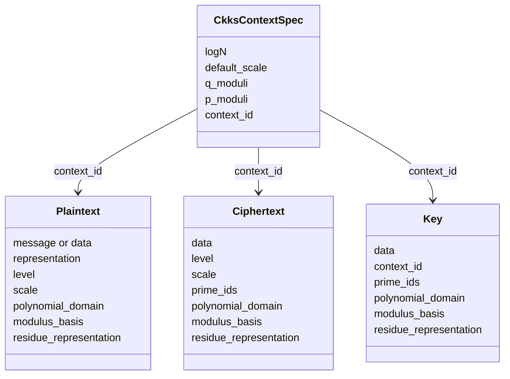
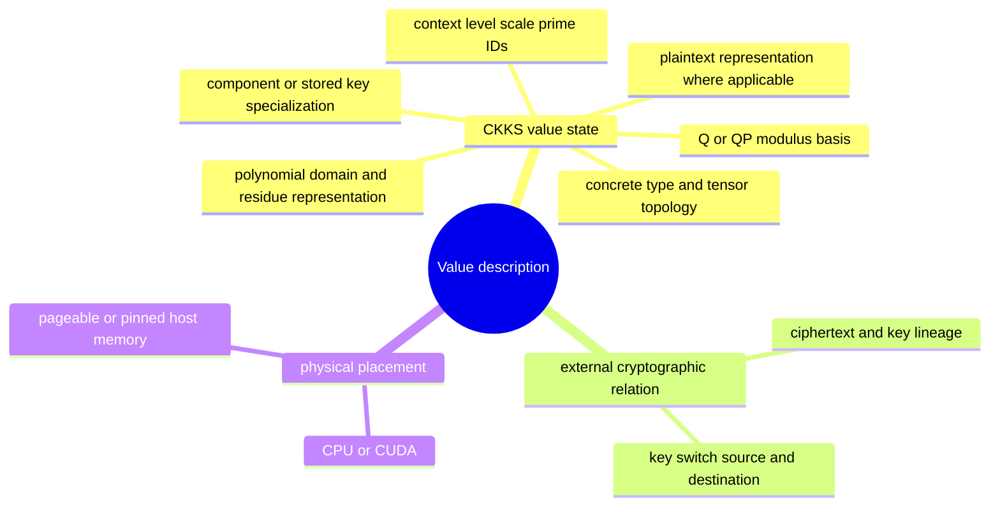
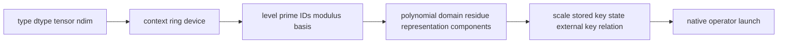

# Value model and identity

The FHElium value model defines the tensor layouts, metadata, cryptographic
relations, and placement properties that identify one local plaintext,
ciphertext, or key. Tensor shape and device are necessary for execution, but
they are not sufficient to prove that two values have the same mathematical
meaning.

This page defines value identity and compatibility. Primitive conversions
between those states are specified separately in
[State transitions and orthogonality](state-transitions-and-orthogonality.md).

## Four core object families



## Dimensions of value identity



These dimensions cannot substitute for each other:

- NTT domain is not the same as Montgomery form.
- QP basis is not a later or earlier level.
- Moving from CPU to CUDA does not change cryptographic meaning.
- Equal shape does not imply equal context or prime IDs.
- Two rotation keys with equal tensor shape are not interchangeable if their
  canonical steps differ.

## Canonical value axes

`*batch` means zero or more logical dimensions of independent homogeneous
messages. It is distinct from every CKKS structural axis:

| Value/form | Canonical dense layout |
| --- | --- |
| Slots plaintext | scalar repeat-to-all-slots, or `[*batch, slot]` |
| Integer-coefficient plaintext | `[*batch, coefficient]` |
| Approximate-coefficient plaintext | `[*batch, coefficient]` |
| RNS plaintext | `[*batch, limb, coefficient_or_ntt_index]` |
| Ciphertext | `[component, *batch, limb, coefficient_or_ntt_index]` |

For ciphertexts the component axis remains outermost, so `ct.c0` and `ct.c1`
each have layout `[*batch, limb, coefficient_or_ntt_index]`. The two trailing
axes are always RNS limb and polynomial index. Consequently:

```text
Plaintext RNS batch_shape  = data.shape[:-2]
Ciphertext batch_shape     = data.shape[1:-2]
```

An empty `batch_shape` preserves the original unbatched layouts. `(1,)` is a
real singleton batch and is never silently squeezed. Empty batch extents are
invalid.

All members of one value share context, level, scale, polynomial domain,
modulus basis, dtype, component count, and RNS row identity. Their tensor
fields also share one physical placement. Ciphertext members must have a
compatible external encryption-key relation; `context_id` identifies
parameters, not a particular key.

Message batch axes are not:

- ciphertext components;
- RNS limbs or hybrid-decomposition digits;
- packed CKKS slots within one message;
- distributed ranks or placement metadata.

`select_batch` and `unbind_batch` return storage-sharing views.
`stack_batch` is a named allocating copy for compatible existing values. For
ciphertext-ciphertext arithmetic, batch shapes must match exactly. A genuinely
unbatched RNS plaintext may broadcast over a ciphertext batch; a batched RNS
plaintext must have the ciphertext batch shape.

## Plaintext owns one representation

A `Plaintext` contains exactly one canonical representation:

| Representation | Storage | State |
| --- | --- | --- |
| `"slots"` | Scalar or `[*batch, slot]` semantic message | No polynomial domain, modulus basis, residue representation, or prime IDs |
| `"integer_coefficients"` | `[*batch, coefficient]` configured integral-dtype polynomial | Integer coefficient polynomial, but no RNS modulus basis or prime IDs |
| `"approximate_coefficients"` | `[*batch, coefficient]` finite float64 decrypt reconstruction | Decodable approximation, but not encryptable or reducible to RNS |
| `"rns"` | `[*batch, limb, coefficient_or_ntt_index]` | Polynomial domain, modulus basis, residue representation, and prime IDs |

The complete plaintext and ciphertext transition graphs, strict source-state
preconditions, and operation-oriented preparation equivalences are defined in
[State transitions and orthogonality](state-transitions-and-orthogonality.md).
There is deliberately no implicit `RNS -> integer_coefficients` transition;
decryption exposes its bounded tail-Q binary64 reconstruction as
`approximate_coefficients` instead of misrepresenting it as exact CRT output.

If the same semantic weight is needed in two operation states or at two levels,
the application creates two distinct values. A `Plaintext` does not hide a
mutable multi-level cache.

## Ciphertext dense layout

A ciphertext payload is:

```text
[component, *batch, limb, coefficient_or_ntt_index]
```

- Two components represent fresh or relinearized encrypted values.
- Three components represent the natural output of ciphertext-ciphertext
  multiplication before relinearization.
- The limb axis corresponds one-to-one with `prime_ids`.
- The intervening `*batch` axes preserve independent homogeneous messages.
- Coefficient-domain ciphertexts use standard representation.
- NTT-domain ciphertexts use Montgomery representation.

Direct construction rejects structurally impossible combinations, such as an
NTT ciphertext without Montgomery representation. Public operations also
validate their arithmetic preconditions before launch.

## Key layouts carry state too

Conceptual dense layouts include:

| Key type | Layout |
| --- | --- |
| `SecretKey` | `[limb, coefficient_or_ntt_index]` |
| `PublicKey` | `[key_component=2, limb, coefficient_or_ntt_index]` |
| `KeySwitchKey` | `[digit, key_component=2, limb, coefficient_or_ntt_index]` |
| `RotationKey` | key-switch layout plus one canonical signed step |

Stored key state includes context, modulus basis, prime rows, arithmetic state,
and any concrete specialization such as a rotation step. Engine-generated
keys use NTT-domain Montgomery rows, so their final axis is `ntt_index`.
Public keys and generic key-switch keys do not store a symbolic destination or
source-to-destination lineage identifier; the application maintains those
cryptographic relations.

## Compatibility is operation-specific

The engine validates from broad structure to operation-specific requirements:



For example:

- addition requires compatible two- or three-component layouts, context,
  level, active rows, polynomial domain, modulus basis, residue representation,
  and scale;
- multiplication requires two two-component NTT/Montgomery ciphertexts;
- relinearization requires three components and a compatible relinearization
  key;
- rotation requires a two-component ciphertext and a key for the requested
  canonical step;
- rescale requires coefficient-domain standard residues, every expected active
  row for the Q or QP modulus basis, and another legal level; it records the
  actual scale quotient.

The failure should occur before an expensive copy or native launch.

## Residency is not semantic identity

`TensorResident.to(...)` reconstructs the same value state around tensors on a
new device. It does not record previous placement or create an automatic
placement plan.

This distinction underpins:

- loading a value on CPU and then moving it to an engine device;
- validating one value signature across CPU/pinned/CUDA materializations;
- staging dynamic inputs into fixed CUDA buffers;
- transporting descriptors separately from dense payloads.

## Practical inspection

When diagnosing a mismatch, inspect all of the following rather than shape
alone:

```text
type
context_id
level and scale
prime_ids
plaintext representation
polynomial domain
modulus basis
residue representation
component count
stored key specialization / rotation step
external ciphertext-key or source-destination relation
device
```

## Continue

- [State transitions and orthogonality](state-transitions-and-orthogonality.md)
- [Scale and level lifecycle](scale-and-level-lifecycle.md)
- [Context and modulus chain](context-and-modulus-chain.md)
- [Evaluator operation transitions](evaluator-operation-transitions.md)
- [Key lifecycle](key-lifecycle.md)
- [Value memory and persistence tutorial](../../tutorial/value-memory-and-persistence.md)
- [Diagnose a value-state mismatch](../../how-to/diagnose-value-state-mismatch.md)
