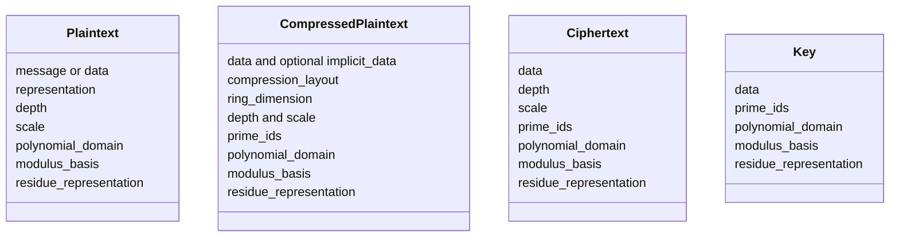
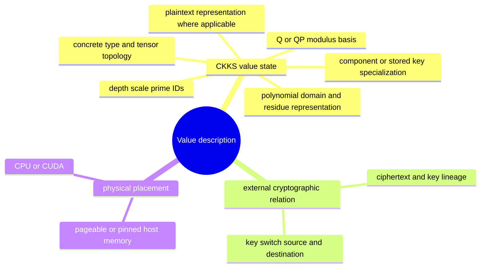
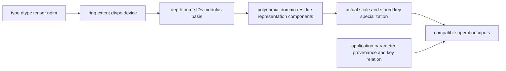

# Value model and identity

The FHElium value model defines the tensor layouts, stored arithmetic state, cryptographic relations, and placement properties of one local plaintext, ciphertext, or key. Compatibility combines Tensor shape and device with CKKS parameters, represented state, and key relations.

This page defines value identity and compatibility. Primitive conversions between those states are specified separately in [State transitions and orthogonality](state-transitions-and-orthogonality.md).

## Core object families



## Dimensions of value identity



These dimensions contribute independently:

- polynomial domain and residue representation are separate coordinates;
- modulus basis and depth are separate coordinates;
- device movement preserves cryptographic meaning;
- shape compatibility also requires compatible CKKS parameters and prime IDs;
- rotation-key compatibility includes the normalized rotation step.

## Value axes

`*batch` means zero or more logical dimensions of independent homogeneous messages. It is distinct from every CKKS structural axis:

| Value/form | Dense layout |
| --- | --- |
| Slots plaintext | scalar repeat-to-all-slots, or `[*batch, slot]` |
| Integer-coefficient plaintext | `[*batch, coefficient]` |
| Approximate-coefficient plaintext | `[*batch, coefficient]` |
| RNS plaintext | `[*batch, limb, coefficient_or_ntt_index]` |
| Compressed RNS plaintext | `[*batch, limb, unique_index]`, with optional `[*batch, limb]` implicit values |
| Ciphertext | `[component, *batch, limb, coefficient_or_ntt_index]` |

For ciphertexts the component axis remains outermost, so `ct.c0` and `ct.c1` each have layout `[*batch, limb, coefficient_or_ntt_index]`. The two trailing axes are always RNS limb and polynomial index. Consequently:

```text
Plaintext RNS batch_shape  = data.shape[:-2]
Ciphertext batch_shape     = data.shape[1:-2]
```

An empty `batch_shape` preserves the original unbatched layouts. `(1,)` is a real singleton batch and is never silently squeezed. Empty batch extents are invalid.

All members of one value share depth, scale, polynomial domain, modulus basis, dtype, component count, and RNS row identity. Their tensor fields also share one physical placement. Ciphertext members must have a compatible external encryption-key relation. The application retains parameter and key-lineage provenance.

Message batch axes represent independent local messages. Ciphertext components, RNS limbs, hybrid-decomposition digits, packed slots, distributed ranks, and placement metadata retain their own structural roles.

`select_batch` and `unbind_batch` return storage-sharing views. `stack_batch` is a named allocating copy for compatible existing values. For ciphertext-ciphertext arithmetic, batch shapes must match exactly. A genuinely unbatched RNS plaintext may broadcast over a ciphertext batch; a batched RNS plaintext must have the ciphertext batch shape.

## Plaintext owns one representation

A `Plaintext` contains exactly one active representation:

| Representation | Storage | State |
| --- | --- | --- |
| `"slots"` | Scalar or `[*batch, slot]` semantic message | No polynomial domain, modulus basis, residue representation, or prime IDs |
| `"integer_coefficients"` | `[*batch, coefficient]` configured integral-dtype polynomial | Integer coefficient polynomial before RNS basis assignment |
| `"approximate_coefficients"` | `[*batch, coefficient]` float64 decrypt reconstruction | Decodable approximation produced after decrypt reconstruction |
| `"rns"` | `[*batch, limb, coefficient_or_ntt_index]` | Polynomial domain, modulus basis, residue representation, and prime IDs |

The complete plaintext and ciphertext transition graphs, strict source-state preconditions, and operation-oriented preparation equivalences are defined in [State transitions and orthogonality](state-transitions-and-orthogonality.md). Decryption names its bounded tail-Q binary64 reconstruction `approximate_coefficients`. Exact integer-coefficient output requires an exact reconstruction operation with its own numerical contract.

If the same semantic weight is needed in two operation states or at two depths, the application creates two distinct values. Each `Plaintext` owns one active representation and depth.

## Compressed plaintext represents a structured RNS layout

`CompressedPlaintext` stores a losslessly expandable polynomial or NTT layout. Its compact Tensor has axes `[*batch, limb, unique_index]`; the expanded final extent is `ring_dimension`. It retains the plaintext's depth, actual scale, domain, basis, residue representation, and prime IDs.

| Compression layout | Expansion along the polynomial or NTT axis |
| --- | --- |
| `cyclic` | Repeat the compact row, such as `[a, b, a, b, ...]`. |
| `contiguous` | Repeat each stored entry in a consecutive block, such as `[a, ..., a, b, ..., b]`. |
| `strided_sparse` | Place $U$ compact entries at stride $N/U$; fill other positions from one `implicit_data` value per batch entry and limb. |

These layouts describe encoded coefficients or NTT evaluations. Slot repetition can change under encoding and coefficient rounding, so representability must be established in the stored layout. Conversion from an existing dense plaintext verifies that expansion reproduces its stored values. Direct compressed preparation from a periodic message performs its own encoding and rounding, which can differ from a separate dense encoding while preserving the intended approximate slot calculation.

Plaintext addition and multiplication can consume supported compressed layouts through implementations that apply the represented expanded values. Compression changes storage and access patterns while retaining the arithmetic state and scale laws of the plaintext operand.

## Ciphertext dense layout

A ciphertext payload is:

```text
[component, *batch, limb, coefficient_or_ntt_index]
```

- Two components represent fresh or relinearized encrypted values.
- Three components represent the natural output of ciphertext-ciphertext multiplication before relinearization.
- The limb axis corresponds one-to-one with `prime_ids`.
- The intervening `*batch` axes preserve independent homogeneous messages.
- Coefficient-domain ciphertexts use standard representation.
- NTT-domain ciphertexts use Montgomery representation.

Direct construction rejects structurally impossible combinations, such as an NTT ciphertext without Montgomery representation. Callers supply the arithmetic state required by an operation; its numerical implementation checks the Tensor execution ABI it consumes.

## Key layouts carry state too

Conceptual dense layouts include:

| Key type | Layout |
| --- | --- |
| `SecretKey` | `[limb, coefficient_or_ntt_index]` |
| `PublicKey` | `[key_component=2, limb, coefficient_or_ntt_index]` |
| `KeySwitchKey` | `[digit, key_component=2, limb, coefficient_or_ntt_index]` |
| `RotationKey` | key-switch layout plus one normalized signed step |

Stored key state includes modulus basis, prime rows, arithmetic state, and any concrete specialization such as a rotation step. Engine-generated keys use NTT-domain Montgomery rows, so their final axis is `ntt_index`. The application records symbolic destination and source-to-destination lineage for public and generic key-switch keys.

## Compatibility is operation-specific

Compatibility includes stored structure, arithmetic state, and application-owned cryptographic relations. Constructors check stored structure, while numerical implementations check the execution ABI they consume. The caller establishes the remaining relationships:



For example:

- addition requires compatible two- or three-component layouts, depth, active rows, polynomial domain, modulus basis, residue representation, and scale;
- multiplication requires two two-component NTT/Montgomery ciphertexts;
- relinearization requires three components and a compatible relinearization key;
- rotation requires a two-component ciphertext and a key for the requested normalized step;
- rescale accepts coefficient/standard or NTT/Montgomery residues, requires every expected active row for the Q or QP modulus basis and another legal depth, preserves the selected arithmetic state, and records the actual scale quotient.

The caller remains responsible for the mathematical relationship among the chosen configuration, values, and keys. These objects carry no parameter-set identity for FHElium to compare.

## Residency and semantic identity

`TensorResident.to(...)` reconstructs the same value state around tensors on a new device. Placement history and placement plans remain with the application or Residency manager.

This distinction underpins:

- loading a value on CPU and then moving it to the execution device;
- validating one value signature across CPU/pinned/CUDA materializations;
- staging dynamic inputs into fixed CUDA buffers;
- transporting descriptors separately from dense payloads.

## Practical inspection

When diagnosing a mismatch, inspect the complete state:

```text
type
depth and scale
prime_ids
plaintext representation
polynomial domain
modulus basis
residue representation
component count
stored key specialization / rotation step
external ciphertext-key or source-destination relation
caller-selected CKKS configuration and parameter provenance
device
```

## Related concepts

- [State transitions and orthogonality](state-transitions-and-orthogonality.md)
- [Scale and depth lifecycle](scale-and-depth-lifecycle.md)
- [Configuration and modulus chain](context-and-modulus-chain.md)
- [Evaluator operation transitions](evaluator-operation-transitions.md)
- [Key lifecycle](key-lifecycle.md)

## Construction and storage operations

Public constructors check the value's representation and structural metadata, including agreement between RNS row counts and prime IDs. They do not verify residue contents, parameter provenance, or key correspondence. Approximate coefficient construction accepts float64 storage without scanning it for finite values; numerical validity remains the caller's responsibility.

Cloning, device movement, and local batch or limb views preserve existing metadata and assemble their storage results without revalidating unchanged fields. Slice methods check their requested axes and intervals; batch stacking checks compatibility of the values being combined. Public payload replacement methods continue to validate newly supplied storage. Because values and their Tensors are mutable, construction checks are not a persistent guarantee about later contents or metadata. Concrete numerical implementations retain their own execution ABI and memory-safety requirements.
