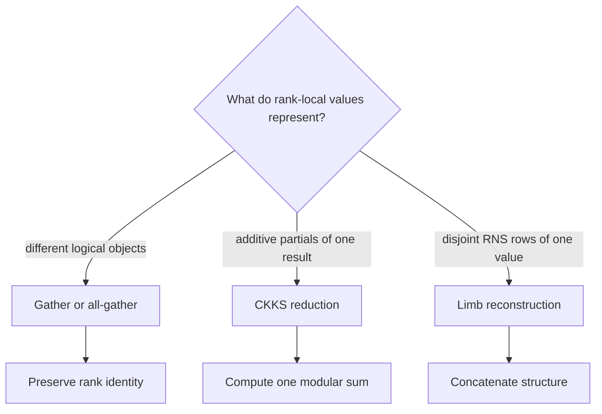
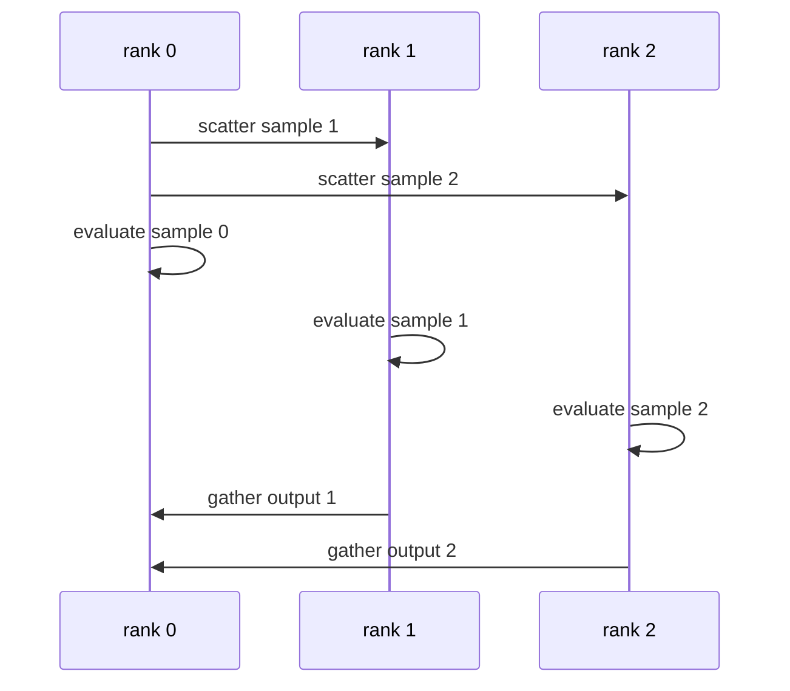
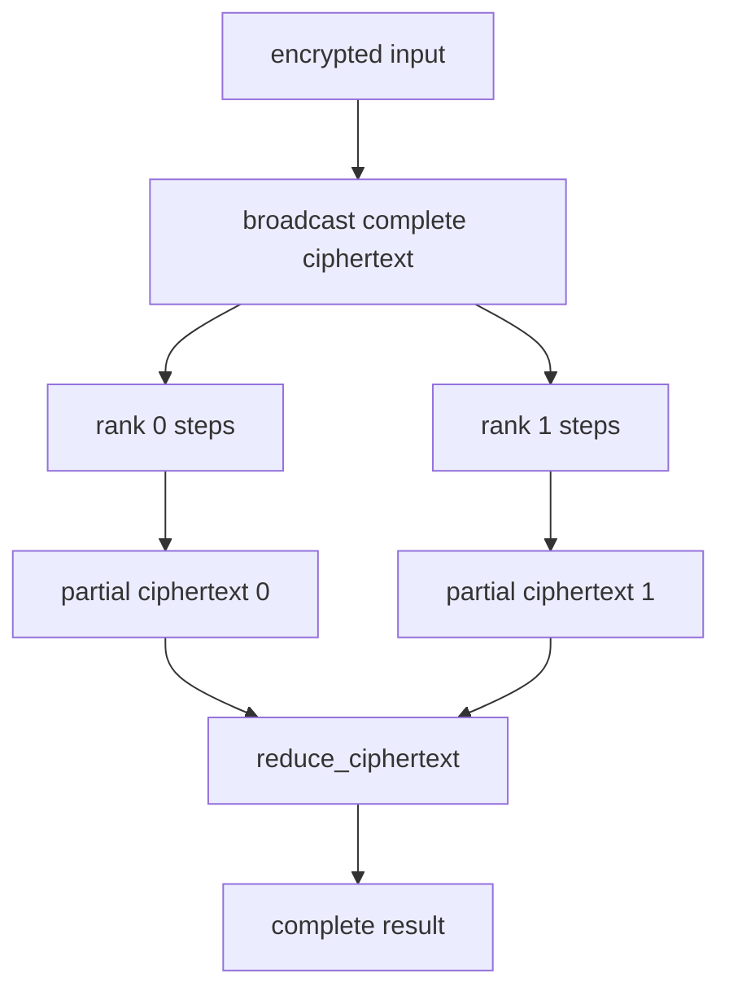
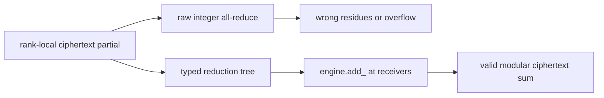
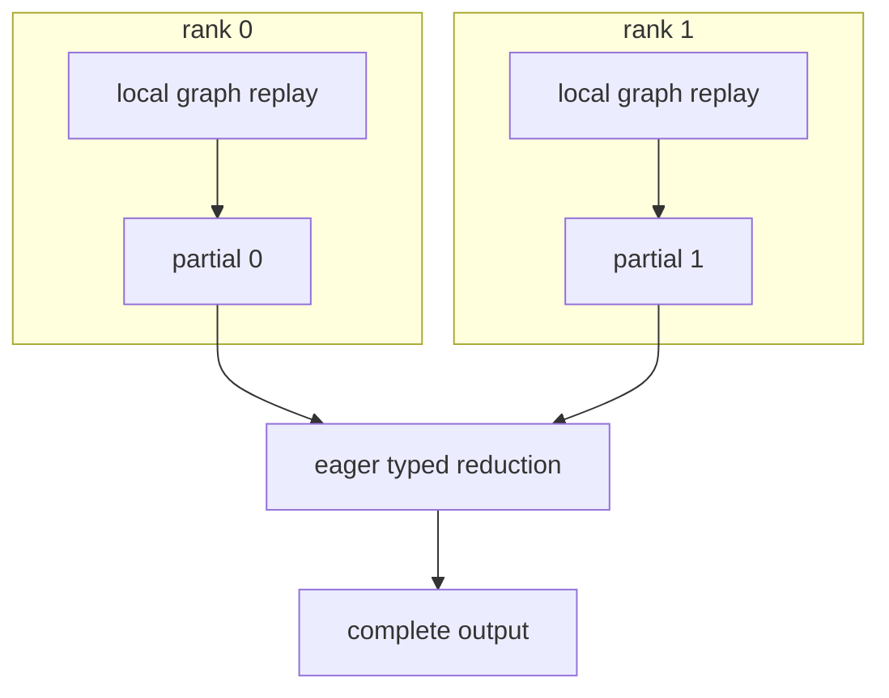
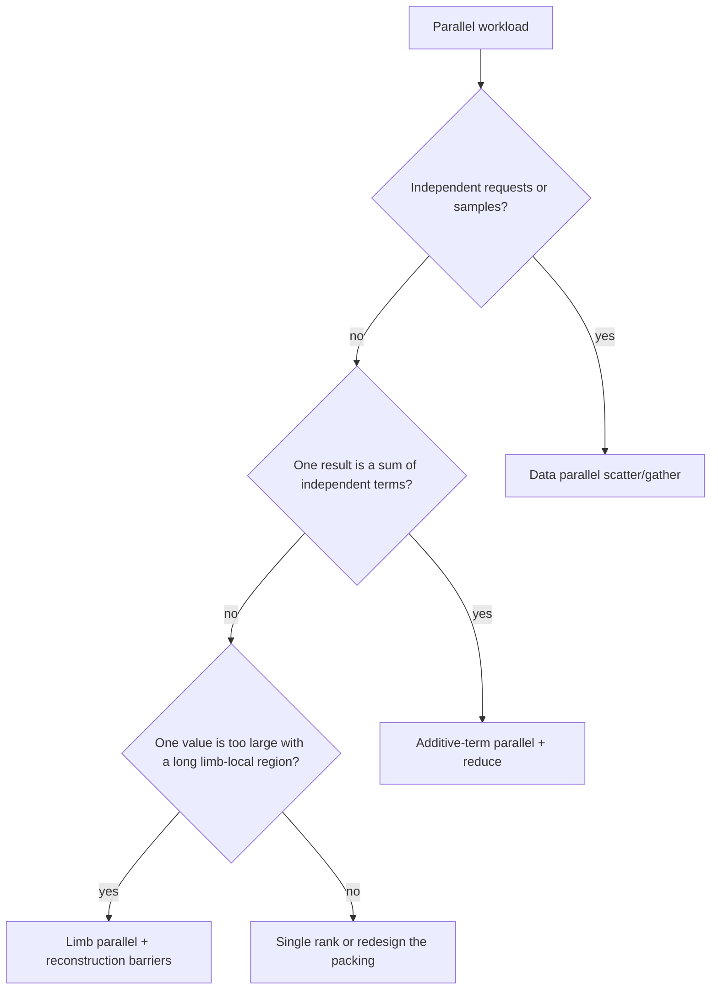

# Communication semantics

Before choosing a collective, identify the **mathematical relationship** among
rank-local values. Equal tensor types and shapes do not imply that the same
communication operation is correct.

## Three relationships, three operations

| Relationship | Example | Correct operation | Arithmetic? |
| --- | --- | --- | --- |
| Independent objects | One request per rank | Gather a list | No |
| Additive partials | Diagonal/rotation terms of one matvec | Reduce with CKKS addition | Yes |
| Disjoint rows | RNS limb shards of one ciphertext | Gather and concatenate limbs | No |

Confusing these relationships can produce a plausible tensor with the wrong
mathematical meaning.

## Pattern A: independent ciphertexts

Each rank evaluates a different sample or request:

Outputs remain a list. Reducing them would incorrectly add independent
requests.

## Pattern B: additive rotation/offset parallelism

A packed diagonal transform often has the form:

$$
y=\sum_i p_i\odot\operatorname{Rot}(x,s_i).
$$

Ranks may own disjoint step sets, produce local partial sums, and then perform
one ciphertext reduction:

The initial input and needed keys may be replicated, while expensive rotations
are partitioned. Communication occurs mainly at input provisioning and final
reduction rather than inside every rotation.

## Pattern C: RNS limb parallelism

One ciphertext may be structurally split into disjoint prime-row ranges. Some
operations are row-local, but others require the complete active-row layout.

| Often limb-local under documented partial-layout semantics | Requires every expected active row |
| --- | --- |
| Add/subtract | Decrypt |
| Fixed-layout pointwise multiplication | Rescale |
| Some row-wise RNS/NTT stages | Relinearize/key switch |
| Local tensor transforms | Rotation |

`Ciphertext.slice_limbs()` creates a storage-sharing local view. It is not a
placement object and does not make a partial value legal for complete-row
operations. The application must reconstruct the complete layout first.

## Why raw integer all-reduce is wrong

Each ciphertext row belongs to a different modulus. Correct addition is:

$$
c_i=(a_i+b_i)\bmod q_i.
$$

A raw NCCL `SUM` over `int64` tensors knows neither $q_i$ nor the required
canonical/lazy residue-range invariant and may overflow machine arithmetic.

`reduce_ciphertext` uses communication plus local engine modular addition. It
is not a thin alias for an integer reduction.

## Gather, reduce, and reconstruct at a glance

| Operation | Output |
| --- | --- |
| Gather independent ciphertexts | Root receives a list of logical objects |
| All-gather same-layout values | Every rank receives a list |
| Gather limbs | A complete value with concatenated prime rows |
| Reduce ciphertext | Root receives one modular sum |
| All-reduce ciphertext | Every rank receives that modular sum |

## Rank-local CUDA Graph capture

CUDA Graph capture applies to a deterministic local evaluator, not to dynamic
process-group control:

This keeps collective ordering, ownership, and variable communication outside
a fixed local capture.

## Choosing a partition

The decision should be validated with communication volume, key placement,
load balance, topology, and memory—not only local kernel time.

## Continue

- [Rotation-parallel matvec tutorial](../../tutorial/spmd-rotation-parallel-matvec.md)
- [Limb-parallel pipeline tutorial](../../tutorial/spmd-limb-parallel-pipeline.md)
- [CKKS cost model](../performance/cost-model.md)
- [Choose a multi-GPU partition](../../how-to/choose-multi-gpu-partition.md)
