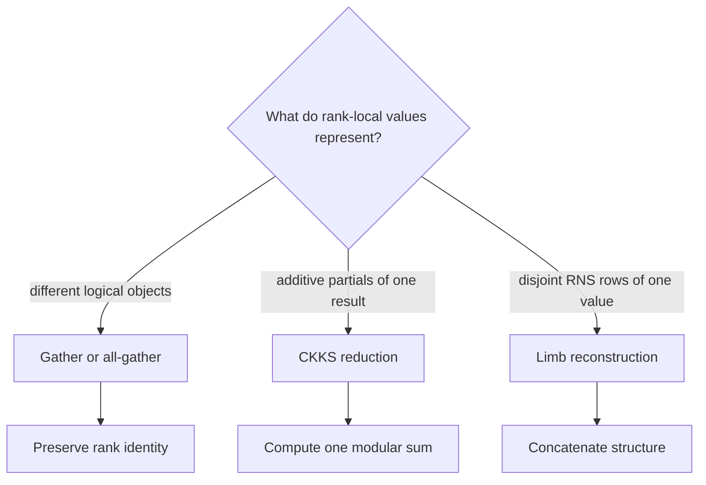
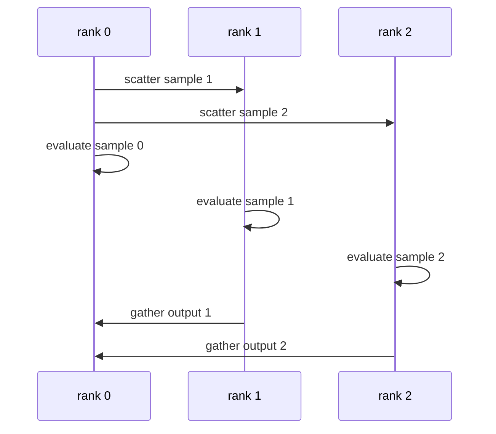
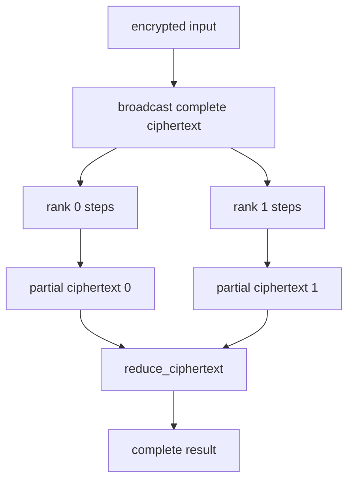
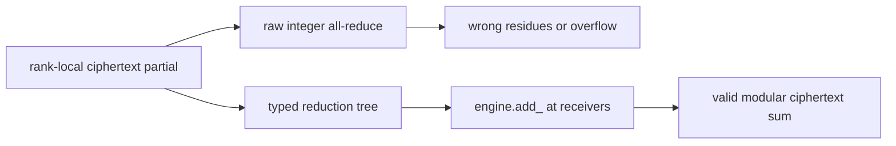
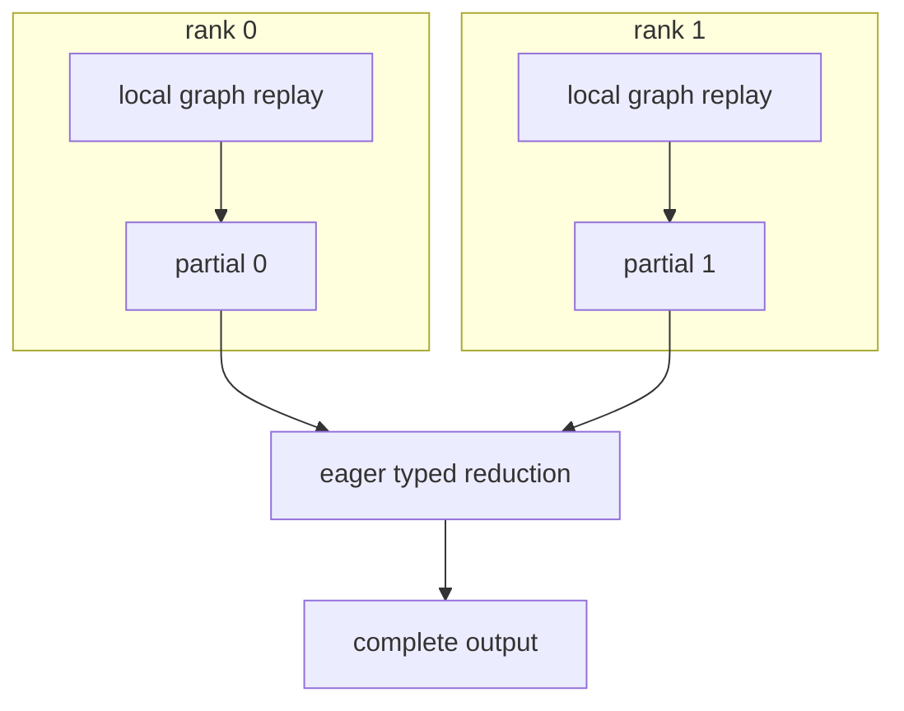
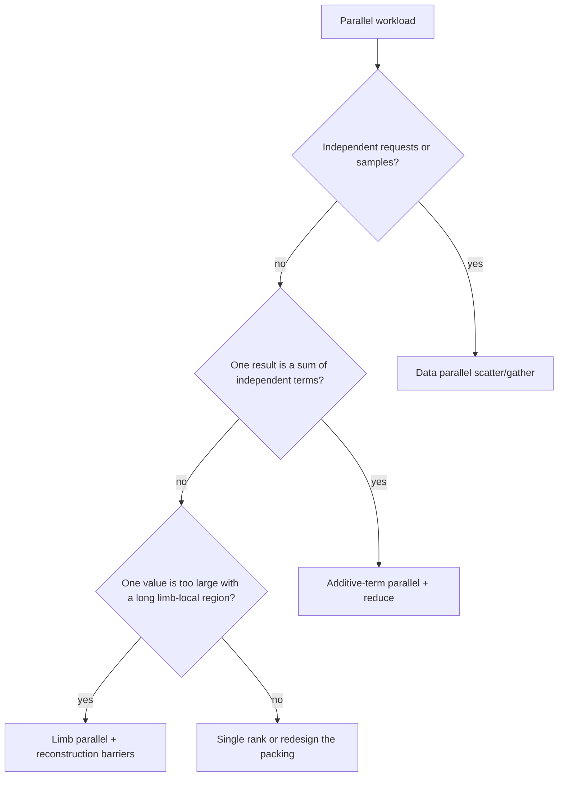

# Communication semantics

The **mathematical relationship** among rank-local values determines the collective's meaning. Communication compatibility includes this relationship as well as Tensor type and shape.

## Three relationships, three operations

| Relationship | Example | Correct operation | Arithmetic? |
| --- | --- | --- | --- |
| Independent objects | Separate requests or sub-batches | Gather a list | No |
| Additive partials | Diagonal/rotation terms of one matvec | Reduce with CKKS addition | Yes |
| Disjoint rows | RNS limb shards of one ciphertext | Gather and concatenate limbs | No |

Confusing these relationships can produce a plausible tensor with the wrong mathematical meaning.

## Pattern A: independent ciphertexts

Each rank evaluates its assigned samples or requests:

Outputs remain a list. Reducing them would incorrectly add independent requests.

A centralized input can be one homogeneous ciphertext batch. The source creates sub-batch views with `Ciphertext.slice_batch`, then passes those prepared values to `scatter_ciphertexts`. Each rank can receive a different batch size. Gather returns the sub-batches in group-rank order; the application restores sample order according to its partition. A rank-independent model produces the same intended result when the partition changes.

## Pattern B: additive rotation/offset parallelism

A packed diagonal transform often has the form:

$$
y=\sum_i p_i\odot\operatorname{Rot}(x,s_i).
$$

Ranks may own disjoint step sets, produce local partial sums, and then perform one ciphertext reduction:

The initial input and needed keys may be replicated, while expensive rotations are partitioned. Communication occurs mainly at input provisioning and final reduction rather than inside every rotation.

## Pattern C: RNS limb parallelism

One ciphertext may be structurally split into disjoint prime-row ranges. Some operations are row-local, but others require the complete active-row layout.

| Often limb-local under documented partial-layout semantics | Requires every expected active row |
| --- | --- |
| Add/subtract | Decrypt |
| Fixed-layout pointwise multiplication | Rescale |
| Some row-wise RNS/NTT stages | Relinearize/key switch |
| Local tensor transforms | Rotation |

`scatter_ciphertext_limbs` accepts a source ciphertext and caller-selected `limb_ranges`, indexed by stored row position in process-group-rank order. It uses `Ciphertext.slice_limbs()` to select storage-sharing views and their existing row descriptions before transport. It does not infer a partition from rank numbers. Complete-row operations require the application to reconstruct the full active layout first.

## Why raw integer all-reduce is wrong

Each ciphertext row belongs to a different modulus. Correct addition is:

$$
c_i=(a_i+b_i)\bmod q_i.
$$

A raw NCCL `SUM` over `int64` tensors knows neither $q_i$ nor the required standard/lazy residue-range invariant and may overflow machine arithmetic.

`reduce_ciphertext` combines communication with local modular ciphertext addition at reduction receivers.

## Gather, reduce, and reconstruct at a glance

| Operation | Output |
| --- | --- |
| Gather independent ciphertexts | Root receives a list of logical objects |
| All-gather same-layout values | Every rank receives a list |
| Gather limbs | A complete value with concatenated prime rows |
| Reduce ciphertext | Root receives one modular sum |
| All-reduce ciphertext | Every rank receives that modular sum |

## Logical values and communication storage

Removing RNS rows changes a value's active basis but does not necessarily compact its underlying allocation. A rescale result can therefore be a valid strided view with gaps between components.

Typed value collectives pack such views when contiguous communication storage is required. In-place results update the original view, preserving its storage aliases and leaving excluded rows untouched. Writable destinations must have non-overlapping elements. Contiguous values already on the transport device are used directly; callers need not compact every typed value before sending it. Raw PyTorch collective calls retain their own buffer requirements.

## Rank-local CUDA Graph capture

CUDA Graph capture records the deterministic local evaluator on each rank. Process-group control remains in the surrounding SPMD program:

This keeps collective ordering, ownership, and variable communication outside a fixed local capture.

## Choosing a partition

The partition's total cost includes communication volume, key placement, load balance, topology, memory, and rank-local computation.

## Related concepts

- [CKKS cost model](../performance/cost-model.md)
