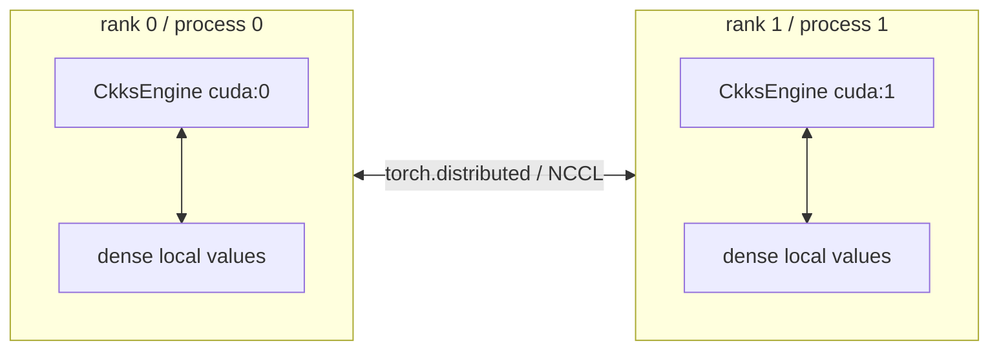
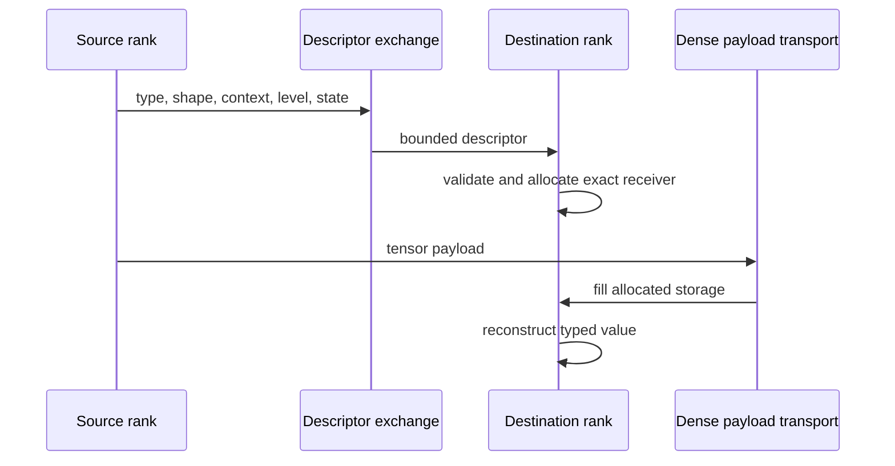
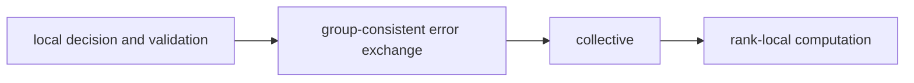

# Rank-local SPMD model

FHElium uses **dense rank-local values with SPMD**. Each process runs
the same worker program on a local CUDA device and communicates only where the
workload's mathematics requires it.

## Basic execution unit



There is no public placement object that automatically redistributes a
ciphertext. The application or compiler-written worker decides ownership,
collective order, and complete-row reconstruction points.

## Initialization belongs to PyTorch

`fhelium.distributed.init()` uses launcher environment such as `RANK`,
`WORLD_SIZE`, and `LOCAL_RANK`, selects the local device, and initializes a real
PyTorch process group. CUDA execution normally uses NCCL and CPU execution uses
Gloo. World size one still follows the same process-group model.

The returned state is not embedded into a `CkksEngine` or value. This keeps:

- rank lifecycle with the launcher/application;
- local CKKS semantics independent of world size;
- ordinary PyTorch distributed tooling available for tensors and debugging.

## Who decides what

| Decision | Owner |
| --- | --- |
| Global rank, world size, and local device | Launcher and process-group init |
| Which rank owns a sample, rotation, key, or limb range | Workload/application |
| Local CKKS arithmetic | Rank-local `CkksEngine` |
| Ordinary tensor collective semantics | `torch.distributed` |
| Receiver allocation for typed HE values | `fhelium.distributed` |
| Modular ciphertext reduction | Typed HE collective plus local engine add |
| Cache, admission, routing, and prefetch | Experimental/application policy |

## Two API categories

### Ordinary tensors

FHElium keeps PyTorch-compatible tensor semantics, including `ProcessGroup`,
mutation, asynchronous `Work`, and reduction operators where ordinary tensor
mathematics is appropriate.

```python
work = dist.all_reduce(tensor, op=dist.ReduceOp.SUM, async_op=True)
work.wait()
```

### Typed HE values

A specialized API is required when:

1. a receiver needs exact metadata before it can allocate a `Ciphertext`,
   `Plaintext`, or key; or
2. the collective operation must use CKKS/RNS arithmetic rather than machine
   integer arithmetic.

Current typed families include:

- `broadcast_ciphertext`, `broadcast_plaintext`, and `broadcast_key`;
- `scatter_ciphertexts` and `gather_ciphertexts`;
- `all_gather_ciphertexts` and `all_gather_plaintexts`;
- `scatter_ciphertext_limbs` and `gather_ciphertext_limbs`;
- `reduce_ciphertext` and `all_reduce_ciphertext`.

Consult the [Distributed API reference](../../api/fhelium/distributed.md) for exact
signatures and synchronization behavior.

## Descriptor before payload



The control-plane exchange allows all ranks to discover layout errors before a
large payload transfer. Collective implementations also aggregate validation
outcomes so one rank does not fail early while peers block indefinitely in a
different collective phase.

## Keys remain workload-owned

A process does not receive every key automatically. The workload decides which
rank needs which exact rotation or evaluation key and whether to:

- create it locally;
- load it from a store;
- broadcast it;
- retain it on host or CUDA;
- discard temporary non-owner material.

This is important because keysets often dominate memory and require stricter
custody than ciphertexts.

## Collective ordering is part of the program

All ranks in a group must call collectives in a compatible order, including
ranks with no local arithmetic work. A local validation failure, early return,
or conditional collective on one rank can deadlock peers.

A robust worker separates:



## World size one is a correctness tool

Before scaling out, run the same SPMD worker with world size one. This tests:

- launcher and initialization paths;
- rank-local device selection;
- typed value construction;
- collective ordering without communication complexity;
- whether distributed logic accidentally depends on rank zero special cases.

## Continue

- [Communication semantics](communication-semantics.md)
- [Independent ciphertexts tutorial](../../tutorial/spmd-independent-ciphertexts.md)
- [Rotation-parallel matvec tutorial](../../tutorial/spmd-rotation-parallel-matvec.md)
- [Diagnose a distributed hang](../../how-to/diagnose-distributed-hang.md)
