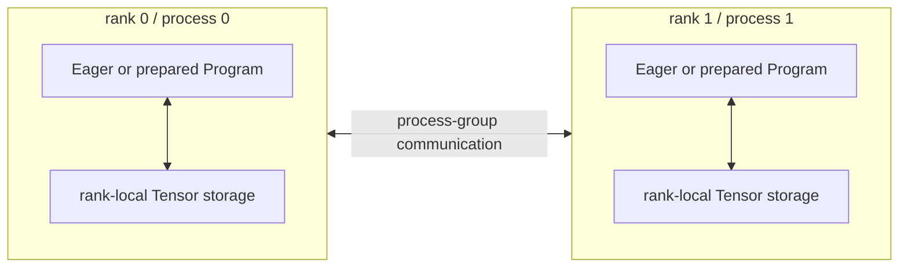
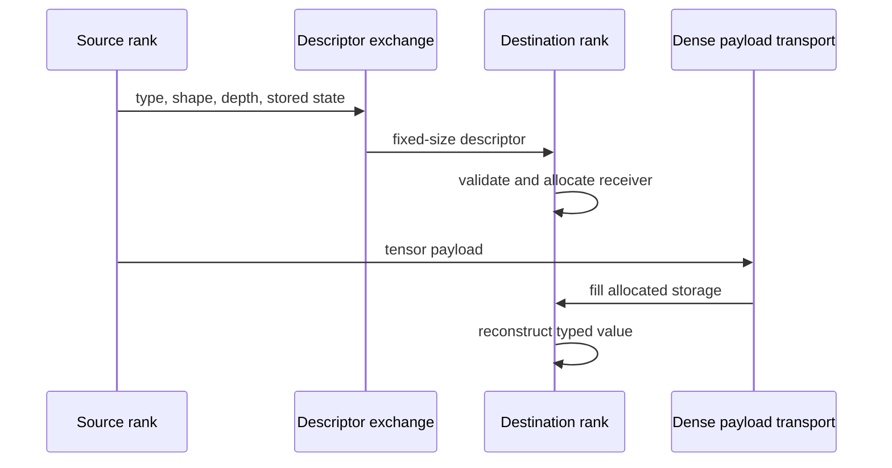
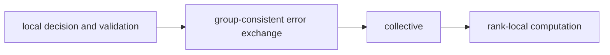

# Rank-local SPMD model

Single Program, Multiple Data (SPMD) execution assigns each process a rank and a local portion of a computation. Each rank executes the worker program using its selected CPU or CUDA resources and communicates at the points required by the distributed schedule. FHElium values and numerical materials remain rank-local.

## Basic execution unit



The application or compiler-written worker assigns ciphertext ownership, collective order, and complete-row reconstruction points.

## Initialization belongs to PyTorch

`fhelium.distributed.init()` uses launcher environment such as `RANK`, `WORLD_SIZE`, and `LOCAL_RANK`, selects the local device, and initializes a real PyTorch process group. CUDA execution normally uses NCCL and CPU execution uses Gloo. World size one still follows the same process-group model.

The application retains the returned process-group state. This keeps:

- rank lifecycle with the launcher/application;
- local CKKS semantics independent of world size;
- ordinary PyTorch distributed tooling available for tensors and debugging.

## Who decides what

| Decision | Owner |
| --- | --- |
| Global rank, world size, and local device | Launcher and process-group init |
| Which rank owns a sample, rotation, key, or limb range | Workload/application |
| Local arithmetic | Eager execution or a prepared rank-local Program |
| Ordinary tensor collective semantics | `torch.distributed` |
| Receiver allocation for typed HE values | `fhelium.distributed` |
| Modular ciphertext reduction | Typed HE collective plus local engine add |
| Cache, admission, routing, and prefetch | Application policy and optional Residency control |

## Two API categories

### Ordinary tensors

FHElium keeps PyTorch-compatible tensor semantics, including `ProcessGroup`, mutation, asynchronous `Work`, and reduction operators where ordinary tensor mathematics is appropriate.

```python
work = dist.all_reduce(tensor, op=dist.ReduceOp.SUM, async_op=True)
work.wait()
```

### Typed HE values

A specialized API is required when:

1. a receiver needs typed metadata before it can allocate a `Ciphertext`, `Plaintext`, or key; or
2. the collective operation requires CKKS/RNS modular arithmetic.

Current typed families include:

- `broadcast_ciphertext`, `broadcast_plaintext`, and `broadcast_key`;
- `scatter_ciphertexts` and `gather_ciphertexts`;
- `all_gather_ciphertexts` and `all_gather_plaintexts`;
- `scatter_ciphertext_limbs` and `gather_ciphertext_limbs`;
- `reduce_ciphertext` and `all_reduce_ciphertext`.

Typed operations exchange value descriptors and payloads. A descriptor supplies the receiver's allocation shape and arithmetic state; communication completion determines when the reconstructed value can be consumed.

## Collectives represented in Programs

A Program can represent rank queries, transfers, broadcasts, and reductions alongside local arithmetic. A process-group reference binds the rank-local handle for that group. The Program records each operation's operands and order; the application initializes the participating processes and binds their corresponding handles.

An additive ciphertext reduction combines partial results with modular addition. A generic reduction instead represents its combine calculation as a region with input and result values. The grouping and ordering selected by the collective must satisfy that region's mathematical requirements. Every participating rank follows a compatible collective sequence even when its local arithmetic work differs.

This model allows a worker to compose Python-controlled communication, represented collectives, and prepared local computation. [Communication semantics](communication-semantics.md) distinguishes independent objects, additive partials, and RNS shards.

## Descriptor before payload



The control-plane exchange allows all ranks to discover layout errors before a large payload transfer. Collective implementations aggregate validation outcomes before ranks enter the payload phase.

Typed value payload transport handles non-contiguous views through temporary contiguous buffers when needed. Receive copy-back preserves existing Tensor views for in-place operations. This storage handling does not infer prime IDs, parameter compatibility, or key ownership; those remain caller-supplied facts.

## Keys remain workload-owned

The workload provisions each rank with the rotation and evaluation keys needed by its local schedule. It may:

- create it locally;
- load it from a store;
- broadcast it;
- retain it on host or CUDA;
- discard temporary non-owner material.

This is important because keysets often dominate memory and require stricter custody than ciphertexts.

## Collective ordering is part of the program

All ranks in a group must call collectives in a compatible order, including ranks with no local arithmetic work. A local validation failure, early return, or conditional collective on one rank can deadlock peers.

A robust worker separates:



## The single-rank case

World size one is the single-process instance of the same SPMD model. Initialization, rank identity, typed value construction, and collective order remain present. Communication reduces to local behavior, while the worker's mathematical interpretation stays the same.

## Related concepts

- [Communication semantics](communication-semantics.md)
