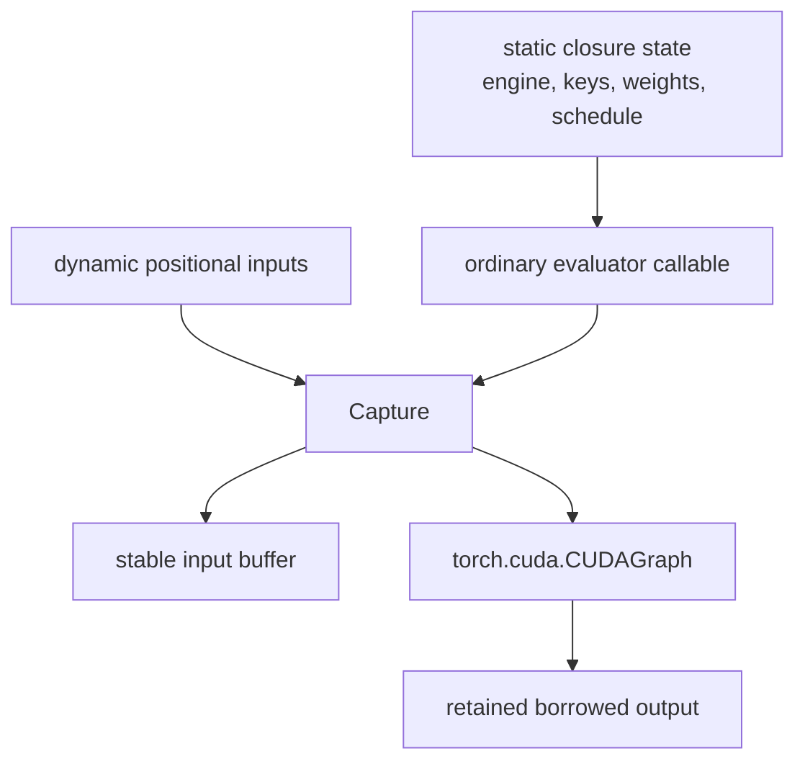
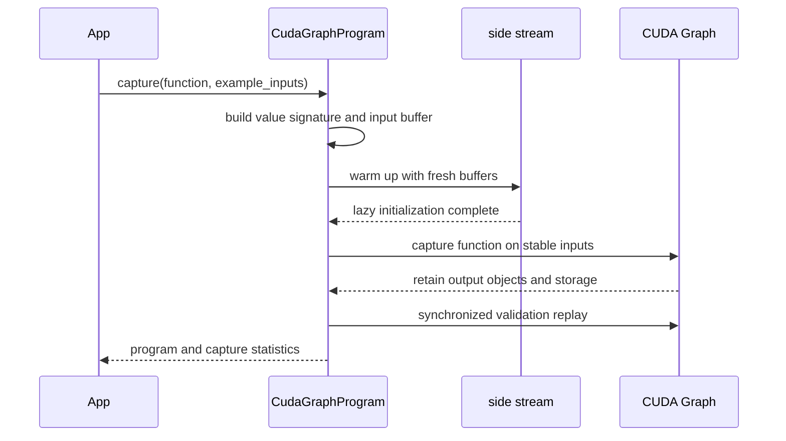
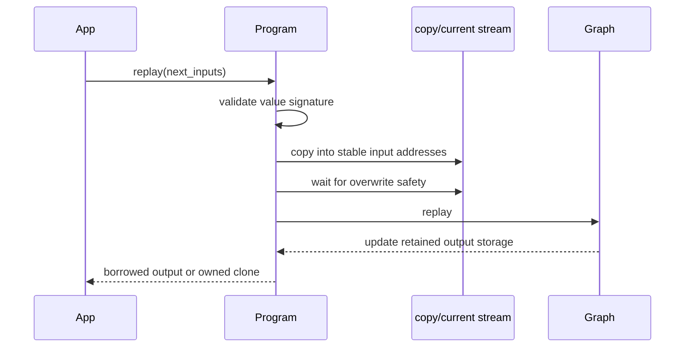
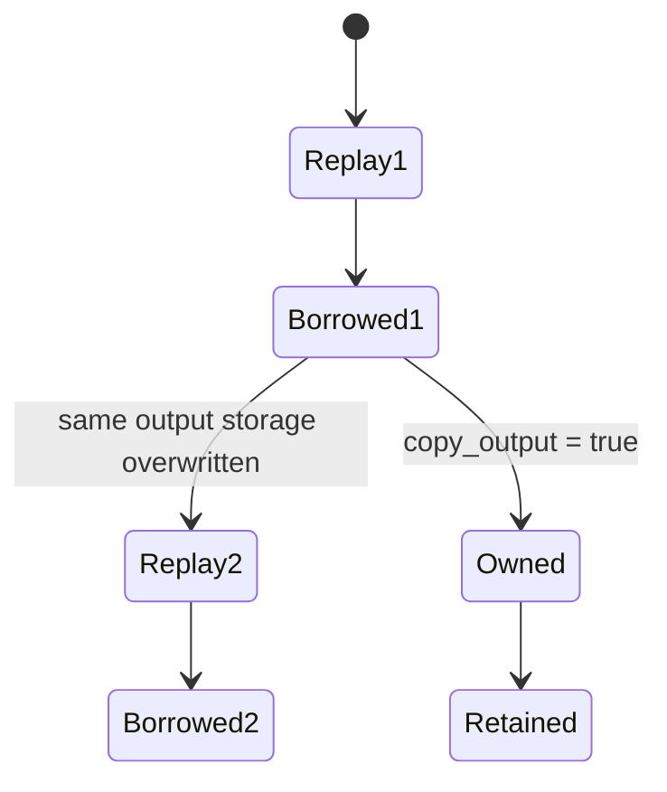
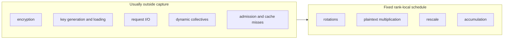

# CUDA Graph execution model

`CudaGraphProgram` adapts an ordinary deterministic rank-local `CkksEngine`
callable for fixed-address capture and replay while preserving its CKKS
semantics. Capture covers that callable's fixed schedule, buffers, and
statically bound resources.

## Static and dynamic state

A good capture candidate has:

- fixed operation sequence and control flow;
- fixed tensor shapes and CKKS states;
- keys and operation-ready weights bound as static state;
- deterministic rank-local arithmetic;
- a small, well-defined set of dynamic inputs.

## Capture lifecycle

Warmup occurs outside capture so lazy initialization, allocator activity, and
kernel setup do not unexpectedly enter the captured region.

## Replay lifecycle

The convenience `replay(...)` path combines input staging and replay. Advanced
schedules may split them:

- `copy_inputs_from(...)` prepares stable inputs and returns a copy handle;
- `replay_prepared(...)` consumes that prepared handle and launches replay.

Use the [Execution API reference](../../api/fhelium/execution/cuda_graph.md) for stream,
event, and output-copy options.

## Borrowed outputs

Captured output tensors are retained at stable addresses. The default output is
therefore borrowed:

If a caller must retain one result across the next replay, request an owned
copy. Merely keeping the Python output object does not preserve its previous
contents.

## Sequential program instances

One `CudaGraphProgram` instance owns one set of stable inputs, graph state, and
retained outputs. Treat it as sequential. Concurrent workers should own
separate program instances, buffers, and scheduling state.

Calling the raw underlying CUDA graph's replay method bypasses FHElium's:

- value-signature validation;
- dynamic input staging;
- event dependencies;
- overwrite protection;
- output ownership policy.

Use the program wrapper unless deliberately implementing a lower-level runtime
with equivalent guarantees.

## Capture region

Randomized key generation/encryption, dynamic shapes or levels, variable
communication topology, storage I/O, and cache miss paths are poor capture
candidates.

A distributed workload normally captures each rank's stable local evaluator
and leaves typed reduction in eager execution.

## When graphs help

Graphs target repeated host/Python/dispatcher launch overhead. They tend to
help when:

- the schedule is replayed many times;
- there are many relatively small launches;
- input signatures remain stable;
- graph-private and retained memory fit the budget.

They may provide little benefit when one large kernel, host-to-device (H2D) input transfer, or
inter-rank communication already dominates. Always compare a synchronized eager
baseline with the same correctness and memory accounting.

## Common failures

- Capturing key generation or fresh-randomness encryption.
- Changing level, scale, or key step between replays.
- Retaining a borrowed output across another replay.
- Concurrent replay through one program instance.
- Assuming graph capture automatically includes distributed collectives.
- Reporting graph speedup without including input staging or checking allocator
  peaks.

## Continue

- [CUDA Graph matvec tutorial](../../tutorial/cuda-graph-matvec.md)
- [Value signatures and buffers](signatures-and-buffers.md)
- [Communication semantics](../distributed/communication-semantics.md)
- [CKKS cost model](../performance/cost-model.md)
