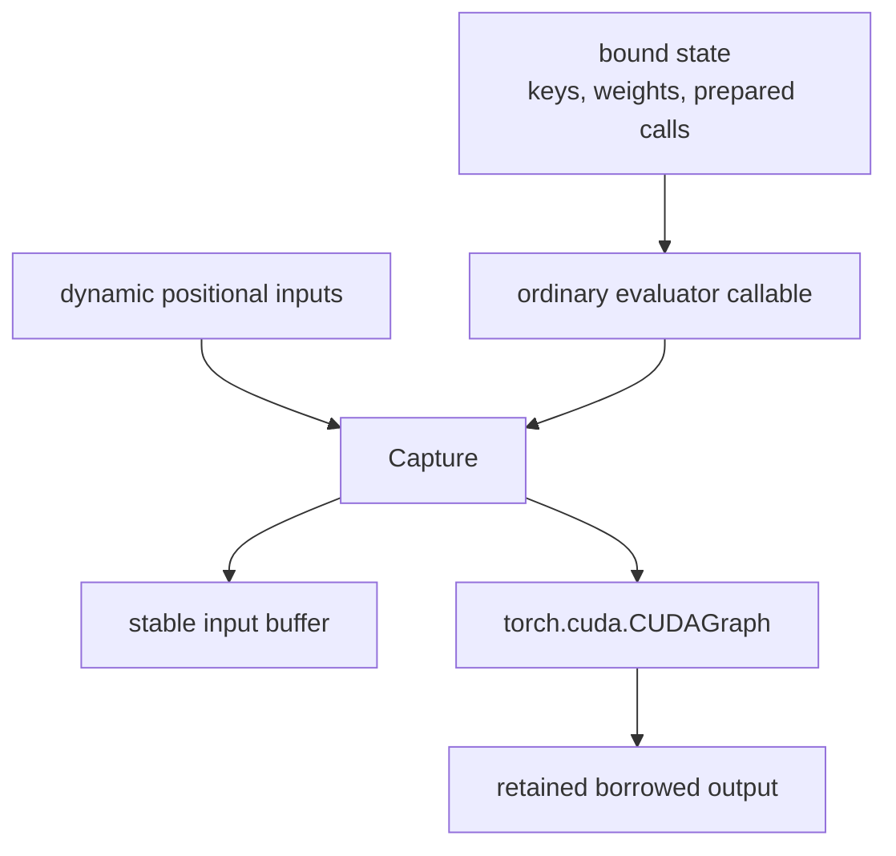
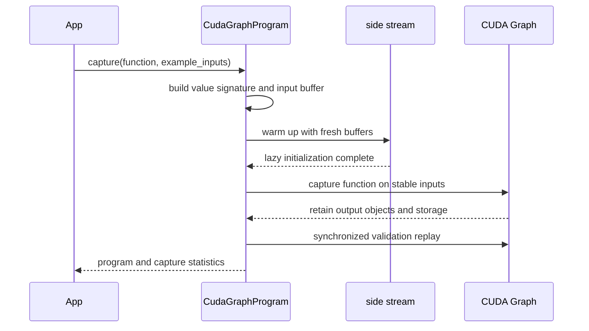
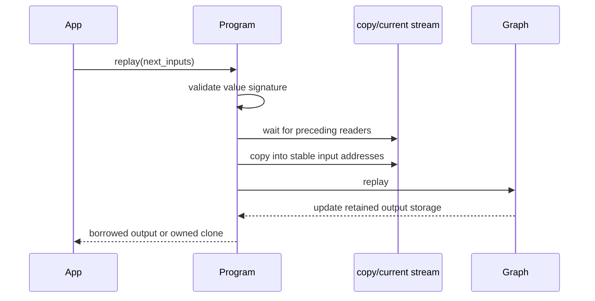
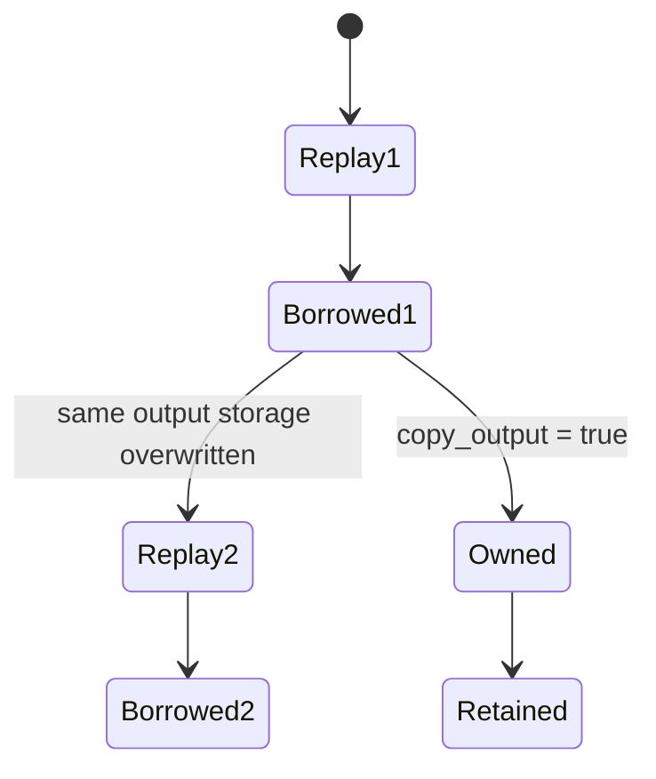
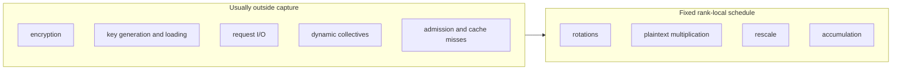

# CUDA Graph execution model

A CUDA Graph records a sequence of device operations for repeated execution at stable storage addresses. `CudaGraphProgram` stages a rank-local callable's inputs into fixed buffers and retains its captured outputs. The callable can invoke Eager methods, a manually linked Program, or a prepared compiled specialization.

## Static and dynamic state

A good capture candidate has:

- fixed operation sequence and control flow;
- fixed tensor shapes and CKKS states;
- keys and operation-ready weights captured as static state;
- a capture-compatible rank-local kernel sequence;
- a small, well-defined set of dynamic inputs.

## Compile preparation and graph capture

Compile transforms represented operations, selects implementations, and prepares host calls. CUDA Graph capture records the device work launched by those calls. A compiled workload can therefore use both: first prepare and execute the required specialization so its kernels and launch plans exist, then capture the resulting device schedule.

Bound keys and weights retain their storage addresses during replay. Their contents may be refreshed through ordered writes after preceding readers complete. A Python reassignment of a key or weight changes the host binding, while the recorded device operations continue to use their captured addresses. Input staging provides the corresponding data-update mechanism for dynamic arguments.

## Capture lifecycle

Warmup occurs outside capture so lazy initialization, allocator activity, and kernel setup do not unexpectedly enter the captured region.

## Replay lifecycle

The convenience `replay(...)` path combines input staging and replay. Advanced schedules may split them:

- `copy_inputs_from(...)` prepares stable inputs and returns a copy handle;
- `replay_prepared(...)` consumes that prepared handle and launches replay.

A copy-complete event makes the staged data visible to the compute stream. A replay-complete event prevents a later write from overwriting data that the preceding replay is still reading. An independently retained output requires a copy ordered after replay completion.

## Borrowed outputs

Captured output tensors are retained at stable addresses. The default output is therefore borrowed:

If a caller must retain one result across the next replay, request an owned copy. Merely keeping the Python output object does not preserve its previous contents.

## Sequential program instances

One `CudaGraphProgram` instance owns one set of stable inputs, graph state, and retained outputs. Replay is sequential within that storage set. Concurrent workers use separate program instances, buffers, and scheduling state.

Calling the raw underlying CUDA graph's replay method bypasses FHElium's:

- value-signature validation;
- dynamic input staging;
- event dependencies;
- overwrite protection;
- output ownership policy.

The wrapper combines these input, event, and ownership transitions around each raw replay.

## Capture region

Dynamic shapes or depths, variable communication topology, storage I/O, and cache-miss preparation belong outside a fixed capture. For randomized operations, replay must advance the live random state through recorded device operations. Host-side counter changes occur while capturing and are not repeated by graph replay; recording fixed samples can therefore repeat randomness. Key provisioning and request-level encryption are normally performed before capture.

A distributed workload normally captures each rank's stable local evaluator and leaves typed reduction in eager execution.

## When graphs help

Graphs target repeated host/Python/dispatcher launch overhead. They tend to help when:

- the schedule is replayed many times;
- there are many relatively small launches;
- input signatures remain stable;
- graph-private and retained memory fit the budget.

They may provide little benefit when one large kernel, host-to-device (H2D) input transfer, or inter-rank communication already dominates. A captured-versus-uncaptured comparison describes the same evaluator with matching input staging, output ownership, correctness criteria, and memory accounting.

## Replay invariants

A replay consumes the same represented input state and fixed storage layout as capture. Writes to input buffers are ordered after preceding readers; retained outputs remain borrowed until copied into independent storage. One program instance serializes access to its input/output storage set. Random-state advancement and collective participation must be part of the represented device schedule or of the surrounding host protocol.

## Related concepts

- [Value signatures and buffers](signatures-and-buffers.md)
- [Communication semantics](../distributed/communication-semantics.md)
- [CKKS cost model](../performance/cost-model.md)
