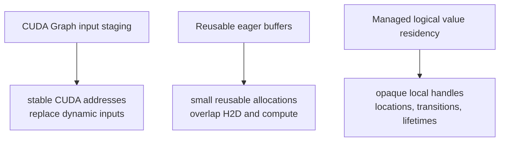

# Residency lifetimes

`fhelium.residency` manages process-local FHElium values under caller-enforced
aliasing and borrowing rules. One `ResidencyManager` is the sole authority for
opaque handles, concrete materializations, strict optional budgets, and access
lifetimes. Applications can control every transition or add a deterministic
`ResidencyController` that derives inspectable placement decisions.

The abstraction layers have distinct responsibilities:

| Layer | Responsibility |
| --- | --- |
| `TensorResident.to(...)` | Functional movement of an application-owned concrete value. |
| Manager primitives | Strict owned `ensure`, `move`, `drop`, `discard`, and already-ready-only `acquire` operations. |
| `ResidencyPlan` | Concrete ordered reclaim, entry, and exit commands plus scoped headroom. |
| `ResidencyRequest` | Declarative `(handle, location)` postconditions and headroom requirements. |
| `ResidencyPolicy` | Pure deterministic ordering and configured fallback-tier choices. |
| `ResidencyDecision` | Manager-bound, state-versioned plan and policy evidence. |
| `ResidencyController.use(...)` | Convenience decision, version-checked scope entry, and strict lease acquisition. |

In short: a request says **what** must be true; a policy ranks legal choices; a
decision records **why** and against which manager state; a plan records **how**
to change placement; the manager validates and executes it; a scope defines the
placement/reservation lifetime; and a lease defines concrete read and CUDA
completion lifetime.

## Residency, staging, and CKKS state



- **Graph staging** preserves addresses for captured dynamic inputs.
- **Reusable buffers** expose a fixed allocation and an copy schedule.
- **Residency** tracks which manager-issued local handle has a materialization
  in which local memory location.

Residency and execution buffers remain separate ownership domains. This
feature does not treat a mutable fixed-address buffer or captured program as a
managed logical-value materialization; a dedicated cross-feature integration
interface is deferred.

Moving a value between pageable host, pinned host, or CUDA does not change its
CKKS context, level, scale, prime IDs, polynomial domain, or key relation.
Pinned host storage can support asynchronous host-to-device (H2D) transfer when
the copy preconditions and source-lifetime requirements are satisfied.

## Opaque handles, replicas, and recoverability

A [`ResidencyHandle`](../../api/fhelium/residency/model.md#residencyhandle)
is an immutable, hashable, tensor-free token issued by one manager. Every
`adopt` and `register_source` call returns a fresh unique handle. The handle is
opaque to application code and retains its typed lookup relationship while its
materializations move among local locations.

Application code associates handles with its values through ordinary variables
or containers.

Two independent constraints describe a managed value:

| Constraint | Meaning |
| --- | --- |
| `ReplicaMode.REPLICABLE` | Multiple simultaneous materializations are permitted. Use `ensure` to create another. |
| `ReplicaMode.EXCLUSIVE` | Exactly one steady materialization is permitted. Use `move`, not `ensure`, to change its location. |
| `Recoverability.RECONSTRUCTIBLE` | A registered `ResidencySource` can reconstruct the managed value after its final materialization is dropped. |
| `Recoverability.MUST_PRESERVE` | At least one materialization remains until the application discards the managed value. `adopt` establishes this preservation requirement. |

`ResidencySource.load()` synchronously reconstructs the exact value and
transfers sole logical ownership of independent tensor storage to the manager.
The source must not retain or mutate the returned concrete value after the
callback returns. While `load()` is active, every concurrent public access to
the same manager's mutable or observational state is rejected in every thread
with `ResidencyReentrancyError`. This manager-wide exclusion includes unrelated
observer and transition calls. Reading immutable `manager_id` and constructing
a not-yet-entered scope do not access manager state and remain available.

## Adoption and leases rely on caller-enforced aliasing rules

```python
handle = residency.adopt(
    plaintext,
    at=PAGEABLE_HOST,
    replica_mode=ReplicaMode.REPLICABLE,
)
del plaintext
```

`adopt` transfers logical ownership under these caller-enforced rules, and
`acquire` grants a time-bounded immutable borrow. The supported alias behavior
is:

- after a successful `adopt` returns, the caller retains the opaque handle and
  no concrete alias to the transferred value;
- while a lease is active, the caller reads the borrowed concrete values
  without mutating them; and
- when the lease releases, the caller retains no extracted alias and performs
  no later CPU read or mutation and submits no new CUDA work through one.

Retaining, reading, or mutating a pre-adoption alias after a successful
transfer is unsupported. Mutating a borrowed value at any time, or retaining,
reading, or submitting new work through an extracted alias after lease release,
is also unsupported. The manager's storage accounting, immutable-value
assumptions, removal protection, and asynchronous lifetime safety apply only
while callers follow these rules.

The adoption and lease APIs deliberately pass direct Python objects. Adoption does not
make a defensive copy, and lease lookup does not replace a concrete value with
a revocable proxy; the manager therefore relies on caller compliance rather
than mechanical alias revocation.

## Lazy local locations and optional budgets

`ResidencyManager()` accepts valid pageable-host, pinned-host, and indexed CUDA
locations without requiring them to be declared in advance. It creates and
accounts location state when a location is first budgeted or used. Unbudgeted
locations therefore appear lazily after their first successful managed use.

```python
cuda0 = cuda_location("cuda:0")
unbudgeted = ResidencyManager()
budgeted = ResidencyManager(
    budgets={
        PINNED_HOST: 4 << 30,
        cuda0: 16 << 30,
    },
)
```

The unbudgeted manager still owns placements, validates replica and lifetime
rules, records reservations, and reports current and peak byte accounting. In
the second manager, pinned host and `cuda:0` additionally use strict admission
budgets. Pageable host and any other valid local CUDA location remain
unbudgeted. The application supplies budget values from its workload and
deployment measurements.

Only `budgets` entries establish admission limits; allocator and NVML free
memory remain observations. A direct transition or reservation that would
exceed its location budget raises `ResidencyBudgetError` without selecting
another placement. Plan explanation reports the same condition as infeasible.
The application chooses a subsequent `move` or `drop`, rejects the workload,
or lets an attached controller decide placement under configured fallback
tiers.

Each primitive names one concrete state transition:

| Manager method | Low-level action | Effect |
| --- | --- | --- |
| `ensure(handle, at)` | `EnsureResident` | Keep existing replicas and create the requested replica; valid for `REPLICABLE` values. |
| `move(handle, to, from_location=...)` | `MoveResident` | Create the destination and remove the selected source; required for `EXCLUSIVE` values. |
| `drop(handle, at)` | `DropResident` | Remove one unprotected materialization while retaining the managed value. |
| `discard(handle)` | `DiscardValue` | End the managed value and remove every unprotected materialization and source. |

The application supplies each destination and optional move source. Snapshots
provide the state and accounting evidence needed to select later transitions.

## Plans are ordered low-level IR

A [`ResidencyPlan`](../../api/fhelium/residency/plan.md#residencyplan)
is immutable ordered intermediate representation (IR):

```python
plan = ResidencyPlan(
    name="inference/attention/tile-4",
    reclaim=(
        DropResident(previous_weight_handle, cuda0),
    ),
    enter=(
        EnsureResident(weight_handle, cuda0),
        MoveResident(input_handle, cuda0, from_location=PINNED_HOST),
    ),
    exit=(
        MoveResident(input_handle, PINNED_HOST, from_location=cuda0),
        DropResident(weight_handle, cuda0),
    ),
    reservations=(
        MemoryReservation(
            cuda0,
            output_and_workspace_bytes,
            label="attention output and native workspace",
        ),
    ),
)

explanation = residency.explain(plan)  # dry run; no state change
if not explanation.feasible:
    raise RuntimeError(explanation.reason)

with residency.scope(plan) as scope:
    run_tile()
```

The complete runtime order is:

```text
reclaim -> admit reservations -> enter -> body -> exit -> release reservations
```

Reclaim establishes capacity before scoped headroom is admitted. Scope exit
executes `exit` actions in order and releases the reservations. Preflight
rejects predictable current-state failures before the first action,
but it cannot guarantee that a source callback, allocation, or copy will
succeed at runtime. If action $i$ fails at runtime, completed actions
$0, \ldots, i-1$ remain committed and are not rolled back. A runtime-failed
`execute_actions`, scope entry, or scope exit raises
`ResidencyPlanExecutionError`.
The error identifies the failed phase and action and carries a structured
`partial_report` containing every completed transition. The manager's bounded
trace remains an independent rolling observation and may be disabled. A scope
publishes its complete report only after its exit actions complete
successfully. Failed scope entry consumes and closes that single-use scope;
calling `close()` afterward is a no-op and cannot execute exit actions. If both
the scope body and exit actions fail, the body exception remains primary and
the scope retains the structured plan failure in `scope.exit_error`.

A `MemoryReservation` charges measured headroom for unmanaged outputs or native
workspace across the scope lifetime. At a budgeted location it reduces the
remaining admission budget; at an unbudgeted location it remains visible
accounting. Tensor and workspace allocation remains part of the operation that
consumes that headroom.

A **stage** is an application-defined named and nestable usage pattern. Its
plan name supports diagnostics, while actions refer to the opaque handles
issued by the local manager. FHE operations can expand memory substantially
through key switching, rotation, multiplication, relinearization,
bootstrapping, and temporary RNS bases. Stage and tile transitions select
managed values, reserve measured headroom, acquire a read window, and release
or move materializations at an declared completion point.

`execute_actions(...)` runs a raw ordered action sequence without a scoped
body. Both it and `scope(...)` accept a per-destination `transfer_streams`
mapping. The direct primitive methods retain their single `stream=` argument.

## Automatic decisions remain inspectable

Automation adds policy without changing manager ownership or strict primitive
semantics:

```python
policy = DeterministicTieredLRU(
    fallback_tiers={cuda0: (PINNED_HOST, PAGEABLE_HOST)},
)
controller = ResidencyController(residency, policy=policy)
request = ResidencyRequest(
    name="inference/attention/tile-4",
    requirements=(
        ResidencyRequirement(input_handle, cuda0),
        ResidencyRequirement(weight_handle, cuda0),
    ),
    reservations=(
        MemoryReservation(cuda0, workspace_bytes, "workspace"),
    ),
)

decision = controller.decide(request)
print(
    decision.evictions,
    decision.explored_states,
    decision.explanation.predicted_peak_bytes,
)

with controller.use(
    request,
    consumer_streams={cuda0: compute_stream},
    transfer_streams={cuda0: transfer_stream},
) as use:
    input_value = use.value(input_handle, at=cuda0)
    weight_value = use.value(weight_handle, at=cuda0)
    run(input_value, weight_value)
```

Each requirement identifies an exact `(handle, location)` endpoint. A
`REPLICABLE` value may be required at several locations; an `EXCLUSIVE` value
cannot. The built-in policy uses configured fallback edges and deterministic
priority-aware least-recently-used ordering. It never infers a tier or capacity
from allocator or NVML free-memory readings, starts a background eviction
thread, waits for protected values, retries a failed transition, rolls back a
committed prefix, or automatically emits `DiscardValue`.

`decide()` reads a tensor-free manager snapshot and returns a
`ResidencyDecision` bound to its `state_version`. Scope entry checks that
version under the manager lock before reclaim or reservation mutation. A stale
decision raises `ResidencyStaleStateError`; it is never silently replanned.
Successful automatic uses keep their materializations cached. A later
admission may reclaim them according to policy.

`ResidencyManager.acquire(...)` remains the strict low-level read operation: it
never materializes a missing value. The controller convenience layer performs
placement first and then invokes that same strict lease operation.

## Leases protect asynchronous consumers

A lease exposes already-resident direct values under the caller-enforced
immutable-read rules defined above:

```python
compute_stream = torch.cuda.Stream(device="cuda:0")
with residency.acquire(
    (ciphertext_handle, key_handle),
    at=cuda0,
    consumer_stream=compute_stream,
) as values:
    with torch.cuda.stream(compute_stream):
        output = engine.rotate_with_key(
            values[ciphertext_handle],
            values[key_handle],
        )
```

On CUDA lease release, the manager records a completion event on the supplied
consumer stream. The Python lease closes immediately, but the materialization
remains protected until the event completes and is reaped. This avoids a
full-device synchronization solely for lease safety. Register every additional
consumer stream with `lease.add_consumer_stream(...)` before release. CUDA
acquisition requires an initial `consumer_stream`; this captures a
reviewable stream identity that remains correct if another Python thread later
releases or finalizes the lease.

A `ResidencyHold` provides longer retention independently of active use and
**exposes no concrete values**. An evaluator still needs a lease. Removal is
rejected while a materialization has an active lease, hold, or pending consumer
event.

## Byte accounting has four different layers

Manager snapshots distinguish logical payload, managed charges, and optional
strict admission budgets:

- `logical_nbytes` sums the declared tensor elements, even when fields are
  views or share backing storage;
- a value specification's `storage_nbytes` is the fixed conservative
  per-materialization charge; a materialization
  snapshot separately reports actual `storage_nbytes` and `charged_nbytes`,
  because functional movement may compact a view-backed allocation;
- `peak_used_bytes` is the highest managed materialization charge, whereas
  `peak_charged_bytes` also includes `MemoryReservation` and temporary charges;
- `torch.cuda.memory_allocated()` and `torch.cuda.memory_reserved()` describe
  PyTorch's caching allocator for the process and device; CUDA location
  snapshots sample both process-wide values at capture time;
- `nvidia-smi`/NVML reports a broader device/process view that also includes
  contexts and allocations outside the manager.

For each budgeted or observed location, `budget_bytes` is the configured strict
budget or `None`, and `remaining_budget_bytes` is the unused budget or `None`
for an unbudgeted location. `used_bytes` and `reserved_bytes` remain available
in both modes. Process-wide allocator and NVML measurements supply the broader
memory evidence. Dropping or offloading a live materialization can reduce
manager `used_bytes` and PyTorch allocated bytes while PyTorch reserved bytes
remain stable because the caching allocator retains reusable blocks.

## Process-local locations

One manager may contain pageable host, pinned host, and several indexed CUDA
locations visible to its process. Its handles are valid only for that manager.
Distributed programs create and use independent rank-local managers.

## Common failures

- Retaining the value passed to `adopt` or a raw value borrowed from a lease.
- Calling `ensure` for an `EXCLUSIVE` value instead of `move`.
- Releasing a CUDA lease without registering every consumer stream.
- Expecting a hold to expose values or replace an active-use lease.
- Treating a dry-run plan as a rollback-capable transaction.
- Assuming an inspectable decision survives an intervening manager mutation.
- Expecting automation to choose unconfigured spill tiers or wait for a lease.
- Treating reservation bytes as an actual tensor or allocator reservation.
- Assuming offload must lower PyTorch reserved bytes or `nvidia-smi` usage.

## Continue

- [Explicit residency tutorial](../../tutorial/explicit-residency.md)
- [Automatic residency tutorial](../../tutorial/automatic-residency.md)
- [Choose a Residency control level](../../how-to/choose-residency-control-level.md)
- [Diagnose a Residency failure](../../how-to/diagnose-residency-failure.md)
- [Stream resources with bounded memory](../../how-to/stream-bounded-memory.md)
- [Exact signatures and buffers](exact-signatures-and-buffers.md)
- [CKKS cost model](../performance/cost-model.md)
