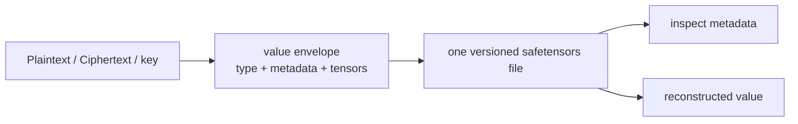
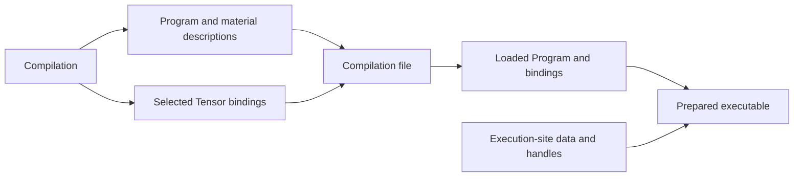
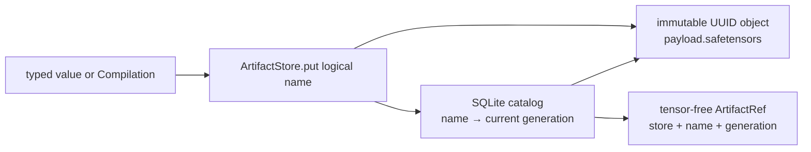
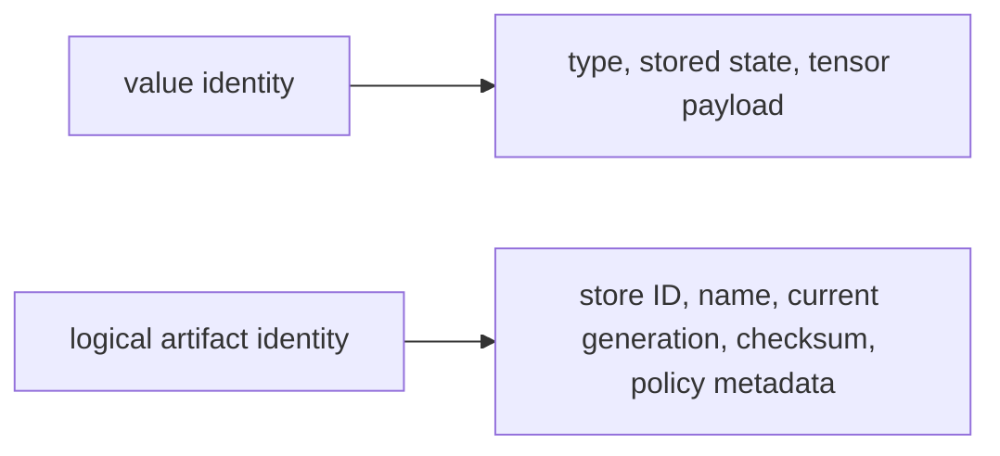

# Serialization and artifacts

Persistence records a value or computation so it can be reconstructed in another execution. FHElium stores typed values as metadata and Tensor payloads, and Compilations as a Program with optional numerical materials. Artifact repositories add logical names and generation identities to those stored objects.

## Direct value files

Top-level public functions are:

```python
import fhelium as fh

fh.save_value(value, path)
metadata = fh.inspect_value(path)
restored = fh.load_value(
    path,
    expected_type=type(value),
    device="cuda:0",
)
```

One versioned safetensors value file contains:

- concrete value type and schema version;
- non-tensor value metadata;
- named tensor payloads;
- enough information to reconstruct the typed value.

Applications preserve the `CkksConfig` association beside the file and select compatible parameters and keys after loading.



`ValueEnvelope` is the internal structural representation shared by signatures and serialization. Most users should prefer the public file functions.

## Inspection without full materialization

`inspect_value(...)` allows a caller to examine type, stored metadata, and payload description before allocating all tensors on a target device. This is useful for:

- admission and compatibility checks;
- debugging stale files or unexpected stored state;
- inventory tools;
- deciding whether a value may be installed into an engine.

Loading allocates the reconstructed value on the selected device. The stored arithmetic state determines how subsequent operations interpret its Tensor data.

## Programs and selected numerical materials

A Program records operation structure, value types, attributes, and symbolic references. A Compilation pairs it with a symbol-to-Tensor material dictionary and the workspace used during preparation. A material symbol identifies an operand slot in the Program; its optional description explains its purpose, and its binding supplies the current Tensor.

Compilation persistence stores the Program and descriptions together with none, some, or all of the bound numerical materials. A file can therefore contain a portable graph whose keys and tables will be supplied later, or a graph with selected weights and tables already present. Saving a subset leaves the remaining symbols unresolved. Loading restores the graph and selected bindings; the execution site supplies missing data and prepares the executable.



The Compilation storage format preserves sharing between saved Tensor views, including their strides and offsets. Reconstruction creates new storage on the selected device. Saving one typed value instead creates a snapshot of that value's payloads; it does not preserve aliases to other live values. Runtime workspaces, process groups, sampler objects, and executable caches are recreated at the execution site.

A loaded material dictionary can combine saved data with new bindings. Each symbol remains an independent assignment, even when two descriptions are identical. Linked calls retain the supplied Tensor objects: in-place data updates become visible to those calls, while replacing a dictionary entry takes effect after linking again. [Program representation](../neutral-ir-programs.md) and the [Compile lifecycle](../open-compiler-stack.md) explain these stages.

## Deployment-managed persistence policy

Direct serialization defines one value file. Deployment infrastructure supplies tenant or model namespaces, directory policy, remote object storage, encryption and KMS integration, cache admission/prefetch/eviction, and engine or process-group placement. These policies remain independent of the value format.

## `ArtifactStore` as a local repository

`ArtifactStore` is a local repository for named typed values and Compilations. A SQLite catalog owns each logical name's current generation and transactional metadata, while store-controlled immutable safetensors files hold the tensor payloads produced by the serialization layer.

A put operation publishes one stored object under a logical name and returns an `ArtifactRef`. A get operation resolves that name or reference and reconstructs the object. The returned object owns live data; the reference is a Tensor-free identity for the published generation.



The artifact repository adds local policy features such as:

- normalized logical names and collections;
- one current artifact generation per logical name;
- immutable artifact IDs and store identity;
- stale-reference rejection;
- catalog and payload-header cross-validation;
- payload checksums;
- transactional current-generation replacement;
- put, get, list, inspect, and delete operations;
- sensitivity metadata.

An `ArtifactRef` identifies the checked current generation without materializing large tensors. Overwriting the same name publishes a new generation and makes every older reference for that name stale. The store does not retain those references as loadable version history.

Publication writes the complete payload before committing the catalog entry. An interrupted write can leave an unreferenced object for recovery to remove; a published generation refers to a completed payload. Replacing a name commits its new generation before reclaiming the old object.

## Value identity versus logical identity

These are intentionally separate:



The same typed value format can therefore be used directly by a research script or through a namespaced artifact policy without changing `Ciphertext` or key types.

## Sensitive stored data

Value files store unencrypted data. Typed secret-key serialization requires `allow_secret=True`. A Compilation can include arbitrary Tensor materials, so the selected bindings must be checked for secret keys, plaintexts, and random-generator state. Restoring a saved stream state can repeat randomness. Storage encryption remains a deployment responsibility.

An artifact `sensitivity="secret"` label provides descriptive classification metadata. The payload SHA-256 detects accidental corruption. Production deployments supply authenticated integrity and:

- encrypted storage and transport;
- KMS/credential lifecycle;
- filesystem and service access-control lists (ACLs);
- audit logging;
- backup and deletion policy.

## Memory and lifetime after saving

Serialization leaves the original value and its placement unchanged. If a CUDA value remains referenced, its allocation remains live after a file is written. PyTorch's allocator may also keep freed memory reserved after live references disappear.

The relevant memory quantities are:

```text
live tensor bytes
PyTorch allocated bytes
PyTorch reserved bytes
physical free device memory
```

File operations return application-owned values. Managed residency transitions operate on manager handles and materializations.

## Persistence and lifetime mechanisms

| Property | Mechanism |
| --- | --- |
| Save/load one known path | `save_value` / `load_value` |
| Inspect value metadata before loading | `inspect_value` |
| Save/load a Program with selected Tensor bindings | `save_compilation` / `load_compilation` |
| Local logical names, checked generations, collections, checksums | `ArtifactStore` |
| Local pageable/pinned/CUDA materializations, lifetimes, and optional admission budgets | `ResidencyManager` |

## Related concepts

- [Residency lifetimes](residency-lifetimes.md)
- [Ownership and runtime responsibilities](../architecture/ownership-and-responsibilities.md)
