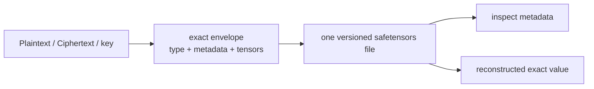
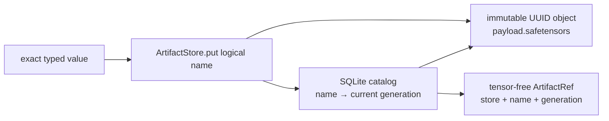
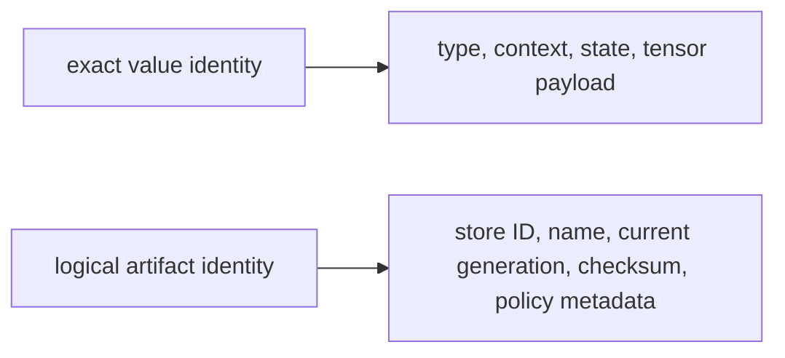

# Serialization and artifacts

FHElium separates **exact value persistence** from **storage-path and namespace
policy**. The core file format answers "what exact value is this?"; optional
artifact tooling answers "where and under which logical name should it live?"

## Direct exact-value files

Top-level public functions are:

```python
import fhelium as fh

fh.save_value(value, path)
metadata = fh.inspect_value(path)
restored = fh.load_value(
    path,
    expected_type=type(value),
    expected_context_id=value.context_id,
    device="cuda:0",
)
```

Consult the [Serialization API reference](../../api/fhelium/serialization/value.md) for the
current optional arguments. The file-format guarantee is that one versioned
safetensors file contains:

- concrete value type and schema version;
- exact non-tensor metadata;
- context identity;
- named tensor payloads;
- enough information to reconstruct the exact typed value.



`ValueEnvelope` is the internal structural representation shared by signatures and
serialization. Most users should prefer the public file functions.

## Inspection without full materialization

`inspect_value(...)` allows a caller to examine type, context, metadata, and
payload description before allocating all tensors on a target device. This is
useful for:

- admission and compatibility checks;
- debugging stale or wrong-context files;
- inventory tools;
- deciding whether a value may be installed into an engine.

Loading defaults and device behavior are defined by the current API; do not
assume a saved CUDA value will silently return to its previous GPU.

## Deployment-managed persistence policy

Direct serialization defines one exact-value file. Deployment infrastructure
supplies tenant or model namespaces, directory policy, remote object storage,
encryption and KMS integration, cache admission/prefetch/eviction, and engine
or process-group placement. These policies remain independent of the exact
value format.

## `ArtifactStore` as a local repository

`ArtifactStore` is a local repository for named exact-value
artifacts. A SQLite catalog owns each logical name's current generation and
transactional metadata, while store-controlled immutable safetensors files
hold the tensor payloads produced by the serialization layer.

For the `put`/`get` programming model, the distinction between a live value
and an `ArtifactRef`, per-type persisted state, and complete lifecycle rules,
see [Values, memory, and persistence](../../tutorial/value-memory-and-persistence.md).



The artifact repository adds local policy features such as:

- normalized logical names and collections;
- one current artifact generation per logical name;
- immutable artifact IDs and store identity;
- stale-reference rejection;
- catalog and payload-header cross-validation;
- payload checksums;
- transactional current-generation replacement;
- put, get, list, inspect, and delete operations;
- sensitivity metadata.

An `ArtifactRef` identifies the checked current generation without
materializing large tensors. Overwriting the same name publishes a new
generation and makes every older reference for that name stale. The store does
not retain those references as loadable version history.

Transaction ordering, the SQLite v1 schema, crash recovery, filesystem
requirements, and contributor-facing invariants are specified separately in
[ArtifactStore v1 internals](../../developer/artifact-store-v1.md). Those
mechanisms implement repository durability; they are not part of an exact
`Plaintext`, `Ciphertext`, or key's mathematical identity.

## Exact value versus logical identity

These are intentionally separate:



The same typed value format can therefore be used directly by a research
script or through a namespaced artifact policy without changing `Ciphertext`
or key types.

## Supported security scope

Secret-key serialization requires explicit authorization (`allow_secret=True`
in the current file API). That flag authorizes writing; it does not encrypt the
payload.

Likewise, an artifact `sensitivity="secret"` label is descriptive metadata, not
an access-control or cryptographic mechanism. The payload SHA-256 detects
accidental corruption; it is not an authenticated digest against a writer that
can alter both the catalog and payload. Production deployments remain
responsible for:

- encrypted storage and transport;
- KMS/credential lifecycle;
- filesystem and service access-control lists (ACLs);
- audit logging;
- backup and deletion policy.

## Memory and lifetime after saving

Serialization does not automatically offload or destroy the original value.
If a CUDA value remains referenced, its allocation remains live after a file is
written. PyTorch's allocator may also keep freed memory reserved after live
references disappear.

Distinguish:

```text
live tensor bytes
PyTorch allocated bytes
PyTorch reserved bytes
physical free device memory
```

File operations return application-owned exact values. Managed residency
transitions operate on manager handles and materializations.

## When to use which layer

| Need | Use |
| --- | --- |
| Save/load one exact known path | `save_value` / `load_value` |
| Inspect exact metadata before loading | `inspect_value` |
| Local logical names, checked generations, collections, checksums | `ArtifactStore` |
| Local pageable/pinned/CUDA materializations, lifetimes, and optional admission budgets | `ResidencyManager` |

## Continue

- [Value memory and persistence tutorial](../../tutorial/value-memory-and-persistence.md)
- [Manage exact artifacts by logical name](../../how-to/manage-exact-artifacts.md)
- [Residency lifetimes](residency-lifetimes.md)
- [Ownership and runtime responsibilities](../architecture/ownership-and-responsibilities.md)
- [Serialization API](../../api/fhelium/serialization/value.md)
- [Artifact store API](../../api/fhelium/artifacts/store.md)
- [Artifact reference API](../../api/fhelium/artifacts/artifact.md)
