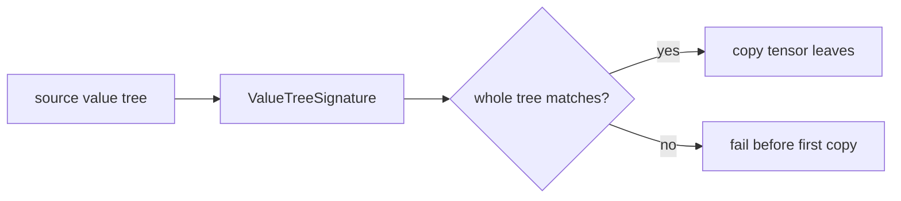
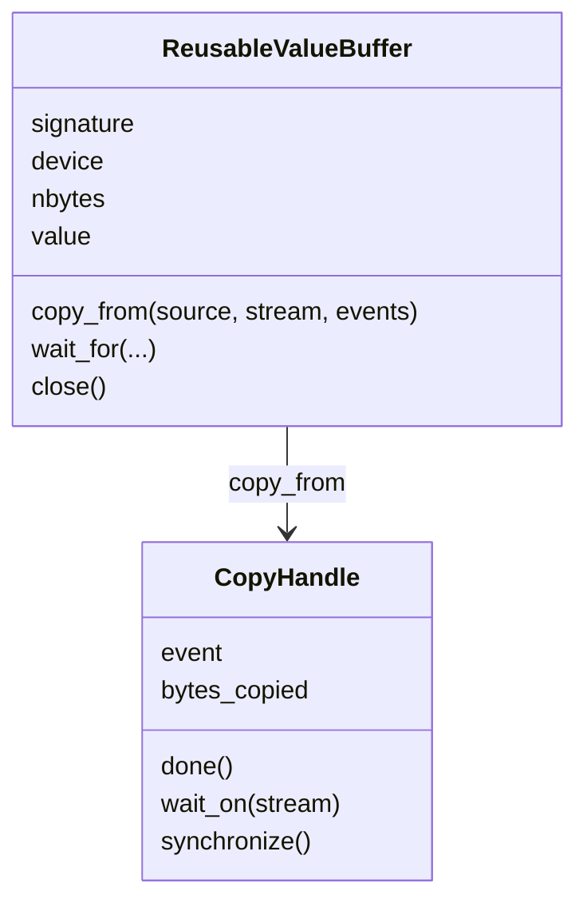
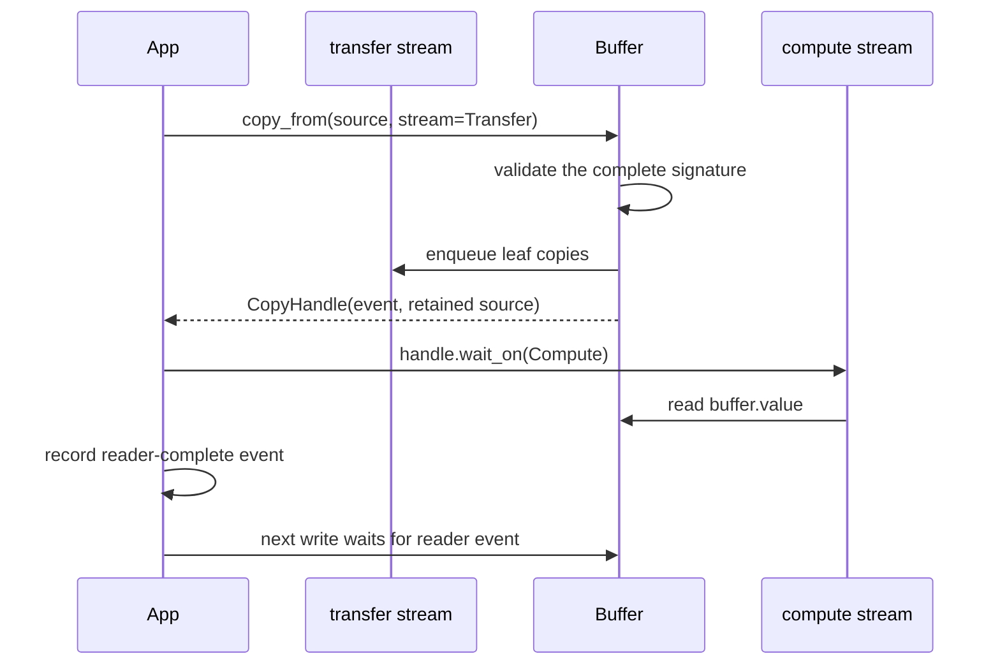
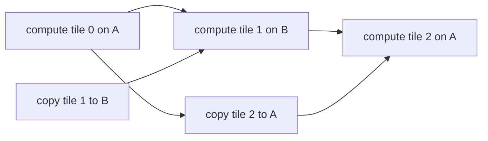

# Value signatures and reusable buffers

Repeated execution needs a compatibility test stricter than "same shape" and
more flexible than "same device". FHElium uses device-independent value signatures
to decide whether a value tree may be copied into reusable fixed storage.

## Copy compatibility

`ValueTreeSignature` supports tensors, FHElium values, and nested
`list`/`tuple`/`dict` structures. It records:

- Python container structure and dictionary keys;
- tensor shape, stride, dtype, layout, and `requires_grad`;
- concrete FHElium value type and schema version;
- context, level, scale, prime IDs, polynomial domain, modulus basis, and residue representation;
- key specialization such as a rotation step.

Device is deliberately excluded. A CPU value and a CUDA value can share an
value signature while the target buffer owns the residency decision. An
external ciphertext/key relation is also excluded when no concrete value field
stores it; the application must validate that relation separately.



Validation completes for the entire tree before any leaf is copied. A mismatch
therefore cannot leave half of a reusable input tree updated and half stale.

## `ReusableValueBuffer`

A reusable buffer owns:

```text
one tree structure
+ one target device
+ stable tensor storage addresses
+ copy ordering
```

It can be created from a representative value tree and reused for eager
streaming or CUDA Graph input staging.



The buffer's `.value` object owns the stable target tensors. The source object
may be on CPU, pinned host memory, or another compatible device, subject to
PyTorch copy semantics.

## Copy ordering and source lifetime



`CopyHandle` retains source storage until the enqueued copy has completed. It
also provides two different kinds of waiting:

- `wait_on(stream)` inserts a device-side dependency without blocking the CPU;
- `synchronize()` blocks the host and should be reserved for code that truly
  requires host-visible completion.

## The writer cannot infer arbitrary readers

A buffer can serialize its own writes, but it cannot know when an arbitrary
consumer kernel has finished reading the previous contents. The application
must record reader completion and pass the relevant event before overwriting
the buffer.

This is the central lifetime rule:

> Stable address does not imply exclusive or completed use.

## Double-buffered streaming

Two fixed CUDA buffers can stream a large set of operation-ready weights:



The CUDA footprint becomes proportional to the active window rather than all
weights:

$$
O(\text{all tiles}) \rightarrow O(2\times\text{tile size}).
$$

The trade-off is host-to-device (H2D) bandwidth, event coordination, and possible loss of
compute/transfer overlap when sources are not pinned or the workload is too
small.

## Buffer requirements and synchronization

A `ReusableValueBuffer` owns fixed destination storage for one value
signature. The application supplies the tile sequence and copy/consumer
streams. `CopyHandle` and consumer-complete events order writes against readers,
while signature validation protects CKKS state compatibility. Size the active
window from measured tile storage, allocator usage, and operation peaks.

## Common failures

- Comparing only shape and dtype while level or prime IDs differ.
- Expecting pageable CPU memory to provide fully asynchronous H2D overlap.
- Overwriting a buffer before the previous reader finishes.
- Reusing a buffer for a different rotation-key step.
- Closing a buffer while a copy or consumer still references its storage.

## Continue

- [Reusable value buffer tutorial](../../tutorial/reusable-value-buffer.md)
- [CUDA Graph execution model](cuda-graph-model.md)
- [Residency lifetimes](residency-lifetimes.md)
