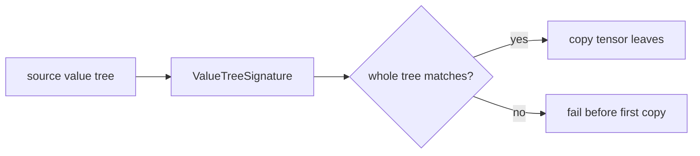
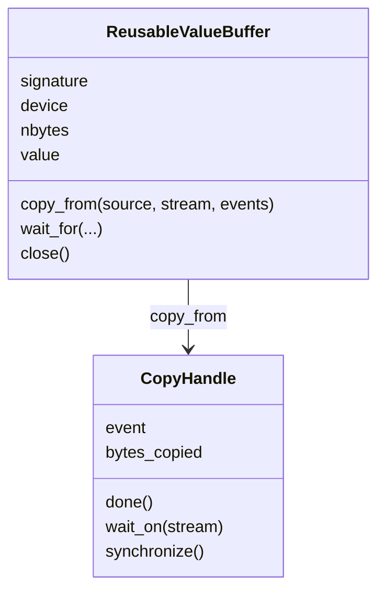
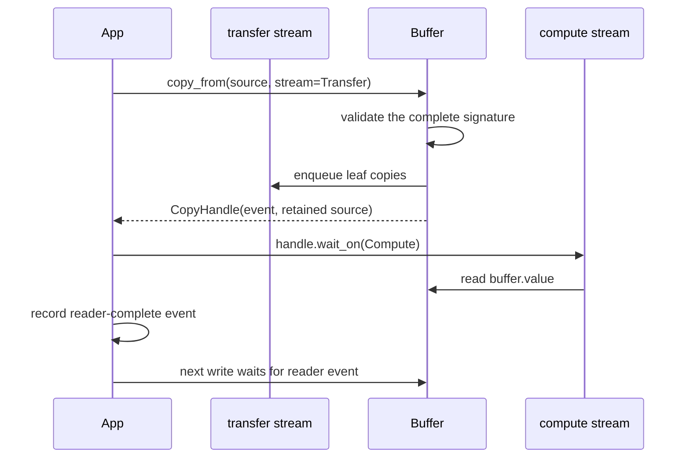
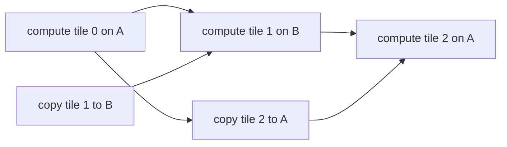

# Value signatures and reusable buffers

Repeated execution copies new values into retained storage. A device-independent value signature defines the structure and arithmetic metadata that must match for that copy to preserve the meaning of the destination value.

## Copy compatibility

`ValueTreeSignature` supports tensors, FHElium values, and nested `list`/`tuple`/`dict` structures. It records:

- Python container structure and dictionary keys;
- tensor shape, stride, dtype, layout, and `requires_grad`;
- concrete FHElium value type and schema version;
- depth, scale, prime IDs, polynomial domain, modulus basis, and residue representation;
- key specialization such as a rotation step.

Device is deliberately excluded. A CPU value and a CUDA value can share a value signature while the target buffer owns the residency decision. An external ciphertext/key relation is also excluded when no concrete value field stores it; the application must validate that relation separately. CKKS parameter provenance is likewise excluded.



Validation completes for the entire tree before any leaf is copied. A mismatch therefore cannot leave half of a reusable input tree updated and half stale.

## Buffer compatibility and callable specialization

A buffer signature describes the value tree that fits one fixed allocation. A callable specialization describes the input conditions under which a transformed Program and its prepared implementations can be reused. These conditions can include device placement and static scalar arguments as well as Tensor metadata. A CPU source may be copied into an existing CUDA buffer when its buffer signature matches; a compiled callable receiving that CPU value directly may require a different specialization.

Both mechanisms keep numerical contents separate from structural compatibility. Replacing input data can reuse a buffer or a specialization when the corresponding conditions remain satisfied. [The Compile lifecycle](../open-compiler-stack.md) describes how specialization prepares and retains executable calls.

## `ReusableValueBuffer`

A reusable buffer owns:

```text
one tree structure
+ one target device
+ stable tensor storage addresses
+ copy ordering
```

It can be created from a representative value tree and reused for eager streaming or CUDA Graph input staging.



The buffer's `.value` object owns the stable target tensors. The source object may be on CPU, pinned host memory, or another compatible device, subject to PyTorch copy semantics.

## Copy ordering and source lifetime



`CopyHandle` retains source storage until the enqueued copy has completed. It also provides two different kinds of waiting:

- `wait_on(stream)` inserts a device-side dependency without blocking the CPU;
- `synchronize()` blocks the host and should be reserved for code that truly requires host-visible completion.

## The writer cannot infer arbitrary readers

A buffer can serialize its own writes, but it cannot know when an arbitrary consumer kernel has finished reading the previous contents. The application must record reader completion and pass the relevant event before overwriting the buffer.

This is the central lifetime rule:

> Stable address does not imply exclusive or completed use.

## Double-buffered streaming

Two fixed CUDA buffers can stream a large set of operation-ready weights:



The CUDA footprint becomes proportional to the active window rather than all weights:

$$
O(\text{all tiles}) \rightarrow O(2\times\text{tile size}).
$$

The trade-off is host-to-device (H2D) bandwidth, event coordination, and possible loss of compute/transfer overlap when sources are not pinned or the workload is too small.

## Buffer requirements and synchronization

A `ReusableValueBuffer` owns fixed destination storage for one value signature. The application supplies the tile sequence and copy/consumer streams. `CopyHandle` and consumer-complete events order writes against readers, while signature validation protects CKKS state compatibility. Size the active window from measured tile storage, allocator usage, and operation peaks.

## Compatibility and lifetime invariants

Copy compatibility includes depth, prime IDs, scale, and key specialization as well as Tensor structure. Asynchronous transfer requires suitable source storage and retained source lifetime. Buffer reuse requires preceding consumers to finish before overwrite, and closing the owner requires all uses of its storage to have completed. These conditions jointly define safe reuse of one fixed allocation.

## Related concepts

- [CUDA Graph execution model](cuda-graph-model.md)
- [Residency lifetimes](residency-lifetimes.md)
