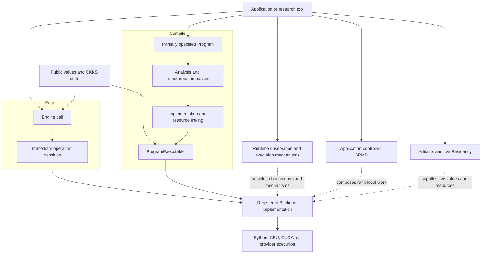

# Concepts

Concepts explain the mental models that remain useful across APIs and
implementations. FHElium's foundation consists of two use models,
shared CKKS value and operation semantics, and a Backend execution interface.
Eager evaluates one requested operation at a time. Compile represents and
transforms a Program before linking it for execution.

## Core model



Eager and Compile differ in when CKKS state and scheduling decisions are made.
They converge on registered implementations that consume Tensor payloads and
concrete arithmetic resources. Runtime, distributed execution, persistence,
and Residency compose with these paths without becoming hidden properties of a
ciphertext or Program.

## Choose a starting point

<DocGrid>
  <DocCard
    title="Understand the architecture"
    description="See how values, Eager, Compile, Backend implementations, runtime mechanisms, and native execution form one stack."
    href="/concepts/architecture/system-overview"
  />
  <DocCard
    title="Reason about CKKS values"
    description="Start from value identity, represented state, operation transitions, and the scale-level lifecycle."
    href="/concepts/ckks/value-model-and-identity"
  />
  <DocCard
    title="Understand a Program"
    description="Learn how mixed-level SSA, partial CKKS state, symbolic references, and structural validity coexist in one neutral representation."
    href="/concepts/neutral-ir-programs"
  />
  <DocCard
    title="Compose a Compile pipeline"
    description="Understand caller-selected capture, transformation, lowering, implementation assignment, linking, and runtime specialization."
    href="/concepts/open-compiler-stack"
  />
  <DocCard
    title="Trace system ownership"
    description="Understand process-local ownership, placement, policy, and lifetime responsibilities."
    href="/concepts/architecture/ownership-and-responsibilities"
  />
  <DocCard
    title="Use multiple GPUs"
    description="Understand rank-local values, application-owned partitioning, and collective ordering before choosing a communication schedule."
    href="/concepts/distributed/spmd-model"
  />
  <DocCard
    title="Repeat execution within bounded memory"
    description="Connect value signatures, reusable buffers, CUDA Graph execution, and Residency lifetimes."
    href="/concepts/execution/signatures-and-buffers"
  />
  <DocCard
    title="Optimize a workload"
    description="Establish the CKKS cost model before selecting lowering, implementation, batching, communication, or scheduling choices."
    href="/concepts/performance/cost-model"
  />
  <DocCard
    title="Use terminology and notation"
    description="Look up FHElium terms, value-state coordinates, tensor layouts, arithmetic laws, and distinctions among execution layers."
    href="/concepts/terminology-and-mathematical-model"
  />
</DocGrid>

## Concept families

| Family | Questions answered |
| --- | --- |
| [Architecture](architecture/system-overview.md) | How do Eager, Compile, shared operation semantics, Backend implementations, runtime mechanisms, and native execution fit together? |
| [CKKS semantics](ckks/value-model-and-identity.md) | What mathematical and representational state does a value carry, and how does each operation change it? |
| [Program representation](neutral-ir-programs.md) | What can a partially specified, mixed-level Program represent before it is executable? |
| [Compile pipelines](open-compiler-stack.md) | How do source capture, caller-composed passes, Backend linking, and runtime specialization remain separable? |
| [Distributed execution](distributed/spmd-model.md) | How do rank-local values and collective order define a multi-process computation? |
| [Execution and lifecycle](execution/signatures-and-buffers.md) | How are repeated execution, buffers, CUDA Graphs, persistence, and live-value retention modeled? |
| [Performance](performance/cost-model.md) | Which arithmetic, memory, launch, and communication costs determine a useful optimization? |
| [Advanced CKKS mechanisms](ckks/composable-bootstrapping.md) | How are bootstrapping components and other research mechanisms composed without redefining the core execution model? |
| [Terminology and mathematical model](terminology-and-mathematical-model.md) | What do specialized terms, symbols, layouts, and cross-layer identities mean? |

## Suggested reading sequences

For immediate evaluator work:

```text
Architecture
→ Value model and identity
→ Evaluator operation transitions
→ Scale and level lifecycle
→ Key lifecycle
```

For Program transformation and execution:

```text
Architecture
→ Neutral IR programs
→ Open compiler stack
→ State transitions and orthogonality
→ System ownership
```

For runtime and multi-device work:

```text
Architecture
→ Rank-local SPMD
→ Communication semantics
→ Signatures and buffers
→ Residency lifetimes
```
