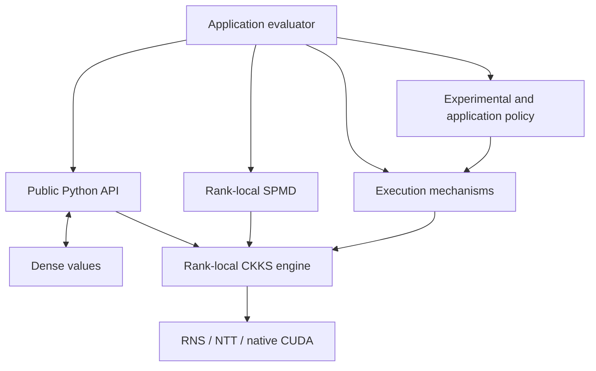

# Concepts

Concepts explain **why FHElium is structured as it is**. They describe stable
mental models, invariants, ownership rules, and mathematical semantics.

## Choose a reading path

<DocGrid>
  <DocCard
    title="Write a correct evaluator"
    description="Start with the programming model, value identity, primitive state transitions, and the scale-level lifecycle."
    href="/concepts/programming-model"
  />
  <DocCard
    title="Use multiple GPUs"
    description="Understand the rank-local SPMD model before choosing communication semantics."
    href="/concepts/distributed/spmd-model"
  />
  <DocCard
    title="Repeat execution within bounded memory"
    description="Connect value signatures, CUDA Graph execution, and residency lifetimes."
    href="/concepts/execution/signatures-and-buffers"
  />
  <DocCard
    title="Optimize a workload"
    description="Establish the CKKS cost model before selecting an optimization mechanism."
    href="/concepts/performance/cost-model"
  />
  <DocCard
    title="Compose CKKS bootstrapping"
    description="Combine replaceable mathematical components in an engine-bound callable."
    href="/concepts/ckks/composable-bootstrapping"
  />
  <DocCard
    title="Use JIT programs"
    description="Relate one mixed-dialect Program to structural validity, selected passes, retained runtime capabilities, and readiness."
    href="/concepts/unified-jit-programs"
  />
  <DocCard
    title="Modify the native operator stack"
    description="Trace ownership responsibilities and state transitions before entering the engine and native stack."
    href="/concepts/architecture/system-overview"
  />
</DocGrid>

## The conceptual map

The main conceptual families are:

| Family | Scope |
| --- | --- |
| [Architecture](architecture/system-overview.md) | Responsibility ownership across system layers |
| [CKKS semantics](ckks/value-model-and-identity.md) | Context, value identity, primitive transitions, scale-level laws, and evaluator state effects |
| [Distributed execution](distributed/spmd-model.md) | Mathematical relationships among rank-local values |
| [Execution and lifecycle](execution/signatures-and-buffers.md) | Value staging, repetition, persistence, and retention |
| Features | Composable CKKS bootstrapping and JIT program construction, transformation, and execution |
| [Performance](performance/cost-model.md) | Operation costs and optimization effects |
| [Glossary](glossary.md) | Definitions of FHElium terminology |
