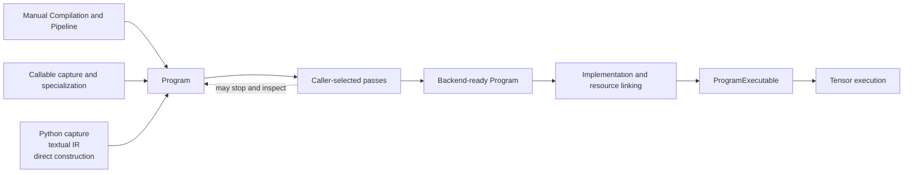
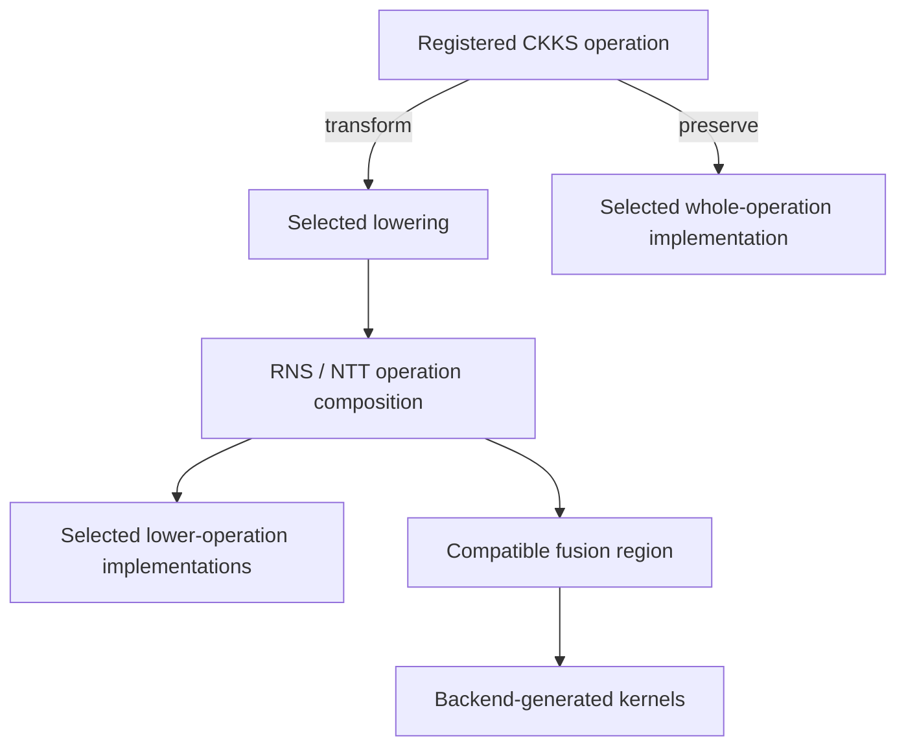

# Open compiler stack

Compile represents a computation as a `Program`, applies caller-selected analyses and transformations, and links the resulting operations to concrete Backend implementations and resources. Eager applies one operation's state transition and executes it immediately; Compile can defer those decisions until the Program exposes enough information to make them.

The **open** stack accepts Programs at several abstraction levels and lets the caller compose their transformation sequence. A caller may construct or import a Program, select applicable passes, inspect every intermediate result, and choose whether an operation is preserved or lowered before execution.

## The Compile lifecycle

These are separate transitions:

1. **Construction** produces a structurally valid Program.
2. **Transformation** analyzes or rewrites the represented computation.
3. **Implementation assignment** selects how remaining operations should run.
4. **Linking** resolves selected implementation calls, Tensor materials, and non-Tensor execution handles.
5. **Execution** invokes prepared host control flow over runtime Tensor values.

Each transition has its own preconditions. A Program may support analysis or interchange before the available Backend can execute it.

## One Program can contain several abstraction levels

`fhelium.ir.Program` owns an xDSL module whose operations may describe:

- source-role-aware semantic arithmetic;
- logical encrypted and public computation;
- CKKS evaluator operations;
- lower-level RNS and NTT composition;
- Torch operations;
- structured control flow;
- FHElium or caller-defined extensions.

A Program may contain several lowering levels. A pass can transform the operation patterns it recognizes and preserve the rest. An unknown extension can survive parsing, printing, cloning, and unrelated transformations, but preservation grants neither mathematical meaning nor execution authority.

This mixed-level representation matters because CKKS decisions require different information at different times. Source capture knows value roles and static arguments. CKKS scheduling needs scale, depth, key, and representation facts. Implementation selection may depend on available resources or a target. A single mandatory lowering order would force those decisions before their inputs are available.

## Partial state is a representation capability

Program value types can leave CKKS facts unknown, including depth, scale, prime identities, polynomial domain, modulus basis, residue representation, and ciphertext component count. Unknown state records a decision that remains open; a selected pass must make it concrete before an execution boundary requires it.

A selected pass may assign, propagate, or transform state when its assumptions are satisfied. A later pass can report missing required facts and leave the Program unchanged. A public CKKS output requires concrete reconstruction state when its output adapter first executes. Output adapters are created after the first numerical invocation, so missing result state can be reported at that point.

Compiler state serves analysis, transformation, and scheduling. Backend implementations receive Tensor payloads plus the concrete parameters, tables, keys, and index resources selected from that state.

## Program, Compilation, and workspace have different roles

| Object | Responsibility |
| --- | --- |
| `Program` | Serializable operation, region, SSA, type, attribute, and symbolic-reference structure |
| `Compilation` | Keep one Program, one `CompileWorkspace`, one material-binding dictionary, and ordered pass reports together |
| `CompileWorkspace` | Carry caller- and pass-owned Python objects alongside Program text |
| `Compilation.material_bindings` | Map Program material symbols to live Tensors |
| Pass report | Record what one pass matched, changed, rejected, or decided |

The workspace is an ordinary extensible mapping whose entry owners define each key and value contract. Its entries can include configuration, capture metadata, analyses, or caller-defined data. Captured Tensor constants are retained in `Compilation.material_bindings`. Program text remains independent of those live Python objects. Saving a Program serializes its IR structure while the compile request and runtime environment retain their own lifecycles.

## Pipelines are caller compositions

A `Pipeline` is an ordered tuple of passes. `Pipeline.run(compilation)` clones the input Program once, calls each `Pass.run(current_compilation)`, structurally verifies every returned Program, and appends pass reports. The workspace and material-binding dictionary remain shared across that Pipeline invocation. Independent assignments can use copied mappings while retaining the live Tensor storage.

FHElium supplies a pass catalog for caller-composed pipelines. Callers can choose where to:

- lower source semantics to logical operations;
- introduce CKKS representation;
- place NTT transitions, relinearization, rescale, or rotation hoisting;
- assign depths and per-value actual scales;
- lower selected CKKS operations to RNS/NTT composition;
- preserve selected operations for whole-operation implementations;
- assign named implementations;
- stop for inspection, interchange, or external transformation.

A pass that finds no applicable pattern may return an unchanged Program with a report. Pipeline completion records that the selected passes ran. Numerical correctness, key sufficiency, implementation coverage, and execution readiness have their own checks.

## Operation meaning, lowering, and implementation are independent

Three identities must remain separate:

1. **Operation semantics** state what an operation means and what effects it has. Registered semantics belong to the IR operation specification.
2. **Lowering** replaces an operation with a composition of other operations that preserves the intended meaning under stated assumptions.
3. **Implementation selection** chooses executable code for an operation that remains in the Program.

For example, a CKKS operation can be lowered to registered RNS and NTT operations, or it can remain a CKKS operation and select a registered whole-operation implementation. A fused implementation preserves the operation's mathematical identity while changing its execution strategy. Registered operation specifications define semantics; selected passes define the lowering route.

## Materials and operation preparation

Numerical materials are Tensor operands identified by Program symbols: keys, RNS parameters, NTT tables, codec tables, and mutable rounding state. A Compilation retains one dictionary of their live bindings. A non-Tensor execution handle, such as a process group or encryption sampler, is supplied through Backend resource bindings.

Preparation connects these inputs to the represented computation:

1. Selected implementations or lowerings declare missing numerical operands and their material descriptions.
2. Optional preparation fills absent bindings from caller-supplied numerical providers and keys.
3. Placeholder resolution records available physical facts such as shape, stride, dtype, and device.
4. Per-operation selection chooses compatible whole implementations, exposed lowerings, or generated fusion regions under existing assignments.
5. Linking resolves the resulting numerical references and non-Tensor handles.

Existing bindings retain their assignments. Key preparation selects supplied data; an absent evaluation key stays unresolved. Known facts inform local implementation choices, and partially specified operations can remain available for later preparation.

## Linking and prepared execution

`OperationBackend` owns an implementation registry and an immutable `BackendWorkspace` containing named non-Tensor handles and an optional handle materializer. `OperationBackend.link` invokes Compile-owned linking passes using fresh workspace and material-binding mappings. The passes resolve Tensor facts and implementation calls, initialize and optionally materialize execution handles, resolve material references, prelink resource indices, and construct a `ProgramExecutable`.

The executable retains a prepared host function whose local variables express the Program's dataflow and whose calls target the selected implementations. Supported structured regions become host control flow or prepared region callables. Public input adapters unwrap value payloads before numerical execution; output adapters reconstruct declared CKKS results afterward. Flat-block intermediates are released at their last use, with Tensor storage managed through ordinary PyTorch ownership.

Bound materials remain live Tensor objects. Compatible in-place content updates are visible to execution. Replacing a material dictionary entry requires another link to bind the new object. Applications can link a transformed Compilation with different supplied bindings and non-Tensor resources while retaining its represented computation.

## Eager execution and callable Compile

Eager and Compile share operation semantics and registered Tensor implementations. Their state-management and execution workflows have distinct owners:

| Concern | Eager | Compile |
| --- | --- | --- |
| Representation | One immediate operation call | A Program with SSA values and operations |
| CKKS transition | Applied by the called `Engine` method | Represented and transformed by selected passes |
| Implementation preparation | Device-local direct resolution and caching | Program operation resolution and execution linking |
| Execution | Invoke one registered implementation | Invoke a linked `ProgramExecutable` |

Manual Program/Compilation/Pipeline execution and callable specialization are equally supported ways to use Compile. Manual execution exposes the individual transformation and linking stages. `fhelium.compile.compile` manages reusable callable specializations over those same stages, accepting a Python function, Program, or Compilation. Function capture represents supported ordinary Tensor expressions and Engine-call compositions together; supplied Programs and Compilations enter directly.

Both routes can use the editable `default_lower_and_fuse_pipeline`. It resolves available facts, lowers semantic and logical arithmetic, prepares operands, selects local execution, reuses compatible intermediates, and constructs supported fusion regions. The baseline preserves caller-inserted state transitions and leaves rescale and relinearization scheduling to the caller's chosen passes. A supplied callable pipeline replaces the default recipe.

A specialization records input metadata and static scalar conditions, its transformed Compilation, and its linked executable. `prepare` establishes a specialization before invocation. The default miss policy permits preparation for new conditions; `on_miss="error"` requires the matching preparation to exist. `with_backend` relinks existing transformed variants to another Backend, while future variants are prepared independently.

Compile constructs fusion regions, and the selected Backend generates their numerical execution. A region may contain one pointwise kernel or several synchronized transform stages. Host preparation can complete before first-use device compilation; execute the prepared workload before measuring warmed execution or recording its CUDA Graph. Callable specialization, generated device code, and CUDA Graph capture therefore have distinct preparation lifetimes.

## Four different validity questions

An open stack must keep its checks distinct:

| Question | What it establishes |
| --- | --- |
| Structural validity | Registered IR constraints, region/block structure, and SSA relationships are well formed |
| Semantic knowledge | Operations have known meaning and effects for the selected consumer |
| Mathematical readiness | CKKS state, keys, approximations, and scheduling assumptions satisfy the intended computation |
| Execution readiness | Every operation, material, and resource required by the selected Backend can be linked |

Apply these checks independently. Permissive parsing allows unknown operations to remain valid data; execution additionally requires defined operation semantics and complete implementation coverage.

## Composition with runtime, distributed, and storage systems

Compile exchanges Programs, symbolic references, observations, and built callables with other FHElium systems while each system retains its lifecycle:

- `fhelium.runtime` supplies CPU/CUDA topology, point-in-time memory observations, reusable buffers, and CUDA Graph mechanisms. Callers can feed those observations into transformation or implementation policy and wrap a suitable linked callable for repeated execution.
- Residency manages live materializations, accounting, leases, and admission. Program resource symbols can be resolved from caller-selected resident objects during linking.
- Distributed applications create processes, partition values, and order collectives. Each rank can transform or execute a local Program containing registered collective operations.
- `Program.save` and `Program.load` exchange textual IR. Compilation serialization stores Program text with no, all, or selected Tensor bindings, and `ArtifactStore` manages named generations of values or Compilations. Loading restores saved data; the execution site supplies its configuration, handles, and executable preparation.

Adapters can connect these owners at Program construction, pass, linking, or callable-execution time without combining their state models.

## Related concepts

- [Architecture](architecture/system-overview.md) places Eager and Compile in the shared execution stack.
- [Neutral IR programs](neutral-ir-programs.md) defines Program structure, partial state, and symbolic references.
- [Ownership and runtime responsibilities](architecture/ownership-and-responsibilities.md) assigns execution and storage lifetimes.
- [State transitions and orthogonality](ckks/state-transitions-and-orthogonality.md) separates mathematical state from execution choices.
- [Signatures and buffers](execution/signatures-and-buffers.md) explains reusable input storage and execution interfaces.
- [Serialization and artifacts](execution/serialization-and-artifacts.md) explains persistent Program and value representations.
