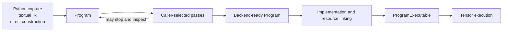
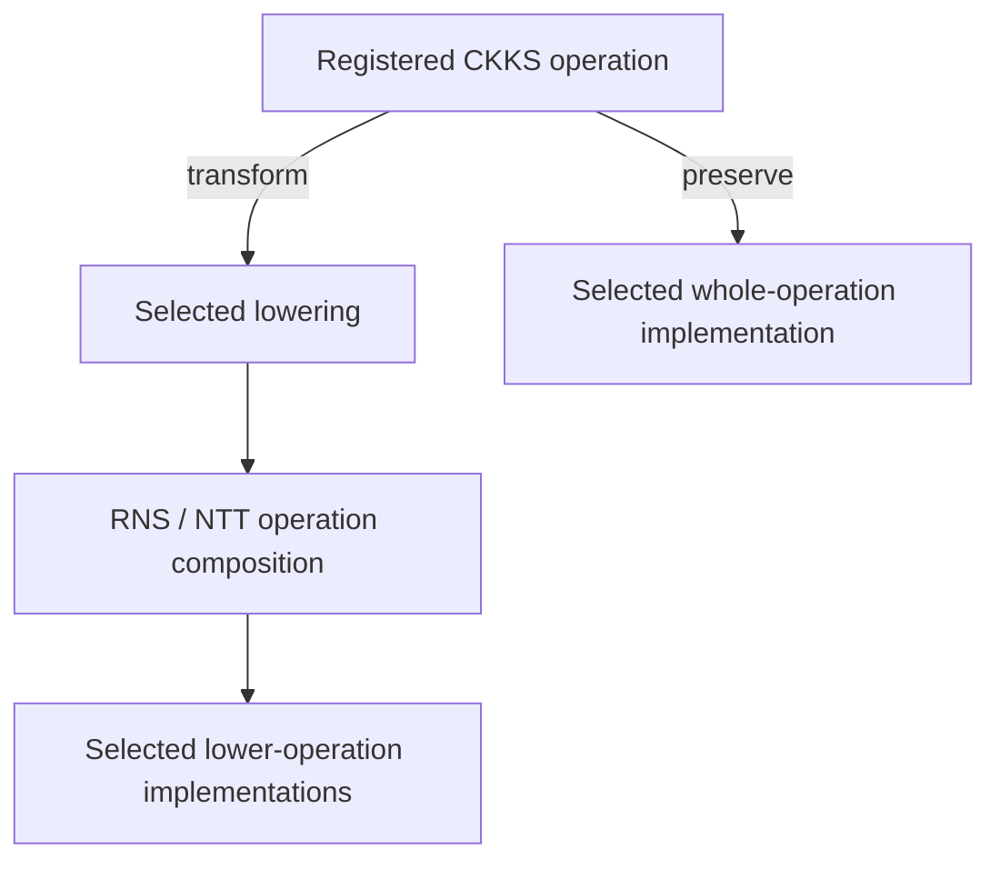

# Open compiler stack

Compile represents a computation as a `Program`, applies caller-selected analyses and
transformations, and links the resulting operations to concrete Backend
implementations and resources. Eager applies one operation's state transition
and executes it immediately; Compile can defer those decisions until the
Program exposes enough information to make them.

The **open** stack accepts Programs at several abstraction levels and lets the
caller compose their transformation sequence. A caller may construct or import
a Program, select applicable passes, inspect every intermediate result, and
choose whether an operation is preserved or lowered before execution.

## The Compile lifecycle

These are separate transitions:

1. **Construction** produces a structurally valid Program.
2. **Transformation** analyzes or rewrites the represented computation.
3. **Implementation assignment** selects how remaining operations should run.
4. **Linking** binds live materials, keys, and arithmetic resources.
5. **Execution** evaluates the linked SSA Program on runtime values.

Each transition has its own preconditions. A Program may support analysis or
interchange before the available Backend can execute it.

## One Program can contain several abstraction levels

`fhelium.ir.Program` owns an xDSL module whose operations may describe:

- source-role-aware semantic arithmetic;
- logical encrypted and public computation;
- CKKS evaluator operations;
- lower-level RNS and NTT composition;
- Torch operations;
- structured control flow;
- FHElium or caller-defined extensions.

A Program may contain several lowering levels. A pass can transform the
operation patterns it recognizes and preserve the rest. An unknown extension
can survive parsing, printing, cloning, and unrelated transformations, but
preservation grants neither mathematical meaning nor execution authority.

This mixed-level representation matters because CKKS decisions require
different information at different times. Source capture knows value roles and
static arguments. CKKS scheduling needs scale, depth, key, and representation facts.
Implementation selection may depend on available resources or a target. A
single mandatory lowering order would force those decisions before their inputs
are available.

## Partial state is a representation capability

Program value types can leave CKKS facts unknown, including depth, scale, prime
identities, polynomial domain, modulus basis, residue representation, and
ciphertext component count. Unknown state records a decision that remains open;
a selected pass must make it concrete before an execution boundary requires it.

A selected pass may assign, propagate, or transform state when its assumptions
are satisfied. A later pass can report missing required facts and leave the
Program unchanged. Linking a public CKKS result requires the concrete state
needed to reconstruct its `Ciphertext` or `Plaintext` value.

Compiler state serves analysis, transformation, and scheduling. Backend
implementations receive Tensor payloads plus the concrete parameters, tables,
keys, and index resources selected from that state.

## Program, Compilation, and workspace have different roles

| Object | Responsibility |
| --- | --- |
| `Program` | Serializable operation, region, SSA, type, attribute, and symbolic-reference structure |
| `Compilation` | Keep one Program, one `CompileWorkspace`, and ordered pass reports together |
| `CompileWorkspace` | Carry caller- and pass-owned Python objects alongside Program text |
| `ConstantBundle` | Hold captured immutable Tensor constants referenced by symbolic material names |
| Pass report | Record what one pass matched, changed, rejected, or decided |

The workspace is an ordinary extensible mapping whose entry owners define each
key and value contract. Its entries can include configuration, captured
constants, analyses, or caller-defined data. Program text remains independent of those live Python
objects. Saving a Program serializes its IR structure while the compile request
and runtime environment retain their own lifecycles.

## Pipelines are caller compositions

A `Pipeline` is an ordered tuple of passes. It clones the input Program once,
runs each pass over the evolving representation, structurally verifies every
returned Program, and appends the pass reports to the Compilation.

FHElium supplies a pass catalog for caller-composed pipelines. Callers can
choose where to:

- lower source semantics to logical operations;
- introduce CKKS representation;
- place NTT transitions, relinearization, rescale, or rotation hoisting;
- assign depths and per-value actual scales;
- lower selected CKKS operations to RNS/NTT composition;
- preserve selected operations for whole-operation implementations;
- assign named implementations;
- stop for inspection, interchange, or external transformation.

A pass that finds no applicable pattern may return an unchanged Program with a
report. Pipeline completion records that the selected passes ran. Numerical
correctness, key sufficiency, implementation coverage, and execution readiness
have their own checks.

## Operation meaning, lowering, and implementation are independent

Three identities must remain separate:

1. **Operation semantics** state what an operation means and what effects it
   has. Registered semantics belong to the IR operation specification.
2. **Lowering** replaces an operation with a composition of other operations
   that preserves the intended meaning under stated assumptions.
3. **Implementation selection** chooses executable code for an operation that
   remains in the Program.

For example, a CKKS operation can be lowered to registered RNS and NTT
operations, or it can remain a CKKS operation and select a registered
whole-operation implementation. A fused implementation preserves the
operation's mathematical identity while changing its execution strategy.
Registered operation specifications define semantics; selected passes define
the lowering route.

## Linking introduces live execution authority

`OperationBackend` owns an implementation registry and a `BackendWorkspace`
containing ordinary keys, named low-level resources, an optional resource
materializer, and material overrides. Linking operates on a fresh copy of the
Compilation workspace and performs the Backend-stage work selected by the
caller:

- resolve each executable operation to one implementation;
- initialize resource bindings;
- match Program key requirements to supplied CKKS keys;
- optionally materialize constructible resources;
- resolve symbolic materials from the `ConstantBundle` and overrides;
- prelink resource-table indices;
- construct a `ProgramExecutable`.

Application participant identities remain in caller-owned key and resource
selection. The same Compilation can be linked more than once with different
Backend workspaces, keys, or resources. Each link starts with fresh transient
binding state.

At runtime, `ProgramExecutable` checks represented public input state where it
is concrete, unwraps public values to Tensor payloads, follows SSA topology,
invokes the selected implementations, and reconstructs declared public CKKS
outputs. Execution follows the prelinked dispatch table and requires concrete
CKKS state at public result boundaries.

## Relationship to Eager and Experimental JIT

Eager and Compile share operation semantics, implementation registrations, and
arithmetic resource types. Their state-management and execution workflows
remain independent:

| Concern | Eager | Compile |
| --- | --- | --- |
| Representation | One immediate operation call | A Program with SSA values and operations |
| CKKS transition | Applied by the called `Engine` method | Represented and transformed by selected passes |
| Implementation preparation | Device-local direct resolution and caching | Program-wide resolution and resource linking |
| Execution | Invoke one registered implementation | Run a linked `ProgramExecutable` |

`fhelium.experimental.jit` is a runtime-oriented consumer of Programs. It
combines runtime observation, provider coverage, region
assignment, and executable construction without changing the ownership of
Eager calls or Compile requests. Its policy is not part of Program semantics.

## Four different validity questions

An open stack must keep its checks distinct:

| Question | What it establishes |
| --- | --- |
| Structural validity | Registered IR constraints, region/block structure, and SSA relationships are well formed |
| Semantic knowledge | Operations have known meaning and effects for the selected consumer |
| Mathematical readiness | CKKS state, keys, approximations, and scheduling assumptions satisfy the intended computation |
| Execution readiness | Every operation, material, and resource required by the selected Backend can be linked |

Apply these checks independently. Permissive parsing allows unknown operations
to remain valid data; execution additionally requires defined operation
semantics and complete implementation coverage.

## Composition with runtime, distributed, and storage systems

Compile exchanges Programs, symbolic references, observations, and built
callables with other FHElium systems while each system retains its lifecycle:

- `fhelium.runtime` supplies CPU/CUDA topology, point-in-time memory
  observations, reusable buffers, and CUDA Graph mechanisms. Callers can feed
  those observations into transformation or implementation policy and wrap a
  suitable linked callable for repeated execution.
- Residency manages live materializations, accounting, leases, and admission.
  Program resource symbols can be resolved from caller-selected resident
  objects during linking.
- Distributed applications create processes, partition values, and order
  collectives. Each rank can transform or execute a local Program containing
  registered collective operations.
- `Program.save` and `Program.load` exchange textual IR. Value serialization
  stores typed public values, while `ArtifactStore` manages named immutable
  generations. Compile workspaces, live bindings, and executables remain
  process-owned objects.

Adapters can connect these owners at Program construction, pass, linking, or
callable-execution time without combining their state models.

## Continue

- [Architecture](architecture/system-overview.md) places Eager and Compile in
  the shared execution stack.
- [Neutral IR programs](neutral-ir-programs.md) defines Program structure,
  partial state, extension vocabulary, and workspace separation.
- [Compose and execute a Compile pipeline](../tutorial/compose-and-execute-compile-pipeline.md)
  provides an end-to-end workflow.
- [Custom Compile pass and pipeline](../tutorial/customize-compile-pass-and-pipeline.md)
  demonstrates caller-owned transformation.
- [Compiler stack internals](../developer/compiler-stack-internals.md) maps the
  current source interfaces and registered implementation machinery.
