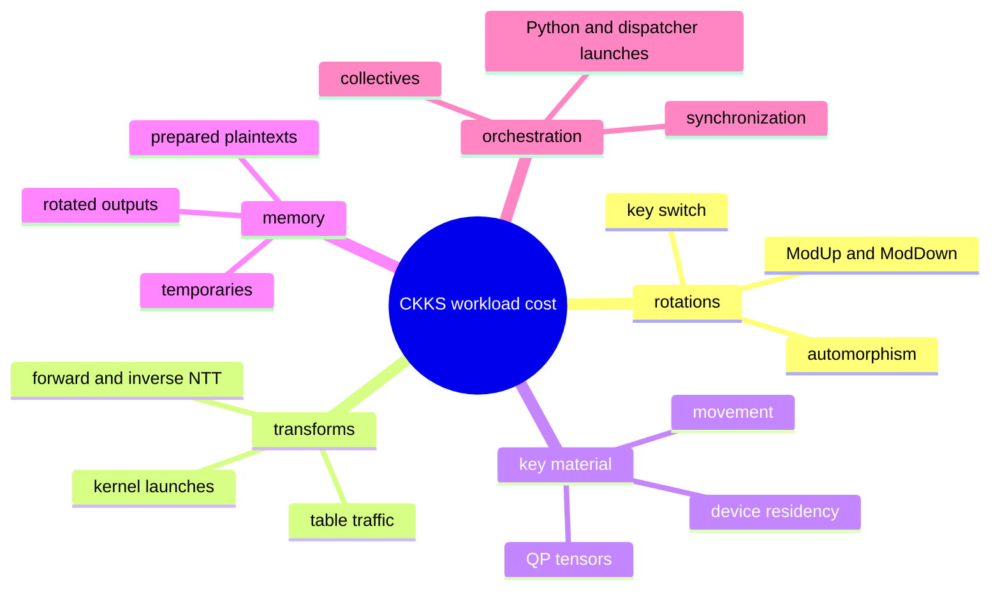
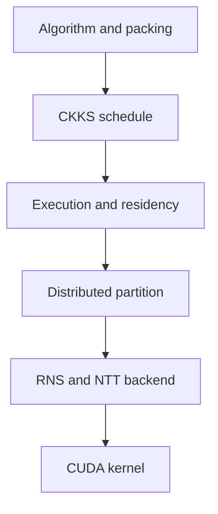
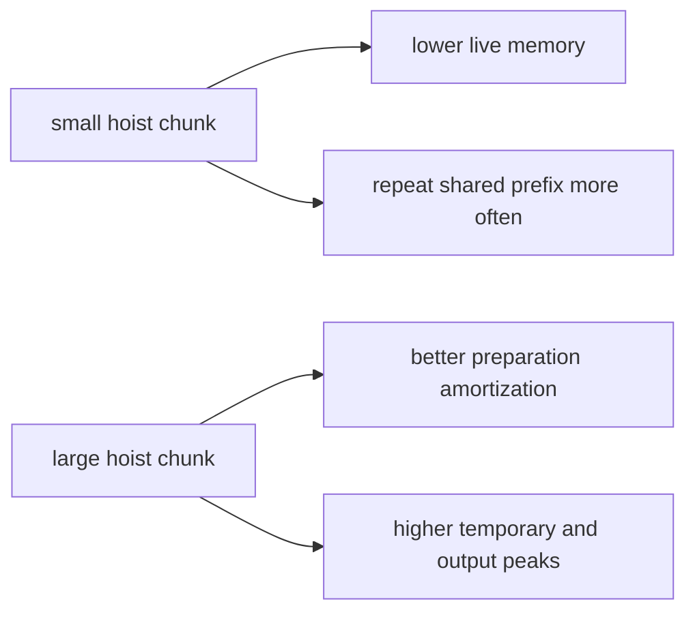
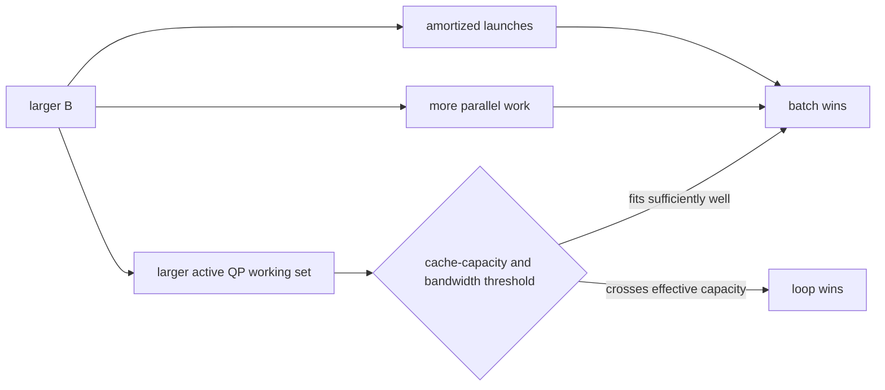
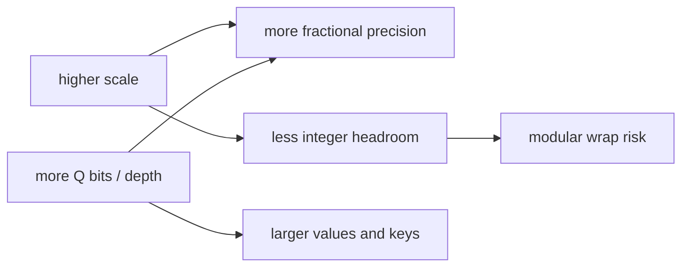
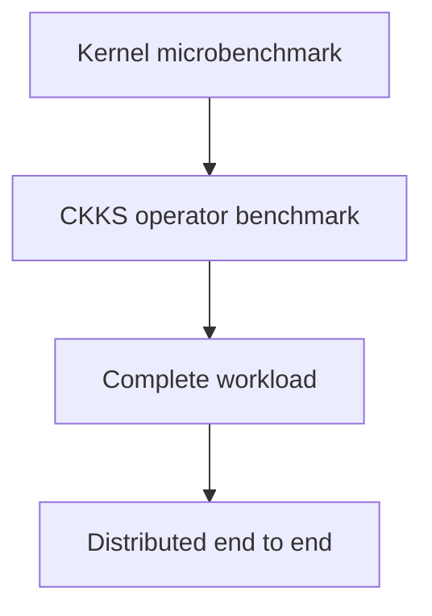
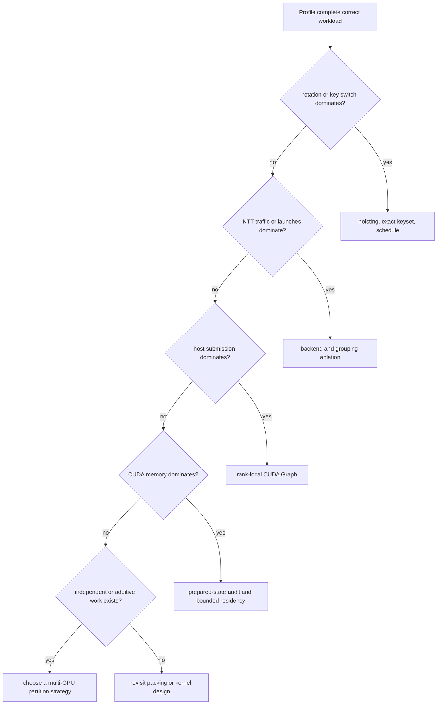

# CKKS workload cost model

Performance work should begin with a real evaluator and a decomposition of its
cost—not with the name of a kernel or the largest available NTT grouping.

## Packed linear workloads are not GEMM kernels

A common diagonal formulation is:

$$
y=\sum_i p_i\odot\operatorname{Rot}(x,s_i).
$$

Its dominant costs can include:



A small plaintext pointwise multiply can be surrounded by a much more
expensive rotation/key-switch path.

## Optimize from the highest useful layer



Higher layers often change total work more dramatically:

- Packing determines the number of rotations and diagonals.
- Scheduling determines rescale/relinearization placement and reuse.
- Execution determines launch and transfer overhead.
- Distribution determines communication and key replication.
- Backend policy determines transform tables and stage grouping.
- Kernel work determines occupancy, memory traffic, and local arithmetic.

Do not move to a lower layer until measurement shows it controls the target
workload.

## Main optimization mechanisms

| Mechanism | Removes or changes | Adds or risks |
| --- | --- | --- |
| Late relinearization | Repeated key switches across compatible triplets | Larger three-component live state |
| Operation-ready plaintexts | Repeated encode/lift/NTT preparation | Larger persistent weight footprint |
| Reused NTT operands | Repeated transforms of fixed operands | Exact level/state coupling |
| NTT-domain product accumulation | Per-term inverse transforms in additive PT×CT regions | One coefficient transition before rescale/decrypt |
| NTT grouping/compact tables | Launches and table/global-memory traffic | Registers, occupancy, index arithmetic |
| Rotation hoisting | Repeated decomposition/ModUp/NTT prefix | Hoist temporaries and output memory |
| CUDA Graph | Repeated host/dispatcher submission | Fixed signatures, retained graph memory |
| Bounded residency | All-resident CUDA footprint | Host-to-device (H2D) traffic and event coordination |
| Multi-GPU partition | Rank-local dominant work | Communication, imbalance, key placement |
| Minimal keyset | Key memory and movement | Possible extra operations with decomposition |

No mechanism dominates every shape, level, GPU, and request pattern.

## Hoisting has a memory curve

Multiple rotations can share preparation that depends only on the input
component, but each step still needs its own automorphism, exact key products,
ModDown, and output storage.



Chunk size is a workload policy. Measure latency and peak memory together.

## Homogeneous batching has a working-set crossover

A homogeneous batch adds independent-message dimensions while keeping one
context, level, scale, polynomial domain, modulus basis, device, dtype, and component count. The
public ciphertext layout keeps its structural component axis first, followed
by `*batch`, limb, and polynomial-index axes. Message batch axes are distinct
from RNS limbs, ciphertext components, hybrid-decomposition digits, and
distributed ranks.

Batching can reduce launches and expose parallel work, but it also multiplies
the tensors active inside NTT, automorphism, ModUp, key accumulation, ModDown,
and result assembly. For one extended key-switch digit, a useful lower-bound
proxy is:

$$
W_{digit}=B\cdot |QP_{active}|\cdot N\cdot 8\ \text{bytes}.
$$

The full active set is larger because transforms read and write data while
keys, accumulators, temporaries, and outputs are live. Once that set exceeds
effective cache capacity, a larger batch can replace cache reuse with DRAM
traffic and become slower than an explicit loop. Later CKKS levels use fewer Q
rows, so the crossover may reverse without changing `N` or `B`.

Two cache regimes are useful when interpreting the crossover:

```text
B1 fits, B2/B4 spills:
    batching introduces a fit-to-spill transition and can regress abruptly

B1 already streams beyond cache:
    increasing B does not create the same new transition; backend structure,
    occupancy, bandwidth, and launch count determine the relative result
```

For example, an RTX A6000 measurement with 6 MiB L2 placed one level-zero QP
digit for `Preset.slots16384_scale40_levels16_int64` at 4.75 MiB: B1 was close to
cache capacity, while B2 was not. The same GPU placed one level-zero digit for
`Preset.slots32768_scale40_levels34_int64` at 19.5 MiB, so even B1 was already a
streaming workload. The former showed a clear batching loss; the latter
retained modest gains with a strict radix-16 backend. The digit size is
explanatory evidence, not a complete cache-fit test.



This is why B1 compatibility, operator speedup, workload speedup, and peak
memory are separate measurements. FHElium preserves homogeneous batch semantics
but does not hide an automatic batch-versus-loop policy in the engine. See the
[homogeneous batching tutorial](../../tutorial/homogeneous-batching.md) and
[batch-size selection guide](../../how-to/choose-homogeneous-batch-size.md).

CUDA Graph and homogeneous batching also overlap as launch-amortization
mechanisms. Batching reduces the number of launches by operating on a larger
message tensor; graph replay reduces host submission gaps while preserving an
explicit loop's smaller per-message working set. A batching win under eager
execution can therefore become a loop win when both paths are captured. The
valid comparison is batch graph versus loop graph, with graph capture and
retained memory reported separately from replay latency.

## NTT grouping is not monotonic

Combining multiple radix-2 stages can reduce launches and global-memory
round-trips, but wider grouping can increase register pressure, reduce
occupancy, or interact poorly with active row count.

The best backend depends on:

- ring dimension;
- active level/row count;
- transform batch shape;
- GPU architecture;
- table footprint and traffic;
- surrounding workload and graph capture.

A name such as `group16` describes an execution strategy; it is not proof of
superiority and should not be confused with an unrelated direct-radix
algorithm.

## Multi-GPU time model

For additive-term parallelism, a useful first approximation is:

$$
T_p \approx T_{local}/p
      + T_{input}
      + T_{key\ provisioning}
      + T_{reduction}
      + T_{imbalance}
      + T_{startup}.
$$

Data parallelism tends to scale most simply because requests are independent.
Additive-term parallelism can move communication to the beginning and end phases.
Limb parallelism pays repeated complete-row reconstruction whenever the next
operation cannot be row-local.

Always report topology, per-rank key footprint, and the synchronization rule
used for timing.

## Numerical limits are performance constraints

Scale, active modulus, input amplitude, and summation width interact:



A faster configuration is not acceptable if it silently changes level
semantics, wraps realistic inputs, or exceeds the error bound. Every
performance result should include correctness.

## Measurement layers answer different questions



| Layer | Good question | Invalid overclaim |
| --- | --- | --- |
| Kernel | Which NTT/RNS implementation is faster for this shape? | The application has the same speedup |
| Operator | What dominates rotate, rescale, or relinearize? | Distributed scaling is solved |
| Workload | How do packing, hoisting, graph, and memory combine? | One kernel caused all gains |
| Distributed | What are compute, communication, imbalance, and memory? | Every topology behaves identically |

## Minimum benchmark metadata

A reproducible report records:

- GPU model/count/topology, driver, PyTorch, and CUDA;
- FHElium version/commit and source or installed wheel;
- preset, `logN`, level, scale, Q/P row counts;
- NTT backend and grouping policy;
- warmup, measured runs, and statistic;
- synchronization and event-completion rule;
- whether setup, keygen, encryption, and decryption are timed;
- hoist chunk, graph mode, rank count, and partition;
- peak allocated and reserved memory;
- decrypt error and expected tolerance.

## Decision process



Change one variable at a time, keep the cleartext oracle and CKKS state
invariants fixed, and promote measured improvements into regression coverage.

## Continue

- [Rotation hoisting tutorial](../../tutorial/rotation-hoisting.md)
- [CUDA Graph tutorial](../../tutorial/cuda-graph-matvec.md)
- [Residency lifetimes](../execution/residency-lifetimes.md)
- [Benchmark a workload correctly](../../how-to/benchmark-a-workload.md)
- [Optimize a workload systematically](../../how-to/optimize-workload.md)
