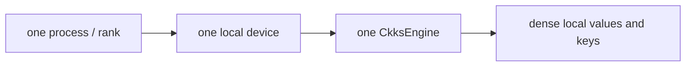

# Programming model at a glance

FHElium exposes **verifiable CKKS state**. The public API keeps correctness,
depth, key use, placement, and cost visible. Eager call-by-call execution over
tensor values can express a complete computation; compilation, CUDA Graph
capture, and workload tuning are optional optimization layers.

## One-sentence mental model

FHElium stores CKKS values as dense PyTorch tensors with typed metadata,
executes local arithmetic through one `CkksEngine` per process-local CPU or
GPU device, uses SPMD schedules for multi-GPU work, and delegates
RNS/NTT/key-switch arithmetic to native CPU or CUDA operators selected by
PyTorch tensor-device dispatch.

## Five principles

### 1. Values carry CKKS state

A ciphertext combines an integer tensor payload with the following state:

- context identity;
- level and scale;
- active prime IDs;
- coefficient or NTT domain;
- Q or QP basis;
- Montgomery representation;
- component count;
- homogeneous message batch shape.

Operations validate these dimensions before launching expensive kernels. See
[Value model and identity](ckks/value-model-and-identity.md) and
[State transitions and orthogonality](ckks/state-transitions-and-orthogonality.md).

### 2. Local values are dense and process-local

The basic ownership unit is:



The current local CKKS implementation supports CPU and CUDA devices through the
same public methods and native schemas. Values, keys, parameter tables, and the
engine must share the selected device; operations do not move them implicitly.
One engine owns computation on one process-local device.

Distribution is not encoded into `Ciphertext`, `Plaintext`, or key types.
Applications choose a partition and collectives. See the
[rank-local SPMD model](distributed/spmd-model.md).

One local `Plaintext` or `Ciphertext` may contain a homogeneous message batch.
Those axes remain local dense value semantics; they are not distributed ranks
or a request scheduler. The application chooses whether to submit
that batch or loop over its members.

### 3. Semantic and expensive transitions are visible

Ciphertext multiplication does not silently hide rescale, NTT conversion, or
relinearization. Exposing these transitions makes depth and cost auditable and
enables schedules such as late relinearization. See
[Scale and level lifecycle](ckks/scale-and-level-lifecycle.md) for the complete
level/scale effect matrix,
[State transitions and orthogonality](ckks/state-transitions-and-orthogonality.md)
for primitive representation conversions, and
[Evaluator operation transitions](ckks/evaluator-operation-transitions.md) for
evaluator operations.

### 4. Key creation, placement, installation, and use are separate

Keys are typed application-managed values. Applications decide which
keys exist, where they reside, when they are installed, and whether secret
material is present on an evaluator. See [Key lifecycle](ckks/key-lifecycle.md).

### 5. Mechanism is separate from policy

Core and execution modules provide value state, typed transport, fixed
buffers, events, and graph replay. Deployment code provides tenant routing,
cache admission, eviction priorities, and model policy.
See [Ownership and runtime responsibilities](architecture/ownership-and-responsibilities.md).

## A minimal ciphertext multiplication

```python
x_ntt = engine.coefficient_domain_to_ntt_domain(ct_x)
y_ntt = engine.coefficient_domain_to_ntt_domain(ct_y)
triplet = engine.multiply(x_ntt, y_ntt)
product = engine.rescale_to_next_level(engine.relinearize(triplet))
```

The sequence exposes four distinct facts:

1. fresh operands use the context default scale unless the program supplies
   another positive finite scale;
2. pointwise polynomial multiplication requires NTT-domain operands;
3. multiplying two two-component ciphertexts produces three components at the
   product scale;
4. relinearization returns to two components, then `rescale_to_next_level` consumes
   one level and records `product.scale / dropped_q`.

The scale and level laws are defined in
[Scale and level lifecycle](ckks/scale-and-level-lifecycle.md); the broader
state machine is described in
[Evaluator operation transitions](ckks/evaluator-operation-transitions.md). A runnable
version is available in the [basic CKKS tutorial](../tutorial/basic-ckks-workflow.md).

## Workload decisions

Programs provide:

- when to rescale or relinearize;
- how to align levels or scales before addition;
- which rotation keys to generate or move;
- which NTT backend is optimal for a workload;
- whether a homogeneous message batch or an explicit loop is faster;
- whether rank-local values represent independent objects, additive partials,
  or disjoint RNS limbs;
- what to retain under a model-, user-, or request-level memory policy;
- what dynamic control flow should be captured in a CUDA Graph.

Those choices depend on mathematics, security, workload structure, hardware,
or product policy and cannot be recovered safely from tensor shape alone.

## Next steps

- New evaluator authors: [Scale and level lifecycle](ckks/scale-and-level-lifecycle.md)
- Parameter authors: [Context and modulus chain](ckks/context-and-modulus-chain.md)
- Multi-GPU authors: [Rank-local SPMD](distributed/spmd-model.md)
- Repeated execution: [CUDA Graph model](execution/cuda-graph-model.md)
- Performance work: [CKKS cost model](performance/cost-model.md)
- Batched values: [Homogeneous batching tutorial](../tutorial/homogeneous-batching.md)
