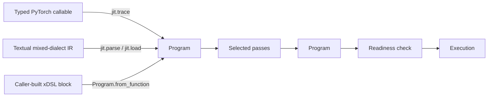

# JIT programs

`fhelium.experimental.jit` represents an encrypted tensor computation as one
source-independent, mixed-dialect xDSL `Program`. PyTorch tracing, textual IR,
and direct xDSL construction are entry paths into that same representation.
The programmer chooses the transformations and runtime capabilities applied to
the program.

In this package, JIT is an in-process path from capture or import through
selected Program passes to readiness-gated interpreter or backend-handler
execution. Native kernel code generation is unsupported.

## One `Program`, several entry paths

A [`Program`](../api/fhelium/experimental/jit.md#program) owns one
`xdsl.dialects.builtin.ModuleOp`. Its functions contain xDSL blocks,
operations, SSA operands and results, attributes, and types. The `Program`
retains this representation independently of how it was created:

A traced frontend also returns a `CaptureResult`. The result retains frontend
attachments—the original callable, its signature, input declarations, FX
source, and a semantic `reference()` method—beside the canonical `Program`.
Those attachments are conveniences of that capture request rather than
properties every `Program` must have.

## Mixed dialects are one graph

A mixed-dialect program can contain FHElium, Torch, xDSL builtin/func, vendor,
and application operations in the same SSA graph. The parser registers a small
structural vocabulary:

- `builtin.module` and `func.func` / `func.return`;
- open FHElium value types for `encrypted`, `message`, `plaintext`, `material`,
  and `resource` roles;
- symbolic `fhelium.material.ref` and `fhelium.resource.ref` operations.

The xDSL context also permits unregistered dialects, operations, attributes,
and types. A textual program can therefore retain an operation such as
`vendor.ckks.bootstrap` or an opaque third-party tensor type even when the
current lowering and executor do not understand it. Later passes can lower the
operation, or a runtime workspace can bind a bound handler for it.

The FHElium role types encode SSA identity and available structural facts;
readiness checks determine whether a parameter, material, and backend
combination is executable.

## Structural validity and readiness validity

JIT uses two separate validity decisions.

### Structural validity

Construction, parsing, and cloning verify the xDSL module. `PassPipeline` also
verifies the Program returned by every pass. Malformed registered operations,
invalid SSA use, and other structural violations are rejected by those
verification steps. A structurally valid program may still contain:

- semantic operations awaiting lowering;
- incomplete CKKS state metadata;
- unknown extension operations and types;
- symbolic materials and resources without live bindings;
- multiple functions or no function named `main`;
- a version unsupported by the current executor.

`Program.to_text()` and `save()` serialize the current module; printing does not
itself establish structural or readiness validity after arbitrary direct
mutation through `Program.module`. This permissive model makes textual
interchange and inspection useful before a runtime has been selected.

### Readiness validity

[`Program.readiness()`](../api/fhelium/experimental/jit.md#readiness)
selects one entry function and compares its exact current operations with a
runtime workspace. Its `ReadinessReport` records concrete diagnostics and a
`runnable` decision. The check covers the executable operation schemas,
unresolved scheduling obligations, program versions, material/resource
bindings, handlers, engine, and required evaluation keys.
Evaluation-key readiness includes compatibility with the selected engine;
online encryption additionally validates a supplied public key after runtime
argument binding shows that an encrypted input is a Tensor.

Readiness checking is observational: it does not execute operations, invoke
lazy resolvers, materialize bindings, or mutate caches. `Program.run()` repeats
this readiness check and raises `ProgramNotReadyError`, with the complete report,
when an execution requirement is unsatisfied.

Structural validity therefore answers “is this a well-formed interchange
program?” Readiness validity answers “can this selected entry execute with
these capabilities now?”

## Program and workspace ownership

A `Program` contains serializable computation and symbolic identities. A
[`Workspace`](../api/fhelium/experimental/jit.md#workspace) is a
retained mutable mapping containing live values, services, policy, analyses,
and caches. This separation keeps device tensors, engines, keys, streams, and
Python callables out of textual IR.

The executor assigns these conventional workspace keys:

| Key | Runtime responsibility |
| --- | --- |
| `materials` | Map a material symbol to its caller-owned, lazy, or artifact-backed binding |
| `resources` | Map a resource symbol to a runtime handle or service |
| `material_resolver` | Resolve `(symbol, kind, binding, workspace)` during a ``Program.run(...)`` call |
| `resource_resolver` | Resolve `(symbol, kind, binding, workspace)` during a ``Program.run(...)`` call |
| `handlers` | Map an extension operation name to an operation handler |
| `torch_handlers` | Map an exact Torch target symbol to an trusted Python callable |
| `engine` | Supply the `CkksEngine` for lowered CKKS operations and encrypted inputs |
| `evaluation_keys` | Supply rotation and relinearization keys required by current operations |
| `public_key` | Authorize online encryption when an encrypted input is supplied as a Tensor |

Passes and applications may use other keys for their own analyses and policies.
The workspace has no automatic invalidation scheme for extension-defined
entries; the producer and consumer of each key must define and honor its schema,
semantics, and invalidation policy.

Tracing snapshots captured Tensor constants, emits symbolic material references
into the program, and stores the snapshots under `workspace["materials"]`.
Pass pipelines receive the same workspace object, and `PipelineResult` returns
it for the eventual execution request.

## Analyses, passes, readiness, and handlers

These mechanisms answer different questions:

- **Analyses** inspect the current program. `analyze_requirements()` collects
  operation names, references, Torch targets, rotation steps, and
  relinearization requirements without deciding executability.
  `analyze_value_states()` exposes open type metadata without simulating CKKS
  arithmetic.
- **Passes** transform locally recognized operations. A `PassPipeline` clones
  the source program once, runs an ordered pass tuple over the clone, shares one
  workspace across the tuple, and returns per-pass reports.
- **Readiness** applies the interpreter's exact schema and capability gate to a
  selected entry and workspace.
- **Handlers** extend execution. `handlers` execute unknown operation names;
  `torch_handlers` authorize exact preserved Torch targets. FHE-touching Torch
  calls require a bound target handler. Built-in operations retain their
  built-in semantics and cannot be overridden through the extension map.

`default_pipeline()` is one predefined general lowering policy. It lowers the
recognized semantic arithmetic, introduces plaintext preparation and
ciphertext-multiply NTT transitions, materializes CKKS operations, and inserts
relinearization/rescale mechanics. Completion means that every selected pass
returned a `PassResult` and every returned program passed xDSL structural
verification. The independent readiness gate decides whether the result is
executable.

A pass that sees no applicable operation is successful. Its `PassResult` can
report an unchanged program, matches, skips, and diagnostics. This local no-op
rule supports mixed programs and lets users insert a pass before the producer
of its patterns while keeping the behavior inspectable.

## Programmer control levels

The following levels are usage modes. They are neither lifecycle subclasses of
`Program` nor global stages through which every workload must pass. The same
`Program` class can move among several modes, and direct core evaluation can be
used beside a JIT-managed subprogram.

| Usage mode | Programmer control |
| --- | --- |
| **Direct core** | Call `CkksEngine` and core value APIs directly; own every CKKS state transition and evaluator schedule |
| **Trace-first** | Declare typed input roles, call `jit.trace()`, apply a selected pipeline, provision requirements, and execute the resulting `Program` |
| **Pass-controlled** | Inspect or replace the default ordered pass tuple, add application passes, consume reports, and retain workspace analyses |
| **IR-first** | Parse/load textual mixed-dialect IR or construct xDSL operations directly, then select passes and runtime bindings |
| **Backend extension** | Preserve dialect-specific operations/types, add transformation passes or state validators, and bind trusted operation/resource handlers |

This organization allows a workload to start from semantic PyTorch, textual IR,
or direct evaluator code while retaining one exact CKKS value model during
execution.

## Continue

- [JIT tutorial](../tutorial/unified-jit.md) follows Example 19 from
  trace through pass reports and encrypted execution.
- [JIT internals](../developer/unified-jit-internals.md) defines the
  xDSL vocabulary, pass scope, schemas, and extension interfaces.
- [JIT API modules](../api/fhelium/experimental/jit.md) provide exact
  current signatures.
