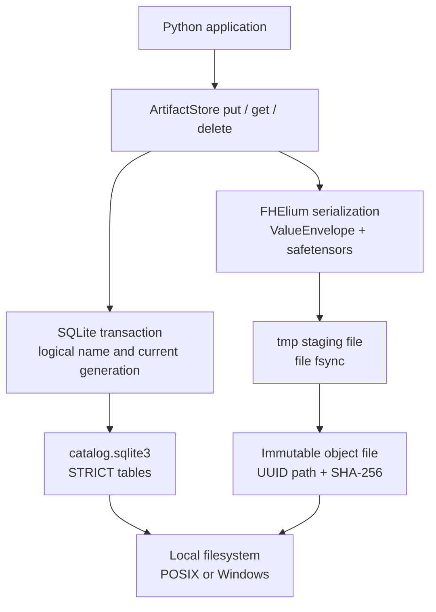

# ArtifactStore internals

`ArtifactStore` implements a transactional repository for FHElium values on
one trusted host. Its on-disk format separates value identity from
logical artifact identity through a SQLite catalog, immutable payloads, and
defined recovery behavior.

## Storage stack



The SQLite catalog stores repository identity, logical names, current
generations, value metadata, object paths, and checksums. Tensor bytes
are written by `fhelium.serialization` into immutable safetensors payloads.
Catalog transactions order publication. POSIX uses no-clobber links followed
by directory `fsync`; Windows uses no-replace
`MoveFileExW(MOVEFILE_WRITE_THROUGH)`. Windows does not provide a supported
directory-flush equivalent in this implementation, so its power-loss guarantee
for directory metadata is weaker than the POSIX guarantee.

The implementation uses the Python `sqlite3` module and local filesystem
operations. It does not place tensor BLOBs in SQLite or reinterpret value
metadata independently of the serialization layer.

## Repository layout

A store root owns four internal paths:

```text
ROOT/
├── .store.lock
├── catalog.sqlite3
├── objects/
│   └── <uuid-prefix>/<artifact-uuid>.safetensors
└── tmp/
```

- `.store.lock` serializes initialization and open-time recovery.
- `catalog.sqlite3` owns logical names, current generations, store identity,
  and transaction ordering.
- `objects/` contains immutable value files addressed by artifact UUID.
- `tmp/` contains unpublished staging files only.

The catalog does not contain tensor BLOBs. Tensor payloads remain ordinary
versioned FHElium safetensors files so the serialization layer retains sole
ownership of value encoding and reconstruction.

## Catalog identity and schema

Format v1 requires SQLite 3.37 or later, `STRICT` tables,
rollback-journal `DELETE` mode, and `synchronous=FULL`. The store metadata table
contains exactly:

- `format = "fhelium-artifact-store"`;
- one canonical UUID `store_id`.

The artifact table has one row per normalized logical name. A row records the
current artifact UUID, value and artifact schema versions, concrete value type,
context identity, logical tensor bytes, payload SHA-256, immutable object path,
sensitivity label, creation time, and the tensor/value metadata copied from the
value-file header.

Opening a store validates the schema version, required table definitions,
unexpected schema objects, catalog identity, canonical UUIDs, row structure,
and referenced object presence. Unsupported versions fail closed; v1 provides
no migration API.

The catalog path and bootstrap lock must each be regular files with exactly one
hard link. Symlinks and shared hard-linked inodes are rejected by store-open
validation. This protects against accidental path aliasing; hostile concurrent
path replacement remains outside the trusted-host model.

## Publishing a generation

`put(name, value)` uses the following ordering:

1. Validate the logical name and value policy, then allocate a candidate
   artifact UUID and its object/staging paths.
2. Start `BEGIN IMMEDIATE`, serializing participating writers.
3. Resolve the existing name, enforce `overwrite`, and reject candidate UUID
   collision with either catalog or object state.
4. Snapshot the supported value state into `tmp/` through `save_value`.
5. Request the store's file mode and `fsync` the staging file. Windows uses a
   writable descriptor because its CRT rejects `fsync` on a read-only one.
6. Validate the staged file header and compute its complete payload SHA-256.
7. Publish without replacement: POSIX links the object, removes the staging
   name, and `fsync`s the modified directories; Windows calls
   `MoveFileExW(MOVEFILE_WRITE_THROUGH)` without `MOVEFILE_REPLACE_EXISTING`.
8. Insert or replace the one current catalog row and commit SQLite.
9. After commit, retire the previous unreachable object.

A committed row therefore never points to a partially written object. Process
death before catalog commit may leave an unreachable object; it does not
publish a generation. Process death after commit may leave the previous object
temporarily present; it is no longer reachable by name. On Windows, the
write-through move is the best available publication primitive used here, but
the absence of directory flush prevents claiming POSIX-equivalent metadata
survival after sudden power loss.

`put` snapshots persistence state without changing the caller's live value.
Device movement and memory release remain ordinary value/residency operations.

## Reading and retirement

`get(name_or_ref)` starts a rollback-journal read transaction before resolving
the current row. The transaction remains open through:

- optional `ArtifactRef` generation validation;
- context and expected-type checks;
- payload presence and optional SHA-256 verification;
- catalog/file-header cross-validation;
- value reconstruction through `load_value`.

In SQLite `DELETE` mode, a writer may prepare a replacement concurrently but
cannot commit while that read transaction remains active. The old object is
removed only after the writer commits, so a selected generation cannot be
retired during materialization.

A string name with no current row is an ordinary repository miss and returns
`None`. A generation-specific reference that is missing, replaced, deleted, or
belongs to another store raises `StaleArtifactReferenceError`. Missing payloads,
checksum failures, malformed metadata, and type/context mismatches remain
errors rather than cache misses.

## Recovery

Store construction holds `.store.lock` while validating catalog identity and
schema, then begins an exclusive SQLite transaction for row/object recovery:

1. Validate catalog version, identity, schema, and row/object bindings.
2. Reject any catalog row whose referenced object is absent or non-regular.
3. Remove all staging entries under `tmp/`.
4. Remove object files not referenced by the current catalog rows.
5. On POSIX, `fsync` every modified surviving object directory. Windows has no
   corresponding supported directory flush in this implementation.

Recovery never promotes an orphan into the catalog and never treats an old
object as retained version history. Exactly one generation per logical name is
reachable after recovery.

## Filesystem requirements and security model

The supported deployment is one trusted host on a local POSIX or Windows
filesystem. POSIX requires working advisory locks, same-filesystem hard links,
atomic local operations, and file/directory `fsync`. Windows uses an `msvcrt`
byte-range bootstrap lock, ordinary SQLite locking, writable-file `fsync`, and
same-volume no-replace write-through moves. NFS, SMB, FUSE/object-store mounts,
multi-host writers, and processes that modify internal files outside the API
are unsupported.

On POSIX, new internal directories use mode `0700`; the catalog, lock, and
payload files use `0600`. An existing store-root mode remains
application-owned. These numeric modes do not establish owner-only Windows
ACLs. A Windows application must provision and verify appropriate access
control on the store root separately.

SHA-256 detects accidental payload corruption but is not authenticated
integrity. A writer that can modify both catalog and payload can replace both.
Sensitivity labels do not encrypt data or enforce access control. Secret-key
persistence requires explicit `allow_secret=True` and still requires an
application-owned at-rest security policy.
