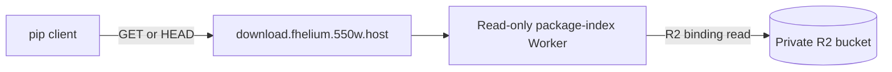
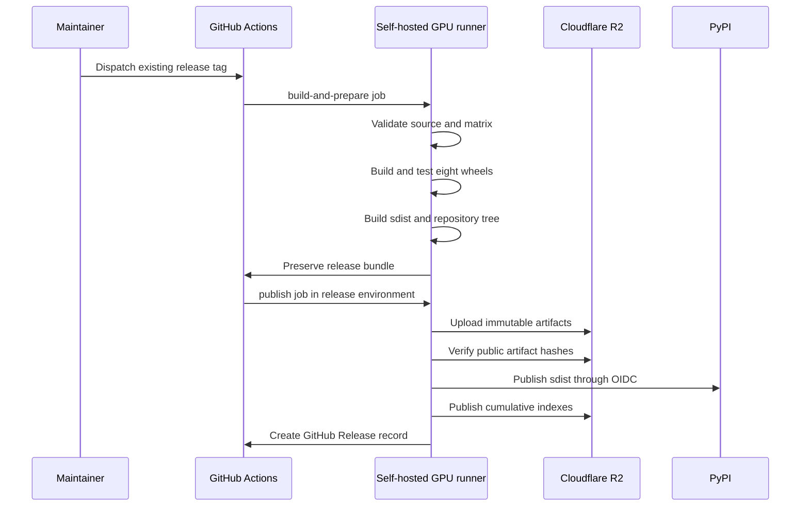

# Binary packaging and release

FHElium's release system produces source and binary artifacts for one Python
distribution, `fhelium`. PyPI stores the source distribution. FHElium's package
repository stores complete Linux wheels for the declared PyTorch, CUDA, and
Python configurations.

This page defines the release outputs, configuration identities, build and
validation process, public storage, and operator procedure. The
machine-readable release matrix and the release workflow are the implementation
sources of truth.

## Release objectives

A FHElium release provides:

- one `fhelium` project name for source and binary installation;
- a PyPI source distribution that compiles against a preinstalled target
  PyTorch environment;
- complete Linux wheels for every configuration and Python ABI declared by the
  release matrix;
- exact PyTorch and native-build identity in each formal wheel;
- immutable wheel objects and cumulative Python Simple Repository indexes;
- source, CPU, CUDA, package-index, and public resolver validation before a
  release is complete.

Each formal binary configuration records the exact PyTorch version and local
CUDA variant, PyTorch C++11 ABI setting, CUDA Toolkit version, CUDA runtime
SONAME, native backend set, and compiled GPU architectures.

## Binary repository layout

Each formal binary configuration has a separate Python Simple Repository root:

```text
https://download.fhelium.550w.host/torch213-cu130/simple/
https://download.fhelium.550w.host/torch212-cu129/simple/
https://download.fhelium.550w.host/torch213-cpu/simple/
https://download.fhelium.550w.host/torch212-cpu/simple/
```

The documentation selector installs the configuration's exact PyTorch
distribution first and then adds the corresponding FHElium index. The FHElium
command sets `--only-binary=fhelium`, making binary artifact selection an
declared requirement for this installation method.

## Release matrix

[`packaging/release_matrix.json`](https://github.com/VisualDust/fhelium/blob/main/packaging/release_matrix.json)
defines the supported binary configurations. Its JSON Schema defines the
structure, while `packaging/release_matrix.py` validates semantic requirements
and generates the documentation installation catalog.

A release builds two Python ABIs for each configuration:

| Configuration | Exact PyTorch | Toolkit | Native backends | Python ABIs |
| --- | --- | --- | --- | --- |
| `torch213-cu130` | `2.13.0+cu130` | CUDA 13.0.3 | CPU and CUDA | CPython 3.12, 3.13 |
| `torch212-cu129` | `2.12.1+cu129` | CUDA 12.9.1 | CPU and CUDA | CPython 3.12, 3.13 |
| `torch213-cpu` | `2.13.0+cpu` | none | CPU | CPython 3.12, 3.13 |
| `torch212-cpu` | `2.12.1+cpu` | none | CPU | CPython 3.12, 3.13 |

The matrix produces eight wheels per FHElium version. CUDA configurations
compile SM 80, 86, 89, 90, 100, and 120. These architectures are release
configuration values. The installation selector presents the resulting CUDA
configuration as one compute-platform choice.

Maintainers review and update the matrix before each release. The workflow
builds the values recorded in that matrix.

## Distribution metadata

Source and binary artifacts intentionally describe PyTorch differently:

- the source distribution declares the supported range
  `torch>=2.10,<2.14`;
- a formal wheel declares one exact local version, such as
  `torch==2.13.0+cu130`.

`scripts/release_dependencies.py` provides this dynamic build metadata. Exact
wheel metadata prevents pip from treating a different PyTorch CUDA variant as
an acceptable runtime dependency.

Source installation remains available for supported environments outside the
formal wheel matrix. It preinstalls the selected PyTorch and
`scikit-build-core`, then disables PEP 517 isolation and pip's wheel cache:

```bash
python -m pip install \
  --index-url https://download.pytorch.org/whl/cu130 \
  "torch==2.13.0+cu130"
python -m pip install "scikit-build-core>=1.0.3"
CMAKE_ARGS="-DFHELIUM_NATIVE_BACKENDS=CPU+CUDA" \
  python -m pip install --no-binary=fhelium \
    --no-build-isolation --no-cache-dir --verbose "fhelium==0.10.0"
```

This order makes the target PyTorch installation available to CMake and avoids
reusing a wheel built for an earlier environment.

## Build implementation

The wheel builders run in digest-pinned `manylinux_2_28_x86_64` containers.
Three Dockerfiles supply CPU, CUDA 12.9, and CUDA 13.0 build environments:

```text
packaging/manylinux_2_28.Dockerfile
packaging/manylinux_2_28_cuda12_9.Dockerfile
packaging/manylinux_2_28_cuda13.Dockerfile
```

`packaging/build_release.py` selects one declared configuration and Python ABI.
It invokes `packaging/build_manylinux_wheel.py`, which performs the following
work:

1. select the matrix-owned manylinux image and CPython interpreter;
2. install the exact PyTorch artifact from its official flavor index;
3. verify PyTorch version, CUDA variant, C++ ABI, and Toolkit identity;
4. compile the selected CPU or CPU+CUDA native backends;
5. finalize the native ABI manifest with release configuration provenance;
6. build and repair the wheel with auditwheel;
7. validate the repaired wheel structure and native dependencies;
8. install it into an isolated environment and execute a CPU native operation.

Release wheels use a relocatable Torch-relative loader path. They do not embed
the build machine's Torch installation path and do not bundle Torch, c10, or
the CUDA runtime. Editable source builds continue to use the selected local
Torch library path.

CUDA wheels receive an additional host-side validation through
`packaging/validate_cuda_wheel.py`. It creates a fresh environment, installs the
exact matrix PyTorch, installs the wheel, and executes a native CUDA operation
on a real NVIDIA GPU. A successful CUDA compile without this execution is not
sufficient release validation.

## Artifact and index representation

`packaging/prepare_static_index.py` converts the eight validated wheels into an
immutable artifact tree and four versioned Simple Repository projections:

```text
artifacts/<version>/<configuration>/<wheel>
artifacts/<version>/manifest.json
releases/<version>/manifest.json
<configuration>/simple/index.html
<configuration>/simple/index.json
<configuration>/simple/fhelium/index.html
<configuration>/simple/fhelium/index.json
```

Each wheel record includes:

- configuration and Python ABI;
- public URL and byte size;
- SHA-256 digest;
- `Requires-Python`;
- publication state;
- source commit and release time provenance.

The HTML pages implement PEP 503. JSON pages implement PEP 691. Both are
generated from the same release manifest. Wheel URLs include SHA-256 fragments,
and published wheel object keys are immutable.

`packaging/merge_published_indexes.py` retrieves and validates the current
public JSON project page for every configuration, then merges historical wheel
records into the new pages. A normal release fails if an existing public index
cannot be read. Missing indexes are accepted only during first-time
repository initialization.

## Public serving architecture

Cloudflare R2 stores wheel objects, manifests, and generated index files in the
private `fhelium-releases` bucket. The read-only Worker under `cloudflare/`
serves them at `download.fhelium.550w.host`.



The Worker:

- accepts only `GET` and `HEAD`;
- maps a trailing-slash Simple Repository URL to `index.html`;
- maps the same URL to `index.json` when the client accepts
  `application/vnd.pypi.simple.v1+json`;
- returns the PEP 691 vendor media types and `Vary: Accept`;
- preserves object cache metadata and ETags;
- exposes no upload or object-deletion route.

The Worker holds an R2 read binding, not the S3-compatible release upload
credentials. Release upload credentials exist only as secrets in the GitHub
`release` environment. Worker source and non-secret resource names are public
repository content, while `cloudflare/` is excluded from the Python sdist and
wheel.

## GitHub Actions and the self-hosted runner

[`.github/workflows/release.yml`](https://github.com/VisualDust/fhelium/blob/main/.github/workflows/release.yml)
is the operator entry point. It uses `workflow_dispatch`; pushing a tag does not
start a release automatically.

The workflow requires an existing `v<project.version>` tag. The tag must point
to the checked-out release commit and must exist in `VisualDust/fhelium`. The
release repository may begin with a new root commit; no earlier repository
history is required by the build or publication process.

All three workflow jobs target a trusted Linux x86-64 self-hosted runner with
these labels:

```text
self-hosted, Linux, X64, fhelium-release, gpu
```

GitHub Actions supplies orchestration, artifacts, environment secrets, and
OIDC identity. The self-hosted runner executes source validation, Docker
builds, native compilation, GPU execution, and publication clients.



### Build and prepare

The first job:

1. checks out and validates the supplied immutable tag;
2. validates the release matrix;
3. runs Ruff, Pyright, pytest, and the documentation build;
4. builds the three builder images once;
5. builds and structurally validates all eight wheels;
6. runs isolated CPU and real-GPU CUDA validation;
7. builds and checks the source distribution;
8. prepares and validates the cumulative static repository;
9. uploads the complete release bundle as a GitHub Actions artifact.

This job does not publish to R2 or PyPI.

### Publish

The second job restores the preserved bundle and revalidates it before external
publication. It runs in the GitHub `release` environment, which supplies:

```text
Environment secrets:
  R2_ACCESS_KEY_ID
  R2_SECRET_ACCESS_KEY

Environment variables:
  R2_ENDPOINT_URL
  R2_BUCKET
```

The `release` environment requires maintainer approval before this job starts.
This separates artifact construction and validation from the authorization to
change public package repositories.

PyPI publication uses GitHub OIDC Trusted Publishing. No PyPI API token is
stored on the runner.

## Publication ordering

The publication code separates immutable artifacts from mutable indexes:

1. upload versioned wheel objects and manifests to R2;
2. retrieve every public artifact and verify its size and SHA-256 digest;
3. publish and verify the source distribution on PyPI;
4. upload the four cumulative HTML and JSON index roots;
5. use pip against every public configuration index;
6. create or update the GitHub Release record in a separate job without PyPI
   OIDC or R2 credentials.

Publishing indexes only after artifact and source-distribution verification
prevents pip from seeing a wheel URL whose object is absent or corrupt and
prevents an invalid PyPI Trusted Publisher configuration from exposing a
binary-only partial release. Index objects use short cache lifetimes; wheel
objects use year-long immutable caching.

A repeated publication attempt accepts an existing immutable object only when
its recorded SHA-256 metadata and byte size match the prepared release bundle.
It refuses to replace a different object at the same key. PyPI and GitHub
Release operations similarly check existing release identity so a retry can
continue without silently changing a published artifact.

## Documentation catalog update

The checked-in installation catalog controls which prebuilt selections appear
in the documentation. Binary recipes are enabled only for configurations whose
indexes are published. A successful release generates a catalog with
`published: true` for all four configurations and includes a Git patch in the
GitHub Release.

Applying that patch to `main` is a separate reviewed source change. The
documentation deployment then exposes the prebuilt `Pip` commands.
Source-build selections remain available independently of the formal binary
matrix.

## Release procedure

A normal release requires the following maintainer actions:

1. review and update `project.version`, the release matrix, `CITATION.cff`, and
   release-facing documentation;
2. run the complete source and packaging validation surface;
3. create the release commit in `VisualDust/fhelium`;
4. create and push the exact `v<project.version>` tag;
5. dispatch **Release FHElium** with that tag and select whether its GitHub
   Release record is a pre-release;
6. inspect the build-and-prepare result and preserved artifact bundle;
7. authorize the publish phase through the configured manual approval;
8. review public pip resolution and the resulting GitHub Release;
9. apply the generated installation-catalog patch to `main`.

`initialize_repository` is selected only for the first release into empty
Simple Repository roots. It remains false for every normal release.
`prerelease` controls the GitHub Release label and does not alter Python
package version semantics. Select it for the first FHElium 0.10 publication.

## Validation commands

Use the smallest relevant layer while changing release code:

```bash
python packaging/release_matrix.py validate
python packaging/validate_release_ref.py --tag v0.10.0
python -m ruff check packaging scripts
python -m pyright
npm --prefix cloudflare ci
npm --prefix cloudflare run check
npm --prefix docs run build
```

A complete release additionally requires the container builds, all eight wheel
checks, real CUDA execution, source-distribution metadata validation, static
repository validation, and public resolver checks performed by the workflow.
Do not substitute a locally assembled wheel for the matrix-owned release
artifact.

## Source ownership

| Responsibility | Source |
| --- | --- |
| Supported binary identities | `packaging/release_matrix.json` |
| Matrix structure and semantic validation | `packaging/release_matrix.schema.json`, `packaging/release_matrix.py` |
| manylinux images and wheel construction | `packaging/manylinux_*.Dockerfile`, `packaging/build_*.py` |
| ELF, metadata, CPU, and CUDA checks | `packaging/check_linux_wheel.py`, `packaging/validate_cuda_wheel.py` |
| Static index generation and validation | `packaging/prepare_static_index.py`, `packaging/validate_static_index.py` |
| Historical index merge | `packaging/merge_published_indexes.py` |
| R2 upload and public verification | `packaging/publish_static_index.py`, `packaging/verify_public_release.py` |
| Public content negotiation | `cloudflare/src/index.ts` |
| Release orchestration | `.github/workflows/release.yml` |
| User-facing install choices | `docs/.vitepress/theme/data/install-catalog.json` |
