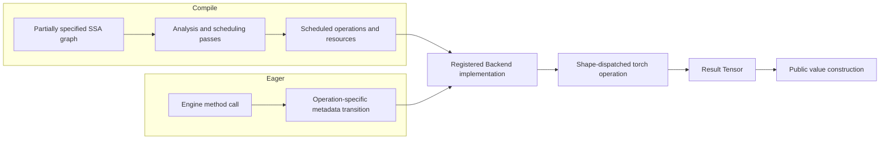

# Compiler state and eager execution

FHElium provides two ways to evaluate homomorphic programs:

- **Compile** transforms an intermediate representation (IR), an operation
  graph whose values are connected through static single assignment (SSA).
  Passes may analyze the graph, assign CKKS state, and choose a schedule before
  execution.
- **Eager** executes each operation when the caller invokes an `Engine` method.
  The caller chooses when level-changing operations occur, so no graph
  scheduler is involved.

Both paths use registered Backend implementations. They differ in who reasons
about CKKS state and when that reasoning occurs.

## Compiler state

CKKS state describes the mathematical representation of a value. Important
fields include:

- **depth**: the modulus-chain capacity available to a computation;
- **level**: a value's position in that chain after zero or more primes have
  been removed;
- **scale**: the per-value factor that relates encoded integers to approximate
  real or complex values;
- ordered prime identities, modulus basis, polynomial domain, residue form,
  and ciphertext component count.

An initial Program may leave these fields unknown. For example, a
frontend may emit multiplication before deciding where rescale or
relinearization should occur. A later sequence of passes may:

1. lower source operations to CKKS operations;
2. estimate depth and resource costs;
3. choose relinearization and rescale positions;
4. insert polynomial-representation transitions;
5. assign or propagate level and scale information;
6. form rotation-hoisting groups or other schedules.

A pass can record state in SSA types, operation attributes, analyses, or data
associated with one Compile request. Unknown fields remain valid partial
representation. A pass that requires concrete information can preserve the
operation until a later stage supplies it.

Compiler state serves graph transformation and scheduling. Native execution
receives the arithmetic resources selected from that state.

## Eager metadata transitions

Eager execution has no pass pipeline. Each `Engine` method owns the public
state transition for its operation:

```text
check public inputs
compute result metadata
execute on Tensor payloads
construct the public result
```

For example, ciphertext multiplication preserves the current prime rows,
multiplies the input scales, and produces three ciphertext components. Rescale
removes the leading active Q prime, advances the level, divides the scale by
the removed prime, and preserves either coefficient/standard or
NTT/Montgomery arithmetic state.

Conceptually, an Eager implementation expresses rescale as:

```python
dropped_prime = rescale_parameters.dropped_q_prime
result_data = implementation.run(ciphertext.data, resources)
result = Ciphertext(
    data=result_data,
    level=ciphertext.level + 1,
    scale=ciphertext.scale / dropped_prime,
    prime_ids=ciphertext.prime_ids[1:],
    polynomial_domain="coefficient",
    modulus_basis="Q",
    residue_representation="standard",
)
```

The metadata update is part of the Eager method's CKKS semantics. Registered
Backend implementations return Tensor payloads to the owner of the result
level and scale. A linked `ProgramExecutable` may expose a public CKKS function
boundary: it unwraps declared `Ciphertext` or `Plaintext` inputs and rebuilds
declared outputs from concrete Program result state after Tensor execution.
Linking checks that output level, scale, prime identities, basis, and
representation are concrete enough to rebuild each public result.

Eager placement follows PyTorch value placement. Factory-like boundary calls
use the Engine's CPU default or a caller-supplied `device`; operations with
materialized operands use their common Tensor device. A caller-supplied
`device` on a boundary operation authorizes its public adapter to move the
inputs. Ordinary homomorphic operations reject mixed-device operands.

For an in-place method, the Engine computes the new metadata and runs the
operation before replacing the input value. Public metadata changes only after
successful execution.

## Backend execution

Backend implementations execute registered operations on Tensor payloads and
concrete arithmetic resources. A resource is a modulus-parameter, NTT-table,
evaluation-key, inverse-table, or index Tensor required by an implementation.

CPU and CUDA torch operations normally derive launch dimensions and loop
extents from the input Tensor:

```text
logical batch extents
component extent
active limb-row count
ring dimension
```

They consume the parameter, key, table, or index Tensors supplied for those
rows. CKKS depth, scale, and level guide resource selection before the kernel
call.

For a complete active Q or QP basis, the configured modulus layout and Tensor
row count can identify the active parameter interval. An operation over an
arbitrary limb subset instead receives the corresponding prime identities or
already selected parameter Tensors. In both cases, execution uses the physical
correspondence between residue rows and arithmetic parameters.

Backend execution assumes that Eager semantics or Compile scheduling has
already selected a valid operation. Its checks are limited to the execution
interface and native memory safety, such as argument arity, Tensor rank, and
row bounds required by a kernel. Runtime resource mutation and placement are
caller-controlled. Eager semantics or Compile analyses establish rescale
placement, remaining depth, and scale compatibility before Backend execution.

## Static specialization and dynamic dispatch

Compile may use concrete state to create a specialized executable. For
example, a pass can statically expand the active hybrid key-switch digits or
preselect modulus rows. This is an optimization and scheduling choice.

Eager may use one implementation across multiple levels. The implementation
can select active rows from runtime Tensor dimensions and configured resources,
then invoke the same shape-dispatched torch operation. Rotation steps can
similarly share an implementation while supplying different Galois elements,
keys, or index Tensors.

The current caller-Program Backend executable selects one device for the whole
Program from its runtime Tensor inputs and build resources. Tensor-consuming
operations dispatch from operand placement. A creation operation may define a
device parameter of its own. Existing values change placement through
registered transfer operations represented in the Program.



Compile and Eager share operation implementations through independent
state-management workflows. Compile can delay state assignment and schedule a
graph; Eager applies the state transition selected directly by the caller.
Backend execution consumes Tensor operations and their arithmetic resources.

## Responsibility summary

| Layer | Responsibility |
| --- | --- |
| Compile frontend and passes | Represent partial state, analyze depth and scale, choose schedules, and insert or preserve operations |
| Eager `Engine` methods | Check public inputs, apply one called operation's metadata transition, and construct public results |
| Backend build and resource owners | Select registered implementations and provide the parameter, key, table, and index Tensors required for execution |
| Backend execution | Enforce the execution interface and invoke Tensor implementations |
| CPU/CUDA torch operations | Dispatch from Tensor dimensions and perform native arithmetic |

Related implementation maps are available in
[Compiler stack internals](compiler-stack-internals.md),
[Operation declaration and implementation selection](operation-registration-and-selection.md),
and [IR operation and implementation index](ir-operation-implementation-index.md).