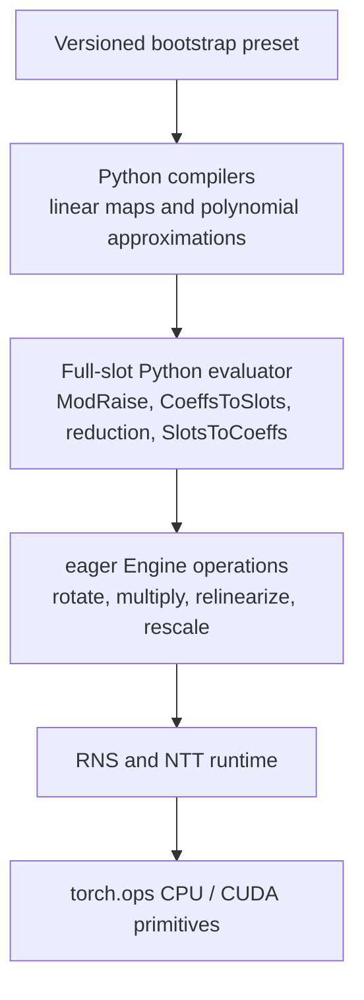

# CKKS bootstrap internals

This page specifies the mathematical, value-state, and actual-scale invariants
of the built-in full-slot composition executed through `fhelium.eager.Engine`.

## Evaluator stack



`fhelium.experimental.bootstrap` compiles diagonal linear maps and polynomial
approximations, then evaluates those stages through the ordinary
`fhelium.eager.Engine`, `Ciphertext`, NTT, and native-operator stack.

`fhelium.experimental.bootstrap.presets` constructs versioned
compositions. Compiler and evaluator objects are paired by protocol: a
compiler's stage representation must be understood by its matching evaluator,
and their `required_depths` reports must match execution. Compiled diagonals,
rotation decompositions, and ModRaise constants are Python/runtime resources;
the dense arithmetic reaches `fhelium_rns_ops`, `fhelium_ntt_ops`, and
`fhelium_ckks_ops` through the engine.

The source tree follows those responsibilities:

- `full_slot.py` owns the complete entry → ModRaise → CoeffsToSlots → periodic
  reduction → SlotsToCoeffs composition, its key requirements, and cache
  lifetime;
- `arithmetic.py` defines `BootstrapArithmetic`, which owns one Engine, the
  prepared materials, and the caller-selected representation-retention mode
  used by Bootstrap's depth-dependent arithmetic;
- `linear/` separates the diagonal value, direct/BSGS evaluators, radix-2
  compiler, and key-aware execution of compiled stages;
- `polynomial/` separates approximation values and interpolation from power-
  basis and Chebyshev evaluation schedules;
- `reduction/` owns the cosine and exponential periodic functions;
- `structural.py` owns the structural-base transition and centered ModRaise;
- `presets/` contains only caller-visible circuit assemblies.

Component `evaluate()` methods consume `BootstrapArithmetic` rather than
reaching process-local state. The same owner is passed through nested periodic
and polynomial evaluation. Its cache retains prepared plaintext materials
for reuse across those calls.

## Notation

Let:

- $N=2^{\mathtt{logN}}$ and $S=N/2$;
- $\Delta_0$ be `config.default_scale`;
- $D$ be `engine.max_depth`;
- $G_{D-1}$ be the entry Q group and $M_{D-1}=\prod_{q\in G_{D-1}}q$;
- $q_b$ be the product of the terminal Q group, used for centered ModRaise;
- $Q_d$ be the ordered Q basis recorded by a ciphertext's `prime_ids` at
  depth $d$;
- $C$ and $T$ be the unscaled CoeffsToSlots and SlotsToCoeffs maps;
- $B$ be `modular_reduction.input_bound`;
- $D$ be `modular_reduction.fused_input_divisor`, either $1$ or $B$ for the
  built-in reducers.

The radix-2 compiler convention is

$$
T(C(a))=Sa.
$$

A plaintext reference round trip therefore compiles $C$ with `scale=1.0` and
$T$ with `scale=1.0 / S`.

## Entry and structural-base transition

The input is a two-component coefficient-domain, standard-residue Q ciphertext
at `bootstrap.input_depth`, which is `max_depth - 1`. Its dense tensor has axes
`[component, *batch, limb, coefficient]`, coefficient extent $N$, and limb order
exactly equal to `prime_ids`. At that depth the Q basis contains the rows of
$G_{D-1}$ followed by the terminal group.

Entry preparation chooses an integer

$$
k=\max\left(1,\left\lceil M_{D-1}\Delta_0/\Delta_{in}\right\rceil\right).
$$

Multiplying both the ciphertext residues and scale by $k$ preserves its
message. The identity case $k=1$ returns the input directly. This avoids an
encoded-one plaintext whose small encoding scale could destroy precision.
Nearest group rescale then yields terminal scale
$\Delta_b=k\Delta_{in}/M_{D-1}$.

The fixed transform circuit operates on the coordinate
$u=(\Delta_b/\Delta_0)m$: a separate metadata view gives the terminal payload
scale $\Delta_0$. After refreshing $u$, the output scale is multiplied by
$\Delta_b/\Delta_0$ to recover coordinate $m$. These two coordinate changes
compensate one another; they are not message-preserving rescale operations.
C2S/S2C coefficients and their cached materials are independent of the input
scale. No approximate floating-point cache-key rounding or automatic material
eviction is needed.

### Arithmetic scale schedule

`BootstrapArithmetic.target_scales` holds depth-dependent targets $s_d$.
Starting from $s_D=\Delta_0$, the owner computes backward

$$
s_d=\sqrt{M_d s_{d+1}}.
$$

Thus a ciphertext product at scale $s_d$ naturally rescales to $s_{d+1}$.
Scalar, polynomial-coefficient, and diagonal plaintexts use scale
$M_d s_{d+1}/\Delta_{in}$, so their products also reach $s_{d+1}$.
This is a Bootstrap circuit schedule, not an Engine scale-alignment rule.
Every rescale retains the quotient's actual scale. Constants added to a
ciphertext are encoded at that ciphertext's scale; prepared-material caches
include the selected encoding scale.

Independent polynomial basis nodes use an arithmetic view anchored at the
input's actual scale, $t_d=\Delta_{in}$, and propagate
$t_{j+1}=t_j^2/M_j$. Copies of the input used in Chebyshev subtraction follow
the same recurrence. Coefficient products connect those basis values to the
chosen output scale. Paterson–Stockmeyer coefficient accumulators use a common
scale multiple of the basis schedule, so multiplication by an unscaled basis
power and addition of the next coefficient group remain consistent.

This does not guarantee precision for arbitrary parameters and degrees.
A basis scale can become too small after repeated products, requiring a scalar
plaintext coefficient beyond the signed-integer encoding range. Material
preparation reports that range failure instead of allowing integer overflow.
A caller can first use `arithmetic.advance_depth(input)` to place the value on
the arithmetic target schedule, accounting for that additional transition.
The evaluator does not silently consume an extra depth.

The terminal depth remains part of the general CKKS chain. Bootstrap owns this
entry requirement and uses an ordinary Engine rescale to reach it.

## Centered ModRaise

For every ciphertext component and polynomial coefficient, centered ModRaise
chooses the unique source representative

$$
\widetilde c\in
\left[-\left\lfloor\frac{q_b}{2}\right\rfloor,
       \left\lfloor\frac{q_b}{2}\right\rfloor\right]
$$

consistent with the residue modulo $q_b$, and emits
$\widetilde c\bmod q_i$ for every $q_i\in Q_{\ell_r}$, where $\ell_r$ is
`modulus_raise_target_depth`. It is a component-wise centered basis extension,
not rescale or modulus restriction.

The transition is

```text
depth D=max_depth, prime_ids G_D, coefficient, standard, Q, two components, scale Delta_0
  ->
depth ell_r, prime_ids Q_ell_r, coefficient, standard, Q, two components,
scale Delta_0
```

Data axes and batch shape are preserved; the limb extent changes from `len(G_D)` to
`len(Q_ell_r)`. Production execution uses mixed-radix native operators and
currently supports at most eight source rows. The
slow `reference_centered_basis_extend()` oracle reconstructs with Python
integers and returns a tensor shaped
`[*batch, target_limb, coefficient]` in standard residues on the input device.

`ModRaisedCiphertext` privately records the source depth, source `prime_ids`,
source modulus width, and scale. `_apply_modraised_linear()` requires that
provenance for the first linear map and then returns a core `Ciphertext`.
This prevents a centered-raised value from being mistaken for an unrelated
public Q ciphertext.

## Cyclic-diagonal linear maps

A `DiagonalLinearTransform` stores one CPU `complex128` vector $d_k$ with axes
`[slot]` for each signed rotation offset $k$. It represents

$$
L(x)=\sum_kd_k\mathbin{\odot}\operatorname{Rot}_k(x),
$$

where `Rot_k` matches `numpy.roll(x, k)`. `reference(values)` accepts exactly
one vector of shape `[slot]`, returns the same shape, and performs neither CKKS
encoding nor scale or depth simulation.

The direct evaluator rotates, plaintext-multiplies, and sums all diagonal terms,
then rescales once. BSGS writes $k=g+b$ and computes the equivalent identity

$$
\operatorname{Rot}_g\left(
 \operatorname{Rot}_b(x)\mathbin{\odot}\operatorname{Rot}_{-g}(d_{g+b})
\right)
=
\operatorname{Rot}_{g+b}(x)\mathbin{\odot}d_{g+b}.
$$

BSGS rescaling of each giant-group accumulator is algebraically equivalent to
the direct sum's single rescale because all group terms share the same pending
scale. The schedules have the same map and state transition, but different
rounding order can prevent bitwise equality.

`DiagonalBSGSEvaluator.aggregate_groups` selects a represented grouped route
when all direct baby-step keys are present. `ckks.GroupedRotationWeightedSumOp`
records the supplied baby rotations and computes
$y_g=\sum_t p_{g,t}\odot\operatorname{Rot}_{b_t}(x)$ after each hybrid key
switch completes its ordinary ModDown. Its Backend implementation hoists the
input decomposition once and passes the resulting ciphertexts to
`rns.MontgomeryWeightedSumsOp`, which accumulates all plaintext groups without
materializing a term-product axis. The evaluator retains ownership of BSGS
partitioning and giant rotations.

For either evaluator, diagonal plaintexts are unbatched
`[limb, ntt_index]` tensors in NTT/Montgomery form over the active Q basis.
They broadcast over ciphertext batch axes. At depth $d$ and input scale
$\Delta$, their encoding scale is $M_d s_{d+1}/\Delta$. One group rescale
therefore returns scale $s_{d+1}$, advances depth once, and removes all rows
in that group. The output has two coefficient-domain standard-RNS components.

## CoeffsToSlots, branch split, and coordinates

Construction compiles numerical factors

$$
\alpha_C=\frac{\Delta_0}{q_bD},\qquad
\alpha_T=\frac{q_b}{2\Delta_0}.
$$

The factors multiply diagonal values; they are distinct from the diagonal
plaintext's encoding scale selected by `BootstrapArithmetic`. Let $a$ denote the
coefficient-coordinate value represented by the centered-raised ciphertext at
metadata scale $\Delta_0$. Define

$$
w=\frac{\Delta_0}{Sq_b}C(a),\qquad
r_{\rm R}=2\operatorname{Re}(w),\qquad
r_{\rm I}=2\operatorname{Im}(w).
$$

After the compiled CoeffsToSlots stages, `_multiply_scalar(..., 1 / S)` consumes
one depth and retains the actual scale selected by the arithmetic schedule. The
represented complex coordinate is $w/D$.

Conjugation gives $\overline{w}/D$. Addition exposes $2\operatorname{Re}(w)/D$;
subtraction exposes $2i\operatorname{Im}(w)/D$. Under the full-slot cyclotomic
order used by the generator-5 profile, multiplication by $X^{3S}$
converts the latter to $2\operatorname{Im}(w)/D$. Therefore:

- if normalization is not fused, $D=1$ and the reducers receive raw coordinates
  $r_{\rm R}$ and $r_{\rm I}$;
- if normalization is fused, $D=B$ and they receive normalized coordinates
  $x_{\rm R}=r_{\rm R}/B$ and $x_{\rm I}=r_{\rm I}/B$.

Conjugation, branch addition/subtraction, and monomial multiplication preserve
depth, actual scale, two components, Q basis, domain, residue representation,
and `prime_ids`.

## Periodic reduction

The raw coordinate is $r$. The normalized polynomial coordinate is a distinct
object

$$
x=r/B\in[-1,1].
$$

Both built-in reducers target

$$
\rho_B(x)=\frac{\sin(\pi Bx)}{\pi}
          =\frac{\sin(\pi r)}{\pi}.
$$

For $r=2k+\epsilon$, the periodic target is
$\sin(\pi\epsilon)/\pi\approx\epsilon$. Neither a reducer nor a factory can
inspect encrypted $r$, so $|r|\le B$ is a caller-established precondition.

The method inputs deliberately differ:

- `reference(values)` always consumes normalized $x$ and applies the fitted
  polynomial and recurrence directly;
- non-fused `evaluate(...)` consumes raw $r$ and spends one scalar-multiply
  depth computing $x=r/B$;
- fused `evaluate(...)` assumes the caller already supplied $x$.

### Cosine recurrence

For $R=$ `double_angle_iterations`, the fitted seed is

$$
z_0(x)\mathrel{\approx}
\pi^{-1/2^R}
\cos\left(\frac{\pi Bx}{2^R}-\frac{\pi}{2^{R+1}}\right),
$$

followed by

$$
z_j=2z_{j-1}^2-\pi^{-1/2^{R-j}},\qquad j=1,\ldots,R.
$$

The final value approximates $\rho_B(x)$. Every square uses ciphertext
multiplication, relinearization, and group rescale with actual scale retained.

### Exponential recurrence

The power-basis seed truncates

$$
z_0(x)=\exp(i\pi x)
       =\sum_{n=0}^{\infty}\frac{(i\pi)^n}{n!}x^n.
$$

For $K=\log_2 B$, repeated squaring approximates
$z_K=\exp(i\pi Bx)$. Conjugation and scalar multiplication extract

$$
\frac{z_K-\overline{z_K}}{2i\pi}\mathrel{\approx}\rho_B(x).
$$

The output of each built-in reduction is a functional two-component,
coefficient-domain standard-RNS Q ciphertext at input depth plus
`required_depths`, unchanged batch shape, and the corresponding active
`prime_ids`. Its actual scale follows the arithmetic schedule and quotient
scales; it need not equal $\Delta_0$.

## Polynomial basis and evaluator requirements

`PolynomialApproximation.coefficients` is always ascending degree:

$$
p(x)=\sum_{n=0}^{d}a_nx^n
\quad\text{or}\quad
p(x)=\sum_{n=0}^{d}a_nT_n(x).
$$

`ChebyshevInterpolator` maps a physical coordinate $t\in[a,b]$ to

$$
x=\frac{2t-(a+b)}{b-a}.
$$

Its returned coefficients are functions of $x$, even though `domain` records
$[a,b]$. `evaluate_plaintext()` and the homomorphic evaluators do not apply this
affine normalization. The caller must provide the basis coordinate and account
for any depth required to compute it.

`BalancedPowerEvaluator` uses shared balanced powers.
`BinaryDecompositionChebyshevEvaluator` uses

$$
T_{2n}=2T_n^2-1,\qquad
T_{2n+1}=2T_nT_{n+1}-T_1.
$$

Both consume a two-component coefficient-domain standard-RNS Q ciphertext and
return the same state at the declared deeper depth. Ciphertext products
temporarily enter NTT/Montgomery form, produce three components, relinearize to
two components, then divide actual scale by the group product during rescale.

## Recombination, SlotsToCoeffs, and output

After periodic reduction, multiplication of the imaginary result by $X^S$
restores its imaginary placement. Branch addition represents

$$
\rho(r_{\rm R})+i\rho(r_{\rm I}),
\qquad
\rho(r)=\frac{\sin(\pi r)}{\pi}.
$$

The fixed SlotsToCoeffs factor $q_b/(2\Delta_0)$ cancels the branch-split
factor for the internal coordinate $u$. Its result initially records the
circuit's actual output scale. Multiplying that metadata scale by
$\Delta_b/\Delta_0$ then changes coordinates from refreshed $u$ back to $m$.

The output depth is

$$
\ell_{\rm out}=\ell_r+m_C+1+m_\rho+m_T,
$$

where $m_C$ and $m_T$ are the declared CoeffsToSlots and SlotsToCoeffs stage
costs and $m_\rho$ is `modular_reduction.required_depths`. The output is a
functional two-component coefficient-domain standard-RNS Q ciphertext with
unchanged batch axes and `Q_ell_out` `prime_ids`.

## Primitive keys, caches, and factory requirements

`required_rotations` is the union of direct or BSGS transform offsets.
`key_steps("direct")` returns that inventory. `key_steps("power_of_two")` returns
signed-power components that `_rotate_with_key_inventory()` composes online.
`create_rotation_keys()` generates only the selected `RotationKeySet`. The
callable accepts one `EvaluationKeySet` through `evaluation_keys=`; that set
contains the rotation inventory, the required conjugation key, and a
relinearization key when the selected reduction performs ciphertext products.
Built-in reductions reject a missing relinearization key; a custom slotwise
reduction without ciphertext products may omit it. Branch splitting always
requires conjugation, and the same primitive is passed to the reduction for
algorithms such as exponential sine extraction. The replaceable reduction
stage is slotwise and does not receive or add rotation-key requirements.

The callable's optional diagonal cache retains prepared plaintexts, its
constant cache retains prepared scalar and monomial materials, its rotation
cache contains integer decompositions, and its ModRaise cache contains
modulus-dependent arithmetic tables. `clear_cache()` releases all of these
callable-owned caches. None is part of ciphertext identity or serialized
arithmetic state.

The versioned `logn16` factories document a configuration derived
from `Preset.slots32768_scale50_depth27_int64` for
a `CkksConfig` configured with `galois_generator=5`. Construction enforces only:

- a valid target depth;
- $q_b/\Delta_0\in[0.5,2]$;
- nonempty compiled transforms with the engine's slot count;
- sufficient public Q depth for the declared component costs.

The application must establish the input-range bound, validate numerical
accuracy, and define workload benchmark acceptance criteria. Construction does
not verify derivation from the documented preset baseline or certify those
workload properties.
