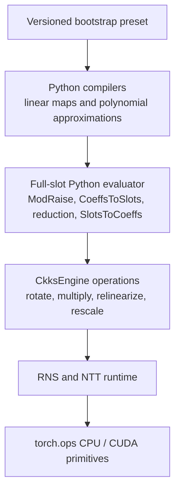

# CKKS bootstrap internals

This page specifies the mathematical, value-state, and actual-scale invariants
of the built-in full-slot composition executed through `CkksEngine`.

## Evaluator stack



`fhelium.experimental.bootstrap` compiles diagonal linear maps and polynomial
approximations, then evaluates those stages through the ordinary
`CkksEngine`, `Ciphertext`, NTT, and native-operator stack.

`fhelium.experimental.bootstrap.presets` constructs versioned measured
compositions. Compiler and evaluator objects are paired by protocol: a
compiler's stage representation must be understood by its matching evaluator,
and their `required_levels` reports must match execution. Compiled diagonals,
rotation decompositions, and ModRaise constants are Python/runtime resources;
the dense arithmetic reaches `fhelium_rns_ops`, `fhelium_ntt_ops`, and
`fhelium_ckks_ops` through the engine.

## Notation

Let:

- $N=2^{\mathtt{logN}}$ and $S=N/2$;
- $\Delta_0$ be `config.default_scale`;
- $L$ be `engine.public_level_count`, so the final public level is $L-1$;
- $q_s$ be the leading scale prime at level $L-1$;
- $q_b$ be the final structural Q prime;
- $Q_\ell$ be the ordered Q basis named by
  `engine.rns_layout.prime_ids(level=ell)`;
- $C$ and $T$ be the unscaled CoeffsToSlots and SlotsToCoeffs maps;
- $B$ be `modular_reduction.input_bound`;
- $D$ be `modular_reduction.fused_input_divisor`, either $1$ or $B$ for the
  built-in reducers.

The radix-2 compiler convention is

$$
T(C(a))=Sa.
$$

A plaintext reference round trip therefore compiles $C$ with `scale=1.0` and
$T$ with `scale=1.0 / S`.

## Entry and structural-base transition

The input is a two-component coefficient-domain, standard-residue Q ciphertext
at final public level $L-1$. Its dense tensor has axes
`[component, *batch, limb, coefficient]`, coefficient extent $N$, and limb order
exactly equal to `prime_ids`. At that level the Q basis is `[q_s, q_b]`.

The accepted actual scale $\Delta_{\rm in}$ is near either $\Delta_0$ or
$\Delta_0^2$:

1. If $\Delta_{\rm in}$ is near $\Delta_0$, `_prepare_entry()` multiplies by an
   NTT/Montgomery RNS encoding of $1$ at scale $\Delta_0$. The level and basis
   do not change, the ciphertext remains coefficient-domain standard RNS, and
   the pending scale is

   $$
   \Delta_{\rm pre}=\Delta_{\rm in}\Delta_0.
   $$

2. If $\Delta_{\rm in}$ is already near $\Delta_0^2$, the value passes through
   and $\Delta_{\rm pre}=\Delta_{\rm in}$.

3. `_rescale_to_structural_base()` applies nearest-integer division by $q_s$:

   $$
   c_b=\operatorname{Round}(c_{\rm pre}/q_s)\pmod{q_b},\qquad
   \Delta_b^{\rm actual}=\Delta_{\rm pre}/q_s.
   $$

   It removes the $q_s$ row, enters private internal level $L$ over `[q_b]`,
   and then deliberately changes only metadata from
   $\Delta_b^{\rm actual}$ to $\Delta_0$. This reinterpretation changes the
   represented message by the factor
   $\Delta_b^{\rm actual}/\Delta_0$; it is a metadata reinterpretation, not a
   rescale result.

This private structural level is not a public CKKS computation level.

## Centered ModRaise

For every ciphertext component and polynomial coefficient, centered ModRaise
chooses the unique source representative

$$
\widetilde c\in
\left[-\left\lfloor\frac{q_b}{2}\right\rfloor,
       \left\lfloor\frac{q_b}{2}\right\rfloor\right]
$$

consistent with the residue modulo $q_b$, and emits
$\widetilde c\bmod q_i$ for every $q_i\in Q_{\ell_r}$, where $\ell_r$ is
`modulus_raise_target_level`. It is a component-wise centered basis extension,
not rescale or modulus restriction.

The transition is

```text
level L, prime_ids [q_b], coefficient, standard, Q, two components, scale Delta_0
  ->
level ell_r, prime_ids Q_ell_r, coefficient, standard, Q, two components,
scale Delta_0
```

Data axes and batch shape are preserved; the limb extent changes from one to
`len(Q_ell_r)`. Production execution uses mixed-radix native operators. The
slow `reference_centered_basis_extend()` oracle reconstructs with Python
integers and returns a tensor shaped
`[*batch, target_limb, coefficient]` in standard residues on the input device.

`ModRaisedCiphertext` privately records the source level, source `prime_ids`,
source modulus width, and scale. `_apply_modraised_linear()` requires that
provenance for the first linear map and then returns a core `Ciphertext`.
This prevents a centered-raised value from being mistaken for an unrelated
public Q ciphertext.

## Cyclic-diagonal linear maps

A `DiagonalLinearTransform` stores one CPU `complex128` vector $d_k$ with axes
`[slot]` for each signed rotation offset $k$. It represents

$$
L(x)=\sum_kd_k\mathbin{\odot}\operatorname{Rot}_k(x),
$$

where `Rot_k` matches `numpy.roll(x, k)`. `reference(values)` accepts exactly
one vector of shape `[slot]`, returns the same shape, and performs neither CKKS
encoding nor scale or level simulation.

The direct evaluator rotates, plaintext-multiplies, and sums all diagonal terms,
then rescales once. BSGS writes $k=g+b$ and computes the equivalent identity

$$
\operatorname{Rot}_g\left(
 \operatorname{Rot}_b(x)\mathbin{\odot}\operatorname{Rot}_{-g}(d_{g+b})
\right)
=
\operatorname{Rot}_{g+b}(x)\mathbin{\odot}d_{g+b}.
$$

BSGS rescaling of each giant-group accumulator is algebraically equivalent to
the direct sum's single rescale because all group terms share the same pending
scale. The schedules have the same map and state transition, but different
rounding order can prevent bitwise equality.

For either evaluator, diagonal plaintexts are unbatched
`[limb, ntt_index]` tensors in NTT domain with Montgomery residues, Q basis,
actual scale $\Delta_0$, and active `prime_ids`. An unbatched diagonal
broadcasts across homogeneous ciphertext batch axes. If a stage starts at
level $\ell_j$ with scale $\Delta_j$ and leading prime $q_j$, then

$$
\ell_{j+1}=\ell_j+1,\qquad
\Delta_{j+1}=\frac{\Delta_j\Delta_0}{q_j}.
$$

The result has axes `[component, *batch, limb, coefficient]`, two components,
coefficient domain, standard residues, Q basis, and `prime_ids` with the leading
row removed. Ordinary transform stages do not reinterpret scale metadata.

## CoeffsToSlots, branch split, and coordinates

Construction compiles numerical factors

$$
\alpha_C=\frac{\Delta_0}{q_bD},\qquad
\alpha_T=\frac{q_b}{2\Delta_0}.
$$

The factors multiply diagonal values; they are distinct from the diagonal
plaintext's metadata scale $\Delta_0$. Let $a$ denote the
coefficient-coordinate value represented by the centered-raised ciphertext at
metadata scale $\Delta_0$. Define

$$
w=\frac{\Delta_0}{Sq_b}C(a),\qquad
r_{\rm R}=2\operatorname{Re}(w),\qquad
r_{\rm I}=2\operatorname{Im}(w).
$$

After the compiled CoeffsToSlots stages, `_multiply_scalar(..., 1 / S)` consumes
one level and explicitly returns scale $\Delta_0$. The represented complex
coordinate is $w/D$.

Conjugation gives $\overline{w}/D$. Addition exposes $2\operatorname{Re}(w)/D$;
subtraction exposes $2i\operatorname{Im}(w)/D$. Under the full-slot cyclotomic
order used by the measured generator-5 profile, multiplication by $X^{3S}$
converts the latter to $2\operatorname{Im}(w)/D$. Therefore:

- if normalization is not fused, $D=1$ and the reducers receive raw coordinates
  $r_{\rm R}$ and $r_{\rm I}$;
- if normalization is fused, $D=B$ and they receive normalized coordinates
  $x_{\rm R}=r_{\rm R}/B$ and $x_{\rm I}=r_{\rm I}/B$.

Conjugation, branch addition/subtraction, and monomial multiplication preserve
level, actual scale, two components, Q basis, domain, residue representation,
and `prime_ids`.

## Periodic reduction

The raw coordinate is $r$. The normalized polynomial coordinate is a distinct
object

$$
x=r/B\in[-1,1].
$$

Both built-in reducers target

$$
\rho_B(x)=\frac{\sin(\pi Bx)}{\pi}
          =\frac{\sin(\pi r)}{\pi}.
$$

For $r=2k+\epsilon$, the periodic target is
$\sin(\pi\epsilon)/\pi\approx\epsilon$. Neither a reducer nor a factory can
inspect encrypted $r$, so $|r|\le B$ is a caller-established precondition.

The method inputs deliberately differ:

- `reference(values)` always consumes normalized $x$ and applies the fitted
  polynomial and recurrence directly;
- non-fused `evaluate(...)` consumes raw $r$ and spends one scalar-multiply
  level computing $x=r/B$;
- fused `evaluate(...)` assumes the caller already supplied $x$.

### Cosine recurrence

For $R=$ `double_angle_iterations`, the fitted seed is

$$
z_0(x)\mathrel{\approx}
\pi^{-1/2^R}
\cos\left(\frac{\pi Bx}{2^R}-\frac{\pi}{2^{R+1}}\right),
$$

followed by

$$
z_j=2z_{j-1}^2-\pi^{-1/2^{R-j}},\qquad j=1,\ldots,R.
$$

The final value approximates $\rho_B(x)$. Every square uses ciphertext
multiplication, relinearization, rescale, and explicit reinterpretation at
$\Delta_0$.

### Exponential recurrence

The power-basis seed truncates

$$
z_0(x)=\exp(i\pi x)
       =\sum_{n=0}^{\infty}\frac{(i\pi)^n}{n!}x^n.
$$

For $K=\log_2 B$, repeated squaring approximates
$z_K=\exp(i\pi Bx)$. Conjugation and scalar multiplication extract

$$
\frac{z_K-\overline{z_K}}{2i\pi}\mathrel{\approx}\rho_B(x).
$$

The output of each built-in reduction is a functional two-component,
coefficient-domain standard-RNS Q ciphertext at input level plus
`required_levels`, actual scale $\Delta_0$, unchanged batch shape, and the
corresponding active `prime_ids`.

## Polynomial basis and evaluator requirements

`PolynomialApproximation.coefficients` is always ascending degree:

$$
p(x)=\sum_{n=0}^{d}a_nx^n
\quad\text{or}\quad
p(x)=\sum_{n=0}^{d}a_nT_n(x).
$$

`ChebyshevInterpolator` maps a physical coordinate $t\in[a,b]$ to

$$
x=\frac{2t-(a+b)}{b-a}.
$$

Its returned coefficients are functions of $x$, even though `domain` records
$[a,b]$. `evaluate_plaintext()` and the homomorphic evaluators do not apply this
affine normalization. The caller must provide the basis coordinate and account
for any level required to compute it.

`BalancedPowerEvaluator` uses shared balanced powers.
`BinaryDecompositionChebyshevEvaluator` uses

$$
T_{2n}=2T_n^2-1,\qquad
T_{2n+1}=2T_nT_{n+1}-T_1.
$$

Both consume a two-component coefficient-domain standard-RNS Q ciphertext and
return the same state at the declared deeper level. Ciphertext products
temporarily enter NTT/Montgomery form, produce three components, relinearize to
two coefficient-domain components, rescale, and reinterpret at $\Delta_0$.

## Recombination, SlotsToCoeffs, and output

After periodic reduction, multiplication of the imaginary result by $X^S$
restores its imaginary placement. Branch addition represents

$$
\rho(r_{\rm R})+i\rho(r_{\rm I}),
\qquad
\rho(r)=\frac{\sin(\pi r)}{\pi}.
$$

The compiled SlotsToCoeffs factor $q_b/(2\Delta_0)$ cancels the branch-split
factor two and the structural normalization. If SlotsToCoeffs begins at level
$\ell_T$ with scale $\Delta_0$ and contains $m_T$ stages, its scale recurrence
gives

$$
\Delta_{\rm out}=\Delta_0
\prod_{j=0}^{m_T-1}\frac{\Delta_0}{q_{\ell_T+j}}.
$$

There is no final implicit reset to $\Delta_0$. The output level is

$$
\ell_{\rm out}=\ell_r+m_C+1+m_\rho+m_T,
$$

where $m_C$ and $m_T$ are the declared CoeffsToSlots and SlotsToCoeffs stage
costs and $m_\rho$ is `modular_reduction.required_levels`. The output is a
functional two-component coefficient-domain standard-RNS Q ciphertext with
unchanged batch axes and `Q_ell_out` `prime_ids`.

## Primitive keys, caches, and factory requirements

`required_rotations` is the union of direct or BSGS transform offsets.
`key_steps("direct")` returns that inventory. `key_steps("power_of_two")` returns
signed-power components that `_rotate_with_key_inventory()` composes online.
`create_rotation_keys()` generates only the selected `RotationKeySet`. The
callable accepts that set and a `ConjugationKey` as required keyword-only
arguments, plus an optional `RelinearizationKey`. Built-in reductions reject a
missing relinearization key; a custom slotwise reduction without ciphertext
products may omit it. Branch splitting always requires conjugation, and the
same primitive is passed to the reduction for algorithms such as exponential
sine extraction. The replaceable reduction stage is slotwise and does not
receive or add rotation-key requirements.

The callable's optional diagonal cache retains prepared plaintexts. Its rotation
cache contains integer decompositions, and its ModRaise cache contains
modulus-dependent arithmetic tables. `clear_cache()` releases all three. None is
part of ciphertext identity or serialized arithmetic state.

The versioned `logn16` factories document a measured configuration derived
from `Preset.slots32768_scale50_levels27_int64` with `base_prime_bits=50` and bound
to an engine using `galois_generator=5`. Construction enforces only:

- a valid target level;
- $q_b/\Delta_0\in[0.5,2]$;
- nonempty compiled transforms with the engine's slot count;
- sufficient public Q depth for the declared component costs.

The application must establish the input-range bound, validate numerical
accuracy, and define workload benchmark acceptance criteria. Construction does
not verify derivation from the documented preset baseline or certify those
workload properties.
