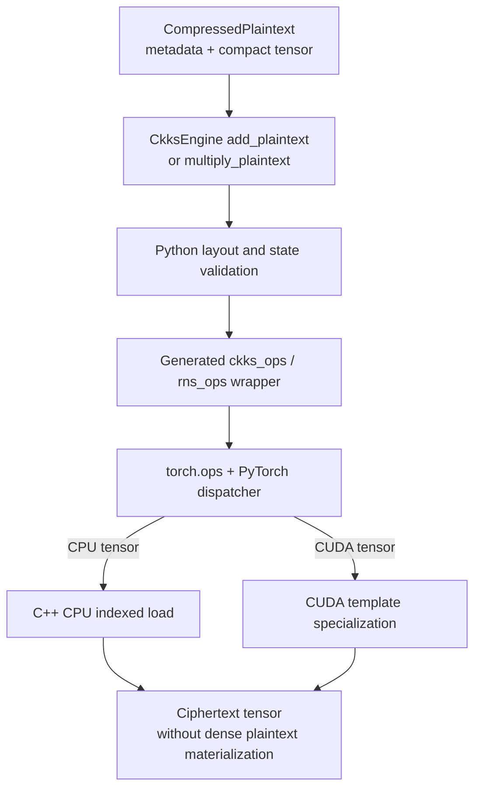

# CompressedPlaintext internals

`CompressedPlaintext` is an operation-ready RNS value whose last axis can be
reconstructed without loss from repeated values. Its implementation defines
value metadata, reconstruction rules, dispatcher boundaries, and native
arithmetic paths.

`Plaintext` remains the standard CKKS representation. `CompressedPlaintext` uses a separate representation and arithmetic path rather than changing standard plaintext encoding.

## Execution path

Compression layout is value metadata. `CkksEngine` validates that
metadata and selects one named native operator before dispatch. Cyclic,
contiguous, and strided-sparse layouts do not travel through one runtime mode
argument: they use distinct schemas or dedicated Python paths. PyTorch then
selects the CPU or CUDA registration from tensor device, as it does for dense
plaintext operations.

## Encoded-axis layouts

Compression format version 1 freezes the following encoded-axis expansion
formulas. A future incompatible mapping must use another format version rather
than reinterpret an existing artifact.

For compact width `U` and ring dimension `N`, `U` and `N/U` are powers of two.
The supported physical layouts are:

- **cyclic**: dense index `i` reads compact index `i mod U`;
- **contiguous**: dense index `i` reads compact index `floor(i / (N/U))`.
- **strided_sparse**: compact index `u` occupies dense index `u * (N/U)`;
  other positions carry one stored implicit value per batch and limb.

The native repeated-value kernels use a mask for cyclic indexing and a
precomputed shift for contiguous indexing. Strided addition visits all `N`
output positions but loads each right-hand-side value directly from either the
compact support tensor or the per-row implicit tensor; it never materializes a
dense plaintext. This preserves the encoded behavior for arbitrary implicit values
and does not assume that ciphertext residues outside the support are already
canonical. The compact value carries a frozen compression-format version,
`N`, the compression layout, level, scale, context, polynomial domain, modulus basis,
residue representation, and ordered prime IDs. It is therefore serializable,
transferable, residency-managed, execution-signatured, and
CUDA-Graph-compatible when resident on CUDA, without an engine reference.

Repeated layout selection happens in Python before native execution. Cyclic
and contiguous arithmetic have distinct Torch operator schemas with CPU and
CUDA dispatcher implementations; the CUDA implementation uses distinct
template specializations. No operator accepts a runtime layout string or
integer mode, and no kernel branches on representation. This makes the
value metadata a compilation guard while keeping each captured or compiled
operator schedule static.

`CompressedPlaintext.from_plaintext` is a checked conversion. It validates the
encoded tensor bit-for-bit and clones the compact slice so the result does not
retain the dense input's storage. `to_plaintext` is the inverse and is
not called by evaluator kernels.

## Why encoded layout is distinct from slot layout

The compression layout describes the operation-ready polynomial/NTT tensor,
not semantic CKKS slot order. The CKKS canonical embedding permutes slots, and
encoding rounds polynomial coefficients to integers.

A power-of-two periodic slot vector
`[a, b, a, b, ...]` occupies a coordinate-aligned subspace: its coefficient
encoding is strided sparse, and its NTT representation has `2r` values
in contiguous blocks for slot period `r`. The NTT plaintext is therefore
losslessly representable by this type with `U = 2r`.

A contiguous semantic slot vector
`[a, ..., a, b, ..., b]` does not generally have the same property. Its
coefficient polynomial is dense, and independent integer coefficient rounding
usually destroys residue equality among NTT positions. The source message still
has a compact semantic description, but treating that as an operation-ready
compressed RNS plaintext would not be a lossless representation of standard
CKKS encoding. The checked constructor rejects it rather than silently
changing encoding semantics.

This distinction is why the public compression names are
*encoded-axis* layouts. An application/compiler may select a packing that maps
its logical data to a compressible slot order; core arithmetic does not infer
or rewrite packing policy.

## Arithmetic paths

- `add_plaintext` accepts coefficient-domain `CompressedPlaintext`; repeated
  layouts use a fused indexed kernel and `strided_sparse` reads compact support
  and implicit row values directly.
- `multiply_plaintext` accepts NTT-domain `CompressedPlaintext` and uses a
  compressed-right-hand-side Montgomery multiplication kernel.
- Batch matching and the one unbatched-broadcast case are identical to
  standard RNS plaintext rules.
- No evaluator operation materializes `N` plaintext elements.

Periodic-slot coefficient addition uses `strided_sparse`, while multiplication
uses the independently materialized NTT compressed value. As with standard
`Plaintext`, represent both arithmetic states as two values.

## Source map

| Responsibility | Source |
| --- | --- |
| Compressed value, layouts, checks, and expansion | `fhelium/core/compressed_plaintext.py` |
| Evaluator selection and ciphertext reconstruction | `fhelium/engine/ckks_engine.py` |
| Generated plaintext and Montgomery wrappers | `fhelium/native/wrapper/{ckks_ops,rns_ops}.py` |
| Backend-neutral compressed operator schemas | `csrc/ops/ckks/ckks.cpp`, `csrc/ops/rns/rns_arithmetic.cpp` |
| CPU plaintext and RNS implementations | `csrc/ops/ckks/cpu/`, `csrc/ops/rns/cpu/` |
| CUDA plaintext and RNS implementations | `csrc/ops/ckks/cuda/`, `csrc/ops/rns/cuda/` |
| Conversion and arithmetic tests | `tests/test_compressed_plaintext.py` |
