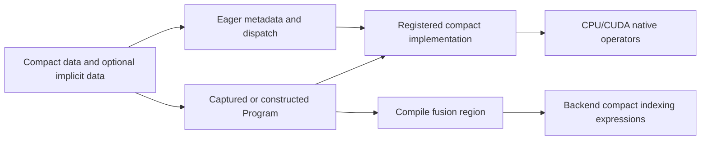

# Compressed plaintext storage and execution

`CompressedPlaintext` represents an RNS plaintext through compact coefficient or NTT rows and an encoded-axis expansion rule. FHElium can check and compress existing dense encoded data or prepare compact data directly from one period of message slots. Eager, captured Programs, and generated arithmetic consume the compact storage through the same represented layouts.

## What is stored?

The public Tensor `data` has shape `[*batch, limb, U]`, where `U` is `unique_count`. The value records full `ring_dimension=N`, layout, depth, actual scale, ordered `prime_ids`, basis, polynomial domain, and residue representation. `U<N`, and both extents are powers of two. Coefficient data can use standard or Montgomery residues; NTT data uses Montgomery residues.

Let $R=N/U$ and let $v_u$ denote one compact row. The three layouts define the expanded row $p_i$ as follows:

| Layout | Encoded-axis expansion |
| --- | --- |
| `cyclic` | $p_i=v_{i\bmod U}$ |
| `contiguous` | $p_i=v_{\lfloor i/R\rfloor}$ |
| `strided_sparse` | $p_{uR}=v_u$; other positions use a stored implicit value |

`strided_sparse` adds `implicit_data` of shape `[*batch, limb]`, with the same dtype and device as `data`. The implicit value can be nonzero. Numerical operation adapters supply it with a final singleton axis when an implementation expects `[*batch, limb, 1]`.

`values/compressed_plaintext.py` owns these layouts and value operations. Direct construction retains supplied storage. Cloning and decompression allocate independent storage; batch selection and unbinding produce storage-sharing views. Limb and batch operations must preserve both compact and implicit Tensor leaves. `serialization/value.py` writes `compression_format_version` into the serialized value metadata.

## How is an existing encoding compressed?

`CompressedPlaintext.from_plaintext` checks whether the dense encoded Tensor obeys the requested expansion formula bit for bit. It clones the compact slice and any implicit values, preserving depth, scale, domain, basis, residue form, dtype, device, and prime rows. `decompress_data` and `to_plaintext` reconstruct that checked representation.

This check operates on encoded coefficients or NTT evaluations. Semantic slot repetition and encoded-axis repetition are different properties because the CKKS embedding permutes coordinates and quantizes polynomial coefficients. A short description of a slot vector is not sufficient to select an encoded layout; its encoded data must satisfy the chosen formula.

## How does direct periodic preparation work?

`Engine.prepare_compressed_plaintext` interprets its last message axis as one period of slots, repeated semantically to fill $N/2$ slots. `backend/ckks/codec/_periodic.py` computes the encoded subring extent

$$
U=\max(U_{\min},2r),\qquad
U_{\min}=\begin{cases}4,&\text{generator 3},\\2,&\text{generator 5},\end{cases}
$$

where $r$ is the supplied period. The period must be a power of two dividing $N/2$, and $U$ must be smaller than $N$. In particular, generator-3 period one uses four encoded coefficients. Its slot ordering alternates the two conjugacy classes modulo four.

The compact embedding constructs a degree-below-$U$ polynomial $a$ such that the full-ring polynomial is

$$
p(X)=a(X^R),\qquad R=N/U.
$$

Only coefficients at indices $jR$ are stored. `periodic_materials` builds the compact slot permutation, twister, RNS parameters, rounding-state operand, and indexed NTT tables. It derives each compact transform root from the selected full-ring prime's root:

$$
\psi_U=\psi_N^{N/U}.
$$

Using that target-root mapping makes the compact transform's bit-reversed entries correspond to contiguous blocks of $R$ evaluations in the full transform. Choosing an unrelated primitive root for the smaller ring could change evaluation ordering even though both roots are mathematically valid.

`prepare_periodic_tensor` performs the $U$-point inverse embedding, quantizes the scaled coefficients, and lifts them into the selected Q or QP rows. Coefficient output stores Montgomery residues in `strided_sparse` layout with zero implicit rows. NTT output transforms the compact rows and returns `contiguous` layout in NTT/Montgomery form. Both retain the requested depth and actual scale. This path constructs compact coefficient and transform data directly, without allocating an expanded length-$N$ plaintext.

## How is rounding aligned with a full-ring stream?

`rng.csprng.stochastic_round_` accepts `word_stride=R` for compact preparation. Stored coefficient $j$ uses random word $jR$ from the corresponding full-ring coefficient stream. The state advances by $N$ words per batch item, including the omitted coefficient positions. The generator retains its key/nonce and advances its counters and intra-block position.

The smaller FFT and a full-ring FFT can have different floating-point roundoff near integer-quantization thresholds. Aligned random-word selection preserves the stream positions, but direct compact preparation can still produce different rounded integers from a separately encoded expanded message. Checked compression preserves an existing encoding bit for bit; direct preparation computes a compact encoding with its own FFT quantization. Numerical comparison should identify which of these two contracts is being evaluated.

## How do addition and multiplication read compact data?

`backend/ckks/arithmetic.py` implements `NativeCompressedPlaintextImplementation`. Eager dispatches `ckks.AddCompressedPlaintextOp` or `ckks.MultiplyCompressedPlaintextOp`; linked Programs resolve those same operations. All three layouts support the following arithmetic:

| Operation | Input state | Effect |
| --- | --- | --- |
| Coefficient addition | Coefficient/standard ciphertext and coefficient/Montgomery plaintext | Add $p$ to component zero; preserve ciphertext state and scale |
| NTT addition | NTT/Montgomery ciphertext and plaintext | Add the represented NTT value to component zero; preserve state and scale |
| NTT multiplication | NTT/Montgomery ciphertext and plaintext | Multiply every component by $p$; multiply actual scales and preserve depth/rows |

Addition requires matching actual scales and compatible depth, rows, basis, shape, and domain. Native coefficient-add primitives reduce the compact Montgomery plaintext before adding it. Writing $M$ for the Montgomery radix, NTT addition first converts compact $pM$ to $pM^2$ so the same primitive's reduction contributes $pM$ to ciphertext $cM$.

Cyclic and contiguous paths use named indexed native schemas. Sparse addition reads compact support and implicit row values directly. Sparse multiplication computes the implicit-position products using the one-value cyclic path, then replaces the strided support positions with their compact products. Full ciphertext outputs are allocated as required by functional arithmetic; the plaintext remains compact. In-place methods retain the public method's mutation contract.

## How does generated fusion represent a compact operand?

`backend/triton/_expressions.py::compact_value` creates a compact-load expression containing layout, $U$, $R$, and optional implicit input. It indexes that expression at the full ciphertext extent. Coefficient addition converts the compact Montgomery value before adding to component zero; NTT addition retains its Montgomery value; multiplication applies the compact expression to each ciphertext component.

The expression graph preserves input strides, batch mapping, and escaping results under the selected implementation's layout support. Fusion can combine compact arithmetic with other compatible pointwise operations and NTT endpoints. It emits compact loads inside those kernels rather than constructing a dense plaintext Tensor first.

## How are compact values captured and returned?

`compile/frontend/_eager_capture.py` captures direct periodic preparation as `PrepareCompressedPlaintextOp` with supplied compact table and rounding-state operands. Coefficient preparation has separate compact and implicit results; NTT preparation has one compact result. Captured arithmetic retains the layout, represented value state, and both numerical inputs when implicit data is present.

Captured inputs can carry compact and implicit Tensor leaves. Structured outputs use a `compressed_plaintext` descriptor containing metadata and separate data/implicit references; `compile/_preparation.py::restore_output` rebuilds the public value within tuple, list, or mapping outputs. Updating compact data while dropping the implicit leaf would change the represented plaintext.

## How are grouped matrix products composed?

`Engine.sum_plaintext_product_groups` accepts a rectangular $G\times T$ matrix of dense or compressed plaintexts and shared ciphertext terms:

$$
y_g=\sum_{t=0}^{T-1}c_t p_{g,t}.
$$

The output inserts the group axis as the first batch axis, preserves depth and rows, and has scale $\Delta_c\Delta_p$. With compressed entries, Eager composes compact `multiply_plaintext` calls and ciphertext sums, then stacks the group outputs. Dense-only inputs can use the registered grouped weighted-sum implementation.

`sum_rotated_plaintext_product_groups` first forms the caller's direct rotation group, retaining NTT/Montgomery outputs, then applies the same grouped plaintext matrix. A `None` key denotes the unrotated term. The compressed path reuses those rotated terms across groups and keeps compact plaintext storage throughout.

Capture expands the grouped APIs into visible multiplication, addition, rotation, and batch-composition operations. The ordinary Compile passes can then select compatible fusion and reuse. These APIs execute the supplied grouping; the caller or a linear-transform pass supplies matrix layout and rotation membership. `experimental/bootstrap/linear/evaluators.py` is one consumer of the grouped interfaces.

## Source and related mechanisms

| Mechanism | Source owner |
| --- | --- |
| Compact value storage and checked conversion | `fhelium/values/compressed_plaintext.py` |
| Direct periodic embedding and target-root tables | `fhelium/backend/ckks/codec/_periodic.py` |
| Strided rounding-stream selection | `fhelium/rng/csprng.py` |
| Native compact arithmetic | `fhelium/backend/ckks/arithmetic.py` |
| Generated compact expressions | `fhelium/backend/triton/_expressions.py` |
| Capture and structured output restoration | `fhelium/compile/frontend/_eager_capture.py`, `fhelium/compile/_preparation.py` |
| Public-value wire metadata | `fhelium/serialization/value.py` |

[Encoding and key construction](encoding-randomness-and-keys.md) defines the general embedding, [generated kernels](compiled-execution-and-kernels.md) explains fusion ownership, and [materials and preparation](materials-and-preparation.md) describes how compact preparation operands remain live through Compile.
