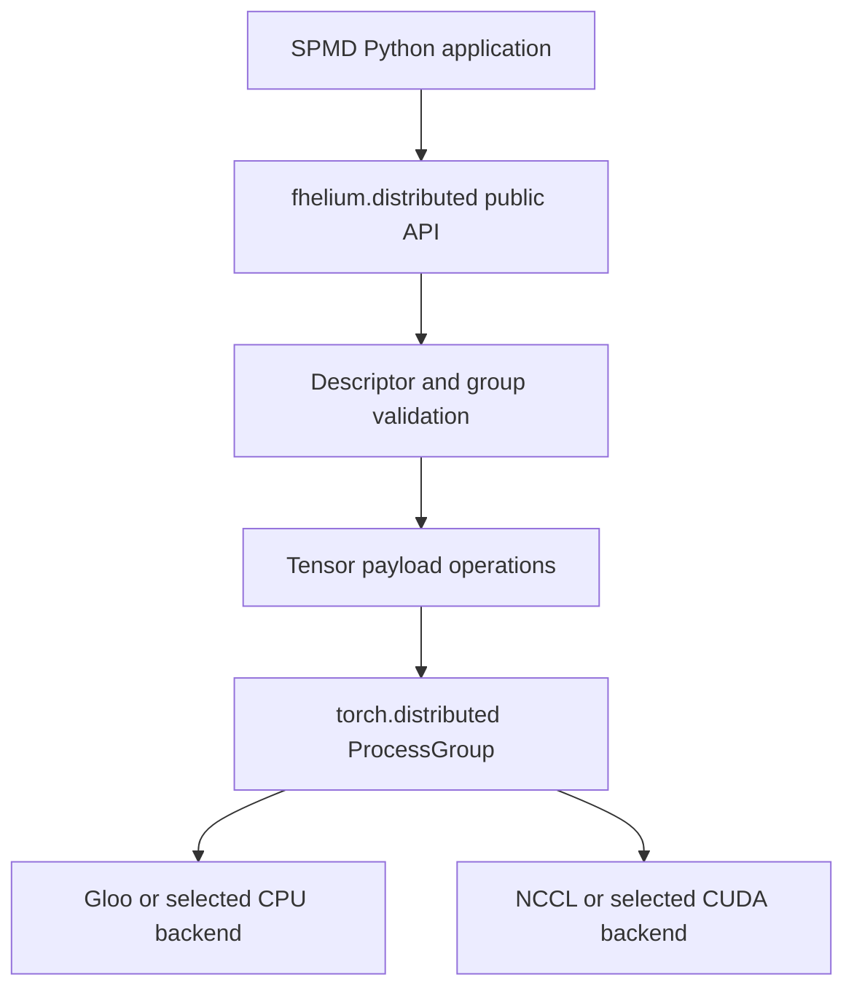
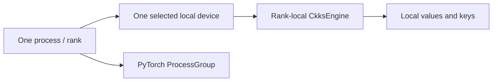
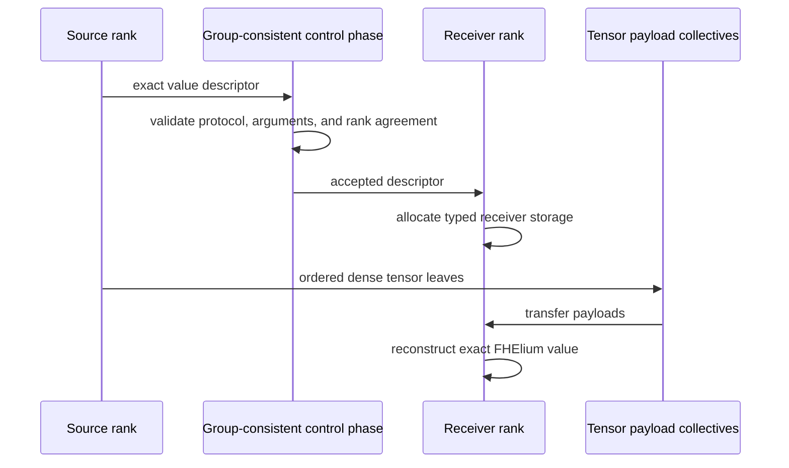

# Distributed internals

`fhelium.distributed` extends PyTorch distributed with collectives that preserve
FHElium value metadata or apply CKKS-specific arithmetic. Process-group
initialization, communication backends, rank identity, point-to-point
operations, and ordinary tensor collectives remain PyTorch facilities.

## Runtime stack

`fhelium.distributed.init()` calls
`torch.distributed.init_process_group`. Under `torchrun`, standard `RANK`,
`WORLD_SIZE`, and `LOCAL_RANK` environment values supply the default process
identity. CUDA initialization selects `cuda:LOCAL_RANK`; CPU execution defaults
to Gloo. A direct world-size-one launch uses a local `HashStore` when no
rendezvous is supplied, but still creates an ordinary PyTorch `ProcessGroup`.

The package also re-exports selected `torch.distributed` APIs. Raw tensor calls
retain their PyTorch signatures, mutation behavior, group semantics, and
`Work` handles. FHElium-specific names such as `broadcast_ciphertext` and
`all_reduce_ciphertext` identify operations that require exact-value metadata
or CKKS arithmetic.

## Rank and device identity

Three integer namespaces appear in distributed code:

- **global rank** identifies a process in the global job;
- **process-group-relative rank** identifies its position in one subgroup;
- **local rank** commonly identifies a process on one host and selects a local
  CUDA device.

They are not interchangeable. Public collective arguments such as `src` and
`dst` use the rank namespace stated by their PyTorch or FHElium interface. A
CUDA device index is local process state, not a process rank.

Each rank constructs a local `CkksEngine` and local values. Engines and process
groups have independent lifetimes:

## Descriptor and payload phases

A typed value transfer separates control metadata from tensor payloads. The
sender converts a value into a `ValueEnvelope`-derived descriptor containing:

- transfer protocol version;
- concrete FHElium value type and value-schema version;
- context identity and exact non-tensor metadata;
- tensor names, shapes, dtypes, and CPU/CUDA device type.

The receiver validates the descriptor, allocates the corresponding tensor
leaves on its rank-local device, transfers those leaves, and reconstructs the
typed value through the exact value schema.

The transfer protocol and durable serialization schema have independent
versions. Raw `torch.Tensor` is a transport descriptor kind, but is not added to
the FHElium exact-value serialization registry.

Control errors must become group-consistent before a rank enters a payload
collective. A rank-local exception followed by peer ranks waiting in NCCL or
Gloo is a distributed deadlock, not useful validation behavior.

## Whole-value collectives

Whole-value collectives transmit one complete typed object per logical
position:

- broadcast supports ciphertexts, plaintexts, compressed plaintexts, and
  selected key types;
- scatter distributes a source sequence of complete ciphertext values;
- gather and all-gather reconstruct complete values in process-group order.

These are transport operations. They preserve payload bits and exact metadata;
they do not add ciphertexts, concatenate RNS rows, align levels, or change
scale.

Receiver allocation follows descriptor device type. A CUDA-described tensor
requires a CUDA rank-local device; CPU-described tensors remain CPU tensors.
The transfer layer does not silently change the sender's declared device type.

## Limb collectives

`scatter_ciphertext_limbs` and `gather_ciphertext_limbs` implement structural
RNS partitioning. A shard carries a subset of the ordered `prime_ids` and the
matching tensor limb rows. Reconstruction requires:

- one context and public level;
- identical component and batch axes;
- identical scale, polynomial domain, modulus basis, and residue form;
- non-overlapping requested prime IDs;
- complete requested coverage in canonical prime order.

Gather concatenates rows into the declared mathematical layout. It does not
perform modular addition. Conversely, whole-value gather does not reconstruct a
ciphertext from disjoint limb shards.

## Ciphertext reductions

Raw `torch.distributed.ReduceOp.SUM` is incorrect for ciphertext payloads
because signed machine-integer addition does not implement per-limb modular
addition. `reduce_ciphertext` uses an arbitrary-world-size binomial tree. Each
receiver obtains one complete ciphertext into temporary storage and calls its
rank-local `engine.add_`:

The tree supports non-power-of-two group sizes, emits `P - 1` ciphertext
messages, has `O(log P)` critical-path rounds, and needs at most one incoming
ciphertext buffer per active receiver. `all_reduce_ciphertext` performs that
modular reduction, then broadcasts the completed ciphertext payload from the
first process-group rank.

These typed reductions are synchronous composite operations. They do not
return a `torch.distributed.Work`; introducing useful overlap would require an
lifetime model covering both communication and local modular
addition.

## Source layout

| Layer | Source |
| --- | --- |
| Process-group initialization and local device | `fhelium/distributed/_state.py` |
| Transfer descriptor and receiver allocation | `fhelium/distributed/_transfer.py` |
| Group/rank validation and tensor staging | `fhelium/distributed/_collective_common.py` |
| Whole-value collectives | `fhelium/distributed/_value_collectives.py` |
| Limb scatter/gather | `fhelium/distributed/_limb_collectives.py` |
| Modular ciphertext reduce/all-reduce | `fhelium/distributed/_ciphertext_reduction.py` |
| Private public-API aggregation | `fhelium/distributed/_typed_collectives.py` |
| Public PyTorch-compatible facade | `fhelium/distributed/__init__.py` |

## Validation

Distributed implementation changes should cover:

- world size one, two, and a non-power-of-two size where applicable;
- default group and subgroups;
- global versus group-relative rank arguments;
- CPU/Gloo and CUDA/NCCL paths supported by the change;
- descriptor or argument mismatch before payload transfer;
- exact reconstructed value state and device;
- whole-value, additive, and limb-partition semantics as distinct cases;
- cleanup and timeout diagnostics after a failed collective.

The focused implementation suite starts at
`tests/test_distributed_transfer.py`. Public multi-rank examples and benchmark
workers provide workload-level validation after the protocol tests.

## Continue

- [Rank-local SPMD model](../concepts/distributed/spmd-model.md)
- [Communication semantics](../concepts/distributed/communication-semantics.md)
- [Execution buffers and CUDA Graphs](execution-buffers-and-cuda-graphs.md)
- [Python-to-native execution stack](engine-native-stack.md)
