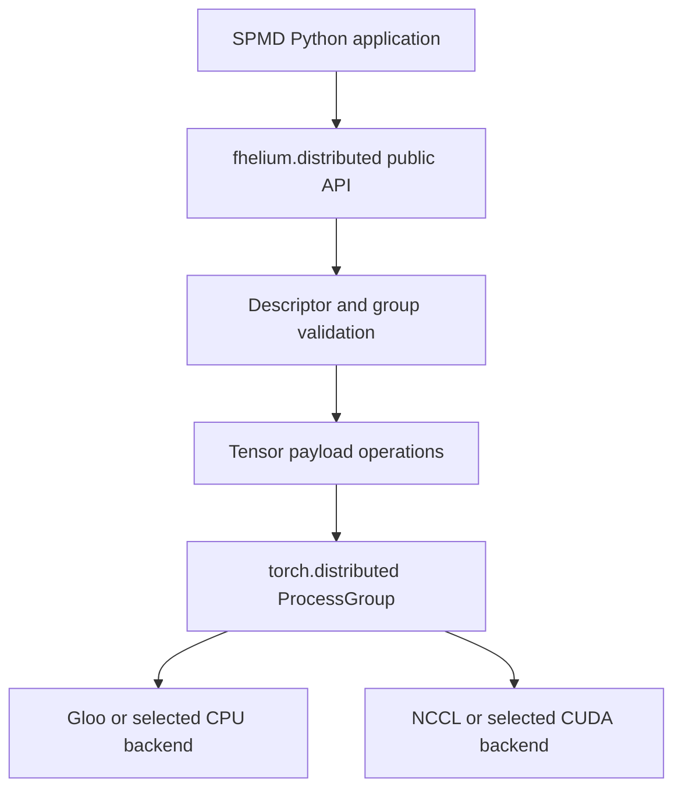
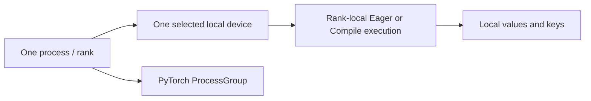

# Distributed internals

`fhelium.distributed` extends PyTorch distributed with collectives that preserve FHElium value metadata or apply CKKS-specific arithmetic. Process-group initialization, communication backends, rank identity, point-to-point operations, and ordinary tensor collectives remain PyTorch facilities.

## Runtime stack



`fhelium.distributed.init()` calls `torch.distributed.init_process_group`. Under `torchrun`, standard `RANK`, `WORLD_SIZE`, and `LOCAL_RANK` environment values supply the default process identity. CUDA initialization selects `cuda:LOCAL_RANK`; CPU execution defaults to Gloo. A direct world-size-one launch uses a local `HashStore` when no rendezvous is supplied, but still creates an ordinary PyTorch `ProcessGroup`.

The package also re-exports selected `torch.distributed` APIs. Raw tensor calls retain their PyTorch signatures, mutation behavior, group semantics, and `Work` handles. FHElium-specific names such as `broadcast_ciphertext` and `all_reduce_ciphertext` identify operations that require value metadata or CKKS arithmetic.

## Rank and device identity

Three integer namespaces appear in distributed code:

- **global rank** identifies a process in the global job;
- **process-group-relative rank** identifies its position in one subgroup;
- **local rank** commonly identifies a process on one host and selects a local CUDA device.

Public collective arguments such as `src` and `dst` use the rank namespace stated by their PyTorch or FHElium interface. CUDA device indices identify process-local placement.

Each rank supplies local values and independently owned execution services. An Eager workload may construct a local `Engine`; a Compile workload binds a rank-local executable. Engines, Backend bindings, and process groups have independent lifetimes:



## Rank-local distributed IR

A Compile `Program` represents one rank. A distributed pass receives a participating-device count and emits a rank-local graph that may read its group rank at launch. An SPMD launcher binds the same graph template, or a rank-specialized derivative, to one process-group member per rank. Process-group creation and destruction remain outside the Program.

The registered distributed vocabulary is:

| Operator | Rank-local meaning |
| --- | --- |
| `fhelium_dist.rank` | Read the current process-group-relative rank. |
| `fhelium_dist.group_size` | Read the number of participating group ranks. |
| `fhelium_dist.broadcast` | Functionally broadcast one local Tensor value from a group-relative root. |
| `fhelium_dist.all_reduce` | Reduce local Tensor values using a visible two-argument combine region. |
| `fhelium_dist.all_reduce_add_ciphertext` | Preserve ciphertext-add reduction intent for a whole-operation implementation or later lowering. |
| `fhelium_dist.yield` | Return one result from a generic combine region. |

`!fhelium_dist.group` is a launch-bound resource type. Its live binding is a `ProcessGroupExecutionResource`. The application initializes and destroys the PyTorch `ProcessGroup`. Rank and group size are distinct from the local CUDA device index. A separate `!fhelium_memory.device` resource selects transfer destinations.

The IR also loads xDSL `arith` and structured control flow (`scf`). A rank may therefore select its local loop interval without embedding one multi-rank module:

```text
group rank -> rank-local loop bounds -> local arithmetic -> collective
```

Compile transformations recurse into `scf.for`, `scf.if`, and generic all-reduce combine regions. Unknown vendor region owners stay opaque. Current Backend execution supports scalar index arithmetic, one-block `scf.for` and `scf.if` regions, and registered Tensor implementations inside those regions. Prepared host control-flow emission is shared by directly linked Programs and compiled callables; see [linking and prepared host execution](prepared-host-execution.md).

Distributed IR is permissive. Structural verification checks local operand, result, attribute, and region shape only. It does not prove that predicates or loop trip counts are uniform, that ranks execute matching collective sequences, that a combine function is associative, or that execution is deadlock-free. Caller-selected analysis passes may diagnose those properties; Backend and launch do not silently add handshakes, barriers, or corrective collectives.

`LowerSpecializedCollectivesPass` may replace `fhelium_dist.all_reduce_add_ciphertext` with generic `fhelium_dist.all_reduce`. The generated combine region contains a visible `fhelium_ckks.add`. Callers may instead preserve the specialized operator and bind a whole-operation implementation. Both representations use the same operation registry and arithmetic resources.

The generic implementation all-gathers equal-layout local Tensor payloads and folds them in process-group rank order through the compiled combine region.

## Rank-local transfer IR

`fhelium_memory.transfer` is the placement-changing operation for an existing SSA value. It consumes a value and a launch-bound `!fhelium_memory.device` resource and produces the same IR value type. Ordinary arithmetic operations do not receive a generic device attribute.

The first implementation is synchronous and functional. Its `memory_space` attribute accepts `default`, `pageable_host`, or `pinned_host`; CPU and concrete-index CUDA targets are runtime resources. A same-device transfer may return the input storage. Cross-device movement delegates to PyTorch. Async copy tokens, streams, fixed-buffer allocation, and Residency integration are not part of this slice.

The Backend transfer ABI consumes one Tensor payload. Public Ciphertext, Plaintext, and key objects remain public boundaries whose adapters decompose and reconstruct Tensor leaves.

## Descriptor and payload phases

A typed value transfer separates control metadata from tensor payloads. The sender converts a value into a `ValueEnvelope`-derived descriptor containing:

- transfer protocol version;
- concrete FHElium value type and value-schema version;
- non-tensor arithmetic metadata;
- tensor names, shapes, dtypes, and CPU/CUDA device type.

The receiver validates the descriptor, allocates the corresponding tensor leaves on its rank-local device, transfers those leaves, and reconstructs the typed value through the value schema.


The transfer protocol and durable serialization schema have independent versions. Raw `torch.Tensor` has its own transport descriptor kind outside the FHElium value serialization registry.

Control errors must become group-consistent before a rank enters a payload collective. Otherwise, a rank-local exception can leave peers waiting in NCCL or Gloo.

## Whole-value collectives

Whole-value collectives transmit one complete typed object per logical position:

- broadcast supports ciphertexts, plaintexts, compressed plaintexts, and selected key types;
- scatter distributes a source sequence of complete ciphertext values;
- gather and all-gather reconstruct complete values in process-group order.

These are transport operations. They preserve payload bits and value metadata; they do not add ciphertexts, concatenate RNS rows, align depths, or change scale.

Receiver allocation follows descriptor device type. A CUDA-described tensor requires a CUDA rank-local device; CPU-described tensors remain CPU tensors. The transfer layer does not silently change the sender's declared device type.

## Payload storage

Typed value collectives share contiguous payload preparation for P2P, broadcast, and all-gather. A contiguous Tensor already on the transport device is used directly. Other sends pack the logical Tensor contents into contiguous storage. NCCL groups stage CPU payloads on the rank-local CUDA device while preserving the value's declared device placement.

When a receive destination needs staging, the operation waits for communication and copies the result into the original Tensor view. It does not replace the value's `.data`, change its strides, or write outside that view. Writable destinations must not contain overlapping elements. Source-only packing does not mutate the input. Gather and all-gather allocate their returned values as specified by those interfaces.

Ciphertext reduce and all-reduce use the same transfer preparation. Their modular additions still update the original destination view; all-reduce then broadcasts the sum with copy-back where required. Packing and device staging may allocate temporary buffers; they are not performed for every payload. The re-exported raw PyTorch functions retain PyTorch's own storage requirements.

## Limb collectives

`scatter_ciphertext_limbs` takes one source ciphertext and caller-selected `limb_ranges`. The source supplies one nonempty `(start, stop)` interval per process-group rank; other ranks supply `None`. These intervals index stored limb positions and must be consecutive in group-rank order. They may have unequal lengths and may select a consecutive portion of the source.

The interface uses `slice_limbs` to select data and its existing `prime_ids`, then reuses typed-value transport. It does not choose a balancing strategy or establish cryptographic provenance. Source-local results remain storage-sharing views; remote results occupy receive storage. `scatter_ciphertexts` transports an already prepared sequence without performing structural slicing.

`gather_ciphertext_limbs` concatenates intervals in group-rank order. It requires matching depth, scale, domain, basis, residue form, component and batch axes, and adjacent prime intervals. The application supplies rows encoded under compatible parameters and keys, including every row required by the next operation. Gather performs no modular addition; ordinary whole-value gather returns separate values rather than concatenating their limbs.

## Ciphertext reductions

Raw `torch.distributed.ReduceOp.SUM` is incorrect for ciphertext payloads because signed machine-integer addition does not implement per-limb modular addition. `reduce_ciphertext` uses an arbitrary-world-size binomial tree. Each receiver obtains one complete ciphertext into temporary storage and calls its rank-local `engine.add_`:


The tree supports non-power-of-two group sizes, emits `P - 1` ciphertext messages, has `O(log P)` critical-path rounds, and needs at most one incoming ciphertext buffer per active receiver, with additional transport staging when layout or device conversion requires it. `all_reduce_ciphertext` performs that modular reduction, then broadcasts the completed ciphertext payload from the first process-group rank.

These typed reductions are synchronous composite operations. They do not return a `torch.distributed.Work`; introducing useful overlap would require an lifetime model covering both communication and local modular addition.

## Source layout

| Layer | Source |
| --- | --- |
| Process-group initialization and local device | `fhelium/distributed/_state.py` |
| Transfer descriptor and receiver allocation | `fhelium/distributed/_transfer.py` |
| Group/rank validation and tensor staging | `fhelium/distributed/_collective_common.py` |
| Whole-value collectives | `fhelium/distributed/_value_collectives.py` |
| Limb scatter/gather | `fhelium/distributed/_limb_collectives.py` |
| Modular ciphertext reduce/all-reduce | `fhelium/distributed/_ciphertext_reduction.py` |
| Private public-API aggregation | `fhelium/distributed/_typed_collectives.py` |
| Public PyTorch-compatible facade | `fhelium/distributed/__init__.py` |
| Distributed IR declarations | `fhelium/ir/dialects/distributed.py` |
| Memory-transfer IR declaration | `fhelium/ir/dialects/memory.py` |
| Structured Compile traversal | `fhelium/compile/passes/_operation_transforms.py` |
| Specialized collective lowering | `fhelium/compile/passes/distributed/_lower_specialized_collectives.py` |
| Process-group resource binding | `fhelium/backend/distributed/resources.py` |
| Registered collective implementations | `fhelium/backend/distributed/operations.py` |
| Registered Tensor transfer implementation | `fhelium/backend/memory/operations.py` |
| Structured Program execution | `fhelium/backend/execution.py` |

## Validation

Distributed implementation changes should cover:

- world size one, two, and a non-power-of-two size where applicable;
- default group and subgroups;
- global versus group-relative rank arguments;
- CPU/Gloo and CUDA/NCCL paths supported by the change;
- descriptor or argument mismatch before payload transfer;
- reconstructed value state and device;
- whole-value, additive, and limb-partition semantics as distinct cases;
- cleanup and timeout diagnostics after a failed collective.

IR-specific behavior coverage additionally checks:

- textual parse/print and dialect catalog registration;
- CKKS lowering and implementation assignment inside known structured regions;
- specialized-to-generic collective lowering;
- CPU/CUDA transfer and pinned-host allocation;
- rank query, `scf` execution, broadcast, and visible combine-region execution;
- Gloo and NCCL operation execution through the selected Backend bindings.

The focused implementation suite starts at `tests/distributed/test_distributed_transfer.py`. Public multi-rank examples and benchmark workers provide workload-level validation after the protocol tests.

## Continue

- [Rank-local SPMD model](../concepts/distributed/spmd-model.md)
- [Communication semantics](../concepts/distributed/communication-semantics.md)
- [Execution buffers and CUDA Graphs](execution-buffers-and-cuda-graphs.md)
- [Eager, Compile, and native execution](engine-native-stack.md)
