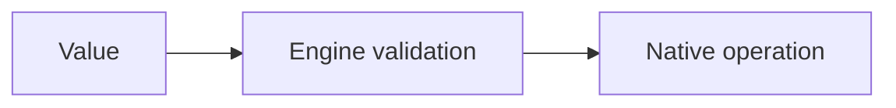
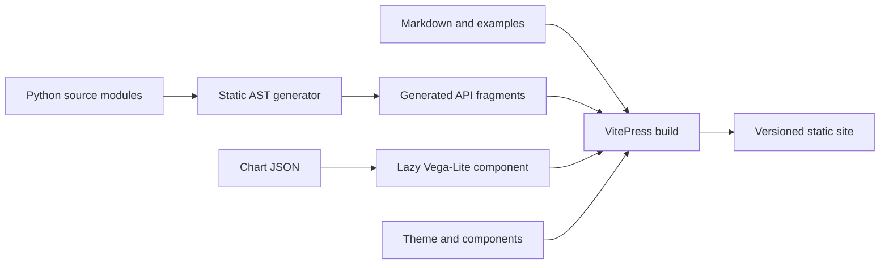

# Contributing to documentation

FHElium keeps hand-written learning material and generated API reference in
one versioned VitePress site.

## Choose the right documentation family

| Family | Primary question | Typical content |
| --- | --- | --- |
| Tutorial | How do I learn a complete workflow? | Numbered example, explanation, checkpoints |
| Concept | Why does this model or design exist? | Mental model, invariant, diagram, trade-off |
| How-to | How do I complete or diagnose one task through a supported interface? | Public-interface procedure, deployment decision, diagnosis, performance validation |
| Developer Guide | How is the implementation assembled or changed? | Source ownership, internal data flow, application binary interface (ABI), implementation invariants, tests |
| API reference | What is the current interface? | Generated signatures and docstrings |
| Blog | What changed, what was investigated, or what is being announced? | Dated engineering note, announcement, release summary, research report |

Avoid placing a long source-tree walkthrough, benchmark report, and beginner
tutorial on one concept page. Cross-link the appropriate families instead.

## Source of truth

- Write tutorials, how-to guides, and concepts as Markdown under `docs/`.
- Write API descriptions in the defining Python module's docstrings. The API
  generator discovers source modules, creates their Markdown pages, and
  expands their members statically; `__all__` may define a declared module
  inventory when needed.
- Do not hand-maintain module pages or API sidebar entries. A generated page
  uses the Python module name and moves automatically when its package
  path changes.
- Reuse runnable programs from `examples/` instead of copying complete scripts.
- Store static documentation files under `docs/public/`; VitePress copies this
  directory to the site root without transforming it. Use `/figures/` for
  technical figures, `/brand/` for identity assets, and `/assets/` for files
  intended for direct download.
- Do not commit `docs/.vitepress/dist/`, the generated `docs/api/fhelium*`
  module pages, or the generated `.vitepress/api-reference.json` and
  `api-sidebar.json` files.

## Start each tutorial from its runnable example

Every numbered tutorial opens immediately after its title with a source link
and a concrete description of the corresponding example:

```markdown
**Example source:** [`examples/01_basic_ckks_flow.py`](https://github.com/VisualDust/fhelium/blob/main/examples/01_basic_ckks_flow.py)

This example encrypts dense tensor messages, evaluates independent arithmetic
branches, then decrypts and checks each result. The tutorial explains the
CKKS state transitions in that workflow.
```

State what the program does before explaining the page structure. Avoid the
generic opening “This tutorial accompanies ...”. Keep the complete script in
`examples/`, link it at the top, and include it once near the end with the
VitePress source directive when the full listing helps the reader.

Recommended image organization:

```text
docs/public/
├── brand/
├── figures/
│   ├── concepts/
│   └── tutorial/
│       └── <tutorial-slug>/
└── assets/
    └── <downloadable-source-group>/
```

Use descriptive lowercase filenames and keep an image near the documentation
family that owns it. Runtime package resources, generated benchmark reports,
and test fixtures do not belong in the general figure tree.

For a figure with a short caption, use portable HTML:

```html
<figure>
  
  <figcaption>Short explanation of what the figure demonstrates.</figcaption>
</figure>
```

## Diagrams and equations

Use Mermaid for architecture, state, sequence, and decision diagrams:

````markdown

````

Keep diagrams focused on one question and provide equivalent meaning in nearby
prose or tables. Use `$...$` for inline mathematics and `$$...$$` for display
mathematics. MathJax, Mermaid, Vega, and Vega-Lite versions are pinned in
`docs/package.json`.

## Mathematical and operation documentation

Use the symbols, value-state coordinates, tensor-axis names, and term
distinctions defined in
[Terminology and mathematical model](../concepts/terminology-and-mathematical-model.md).
Use ASCII code identifiers such as `default_scale`, `prime_ids`, and
`polynomial_domain` in code spans. In Python docstrings containing LaTeX
backslashes, use a raw docstring where needed to avoid invalid escape
sequences.
Write mathematical symbols in docstrings and implementation comments with
LaTeX rather than raw UTF-8 mathematical glyphs.

An arithmetic-operation docstring states:

- the mathematical operation and input preconditions;
- the output level, actual scale, component count, polynomial domain, modulus
  basis, residue representation, and `prime_ids` effect;
- functional or mutating behavior and storage aliasing; and
- caller-visible approximation, rounding, range, or no-wrap requirements.

For a tensor/native operation, also state the meaning and order of every axis,
accepted shape/dtype/device, table or prime-row mapping, output state, allowed
residue range, and mathematical operation implemented. Do not substitute a
generic verb such as “transform,” “prepare,” or “convert” for a concrete NTT,
Montgomery conversion, RNS restriction, basis extension, quotient rounding,
or key switch.

Generated native wrappers remain mechanical typed interfaces. Handwritten
Python orchestration or the public API docstring owns the operation semantics;
lower-level comments repeat only the details needed to use or maintain the
native operator safely.

## Build architecture

The site uses one Node build and static Python API generation. Quantitative
chart data remains JSON and is drawn in the browser only when its figure nears
the viewport:



`scripts/generate_api_docs.py` scans Python source modules and resolves
inherited dataclass constructors and overload groups without importing the
package. It includes ordinary modules regardless of a leading underscore in
their path, includes package initializers with a defined `__all__`, and emits
one page per selected module. A defined `__all__` selects members; otherwise
the generator uses non-underscored definitions. The generator also derives
navigation from those paths, so VitePress contains no separate semantic API
inventory. A generated page does not by itself make an implementation module a
supported downstream import; package initializers and declared interface
documentation define those supported surfaces.
Generated Torch-operator bindings under `fhelium.native.wrapper` are the sole
configured module-tree exclusion.

A VitePress Markdown plugin expands the generated fragments before headings,
search records, and page outlines are built. Mermaid is rendered by a client
component and mathematics is rendered at build time. Quantitative data lives
under `docs/public/data/`. `VegaLiteChart.vue` fetches data near the viewport,
loads `vega-embed`, responds to theme and container-size changes, and leaves the
page background visible. A chart-specific definition owns its labels, checks,
transformations, and visual encoding; it must not add subject-specific logic to
the generic component.

## A useful concept-page structure

1. State the question the page answers.
2. Introduce one compact mental model or diagram.
3. Explain invariants and ownership responsibilities.
4. Show the most important trade-offs or invalid assumptions.
5. Link to a runnable tutorial, a focused how-to, and relevant API/internal pages.

Prefer progressive disclosure over one very long page that addresses every
reader level.

## Add a blog post

Create a Markdown file under `docs/blog/posts/` with the required frontmatter:

```yaml
---
title: Descriptive post title
date: 2026-08-03
category: Engineering
author: FHElium contributors
description: One sentence used by the Blog index.
tags:
  - CUDA
---
```

Use `Announcement`, `Engineering`, `Release`, `Research`, or another concrete
category that describes the post. Dates use `YYYY-MM-DD`. The generated Blog
index validates the required fields, excludes posts with `draft: true`, sorts
published posts by descending date, and uses each post's frontmatter
rather than a separate navigation inventory.

## Install documentation tooling

```bash
cd docs
npm ci
```

This installs only the documentation workspace. It does not install FHElium
or compile the native CUDA extension.

Regenerate API fragments directly when debugging source resolution:

```bash
npm run generate
```

The development server generates API fragments once at startup. Run the
command above or restart the server after changing a Python signature or
docstring.

## Preview locally

```bash
npm run dev
```

## Run the strict build

```bash
npm run build
```

The build runs API generation, Vue/TypeScript type checking, and VitePress. It
fails on unresolved pages, missing API references, malformed source, or invalid
VitePress configuration. GPU example execution belongs in separate CUDA-capable
validation rather than documentation deployment.

## Deployment

The documentation workspace is self-contained under `docs/`. Configure that
directory as the Vercel project root and use the standard `npm run build`
command. VitePress writes the static site to `.vitepress/dist`.
