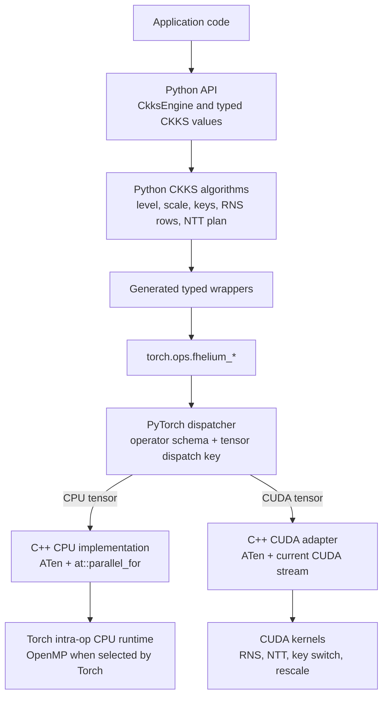
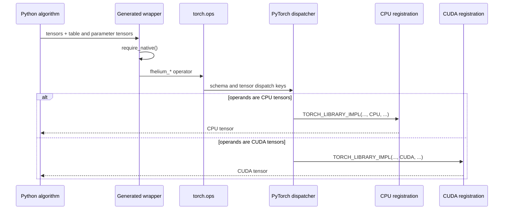
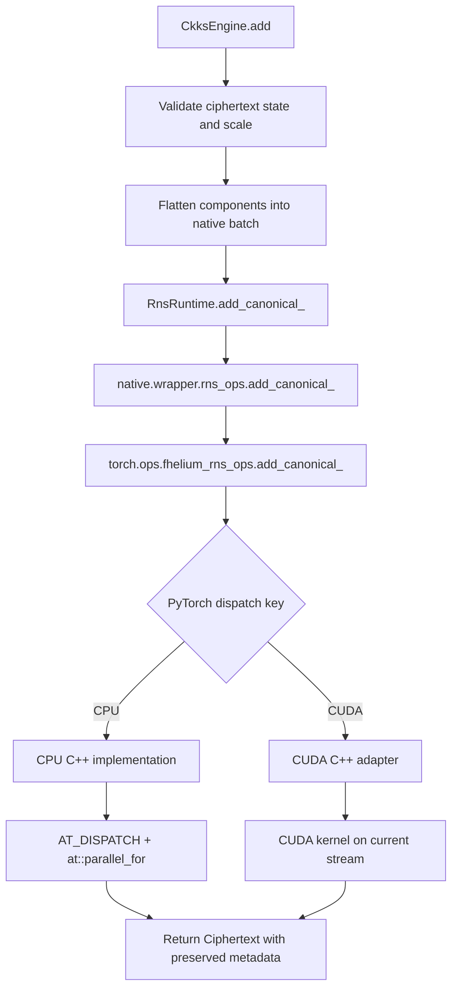
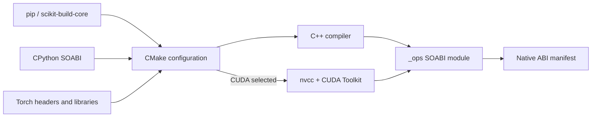

# Python-to-native execution stack

FHElium implements CKKS operations as a Python semantic layer over native
PyTorch operators. Public methods validate cryptographic state and assemble an
operation from tensor primitives; PyTorch dispatches each primitive to the CPU
or CUDA implementation registered for the operand device.



The same Python method and the same `torch.ops` schema are used for both
execution devices. Tensor device is the dispatch input: FHElium does not copy an
operand between CPU and CUDA to satisfy an operation.

## Stack by layer

| Layer | Implementation | Responsibility |
| --- | --- | --- |
| Public Python API | `fhelium`, `CkksEngine`, typed values | Validate context, level, actual scale, polynomial domain, modulus basis, residue representation, keys, shape, and device |
| CKKS and arithmetic planning | `fhelium.engine`, `RnsRuntime`, NTT backends | Select active Q/QP rows, materialize RNS parameters and twiddle tables, and compose native primitives |
| Python/native bridge | Generated modules in `fhelium.native.wrapper` | Present typed Python call signatures and invoke registered `torch.ops.fhelium_*` operators |
| Native operator ABI | `TORCH_LIBRARY_FRAGMENT` schemas in C++ | Define names, arguments, returns, mutation aliases, and the common CPU/CUDA operator surface |
| Device dispatch | PyTorch dispatcher | Select the `CPU` or `CUDA` implementation from tensor dispatch keys |
| CPU implementation | C++17, ATen, `AT_DISPATCH_INTEGRAL_TYPES`, `at::parallel_for` | Execute modular arithmetic and indexed radix-2 NTT through Torch's intra-op runtime |
| CUDA implementation | C++17 adapters plus CUDA C++ kernels compiled by `nvcc` | Validate tensor inputs, select the active CUDA device/current stream, and launch RNS, NTT, and CKKS kernels |
| Build and packaging | scikit-build-core, CMake, PyTorch C++ API, CUDA Toolkit | Build an ABI-specific `_ops` module with CPU, CUDA, or both backends |

## Python semantic layer

A public value contains a dense integral `torch.Tensor` together with the CKKS
state required to interpret that tensor. A public operation such as
`CkksEngine.add` first checks that both ciphertexts have the same context,
level, actual scale, component layout, domain, basis, residue representation,
prime rows, dtype, and local device. It then presents the component storage as
one native tensor batch when the layout permits it.

The arithmetic runtime supplies native operands with parameter
tensors. An RNS operand conventionally has shape
`[*batch, limb, coefficient_or_ntt_index]`; parameter column `j` describes
operand limb `j`. NTT calls additionally receive their schedule and twiddle
tensors. Native operators therefore do not retrieve modulus chains, levels, or
keys from hidden process-global state.

A high-level CKKS method can issue several native operations. Multiplication,
rotation, key switching, and rescale are Python-composed sequences of RNS, NTT,
and CKKS-local primitives. The Python layer constructs the returned
`Ciphertext` metadata after those tensor transitions complete.

## Generated wrappers and `torch.ops`

The compiled extension is loaded with:

```python
torch.ops.load_library(".../fhelium/native/torchops/_ops<SOABI>.so")
```

Loading `_ops` registers these operator namespaces:

- `torch.ops.fhelium_rns_ops` for modular and basis arithmetic;
- `torch.ops.fhelium_ntt_ops` for production NTT transitions;
- `torch.ops.fhelium_ckks_ops` for plaintext, Galois, key-switch, and rescale
  tensor primitives;
- `torch.ops.fhelium_ntt_diagnostic_ops` for named NTT profiling variants.

Wrappers under `fhelium.native.wrapper` are generated from the live operator
schemas. A representative wrapper is equivalent to:

```python
def add_canonical(lhs, rhs, rns_params):
    require_native()
    return torch.ops.fhelium_rns_ops.add_canonical(
        lhs, rhs, rns_params
    )
```

The generated wrapper adds Python typing and the native-availability check. It
does not select a CPU or CUDA function. PyTorch performs that selection after
the `torch.ops` call. Generated FakeTensor registrations describe output shape,
dtype, device, and mutation behavior for PyTorch tracing paths without running
the arithmetic kernel.

## Schema registration and device dispatch

Backend-neutral C++ translation units define each schema once. For example:

```cpp
TORCH_LIBRARY_FRAGMENT(fhelium_rns_ops, m) {
  m.def(
      "add_canonical(Tensor lhs, Tensor rhs, Tensor rns_params) -> Tensor");
  m.def(
      "add_canonical_(Tensor(a!) lhs, Tensor rhs, Tensor rns_params) -> ()");
}
```

Separate translation units attach implementations to PyTorch dispatch keys:

```cpp
TORCH_LIBRARY_IMPL(fhelium_rns_ops, CPU, m) {
  m.impl("add_canonical", &rns_add_canonical_cpu);
}

TORCH_LIBRARY_IMPL(fhelium_rns_ops, CUDA, m) {
  m.impl("add_canonical", &rns_add_canonical_cuda);
}
```

This organization gives functional and in-place forms one shared schema across
backends. Alias annotations such as `Tensor(a!)` tell PyTorch which storage is
mutated. C++ validation checks shape, dtype, device agreement, parameter-row
counts, broadcasting rules, and prohibited overlap before executing the inner
loop or launching a CUDA kernel.



## CPU execution

The CPU backend is implemented in C++ using ATen tensor accessors and integral
dtype dispatch. Kernels commonly flatten batch, RNS-limb, and coefficient work
into an element interval and partition it with `at::parallel_for`:

```cpp
AT_DISPATCH_INTEGRAL_TYPES(input.scalar_type(), operation, [&] {
  at::parallel_for(0, elements, grain, [&](int64_t begin, int64_t end) {
    // Modular arithmetic over the assigned contiguous interval.
  });
});
```

`at::parallel_for` uses the intra-op runtime selected by the installed Torch build.
When Torch was built with OpenMP, FHElium translation units compile with the
matching OpenMP frontend options and reuse the runtime already loaded through
`libtorch_cpu`; the extension does not link a second OpenMP runtime. Thread
count and affinity therefore follow PyTorch CPU execution controls rather than
a separate FHElium thread pool.

The indexed radix-2 NTT is the CPU production backend. Its schedule, even/odd
indices, twiddles, and RNS parameters are ordinary CPU tensors passed through
the same `fhelium_ntt_ops` schemas used by CUDA. CUDA-specific compact and
fixed-radix policies do not silently fall back to CPU.

## CUDA execution

CUDA registrations call C++ adapters that validate ATen tensors and enter the
CUDA implementation. Each launch selects the operand's device and obtains
PyTorch's current CUDA stream for that device:

```cpp
const int device = input.device().index();
cudaSetDevice(device);
auto stream = at::cuda::getCurrentCUDAStream(device);
kernel<<<grid, block, shared_memory, stream>>>(...);
```

CUDA kernels operate directly on device tensor storage. Outputs are allocated
with PyTorch tensor factories such as `torch::empty_like`, so allocation follows
PyTorch's CUDA allocator. Kernels launch on the current stream, preserve normal
PyTorch stream ordering, and do not introduce an implicit host synchronization.
CUDA launch failures may consequently surface at a later synchronization point.

The CUDA layer includes:

- coefficient-wise RNS addition, subtraction, Montgomery multiplication, and
  representation conversion;
- mixed-radix decomposition and basis extension;
- indexed, compact grouped, and power-of-two-radix NTT implementations;
- plaintext-component operations and Galois automorphisms;
- key-switch multiply-accumulate and QP-to-Q ModDown;
- nearest and truncating rescale kernels.

Kernel grids map tensor axes rather than CKKS objects. For a
coefficient-wise RNS kernel, grid dimensions commonly identify limb,
coefficient tile, and flattened batch item; the kernel receives modulus data
from the aligned parameter tensor.

## One operation end to end

Ciphertext addition provides the shortest complete path through the stack:



For this operation, CPU and CUDA consume the same logical operands and produce
canonical residues in `[0, q_i)`. The functional schema allocates new output;
the trailing-underscore schema mutates only its annotated destination. Neither
path changes level, scale, domain, modulus basis, or residue representation.

## Native operator families

| Operator family | CPU | CUDA | Execution notes |
| --- | --- | --- | --- |
| Canonical/lazy RNS arithmetic | Yes | Yes | Same schemas; device-specific C++ implementations |
| Montgomery and representation transitions | Yes | Yes | Integral ATen dtype dispatch on both paths |
| Mixed-radix decomposition and basis extension | Yes | Yes | Coefficient and modulus tables |
| Indexed radix-2 NTT | Yes | Yes | Cross-device production and validation path |
| Compact grouped and fixed-radix NTT | No | Yes | CUDA execution policies with specialized schedules and shared-memory kernels |
| Plaintext, Galois, key-switch, and rescale primitives | Yes | Yes | CKKS-local tensor operators composed by Python algorithms |

Support is a property of the compiled extension as well as the source tree. A
CPU-only build contains schemas and CPU registrations but excludes CUDA source
and the CUDA Toolkit. A combined build contains both registrations; the
operand device selects between them at runtime.

## Build stack and backend selection

The native module is built through scikit-build-core and CMake. CMake obtains
the active CPython interpreter and the installed Torch package, compiles
backend-neutral schema sources, then adds only the selected implementation
sources.



`FHELIUM_NATIVE_BACKENDS` accepts:

- `AUTO`: follow the selected Torch package;
- `CPU`: compile CPU registrations and exclude CUDA sources/toolkit discovery;
- `CUDA`: compile CUDA registrations and the common schemas;
- `CPU+CUDA`: compile both implementation sets into one `_ops` module.

CPU targets link `torch_cpu` and `c10`. CUDA-enabled targets additionally link
the required Torch CUDA libraries and CUDA runtime while keeping Torch and CUDA
runtime libraries external to the FHElium wheel. CUDA compilation uses the
selected Toolkit and configured architecture list; configuration checks the
Torch CUDA identity against that Toolkit before compilation.

## Runtime and ABI loading

`fhelium.native.runtime` locates the `_ops` binary for the current CPython
extension suffix and its adjacent build manifest before registering operators.
The manifest is compared with the running environment, including project and
Python identity, pinned Torch build, Torch CUDA variant, C++ ABI, and compiled
backend set. A mismatch fails before a public engine uses the extension.

After validation, `torch.ops.load_library` installs the schemas and backend
registrations into the process. `CkksEngine(device=...)` then requires the
matching compiled backend. This separates two questions:

1. whether this binary is ABI-compatible with the running Python and Torch;
2. whether it contains an implementation for the requested tensor device.

The separate `fhelium.native.cuda.cuda_info` extension reports CUDA device and
peer-topology properties. It is an inspection module, not the operator data
path.

## Execution properties

- **No hidden device transfer:** CPU input dispatches to CPU and CUDA input
  dispatches to CUDA; mixed-device operands fail validation.
- **PyTorch-owned allocation:** functional outputs use ATen allocation on the
  operand device; in-place schemas preserve annotated storage.
- **PyTorch-owned parallel context:** CPU work uses Torch intra-op execution;
  CUDA work uses the current PyTorch CUDA stream.
- **Arithmetic data:** modulus parameters, twiddles, schedules,
  indices, and key digits are tensor arguments rather than implicit native
  runtime state.
- **Python-owned CKKS semantics:** native operators return or mutate tensors;
  the engine owns level, scale, domain, basis, prime-row, and key semantics.
- **One semantic operator surface:** backend registration changes execution
  code, not the Python method or `torch.ops` schema.

## Continue

- [Native operator workflow](native-operator-workflow.md)
- [RNS and NTT architecture](rns-and-ntt.md)
- [Multiplication, key switching, and rescale](multiplication-keyswitch-rescale.md)
- [System overview](../concepts/architecture/system-overview.md)
