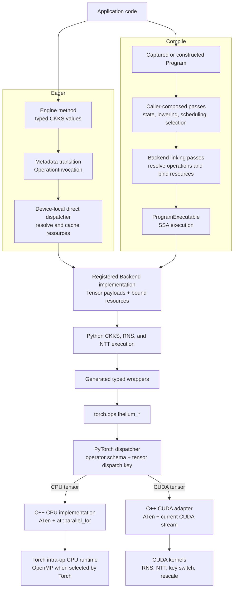
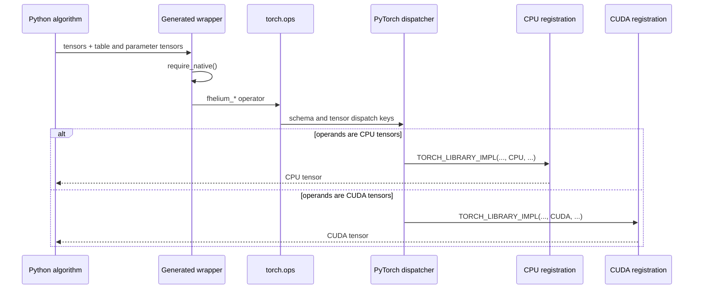
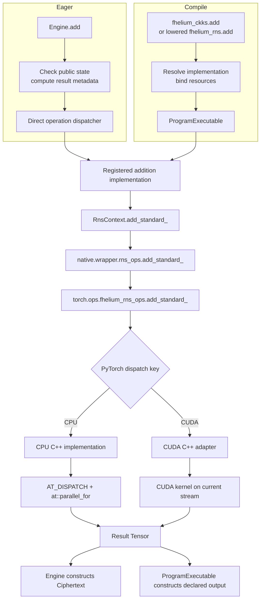
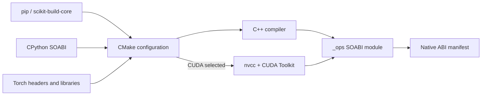

# Eager, Compile, and native execution

FHElium provides two ways to run CKKS computations. **Eager**
executes an operation when an `Engine` method is called. **Compile** represents
a computation as an intermediate representation (IR), transforms that Program,
and links it into a `ProgramExecutable`. The two paths manage CKKS state at
different times, but both select implementations from the same Backend
registry and supply those implementations with Tensor payloads and arithmetic
resources.

An implementation may perform a whole CKKS operation or a composition of
lower-level residue number system (RNS) and number-theoretic transform (NTT)
operations. Implementations that reach FHElium's native arithmetic call typed
Python wrappers over registered PyTorch operators. PyTorch then selects the CPU
or CUDA implementation from the operand Tensor's dispatch key.



Eager direct dispatch and Compile Program execution are independent entry
paths. Their common execution interface is the registered Backend
implementation.
Below that interface, the same `torch.ops` schema serves CPU and CUDA. Tensor
placement is the dispatch input: ordinary operations do not copy an operand
between CPU and CUDA to satisfy a call.

## Stack by layer

| Layer | Implementation | Responsibility |
| --- | --- | --- |
| Runtime values | `fhelium.values` | Carry Tensor payloads and represented CKKS state at public interfaces |
| Eager use model | `fhelium.eager.Engine` | Apply the called operation's metadata transition, select device-local resources from operand placement, and invoke one registered implementation without an SSA graph |
| Compile use model | `fhelium.ir`, `fhelium.compile` | Represent partially specified Programs; capture source; analyze, transform, lower, schedule, and assign implementations through caller-composed passes |
| Program linking and execution | Backend-stage passes and `ProgramExecutable` | Resolve every executable operation, bind materials and resources, execute SSA topology on Tensor payloads, and reconstruct declared public outputs |
| Shared Backend interface | `OperationBackend`, `OperationImplementationRegistry`, and `BackendWorkspace` | Own implementation choices plus live keys, named resources, materialization, and material overrides |
| CKKS and arithmetic implementations | `fhelium.backend.ckks`, `fhelium.backend.rns`, `fhelium.backend.ntt` | Execute whole CKKS operations or lower-level RNS/NTT compositions with concrete parameter, table, key, and index resources |
| Python/native bridge | Generated modules in `fhelium.native.wrapper` | Present typed Python call signatures and invoke registered `torch.ops.fhelium_*` operators |
| Native operator ABI | `TORCH_LIBRARY_FRAGMENT` schemas in C++ | Define names, arguments, returns, mutation aliases, and the common CPU/CUDA operator surface |
| Device dispatch | PyTorch dispatcher | Select the `CPU` or `CUDA` implementation from tensor dispatch keys |
| CPU implementation | C++17, ATen, `AT_DISPATCH_INTEGRAL_TYPES`, `at::parallel_for` | Execute modular arithmetic and indexed radix-2 NTT through Torch's intra-op runtime |
| CUDA implementation | C++17 adapters plus CUDA C++ kernels compiled by `nvcc` | Validate tensor inputs, select the active CUDA device/current stream, and launch RNS, NTT, and CKKS kernels |
| Build and packaging | scikit-build-core, CMake, PyTorch C++ API, CUDA Toolkit | Build an ABI-specific `_ops` module with CPU, CUDA, or both backends |

## Two Python execution models

A public `Ciphertext` or `Plaintext` contains a Tensor payload and the CKKS
state needed to interpret it. Eager and Compile preserve that public meaning
through different state-management workflows.

### Eager

An `Engine` method checks its public inputs, computes the operation's result
metadata, and asks a private device-local dispatcher to execute a registered
operation class. The dispatcher creates an `OperationInvocation`, resolves the
selected implementation and its resource requirements through an
`OperationBackend`, materializes missing device resources, and caches the
prepared direct call. It then passes Tensor payloads and `BoundResource`
objects to the implementation. The Engine constructs the returned public value
after execution succeeds.

This route resolves and executes one graph-free operation call. A
whole-operation implementation can execute directly, while an
Eager method may select shared CKKS-to-RNS/NTT composition before dispatch when
that is the requested implementation route.

### Compile

Compile begins with a captured, parsed, or programmatically constructed
`Program`. Its SSA value types may leave level, scale, prime identity, domain,
basis, or representation state unknown until a pass assigns or transforms
that information. Caller-composed passes can preserve a CKKS operation for a
whole-operation implementation or lower it to registered RNS/NTT operations.

`OperationBackend.link(compilation)` runs the Backend linking pipeline on a
fresh linking workspace. The passes resolve implementations, initialize
resource bindings, optionally materialize constructible resources, bind CKKS
keys, resolve external materials, and produce a `ProgramExecutable`. At
invocation, the executable checks declared
public boundary state, unwraps public values to Tensor payloads, follows SSA
topology, invokes the preselected implementations with prelinked resources,
and reconstructs declared public outputs. Backend execution does not infer
missing CKKS state.

### Shared implementation and native path

Both use models call the same `OperationImplementation` interface. An
implementation receives an operation descriptor, Tensor inputs, and concrete
resources. Those resources may include modulus parameters, NTT tables,
evaluation keys, inverse tables, or index Tensors. An RNS Tensor conventionally
has shape `[*batch, limb, coefficient_or_ntt_index]`; parameter column `j`
describes limb `j`. NTT calls additionally receive schedule and twiddle
Tensors. Every native call receives its modulus, schedule, index, and key data
through arguments or bound resources.

## Generated wrappers and `torch.ops`

The compiled extension is loaded with:

```python
torch.ops.load_library(".../fhelium/native/torchops/_ops<SOABI>.so")
```

Loading `_ops` registers these operator namespaces:

- `torch.ops.fhelium_rns_ops` for modular and basis arithmetic;
- `torch.ops.fhelium_ntt_ops` for production NTT transitions;
- `torch.ops.fhelium_ckks_ops` for plaintext, Galois, key-switch, and rescale
  tensor primitives;
- `torch.ops.fhelium_ntt_diagnostic_ops` for named NTT profiling variants.

Wrappers under `fhelium.native.wrapper` are generated from the live operator
schemas. A representative wrapper is equivalent to:

```python
def add_standard(lhs, rhs, rns_params):
    require_native()
    return torch.ops.fhelium_rns_ops.add_standard(
        lhs, rhs, rns_params
    )
```

The generated wrapper adds Python typing and the native-availability check.
PyTorch selects the CPU or CUDA registration after the `torch.ops` call.
Generated FakeTensor registrations describe output shape,
dtype, device, and mutation behavior for PyTorch tracing paths without running
the arithmetic kernel.

## Schema registration and device dispatch

Backend-neutral C++ translation units define each schema once. For example:

```cpp
TORCH_LIBRARY_FRAGMENT(fhelium_rns_ops, m) {
  m.def(
      "add_standard(Tensor lhs, Tensor rhs, Tensor rns_params) -> Tensor");
  m.def(
      "add_standard_(Tensor(a!) lhs, Tensor rhs, Tensor rns_params) -> ()");
}
```

Separate translation units attach implementations to PyTorch dispatch keys:

```cpp
TORCH_LIBRARY_IMPL(fhelium_rns_ops, CPU, m) {
  m.impl("add_standard", &rns_add_standard_cpu);
}

TORCH_LIBRARY_IMPL(fhelium_rns_ops, CUDA, m) {
  m.impl("add_standard", &rns_add_standard_cuda);
}
```

This organization gives functional and in-place forms one shared schema across
backends. Alias annotations such as `Tensor(a!)` tell PyTorch which storage is
mutated. C++ validation checks shape, dtype, device agreement, parameter-row
counts, broadcasting rules, and prohibited overlap before executing the inner
loop or launching a CUDA kernel.



## CPU execution

The CPU backend is implemented in C++ using ATen tensor accessors and integral
dtype dispatch. Kernels commonly flatten batch, RNS-limb, and coefficient work
into an element interval and partition it with `at::parallel_for`:

```cpp
AT_DISPATCH_INTEGRAL_TYPES(input.scalar_type(), operation, [&] {
  at::parallel_for(0, elements, grain, [&](int64_t begin, int64_t end) {
    // Modular arithmetic over the assigned contiguous interval.
  });
});
```

`at::parallel_for` uses the intra-op runtime selected by the installed Torch build.
When Torch was built with OpenMP, FHElium translation units compile with the
matching OpenMP frontend options and reuse the runtime already loaded through
`libtorch_cpu`. Thread count and affinity therefore follow PyTorch CPU
execution controls.

The indexed radix-2 NTT is the CPU production backend. Its schedule, even/odd
indices, twiddles, and RNS parameters are ordinary CPU tensors passed through
the same `fhelium_ntt_ops` schemas used by CUDA. Compact and fixed-radix NTT
policies require their CUDA implementations.

## CUDA execution

CUDA registrations call C++ adapters that validate ATen tensors and enter the
CUDA implementation. Each launch selects the operand's device and obtains
PyTorch's current CUDA stream for that device:

```cpp
const int device = input.device().index();
cudaSetDevice(device);
auto stream = at::cuda::getCurrentCUDAStream(device);
kernel<<<grid, block, shared_memory, stream>>>(...);
```

CUDA kernels operate directly on device tensor storage. Outputs are allocated
with PyTorch tensor factories such as `torch::empty_like`, so allocation follows
PyTorch's CUDA allocator. Kernels launch on the current stream, preserve normal
PyTorch stream ordering, and do not introduce an implicit host synchronization.
CUDA launch failures may consequently surface at a later synchronization point.

The CUDA layer includes:

- coefficient-wise RNS addition, subtraction, Montgomery multiplication, and
  representation conversion;
- mixed-radix decomposition and basis extension;
- indexed, compact grouped, and power-of-two-radix NTT implementations;
- plaintext-component operations and Galois automorphisms;
- key-switch multiply-accumulate and QP-to-Q ModDown;
- nearest and truncating rescale kernels.

Kernel grids map Tensor axes directly. For a
coefficient-wise RNS kernel, grid dimensions commonly identify limb,
coefficient tile, and flattened batch item; the kernel receives modulus data
from the aligned parameter tensor.

## One operation through both use models

Ciphertext addition shows where Eager and Compile differ and where they
converge:



Eager obtains the result state from the called operation's semantics. Compile
obtains it from the Program result type produced by its passes. Backend and
native code receive the selected Tensor payloads and resources in either case.
For standard RNS addition, CPU and CUDA produce residues in `[0, q_i)`. The
functional schema allocates new output; the trailing-underscore schema mutates
only its annotated destination.

## Native operator families

| Operator family | CPU | CUDA | Execution notes |
| --- | --- | --- | --- |
| Standard/lazy RNS arithmetic | Yes | Yes | Same schemas; device-specific C++ implementations |
| Montgomery and representation transitions | Yes | Yes | Integral ATen dtype dispatch on both paths |
| Mixed-radix decomposition and basis extension | Yes | Yes | Coefficient and modulus tables |
| Indexed radix-2 NTT | Yes | Yes | Cross-device production and validation path |
| Compact grouped and fixed-radix NTT | No | Yes | CUDA execution policies with specialized schedules and shared-memory kernels |
| Plaintext, Galois, key-switch, and rescale primitives | Yes | Yes | CKKS-local tensor operators composed by Python algorithms |

Support is a property of the compiled extension as well as the source tree. A
CPU-only build contains schemas and CPU registrations but excludes CUDA source
and the CUDA Toolkit. A combined build contains both registrations; the
operand device selects between them at runtime.

## Build stack and backend selection

The native module is built through scikit-build-core and CMake. CMake obtains
the active CPython interpreter and the installed Torch package, compiles
backend-neutral schema sources, then adds only the selected implementation
sources.



`FHELIUM_NATIVE_BACKENDS` accepts:

- `AUTO`: follow the selected Torch package;
- `CPU`: compile CPU registrations and exclude CUDA sources/toolkit discovery;
- `CUDA`: compile CUDA registrations and the common schemas;
- `CPU+CUDA`: compile both implementation sets into one `_ops` module.

CPU targets link `torch_cpu` and `c10`. CUDA-enabled targets additionally link
the required Torch CUDA libraries and CUDA runtime while keeping Torch and CUDA
runtime libraries external to the FHElium wheel. CUDA compilation uses the
selected Toolkit and configured architecture list; configuration checks the
Torch CUDA identity against that Toolkit before compilation.

## Runtime and ABI loading

`fhelium.native.runtime` locates the `_ops` binary for the current CPython
extension suffix and its adjacent build manifest before registering operators.
The manifest is compared with the running environment, including project and
Python identity, pinned Torch build, Torch CUDA variant, C++ ABI, and compiled
backend set. A mismatch fails before Eager or a linked executable uses a native
operator.

After validation, `torch.ops.load_library` installs the schemas and backend
registrations into the process. An Eager operation or `ProgramExecutable` then
requires the matching native backend for its selected Tensor device. This
separates two questions:

1. whether this binary is ABI-compatible with the running Python and Torch;
2. whether it contains an implementation for the requested tensor device.

The separate `fhelium.native.cuda.cuda_info` extension reports CUDA device and
peer-topology properties for inspection. Torch operator execution uses the
`_ops` extension described above.

## Execution properties

- **No hidden device transfer:** CPU input dispatches to CPU and CUDA input
  dispatches to CUDA; mixed-device operands fail validation.
- **PyTorch-owned allocation:** functional outputs use ATen allocation on the
  operand device; in-place schemas preserve annotated storage.
- **PyTorch-owned parallel context:** CPU work uses Torch intra-op execution;
  CUDA work uses the current PyTorch CUDA stream.
- **Arithmetic data:** modulus parameters, twiddles, schedules, indices, and
  key digits enter native execution as Tensor arguments.
- **Use-model-owned CKKS semantics:** native operators return or mutate
  Tensors. Eager methods apply immediate metadata transitions; Compile passes
  represent and transform state in Program values. Backend execution consumes
  the resulting concrete operation and resources.
- **Shared implementation interface:** Eager direct calls and linked Programs
  invoke the same registered Backend implementations. CPU/CUDA registrations
  implement one stable `torch.ops` schema.

## Continue

- [Native operator workflow](native-operator-workflow.md)
- [RNS and NTT architecture](rns-and-ntt.md)
- [Multiplication, key switching, and rescale](multiplication-keyswitch-rescale.md)
- [Architecture](../concepts/architecture/system-overview.md)
