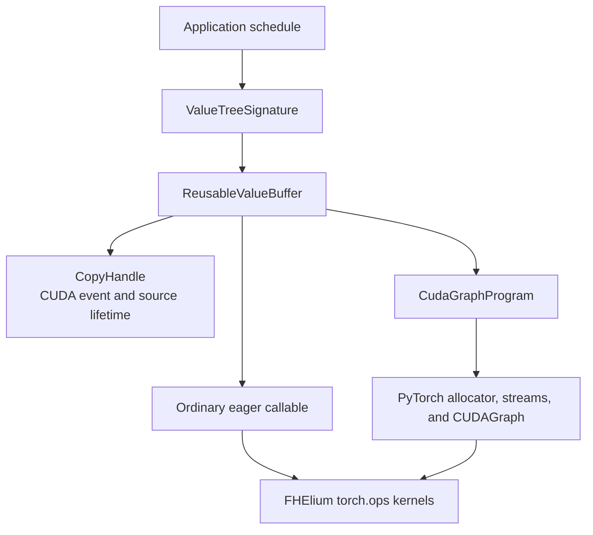
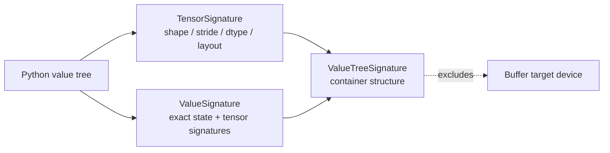
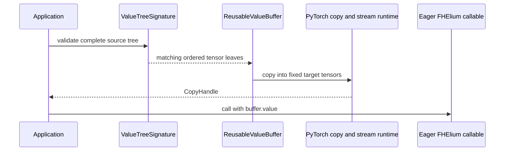
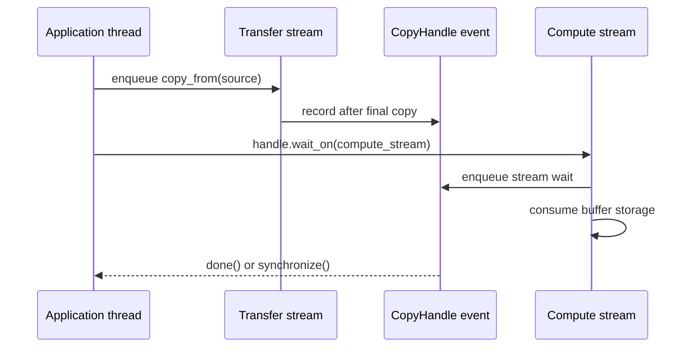
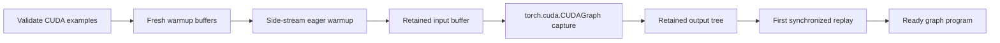
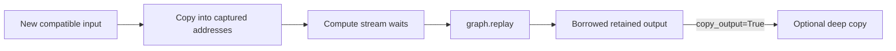

# Execution buffers and CUDA Graphs

`fhelium.execution` provides device-independent value signatures, reusable
fixed-address storage, CUDA-event copy handles, and CUDA Graph capture for a
rank-local Python callable. Every path consumes ordinary FHElium values and
calls the standard evaluator/native-operator stack.

## Execution stack

The application decides what constitutes one program, which inputs are dynamic,
which resources are bound statically, when payloads move, and whether an eager
call or graph replay is appropriate.

## Exact, device-independent signatures

`ValueTreeSignature` recursively describes supported lists, tuples,
dictionaries, raw tensors, and exact FHElium values.

A `TensorSignature` records:

- exact shape and stride;
- dtype and tensor layout;
- `requires_grad`.

A `ValueSignature` additionally records the exact serialization type and schema,
context identity, normalized cryptographic metadata, and ordered tensor-leaf
signatures. That metadata includes fields such as level, scale, representation,
domain, basis, `prime_ids`, and key identity where present.

Device is intentionally excluded. A compatible CPU source and CUDA source can
feed the same fixed CUDA buffer because the buffer, rather than the signature,
owns target residency.

Validation walks the complete candidate tree before the first copy. A structure,
tensor topology, or exact-state mismatch therefore cannot leave a reusable
buffer partially updated.

## Fixed-address value buffers

`ReusableValueBuffer.like(example, device=...)` allocates an independent tree
whose tensor structure and exact metadata match `example`. Its tensor addresses
remain stable while `copy_from` replaces payload bytes.

The buffer reconstructs ordinary `torch.Tensor` and FHElium value objects around
its owned storage. An eager evaluator consumes `buffer.value`; no special
buffer-aware arithmetic API is required.

Buffer construction rejects ambiguous multi-device examples without an indexed
target, unsupported leaves, and aliased representative storage. `pin_memory`
requires a CPU target and creates pinned host staging suitable for non-blocking
host-to-device copies.

A `ReusableValueBuffer` owns fixed storage identified by an exact value
signature. Deployment code associates buffers with models and requests and
chooses tile order, prefetch, and eviction policy. Double buffering uses two
independent buffers.

## Copy handles and stream ordering

A CPU-target copy completes synchronously and returns a handle with no CUDA
event. A CUDA-target copy can be enqueued on a caller-selected stream. Its
`CopyHandle` retains the exact submitted source tensor leaves until the recorded
event completes, preventing the source storage from being released or replaced
while a DMA operation may still read it.

`wait_on(stream)` inserts a stream dependency without blocking the CPU.
`synchronize()` blocks the caller and releases retained source references.
Supplying a stream from another CUDA device is an error.

When overwriting a buffer, the application must provide ordering against prior
readers. A copy-completion event proves that the new payload is ready; it does
not prove that an earlier evaluator has stopped reading the old payload.

## CUDA Graph capture

`CudaGraphProgram.capture(function, example_inputs=...)` specializes one Python
callable to a fixed input structure and CUDA device. Parameters bound through a
closure, `functools.partial`, or a callable object are static program state.
`example_inputs` define dynamic positional values backed by one retained
`ReusableValueBuffer`.

Capture proceeds as follows:

Warmup uses fresh storage so lazy backend initialization does not mutate the
addresses retained for capture. The captured callable ultimately invokes the
same FHElium `torch.ops` CUDA kernels as eager evaluation; CUDA Graph records
those launches and their fixed storage addresses.

Dynamic keyword arguments and arbitrary Python control objects are not captured.
Adapt a dynamic keyword-only tensor into a positional input and keep dynamic
control flow outside the graph.

## Replay and output ownership

The convenience replay path validates and copies new inputs, orders graph launch
after the copy, and returns the retained output object. The advanced path
separates `copy_inputs_from` from `replay_prepared`, allowing transfer and
compute streams to be scheduled by the application.

The default output is borrowed storage. The next replay overwrites it. A caller
that must retain a result uses `copy_output=True` or copies the result through
another mechanism.

One `CudaGraphProgram` owns one input/output storage set and does not support
concurrent replay. Independent concurrent workers require independent program
instances.

## What capture fixes

CUDA Graph capture fixes:

- target CUDA device;
- nested dynamic input structure and exact metadata;
- target tensor shape, stride, dtype, and addresses;
- Python-resolved operation schedule;
- statically bound keys, plaintexts, tables, and other closure resources;
- output object structure and storage addresses.

The application retains responsibility for:

- encryption or key generation before the captured schedule;
- distributed collectives around rank-local replay;
- request routing or concurrency;
- cache selection or Residency admission;
- dynamic branches whose Python outcome changes between replays.

## Source layout

| Responsibility | Source |
| --- | --- |
| Tensor, exact-value, and nested-tree signatures | `fhelium/execution/signature.py` |
| Fixed storage, payload copying, and `CopyHandle` | `fhelium/execution/buffer.py` |
| Capture, replay, output lifetime, and statistics | `fhelium/execution/cuda_graph.py` |
| Public package surface | `fhelium/execution/__init__.py` |

## Validation

Execution changes should cover:

- nested structures and unsupported leaves;
- exact-state and tensor-topology mismatch before the first copy;
- CPU, pageable host, pinned host, and CUDA source paths as applicable;
- source lifetime until copy-event completion;
- cross-stream waits and wrong-device stream rejection;
- stable target pointers across payload replacement;
- eager buffer consumption;
- warmup, capture, first replay, and sequential replay;
- borrowed-output overwrite and owned-output copying;
- close behavior with pending copies or replay work.

The focused suites are `tests/test_execution_buffer.py` and
`tests/test_cuda_graph_execution.py`.

## Continue

- [Exact signatures and buffers](../concepts/execution/exact-signatures-and-buffers.md)
- [CUDA Graph model](../concepts/execution/cuda-graph-model.md)
- [Distributed internals](distributed-internals.md)
- [Residency plans and execution](residency-plans-and-execution.md)
